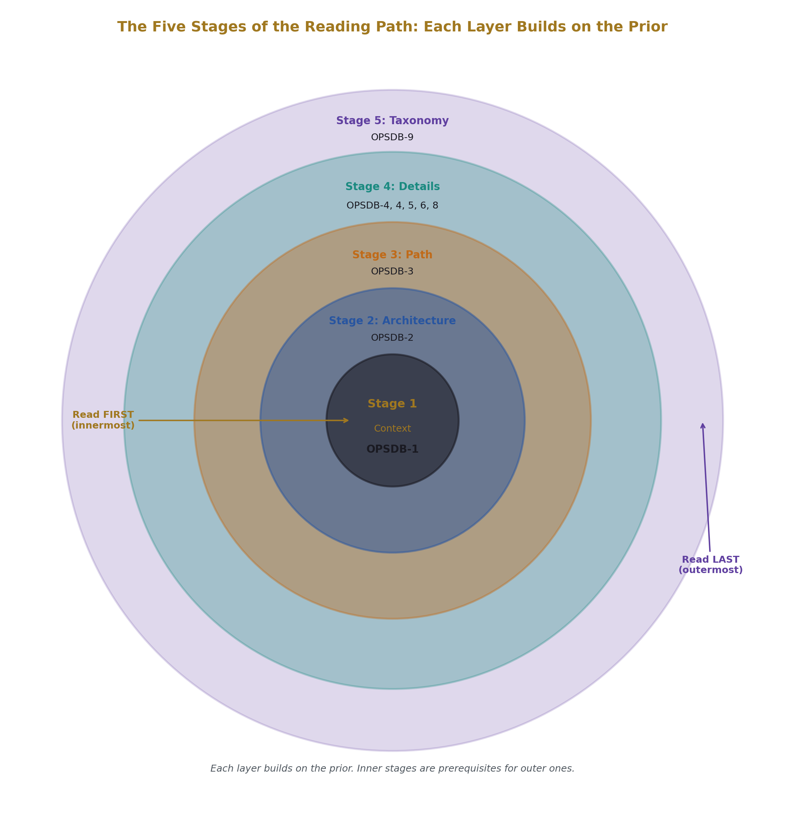
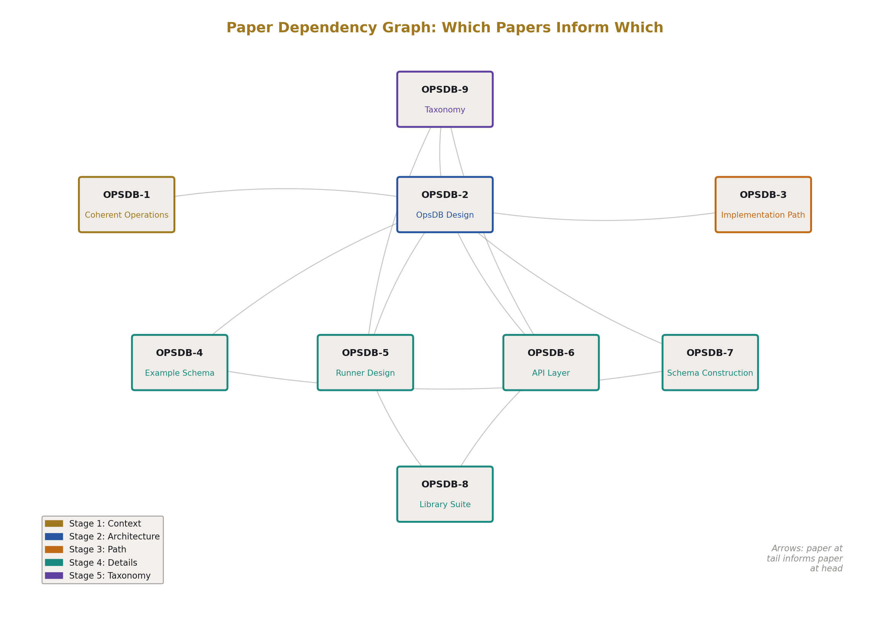
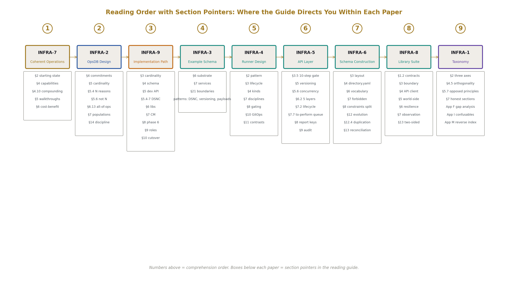
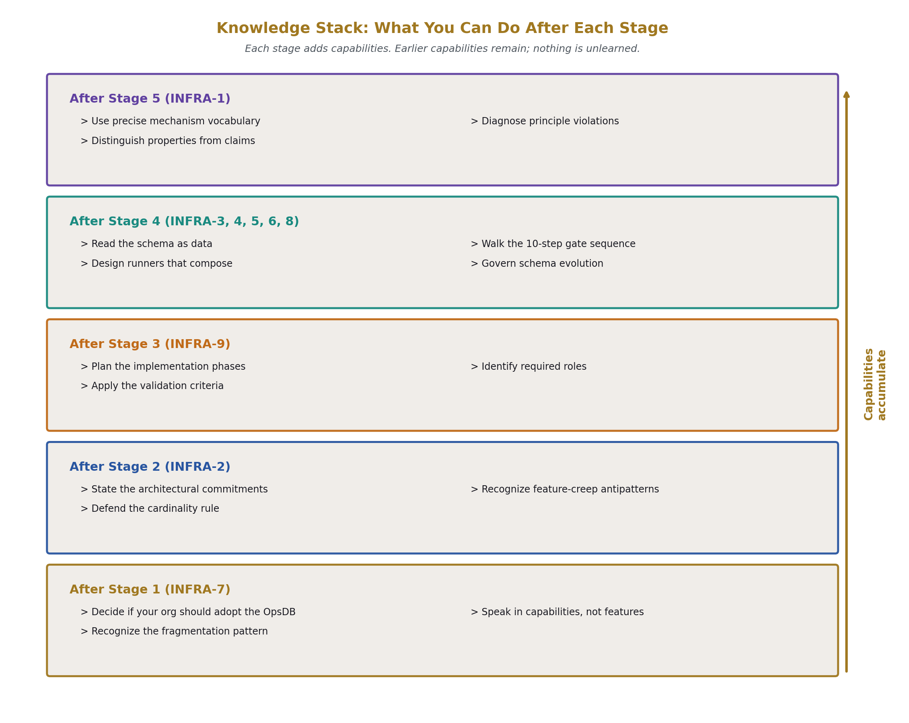
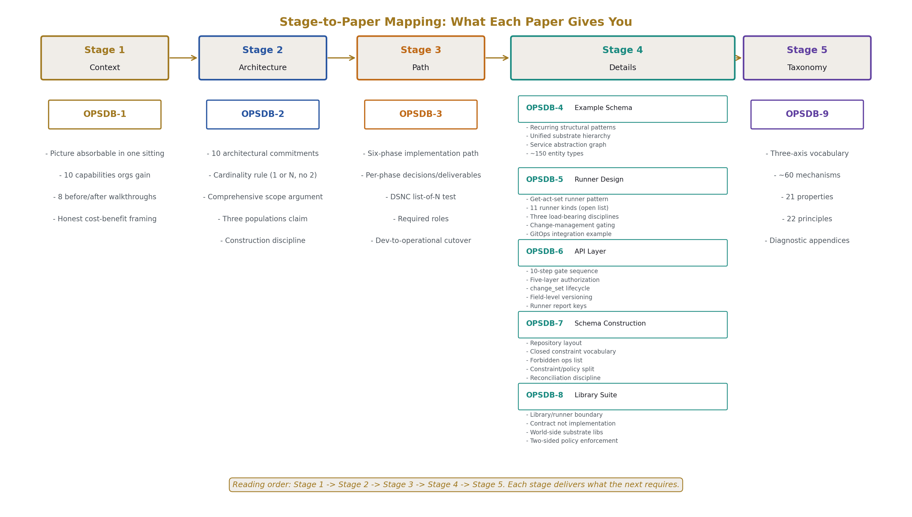

# How to Read the OpsDB Infrastructure Series

A reading guide for the OpsDB architecture papers. The full specification is spread across nine papers; this document specifies the order to read them in and what each paper gives you.

The series is fully specified — every architectural commitment, every disciplinary rule, every implementation phase is in the papers. 

---

## The recommended reading order

The papers in the order a new reader should approach them:

1. [OPSDB-1 — The OpsDB: A Substrate for Coherent Operations](https://github.com/ghowland/Old-School-Operations/blob/main/opsdb//OPSDB-1/manuscript.md) — what it is and what you get
2. [OPSDB-2 — OpsDB Design](https://github.com/ghowland/Old-School-Operations/blob/main/opsdb//OPSDB-2/manuscript.md) — the architectural commitments
3. [OPSDB-3 — OpsDB Implementation Path](https://github.com/ghowland/Old-School-Operations/blob/main/opsdb//OPSDB-3/manuscript.md) — how to build it
4. [OPSDB-4 — An Example OpsDB Schema](https://github.com/ghowland/Old-School-Operations/blob/main/opsdb//OPSDB-4/manuscript.md) — what the data looks like
5. [OPSDB-5 — OpsDB Runner Design](https://github.com/ghowland/Old-School-Operations/blob/main/opsdb//OPSDB-5/manuscript.md) — the operational logic layer
6. [OPSDB-6 — OpsDB API Layer](https://github.com/ghowland/Old-School-Operations/blob/main/opsdb//OPSDB-6/manuscript.md) — the governance gate
7. [OPSDB-7 — OpsDB Schema Construction](https://github.com/ghowland/Old-School-Operations/blob/main/opsdb//OPSDB-7/manuscript.md) — how the schema itself is built
8. [OPSDB-8 — The OpsDB Shared Library Suite](https://github.com/ghowland/Old-School-Operations/blob/main/opsdb//OPSDB-8/manuscript.md) — the framework around the runners
9. [OPSDB-9 — Infrastructure Taxonomy](https://github.com/ghowland/Old-School-Operations/blob/main/opsdb//OPSDB-9/manuscript.md) — the vocabulary that grounds all of it

---

## Why this order

The OpsDB architecture is a complete operational pattern. It commits to specific structural choices — passive substrate, single API gate, decentralized runners coordinating through shared data, schema as the long-lived artifact, governance as data — and each commitment supports the others. Understanding the architecture means understanding what it produces, what it commits to, and how those commitments compose. The reading order is designed to deliver each layer of understanding before the next layer depends on it.

A reader who tries to start with OPSDB-9 (the taxonomy) gets a vocabulary lesson without a context for using it. A reader who tries to start with OPSDB-4 (the schema) gets ~150 entity types without a frame for why those entities exist. A reader who tries to start with OPSDB-6 (the API) gets a 10-step gate without knowing what's being gated or why.

The order in this guide gives you the context first, then the architecture, then the path to building it, then the details, then the vocabulary that lets you talk about all of it abstractly.

---

## Stage 1 — What you get and what it is

**Read [OPSDB-1](https://github.com/ghowland/Old-School-Operations/blob/main/opsdb//OPSDB-1/manuscript.md) first.**

OPSDB-1 is the introduction to the architecture for a reader who has not encountered it before. It opens with §2 describing the operational state most organizations are currently in — fragmented tooling, scattered evidence, audit-as-quarterly-project, drift discovered during incidents — and frames the OpsDB as the architectural alternative to that state.

What you get from OPSDB-1:

- A complete picture of what an OpsDB is at a level you can absorb in one sitting.
- Ten specific capabilities an organization gains by building one (§4), with the argument in §4.10 for why they compound and why partial adoption fails.
- Eight before/after walkthroughs of common operational scenarios in §5: investigation during an incident, deployment, certificate renewal, compliance evidence collection, drift correction, onboarding new automation, schema evolution, vendor or substrate transitions.
- The honest cost-benefit framing in §6 — what the architecture asks of the organization and what it delivers in return.

After OPSDB-1 you should be able to decide whether your organization would benefit from an OpsDB and what it would feel like to operate inside one. If the answer is "no, this isn't the right fit," you've saved the time of reading the rest. If the answer is "yes, or maybe," continue.

---

## Stage 2 — The architectural commitments

**Read [OPSDB-2](https://github.com/ghowland/Old-School-Operations/blob/main/opsdb//OPSDB-2/manuscript.md) second.**

OPSDB-1 describes what the architecture produces. OPSDB-2 specifies what the architecture *is* — the design document. This is where the load-bearing commitments are made explicit and the reasoning behind each is stated.

What you get from OPSDB-2:

- The ten architectural commitments in §4 that are non-negotiable (passive substrate, API as only path, substrate independent of storage engine, governance at the API, decentralized work, configuration as data, authority pointers as first-class, local replicas as valid, schema evolution governed, no 2).
- The cardinality rule in §5 — 1 OpsDB or N, never 2 — with the structural reasons that justify N (§5.4) and the reasons that don't (§5.6).
- The content scope in §6, including §6.13's argument that "all of ops" means everything operationally meaningful, not just server/network/cloud.
- The three populations served by the substrate in §7 (humans, automation, auditors) and why one substrate works for all three.
- The construction discipline in §14 — comprehensive thinking with aggregate building, the schema steward role, resisting fragmentation and feature creep.

After OPSDB-2 you understand the architecture's commitments and the reasoning behind them. You know why the substrate is passive, why the API is the only path, why the cardinality is 1 or N never 2, why the schema is the long-lived artifact. The remaining papers specify how each commitment is realized.

---

## Stage 3 — How to build it

**Read [OPSDB-3](https://github.com/ghowland/Old-School-Operations/blob/main/opsdb//OPSDB-3/manuscript.md) third.**

OPSDB-3 specifies the implementation path. The architecture is large enough that attempting to build it all at once produces a multi-quarter project that delivers nothing usable until the end; OPSDB-3 specifies six phases that each deliver something operational and validate the team's understanding before moving on.

What you get from OPSDB-3:

- The six-phase path: decide cardinality (§3), determine baseline schema (§4), build development API and ingest data (§5), determine shared library core (§6), design and implement change management (§7), add operational logic beyond OpsDB management (§8).
- For each phase: the decision being made, the deliverable produced, what's deferred for the next phase, and the validation criterion that determines completion.
- The DSNC flattening discipline in §5.4–§5.7 with the list-of-N test that prevents naive nested-data flattening.
- The roles required (§9) — schema steward, library steward, substrate operator, platform team, operational stakeholders.
- The development-to-operational transition (§10) as a deliberate cutover at phase 5.

OPSDB-3 is the right paper to read at this stage because it gives you the route from specification to working substrate. Reading it before the detail papers (OPSDB-4, OPSDB-5, OPSDB-6, OPSDB-7, OPSDB-8) is intentional: the implementation path tells you which detail papers matter at which phase, so when you read the details next you know what to look for.

After OPSDB-3 you have a route. You know the order in which the architectural pieces come online, what each phase requires, and what the validation criterion looks like at each step.

---

## Stage 4 — The detail papers

The detail papers specify the structural specifications behind each layer. Read them in this order, with the framing that you're filling in the details of a route you already understand.

### [OPSDB-4 — An Example OpsDB Schema](https://github.com/ghowland/Old-School-Operations/blob/main/opsdb//OPSDB-4/manuscript.md)

What the data looks like. ~150 entity types covering hardware, virtualization, Kubernetes, cloud resources, services, runners, schedules, policies, configuration, cached observation, authority pointers, documentation metadata, monitoring, evidence, change management, audit, and the schema's record of itself.

What you get from OPSDB-4:

- The structural patterns that recur throughout the schema: DSNC naming, versioning siblings, typed payloads with discriminator + JSON, polymorphic relationships through bridge tables, underscore-prefix governance metadata.
- The unified substrate hierarchy in §6 — `megavisor_instance` self-FK chain that threads through bare metal, virtualization, containers, pods, and cloud compute as one navigable structure.
- The service abstraction in §7 with the `service_connection` graph driving config templating, alert suppression, and capacity planning.
- Concrete table-by-table specifications across all eighteen top-level cuts.
- The boundary discipline in §21 — what the schema does not include and why.

OPSDB-4 is one example. Your organization adapts it to your operational reality, adding domains you operate that aren't covered and trimming domains you don't operate. The structural patterns transfer; the specific entity types are your decision.

### [OPSDB-5 — OpsDB Runner Design](https://github.com/ghowland/Old-School-Operations/blob/main/opsdb//OPSDB-5/manuscript.md)

The operational logic layer. The runner pattern in one sentence: get from the OpsDB, act in the world, set to the OpsDB.

What you get from OPSDB-5:

- The runner pattern in §2 — small, single-purpose, data-defined, level-triggered, idempotent, bounded.
- The runner lifecycle in §3 — invocation, get phase, internal computation, dry-run output, act phase, set phase, recorded outcome.
- The eleven runner kinds in §4 — puller, reconciler, verifier, scheduler, reactor, drift detector, change-set executor, reaper, bootstrapper, failover handler, plus the framing in §4.11 that the list is open.
- The three load-bearing disciplines in §7 — idempotency, level-triggered over edge-triggered, bound everything.
- The change-management gating model in §8 — direct write, auto-approved change_set, approval-required change_set, per-target gating, runner authority as data.
- The standard-practice contrasts in §11 showing how the same operational work produces a complete queryable trail with OpsDB coordination.
- The GitOps integration pattern in §10 with six runners coordinating one deployment through OpsDB rows.

After OPSDB-5 you understand the active layer that operates around the substrate.

### [OPSDB-6 — OpsDB API Layer](https://github.com/ghowland/Old-School-Operations/blob/main/opsdb//OPSDB-6/manuscript.md)

The governance gate. The API is the only path; every operation flows through the same enforcement sequence.

What you get from OPSDB-6:

- The 10-step gate sequence in §3.5 — authentication, authorization, schema validation, bound validation, policy evaluation, versioning preparation, change-management routing, audit logging, execution, response.
- The five-layer authorization model in §6.2 — role/group, per-entity governance, per-field classification, per-runner authority, policy rules.
- The change_set lifecycle in §7.2 as state transitions in OpsDB rows, with §7.7 framing the to-perform queue as approved-not-yet-applied rows that the change-set executor runner drains.
- Field-level versioning with full-state version rows in §5 — making point-in-time reconstruction a single lookup.
- Optimistic concurrency in §5.6 with stale-version checks at submit time.
- Runner report keys in §8 — the additional verification step that gates runner writes against declared keys.
- Audit logging in §9 with append-only enforcement at the DDL level and optional cryptographic chaining.

After OPSDB-6 you understand the gate where governance happens.

### [OPSDB-7 — OpsDB Schema Construction](https://github.com/ghowland/Old-School-Operations/blob/main/opsdb//OPSDB-7/manuscript.md)

How the schema itself is constructed and evolved. The schema is data — YAML files in a git repository — processed by a deterministic loader that produces both the relational database structure and the API's validation metadata from the same source.

What you get from OPSDB-7:

- The repository layout in §3 with the `directory.yaml` master file in §4 listing all imports in dependency order.
- The closed constraint vocabulary in §6 — nine type primitives, three modifiers, six constraints, and nothing else.
- What the vocabulary forbids in §7 — no regex, no embedded logic, no conditional constraints, no inheritance, no templating.
- The forbidden evolution list in §12 — no deletions, no renames, no type changes — with the duplication-and-double-write pattern in §12.4 as the only path through forbidden ops.
- The cross-field constraints/policy split in §8 with semantic invariants as policy data evaluated at the API.
- The reconciliation discipline in §13 for when the schema repo and the OpsDB disagree.

After OPSDB-7 you understand how the long-lived schema artifact is governed, evolved, and kept synchronized with the operational substrate.

### [OPSDB-8 — The OpsDB Shared Library Suite](https://github.com/ghowland/Old-School-Operations/blob/main/opsdb//OPSDB-8/manuscript.md)

The framework around the runners. OPSDB-5 promised that runners stay small because the libraries do the heavy lifting; OPSDB-8 specifies what the libraries are.

What you get from OPSDB-8:

- The library/runner boundary in §3 — the simple test of "would two runners reimplement this?"
- The contract-not-implementation framing in §1.2 — multiple language implementations of the same contract can coexist.
- The OpsDB API client in §4 as the mandatory foundational library every runner uses.
- World-side substrate libraries in §5 — Kubernetes, cloud, host, container/registry, secret backend, identity provider, monitoring authority, authority pointer resolution.
- Coordination and resilience libraries in §6 — retry, circuit breaker, hedger, bulkhead, failover.
- Mandatory observation libraries in §7 — structured logging, metrics emission, distributed tracing.
- Notification, templating, and git libraries in §8–§10.
- The two-sided policy enforcement claim in §13 — the structural payoff. The API gate enforces against OpsDB writes; the library suite enforces against world-side actions; together they make "runner authority is data" hold across every action.

After OPSDB-8 you understand the framework that keeps the runner population consistent and that closes the gap in runner authority enforcement that the prior papers left.

---

## Stage 5 — The taxonomy

**Read [OPSDB-9](https://github.com/ghowland/Old-School-Operations/blob/main/opsdb//OPSDB-9/manuscript.md) last.**

OPSDB-9 establishes the vocabulary the rest of the series uses. It separates three things commonly conflated: mechanisms (what does work), properties (what is claimed), and principles (what governs assembly).

Reading OPSDB-9 last is intentional. Most software is normally named by its category — "a database," "a cache," "a load balancer," "a configuration management tool" — with properties that are often unclear or unstated. OPSDB-9 gives you a precise vocabulary for talking about these things: the exact difference between a Cache and a Store (do you lose data if you lose it?), between a Probe and a Heartbeat (who initiates?), between a Reconciler and a Reactor (state or events?), between durability-as-mechanism and durability-as-property.

What you get from OPSDB-9:

- The three-axis structure in §2: mechanisms perform work, properties make claims, principles govern choice.
- ~60 mechanisms across thirteen families: information movement, selection, representation, storage, versioning, lifecycle, sensing, control loop, gating, allocation, coordination, transformation, resilience.
- Twenty-one properties across four bands: data integrity, behavioral, distribution, operational, with §4.5's argument for property orthogonality.
- Twenty-two principles grouped by domain, with §5.7 acknowledging that some directly oppose each other (fail-closed vs fail-open; centralize vs decentralize) and that resolution is per-domain.
- The honest sections in §7 covering the double-citizen problem (durability is both a mechanism and a property), mechanisms that span families, mechanisms not yet in the taxonomy, properties not yet in the taxonomy.
- Operationally useful appendices: F (property gap analysis — what's claimed vs what's delivered), I (mechanisms commonly mistaken for each other with the distinguishing question), J (principle violations and their typical consequences), M (reverse index — symptom to family to inspect first).

After reading OPSDB-9 you can re-read any of the other papers with a sharper vocabulary. Phrases like "the runner is a Reconciler with bounded Convergence" or "the OpsDB provides Durability through Journals + Stores + Replicators with Quorum" become precise rather than approximate. The distinctions that matter operationally — Cache vs Store, Probe vs Heartbeat, Lock vs Lease — become legible.

OPSDB-9 reads last because the abstract vocabulary is most useful when you have concrete examples to anchor it against. The other papers gave you those examples; OPSDB-9 gives you the language to discuss them precisely.

---

## What you have after reading all nine

The full picture. You understand:

- **What an OpsDB is and what an organization gets by building one.** The architectural alternative to operational fragmentation, with the specific capabilities it delivers and the ways daily operational work changes.
- **The architectural commitments.** Why the substrate is passive, why the API is the only path, why the cardinality is 1 or N, why the schema is the long-lived artifact, why comprehensive scope spans all of operations.
- **The implementation path.** How to go from specification to working substrate through six phases, with validation criteria at each phase boundary.
- **The schema.** What ~150 entity types covering all of operational reality look like, what structural patterns recur, how typed payloads accommodate variation, how the substrate hierarchy threads through bare metal and cloud as one structure.
- **The runner pattern.** The active layer that operates around the substrate — small, single-purpose, data-defined, idempotent, level-triggered, bounded, coordinating through shared data rather than direct invocation.
- **The API gate.** Where governance happens, with the 10-step enforcement sequence and the five-layer authorization model.
- **Schema construction.** How the schema is itself data, governed by the same change-management discipline as anything else, with the closed vocabulary and the forbidden list that make long-lived schemas possible.
- **The library suite.** The framework that keeps runners small and that closes the runner-authority enforcement at world-side action time.
- **The vocabulary.** Precise terms for talking about all of it abstractly, with the distinctions that matter operationally.

You have the architecture, the route to building it, the structural details of each layer, and the language to discuss it precisely. The OpsDB process is fully specified across the nine papers; this guide is the path through them.

---

## A note on re-reading

The first read through the nine papers in this order produces the picture. Subsequent reads — when you're working on a specific implementation phase, or when you're designing a specific runner, or when you're adapting the schema for a new operational domain — go directly to the relevant paper.

Phase 1 work refers back to OPSDB-2 §5 and OPSDB-3 §3. Phase 2 work refers back to OPSDB-4 and OPSDB-7. Phase 4 work refers back to OPSDB-8 §15.1. Phase 6 work refers back to OPSDB-5 §4 for runner kinds and OPSDB-8 §5 for world-side libraries.

The first read is for comprehension. Subsequent reads are for reference. The reading order in this guide is for the first read; the numbered order is for the reference structure.

---

## The starting point

If you have not yet read any of the papers, your next click is [OPSDB-1 — The OpsDB: A Substrate for Coherent Operations](https://github.com/ghowland/Old-School-Operations/blob/main/opsdb//OPSDB-1/manuscript.md). That paper introduces the architecture from first principles for a reader who has not encountered it before. By the end of OPSDB-1 you'll know whether the rest of the series is worth your time. If it is, continue with OPSDB-2 and follow the order this guide specifies.

