# Old School Operations
## 25 Year of System Adminstration and SRE


## by Geoffrey Howland

[Amazon Kindle Edition - $2.99](https://www.amazon.com/dp/B0GX2XC5V8)

#

[[Part I: The Foundation]](#part-i-the-foundation)

> [[Chapter 1: Foundations of Operational
> Thinking]](#chapter-1-foundations-of-operational-thinking)
>
> [[1.1 My Background]](#my-background)
>
> [[1.1.1 Work Environments]](#work-environments)
>
> [[1.2 The Strategic Importance of
> Operations]](#the-strategic-importance-of-operations)
>
> [[1.3 The Promise of
> Automation]](#the-promise-of-automation)
>
> [[1.4 Operations is About
> Control]](#operations-is-about-control)
>
> [[Chapter 2: Real vs. Virtual - Understanding What We Work
> With]](#chapter-2-real-vs.-virtual---understanding-what-we-work-with)
>
> [[2.1 The Differences Between Real and
> Virtual]](#the-differences-between-real-and-virtual)
>
> [[2.2 Knowability and Trusting
> Information]](#knowability-and-trusting-information)
>
> [[2.3 Knowability - What Can and Cannot Be
> Known]](#knowability---what-can-and-cannot-be-known)
>
> [[2.3.1 Reality: The Physical - The Limits of
> Knowability]](#reality-the-physical---the-limits-of-knowability)
>
> [[2.3.2 Virtual: The Un-Real - What Can and Cannot Be Fully
> Known]](#virtual-the-un-real---what-can-and-cannot-be-fully-known)
>
> [[2.3.2.1 The Unknowability of Logic (Practical
> Implications)]](#the-unknowability-of-logic-practical-implications)
>
> [[Chapter 3: Data is King, Logic is Shell - The Foundation of Reliable
> Systems]](#chapter-3-data-is-king-logic-is-shell---the-foundation-of-reliable-systems)
>
> [[3.1 Data - The Knowable
> Foundation]](#data---the-knowable-foundation)
>
> [[3.1.1 Data Source Properties]](#data-source-properties)
>
> [[3.2 Logic - The Executable
> Shell]](#logic---the-executable-shell)
>
> [[3.3 Data's Primacy over
> Logic]](#datas-primacy-over-logic)
>
> [[3.3.1 Data is More Trustworthy Than
> Logic]](#data-is-more-trustworthy-than-logic)
>
> [[3.3.2 When Valid Data Breaks
> Logic]](#when-valid-data-breaks-logic)

[[Part II: Thinking Systemically - Tools for Mastering
Complexity]](#part-ii-thinking-systemically---tools-for-mastering-complexity)

> [[Chapter 4: What is a System? - Mapping the Operational
> World]](#chapter-4-what-is-a-system---mapping-the-operational-world)
>
> [[Chapter 5: Systemic Thinking - Tools for Mastering
> Complexity]](#chapter-5-systemic-thinking---tools-for-mastering-complexity)
>
> [[5.1 Inputs, Outputs and Side-Effects: The Universal
> Machine]](#inputs-outputs-and-side-effects-the-universal-machine)
>
> [[5.2 The Philosopher\'s Knife - Slicing Ideas for
> Clarity]](#the-philosophers-knife---slicing-ideas-for-clarity)
>
> [[5.3 Slicing the Pie - Comprehensive vs. Aggregated
> Systems]](#slicing-the-pie---comprehensive-vs.-aggregated-systems)
>
> [[Chapter 6: Axiomatic Engineering - Principled Decision
> Making]](#chapter-6-axiomatic-engineering---principled-decision-making)
>
> [[6.1 What is Engineering?]](#what-is-engineering)
>
> [[6.1.1 Understanding Engineering as a
> Process]](#understanding-engineering-as-a-process)
>
> [[6.1.2 The Use of Resources]](#the-use-of-resources)
>
> [[6.2 Attribute Axes and
> Prioritization]](#attribute-axes-and-prioritization)
>
> [[6.3 Prioritization in Practice: The 90-9-0.9%
> Rule]](#prioritization-in-practice-the-90-9-0.9-rule)
>
> [[6.4 Impersonal Decision
> Making]](#impersonal-decision-making)
>
> [[6.5 The Problem with \"The
> Best\"]](#the-problem-with-the-best)
>
> [[6.6 Fashion Oriented
> Engineering]](#fashion-oriented-engineering)

[[Part III: Operational Dynamics - Applying Principles to People and
Environments]](#part-iii-operational-dynamics---applying-principles-to-people-and-environments)

> [[Chapter 7: Humans - Their Unique Role in
> Operations]](#chapter-7-humans---their-unique-role-in-operations)
>
> [[Chapter 8: Operational Environments - Security Zones and Lifecycle
> Management]](#chapter-8-operational-environments---security-zones-and-lifecycle-management)
>
> [[8.1 Defining Operational
> Environments]](#defining-operational-environments)
>
> [[8.2 The Production
> Environment]](#the-production-environment)
>
> [[8.3 Tiered Security Zones]](#tiered-security-zones)
>
> [[Chapter 9: Operational Logic vs. Application Logic - Different
> Goals, Different
> Code]](#chapter-9-operational-logic-vs.-application-logic---different-goals-different-code)
>
> [[9.1 The Fundamental
> Distinction]](#the-fundamental-distinction)
>
> [[9.2 Many Applications, One Operational
> Environment]](#many-applications-one-operational-environment)
>
> [[9.3 Designing for Resilient Operational
> Logic]](#designing-for-resilient-operational-logic)
>
> [[Chapter 10: Scaling and Control - The \"0, 1, Infinity\"
> Principle]](#chapter-10-scaling-and-control---the-0-1-infinity-principle)
>
> [[10.1 Understanding Distributed
> Systems]](#understanding-distributed-systems)
>
> [[10.2 The \"0, 1, Infinity\"
> Rule]](#the-0-1-infinity-rule)
>
> [[10.3 The Production Environment as a Distributed Operating System
> (DOS)]](#the-production-environment-as-a-distributed-operating-system-dos)

[[Part IV: In Practice - Concrete
Applications]](#part-iv-in-practice---concrete-applications)

> [[Chapter 11: Evaluating Changes - A Principled
> Approach]](#chapter-11-evaluating-changes---a-principled-approach)
>
> [[Chapter 12: Applied Algorithmic Properties - Building Reliable
> Automation]](#chapter-12-applied-algorithmic-properties---building-reliable-automation)
>
> [[12.1 Fundamental Algorithmic Properties in
> Operations]](#fundamental-algorithmic-properties-in-operations)
>
> [[12.2 Idempotency - Consistent Results Every
> Time]](#idempotency---consistent-results-every-time)
>
> [[12.3 Iteration and Algorithmic
> Application]](#iteration-and-algorithmic-application)
>
> [[Chapter 13: Know the Present - Data Collection and Modeling for
> Control]](#chapter-13-know-the-present---data-collection-and-modeling-for-control)
>
> [[13.1 Evaluating the Environment: Knowing the
> Present]](#evaluating-the-environment-knowing-the-present)
>
> [[13.1.1 When to Use Statistics]](#when-to-use-statistics)
>
> [[13.2 Modeling for Understanding and
> Control]](#modeling-for-understanding-and-control)
>
> [[13.2.1 Black-Boxing the World with Universal
> Machines]](#black-boxing-the-world-with-universal-machines)
>
> [[Chapter 14: Engineering Your Path - Tools, Practice, and
> Wisdom]](#chapter-14-engineering-your-path---tools-practice-and-wisdom)
>
> [[14.1 Engineering as a Continuous
> Practice]](#engineering-as-a-continuous-practice)
>
> [[14.2 The Role of Philosophy: Asking
> \"Why?\"]](#the-role-of-philosophy-asking-why)
>
> [[14.3 Simplifying SLO, SLA and
> SLI]](#simplifying-slo-sla-and-sli)
>
> [[14.4 Old School Reading List]](#old-school-reading-list)

[[Conclusion]](#conclusion)

> [[What this book didn't cover: The
> OpsDB]](#what-this-book-didnt-cover-the-opsdb)
>
> [[What I hope you take from this
> book]](#what-i-hope-you-take-from-this-book)
>
> [[Discord Server]](#discord-server)

# Part I: The Foundation

## Chapter 1: Foundations of Operational Thinking

What will you get out of this book? Why read it?

What I hope to impart here is a view into how I see operations, and how
I automate operations.

In the case of this book, \"operations\" means \"networked operations\",
\"server operations\", \"datacenter operations\", \"production
operations\" and the act of managing them all, all rolled into one term.
The name is both specific and non-specific, as operations can mean other
things, but these specific fields are what I\'m referring to.

What I hope you will gain from my perspective is a new foundation you
can use as a plane of reference to improve your own operational mindset
and practices, whether you are already an experienced operations
engineer or new to the field.

This book\'s format is meant to be read from start to finish. It starts
off more general, and philosophical, setting up terminology and
direction.

This book is meant to improve your ability to reason and create
efficient solutions in the operational engineering space. It is a type
of mentorship, in that these are my methods of making decisions that
yield good outcomes.

### 1.1 My Background

As of this writing (2026), I\'ve been working in the industry for over
25 years, and have been programming for over 35 years. I\'ve written
over 1000 programs of varying size, the bulk of them being smaller and
operational in nature, but have also written and deployed PC games,
end-user productivity tools, accounting software, non-trivial end-user
websites, as well as a lot of operations related monitoring, alerting,
log parsing, configuration and automation logic required for operations
work.

Some names of places I\'ve worked:

Google, VMWare, Netflix, LinkedIn, Cisco, Pacific Telesis, Lawrence
Livermore Labs, mobile game companies, PC games industry, mortgage
industry, financial security industry, Internet startups (SaaS and
end-user websites)

You can see my abbreviated job history at LinkedIn:

[[https://www.linkedin.com/in/ghowland]](https://www.linkedin.com/in/ghowland)

At Google, I started in the Sysops team in 2003, and was later
transferred to the SRE Ads Backend team as the first group of 8 "ops"
SREs in 2005, after the organization had started as more software
engineer oriented hiring, so I was in the early phase of when SRE was
created, and in the first phase of "pure operations" people joining the
newly coined SRE team.

I have been in the industry as a lead operations person from 1996 to
2026, at the time of this writing, and have seen and implemented the
changes across the pre-Internet, Internet companies, Dot Com era,
pre-cloud scaling, and cloud computing eras.

### 1.1.1 Work Environments

The more you work in different environments, and complete work in
different areas of implementation (app/net/DB/etc), the more experiences
you will gain. You can supplement these by setting up your own virtual
environments on any cloud hosting providers, or on your own machines
with a series of virtual machines.

All projects, whether in-industry or outside of it, are limited, and
never give complete information, because one\'s viewpoint is limited and
the amount of details one can interact with is limited. So even if you
know one environment from beginning to end, having created all of it,
you will find another environment that you didn\'t create to have many
different properties, even if all the software used is the same, due to
the alignment choices made in its creation.

### 1.2 The Strategic Importance of Operations

Sales people think of organizations in terms of their sales generating
revenues.

Developers think of organizations in terms of the software they write,
which may be sold to generate revenue.

Managers think of organizations in terms of the people they manage that
do the work.

Customer Support thinks about organizations in that customers would be
completely dissatisfied without their support.

Finance thinks about organizations in terms of cash flow, as when an
organization runs out of money, they can no longer pay their building
leases or employees.

Each department in an organization thinks it is a critical department,
and they are all right. No organization would pay the financial and
opportunity costs in maintaining any department that is unnecessary, so
they are all critical. Operations is no different here.

There was a time that Operations was a lot more like facilities
departments, they bought things and maintained them. Keeping them
powered up and plugged in, and keeping people from stealing or damaging
them. This is not really accurate, but from the perspectives of people
paying for these employees, it is pretty close to accurate, and we are
currently discussing how organizations see themselves and their actions,
and organizations act through using money to pay for services.

What has changed, and what companies have for the most part still not
caught on to yet, is operations is now the front-line of many companies
ability to collect revenue. If your service is not available, you cannot
sell it.

This started changing for many companies in the late 1990s, and started
to become normal in the 2000s, and by the 2010s almost every company\'s
interactions with its customers are going through a network, to servers,
and software and databases that run on those servers. In 2026, most
businesses require networking in supporting their revenue generation,
but Operations is still a low status tier in their organization
structure.

The majority of the companies I have worked for have completely
downgraded the importance of their operations departments, giving much
more staffing and scheduling priority to other departments. This is
often the correct model for their staffing needs, but an incorrect model
for their stability goals.

There are a number of reasons for this, and they are all valid in
themselves, as many perspectives are when given in their own context.

However, in a context that is grounded in the physical world the
connection to their revenue might look like this for different
companies, starting from the least-technological and moving to the most:

-   Physical good company. Makes things that are sold in metal cans,
    etc:

    -   Supply chain management has a basis in digital records at every
        step. Some steps involve calling people, writing things on
        paper, but these are recorded in at least Excel type spread
        sheets, and at any larger organizations something more similar
        to an Enterprise Resource Planning (ERP) software to coordinate
        all the steps are required.

    -   Communication with vendors in the chain may have many physical
        components, but ultimately they are also recorded into digital
        mediums, at least the low-level of email, if not higher level
        tracking software.

    -   Employee time and pay records are now kept in a mostly or purely
        digital form.

    -   End-user support is typically done via electronic medium
        (emails, customer support).

    -   The larger the organization for all non-Internet based
        companies, the more corporate infrastructure that will be needed
        to provide support to desktops, laptops, servers to manage
        directory services (AD/LDAP), backups, storage, centralized
        software, etc. More of these services are moving into
        online-only for small-medium companies.

    -   Hold outs will be older (pre-PC age computers) and will need to
        be small, to maintain operating the manual labor scales.

-   Non-Internet Services Company

    -   Similar to physical companies, but with smaller companies that
        can get by without much technology. Real estate agents are a
        famous example of this. Doctors and lawyers are also slow to
        adopt technology in tracking their clients and work, but in most
        medical institutes I have seen recently, all patient visit
        tracking is being digitally tracked.

-   Physical software companies

    -   Software is sold in boxes, in stores or shipped via the mail on
        DVDs. This used to be the dominant paradigm, it's rare now.

    -   All software is written in a networked environment which must
        remain up for any productivity. Developers cannot all go home
        and continue working if the infrastructure goes down (it will be
        down anywhere they access from), and as security levels
        increase, this is not possible for those reasons as well.

    -   Customer support is usually entirely digital, unless it is for
        Enterprise level software, and then there is phone call and
        occasional in-person visits as well, mostly as good-faith
        efforts, not to solve immediate problems.

-   Internet Service Companies

    -   This is where the real change occurs, and many businesses are
        becoming more Internet service oriented.

    -   Almost every interaction the company has with
        end-users/customers is over the Internet, and handled by servers
        that the company manages, and may or may not own/lease.

    -   Most companies have started to look more like this in 2026.

This is a very simplified spectrum of business, and not meant to be
correct or truly representative, but merely to paint a quick picture I
need for this example, which I\'ll start describing\... now.

The change is that these days if your operations are not reliable, and
you have frequent outages, or long-term degraded performance, or you are
unable to respond to customer demands in a \"reasonable\" time, or
competitors have a more reliable and reachable service, then you are
directly impacted in your revenue.

If your operations are down, your customers cannot reach you to pay you.

As someone reading this book, this is no surprise to you, but what may
be somewhat surprising is that many companies I have worked for, and you
may have as well, display all the symptoms of behaving like this is not
true.

Some of these symptoms are:

-   Not properly staffing their operation teams for the workloads they
    are required to perform. Note that it doesn\'t matter *who* the
    operation team staff is, System Administrators, Site Reliability
    Engineers, DevOps, Developers, it doesn\'t matter. If they are
    responsible for the operations of the software and systems, they are
    the operations team.

-   Not giving proper lead times on work that is due, such as finishing
    a project that the operations team was not notified about, and
    expecting an immediate release to the public of that project. Not
    taking into account either ordering hardware, or configuring systems
    to support the software. Often setting up reliable database backends
    takes weeks to fully configure and test, even on modern Kubernetes
    platforms and cloud managed databases.

-   Not giving significant information on how to maintain, run, or even
    install the software to be released and supported.

-   Prioritizing work that does not yield to improving or supporting the
    revenue generating and employee supporting software and services.

There are many other symptoms, but these are large enough to illustrate
this point. Other departments have similar complaints with regard to
notice ahead-of-time, and schedules. See any book on Software
Development project management for examples close to Operations.

This is not a problem that is likely to be solved soon, if ever solved,
because there are a number of difficult factors that cause it; the
primary one being the structure of organizations themselves. When
something is structured a certain way, it will tend to produce certain
results, and producing different results is very difficult, and often
only temporarily possible.

Since the organizational structure of organizations is not likely to
change, the best hope in making progress here is something akin to the
Agile movement in development, where all developers just kept repeating
the same things and eventually the management of companies started to be
populated with managers who also said the same things, and their world
changed.

It\'s debatable on whether their world really changed that much for the
better, but there are many distinct differences in the pre-Agile
development world, from the post-Agile development world, and it was
this change in perspective and discussing it that caused those changes
to take effect.

It\'s also worth noting that the way this change-through-repetition
occurs should be done with as much awareness as possible of what is
being repeated. If it is something that will become a dogmatic problem,
then that is not a good thing to repeat. Things to repeat should be
based on ideas that cause more awareness to the complexities of the
present reality and less dogmatic simplicity, which frequently ignores
any local data and instead focuses on following idealistic principles.
If a principle sounds too idealistic, it probably is.

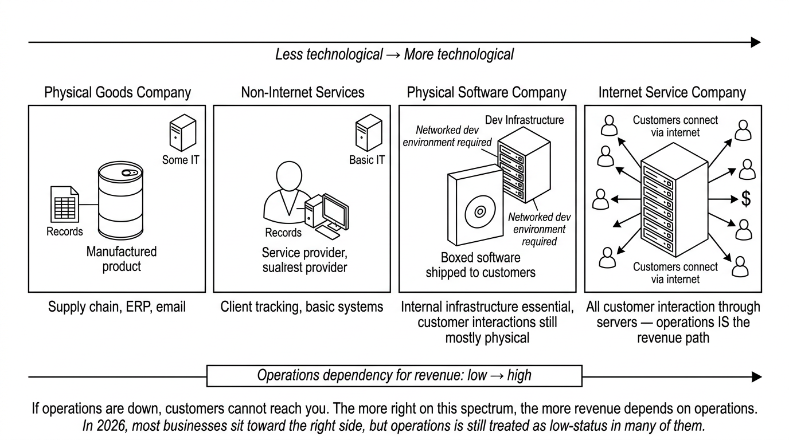

### 1.3 The Promise of Automation

\"The promise of automation is removing classes of work, while you
consistently get the desired results.\"

At this point, everyone knows that automation is a necessary thing. It
wasn\'t always this way. I spent much of my career trying to automate
things and getting strong pushback from both management and peers,
starting around 1996.

These days people usually have some aspects of automation, and are
comfortable with those, so it is only the areas that they do not yet
have experience which are hard to get implemented. A major impetus in
writing this book is to resolve those problems, by making the concepts
better publicized and hopefully well understood.

The issues I find these days are not that people do not want
comprehensive automation, but that there is not a clear understanding on
what comprehensive automation entails, what it takes to build, how
things will change once it is in place, and how the life-cycle of
operations changes accordingly. Now that Kubernetes is a dominant
platform, many assume it is comprehensive automation, except that it
still requires manual labor to configure, change and operate.

With all of these things, it is best to stay results-focused, and look
at what you want to achieve out of automation, and in my opinion the
ultimate goal should be: \"removing classes of work\".

What is a \"Class of Work\"? We will look at this in many ways over the
course of this book, but we can start by summarizing it as: \"anything
that is done\".

This may be a specific thing such as \"update a DNS zone file\" (text
file). When this \"Class of Work\" is comprehensively automated, then no
one will ever again update the text file relating to DNS zones, but will
have to do other work related to DNS still, as only updating the zone
file was comprehensively automated.

This could be extended to \"configuring DNS\", in which case all zone
files are automatically generated, the serial numbers are always
incremented properly, the configuration files that specify the zones are
generated, and all the transfers and tests to ensure that these changes
are pushed out into production and contain valid entries are validated
and monitored.

This is a \"Class of Work\" that requires people to do something
currently, but perhaps only in some areas if it is already partially
automated.

If you have a service (SaaS, such as a web-site like \"DNS Made Easy\")
that does this for you, then someone still needs to enter the data. The
data entry is still a manual process, and part of the total Class of
Work relating to updating DNS.

How would you remove this manual work? It will need to be generated from
either a template of hostnames for the type of services being provided,
or some other automated mechanism.

When no one has to think about the life-cycle changes or perform manual
labor relating to this area of work, then this Class of Work has been
comprehensively automated, and has been removed from the realm of Manual
Labor (which requires scaling personnel).

Updating the system (code) that manages this Class of Work remains
manual labor, as writing logic has not yet been turned into an
automatable task, but the regularity of updating the automation logic
should happen far less frequently, and is more knowledge-work than
data-entry work.

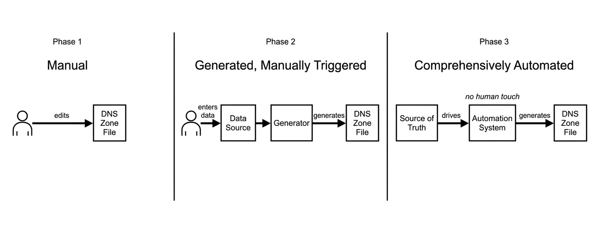

Knowledge work is more stimulating, and known to be something that needs
reviews and tests, whereas manual data-entry work is more prone to
mistakes, because it is done so regularly that constant vigilance
becomes impossible to perform accurately.

Mistakes will happen, as everyone knows manual work must be manually
inspected and automatically tested, and yet this is typically the place
that mistakes are made, because updating automatic tests and manually
inspecting the data are both themselves manual processes, and similarly
prone to failures.

Eventually someone will make a typo or other data-entry mistake, and it
will not be caught in review, and will be pushed out to production, and
will cause an outage, and may cause loss of revenue or other negative
consequences.

With automated logic, these kinds of repetitive data changes and
verifications can be done as correctly as the logic specifies, and if it
is written correctly, it will be done correctly forever. Or, until the
business goals or infrastructure environment changes, and it must be
modified accordingly.

What is automated logic? It is logic that is driven from data, where the
logic was manually created, but its functions are based on structured
data that create the outcomes and can be changed in data, while the
logic stays unchanged. We will look at aspects of this, but this is not
a book about creating automation, it is a book about how to think about
operations and automation.

### 1.4 Operations is About Control

I will posit that the primary thing that operations is about is control.

Why control? Why not up-time, availability, responsiveness to business
direction, or any other valid priority?

My reason for this is that without control, you cannot be efficient in
any other areas. You can only be as efficient as your level of control
allows you to be.

You can always make progress in any area by applying resources to it:
people, time, money, hardware, etc.

These will make progress on problems you have and want to solve, but the
limiting factor to each of them will be your ability to control the
environment.

If you have an up-time failure event, to fix the problem quickly you
must be able to determine what is wrong, which takes the ability to
gather information, and you must be able to take action to resolve the
problem, which takes the ability to change the environment.

Both of those actions, \"gather information\" and \"change the
environment\" have control as a central tenet.

How can you gather information without the control of the environment to
yield you information? In the most basic example, if you do not have
access to the information, you cannot gather it, and you certainly do
not have control over it.

If you do not have access to change the environment, you cannot change
it, and do not have control over it. If changing an environment is slow,
then you do not have control of your fix latency.

Like many things, control can be seen on a spectrum. We can illustrate
in on a line segment, such as:

No Control ◄────► Total Control

This spectrum would represent all possibilities of \"Control\", having
no control, and having total control.

Control is a tricky subject, in that it is not only un-real (Virtual),
but it is even more Virtual than many other things, because it is more
like a concept than something that is valid data.

Unlike other Virtual (non-real) things, control cannot be verified like
data can be verified.

If I have a variable \"X\" and I set X to 5 (X=5), and then I check if X
is 5 (X==5?), I can get a result that is True or False. X is either 5 or
it isn\'t.

But with a concept like \"control\", there is no way to check that you
have control or not. You can check that you have access to some data,
which is an aspect of control, and you can check if you can change data
(by changing it, or looking at permissions (less good)), and this tells
you more aspects about control, but there are so many other things that
go into this that are very difficult to inspect or verify.

For instance, one aspect of control is, \"Do we have enough time to do
the work we need to do?\" This is an aspect of controlling one\'s
schedule, so that good work can be produced.

If we do not have control over our schedules, and work is required to be
done before it can be done to our satisfaction of \"good work\", then we
do not have control over this, and we will see problems arise from this
fact.

There are many other aspects of control that we will look at, and I will
make more cases on why I believe this is the central tenet of Operations
and why understanding what you do have good control over, and do not
have good control over is very valuable and actionable information.

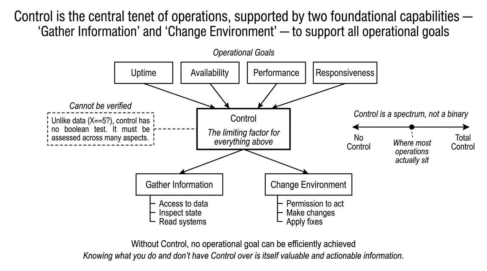

##  

## Chapter 2: Real vs. Virtual - Understanding What We Work With

One of the foundational goals of this book will be to differentiate the
real from the virtual.

This may seem like something that is common sense, but I have found wide
breadth and scale disagreement on what is real and what is not real, and
this creates a lot of communication and planning problems.

If we can\'t agree on what is real, how can we agree on our priorities?
We will value things differently, because we understand them differently
at a very fundamental level, and all communication will be inaccurately
moving past each other, instead of directly engaging with common terms
and values.

The results will be poor, and without coming to terms with why this
fundamental miscommunication is occurring, we may never be able to see
eye-to-eye, and may end up being unable to work to get good results with
each other.

Going to the very basics and working up from there will allow us to
develop a common method of communicating, starting from terms, and
moving to goals, and then priorities, and finally into axioms so that we
can come up with plans where we agree on the components and end results.

### 2.1 The Differences Between Real and Virtual

\"What is reality?\" is a question that is too big and general to be
dealt with here, if you want a good introduction on how to understand
this from an engineering perspective, you can see Bertrand Russell\'s
book *The Problems of Philosophy*. It does a good job of describing how
reality can be determined from our senses, and is a fairly short read,
as it is described in the first 30 pages of the book. You can also take
a look on Wikipedia at the philosophical movement, Logical Positivism,
which is a useful philosophy for engineers, and is one of the
philosophical methodologies I use, but I only use the empirical and
structural aspects of how it relates to physical reality for modeling
and troubleshooting purposes.

For our purposes, it is good enough to have a summary of this, and for
me to describe on which side of real vs. virtual (un-real) various
elements reside, for our purposes. Again, this is not meant to be
\"ultimate truth\", but a tool for communication, so that we can come to
common terms and understandings, and grow our engineering abilities and
get better results. It is not meant for purposes outside of this
endeavor.

To be brief, I will use Russell\'s example converted into the experience
you are having right now.

At present, you are somewhere reading this text. You are real, you
exist, because you have tangible properties, such as mass, made of
molecules and atoms, in a certain state that make you you.

The text you are reading is either in a book form, such as paper, or an
electronic form, such as a monitor, phone or e-ink display.

If you are reading a book, the book is real, because like you, it is
made of molecules, and has physical properties. It resides in a certain
position in the world.

If you are reading from a monitor, then the monitor has similar physical
properties.

These things are all real, for our purposes of reality.

The way you are able to read is that either ambient light is refracting
off of the book, or is being emitted from the monitor, and those photons
are striking your eyes, and the rods and cones in your eyes are being
stimulated, and sending \"signals\" into your brain and nervous system.

These things are all real. Photons have physical properties, and while
different from molecules and atoms, are able to be physically described
and interacted with.

At this point, you are probably affirming why you may have not read more
philosophy works in your life, right? Nothing new here, but lots of
words to get to that point.

Now, we enter into the realm of the un-real, the virtual world.

How you interpret the words is not real. It is a virtual type of
understanding, though the word \"virtual\" is usually confined to
computer related terms, I am going to use it universally to all things
to differentiate from real. Because we are mostly going to be discussing
computer-related un-real concepts, it is easier to just stick to real
vs. virtual.

So, what am I getting at here?

You are real, the device (book/monitor/device) is real, the photons
traveling to your eyes are real, but your understanding and
interpretation of the words is virtual. Your feelings about the words
are virtual, and in fact the words themselves are virtual.

The ink on the paper, or the electrons producing the physical effects
are real, but your understanding and interpretations of them are
virtual.

What\'s the point of this? It will become clearer as we go on why I am
leading with this, and it\'s not to make myself seem like a fancy-pants
smart guy, it\'s because without this agreement now, there will be many
more disagreements in the future, and it will hinder our communication
about the more interesting and relevant parts of engineering and
automation. Please, bear with me here.

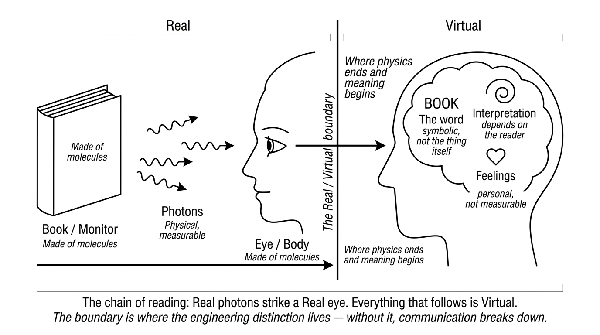

So. We have real books, devices, you are real, I am real, but your
understanding and my understanding of things is not real, and even the
words I am writing and you are reading are not real.

How are words not real? It is because they are symbolic. They represent
an idea, or set of ideas, which are also not real.

The word for \"book\" exists separately then the object they describe.
In other languages, the word \"book\" changes (libre, knega, etc), yet
the book itself does not change. This illustrates how words are
different from the things that they describe.

Words can also be written in different fonts, and I could call this a
\"manual\" instead of a \"book\", and yet what you are reading would not
change.

Symbolic things are not real, they are virtual, or logical. I will use
virtual instead of logical, as I will be differentiating \"Virtual\" as
un-real, from \"Logic\" to be used for processes and code, or
programming.

Let\'s create a quick list of things that are real and virtual, for an
immediate reference:

-   Hardware: Real. Something you buy (a device), put an OS on, and runs
    your software, or something similar.

-   Software: Virtual. Electricity (in RAM), magnetism (on rotating
    disks) or electro-chemical (on SSDs/NAND) stores bits of information
    that can be executed.

-   Data: Virtual. Same as software, but can\'t necessarily be executed.

-   Operating System: Virtual. Collection of software and data to make
    hardware perform operations.

-   Book: Real.

-   Words. Virtual.

-   Ink on a page: Real.

-   Fonts: Virtual. Data about how ink can be put on a page, or pixels
    illuminated on a screen.

-   Light emission from monitors/screens: Real.

-   Words and letters written on the monitor: Virtual. These are just
    patterns we recognize, and are all virtual. The physical properties
    of them are real, but those are not what we call \"words\" or
    \"letters\", but are instead patterns of photons at different
    frequencies and intensity.

-   \"A network\": Virtual. It\'s a concept of something that
    \"networks\", or more specifically may be a network IP address
    (data), that describes the network.

-   Network cables: Real. Physical objects that carry current.

-   Ethernet protocol: Virtual. A collection of data and logic that
    describes how to communicate over electrical signals.

-   Layer 1 Ethernet: Real. Physical electrical signals

-   Layer 1 Ethernet standard: Virtual. The description of how the
    physical Layer 1 ethernet will operate.

-   Layer 2 Ethernet: Virtual. How the Layer 1 physical (real) is used
    via the Layer 1 Ethernet standard (virtual), to create a Layer 2
    ethernet connectivity effect (virtual).

-   IP Address: Virtual. Data.

-   Hostname: Virtual. Data.

-   My engineering perspectives: Virtual. Data.

-   My engineering experience: Virtual. Data.

-   The actual things I have been through in my life: Real. Things
    happened, involving molecules and stuff over time (entropic heat
    exchange, etc)

-   My perspectives and memories of the actual things I have
    experienced: Virtual. Data, and summarized data at that, since I was
    not aware of the full-state of the physical (real) occurrences
    around me, and my memory (virtual) of them is a summary of that as
    well.

I hope this short list and hopefully not-too-painful fundamental section
has left what I am referring to in a clear state with you.

If not, please skim it again. You don\'t need to agree with me on these
things, you merely need to understand what I am trying to say clearly to
get the information I am trying to convey.

If you ever hit parts that feel wrong to you, or you reject, try to use
the mechanism of changing what you disagree with to: \"Geoff says X\"

This means you can take in this information, as \"Geoff is saying this
to me\", without having to update your world-view at this moment to
include what I am saying as \"the truth\", and in fact, I am not asking
you to ever accept what I say as the Truth. This is a communication to
hopefully provide you more insight, which will include my perspectives,
not as instructions on how you should see the world once you have
finished reading this book.

It is more important that the things I am saying to you are internally
consistent (Alignment), than that you agree with my usage and summary of
each of them. I am working with more information than I can convey at
any given time, and am doing my best to partition this into a small
stream of data that can be turned into understandable language. It\'s a
lossy process, at best, but it\'s the best I am currently able to do.

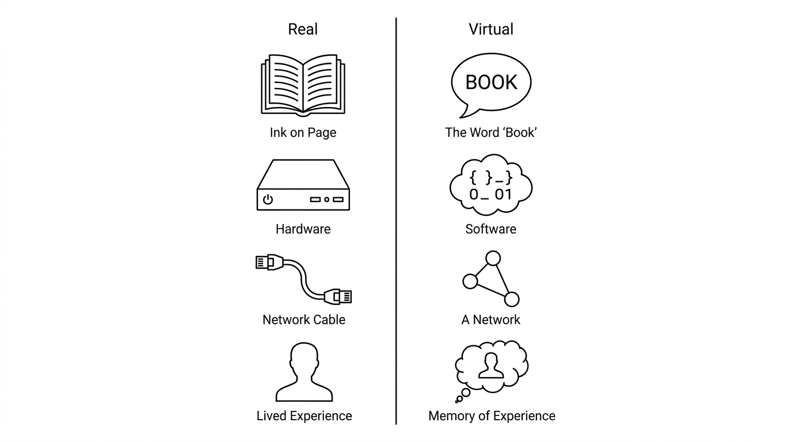

### 2.2 Knowability and Trusting Information

What do I know? What do I really know?

Or, to paraphrase a Sherlock Holmes quote, \"What do I know, and how do
I know it?\"

In any situation that contains a problem to solve, this is a relevant
question.

If I believe I have solid information that I can take action on, I can
begin immediately to take action on that information. If I know that I
do not have solid information, then I know that the first thing I need
to do is to get some solid information I can act on.

How do I know what is good information?

It should be sourced from my own experiences, or it should be planned to
quickly check the information so that it becomes part of my personal
experience. Things I have personally experienced, I can say I have
knowledge of.

Things I have read or heard, or that someone (including myself) just
thought up may not be related to the reality of what is going on at the
moment. Actions based on non-personal-experience information are going
to yield extremely unreliable results, because the information was not
grounded in the circumstances it is being applied to: Local Reality.

What you experience and work with directly constitutes your actual
context: Reality and Local. Information that is not directly related to
your context may not be directly applicable: Virtual and Abstract.

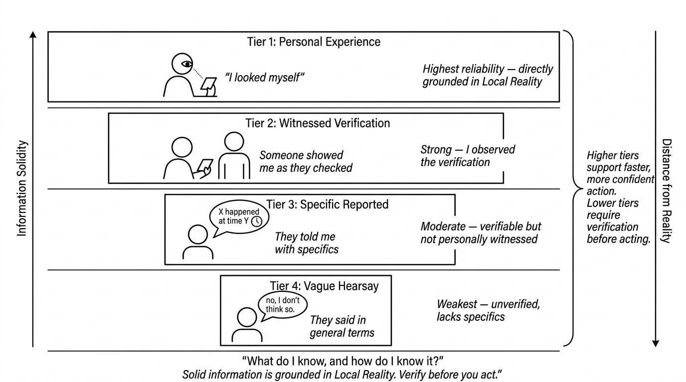

Let\'s create an example, a problem for us to solve. We\'ll be doing a
lot of this during the course of the book, so to get the most out of
these I would suggest taking a moment each time one is introduced to try
to model it out in your mind, imagine it, draw it out on paper, or do
whatever works best for you. I will discuss some of my techniques for
doing this as we progress, but please use what you already know and
invent new ones any time they occur to you, and try them out.

The problem will be a common one: alerts are going off on our monitoring
system, and tell us that we are having problems with our web servers.

The monitor alerts are not extremely specific in this case and report
something like \"HTTP test failure\". More specific alerting would be
helpful here, but those tests take time to set up, and in our immediate
example environment they don\'t exist.

A group of people forms up to deal with the alerts, and immediately
several things are suggested as problems:

-   Maybe there was a bad code push?

-   Maybe the logs have filled up the disks?

-   Maybe there is a DDoS or other hacking attack occurring?

-   Maybe someone is doing work on it, and forgot to tell anyone and
    made a mistake?

All of these are possible, and while some are more likely than others,
and could be used to prioritize where we start looking, the question
remains: What do we know?

What we have experienced so far, and what we really know, is that we got
an alert of \"HTTP test failure\", and this has something to do with our
web server environment returning correct results to the monitor health
checks.

This is all we know in this circumstance.

Was there a bad code push? We don\'t know, because we haven\'t made it
part of our example. Let\'s add some data around that.

We have 2 options:

-   We ask developers or release engineers (or whomever, for this
    purpose we will say \"release engineers\") if they have recently
    pushed any code.

-   We go and look to see if the code has been updated.

Both of these options will yield us new information we can work from,
but will each of them give us solid information?

Asking the release engineers will give us the hearsay information that
whoever we asked gives their best current information. Do they check
first before responding, to see if anyone has pushed code lately, or do
they use their current information to tell us?

If they say, \"No, no one has pushed any code lately. We won\'t be doing
that until X time\", then we will leave that conversation with
information that says no new code was recently pushed, and we will have
impetus to deprioritize the possibility of new-bad code being pushed
into production causing the monitoring alert.

But is this solid information? They may be the only person who does the
code pushes, and so they may be the \"definitive\" answer on the
subject, but what if a new employee accidentally pushed code? The
\"definitive\" person would not know this, unless they checked, and the
answer they gave us would not be congruent with reality.

If we take the second option, and we look for ourselves, then we can see
if the timestamps on the files have been updated, or if the log files
say that the web or application servers have been reloaded.

The second option gives us information that we have personal experience
with, and this is solid information. If we do not have access to go look
ourselves, then the next best thing would be getting someone who does
have access to verify it themselves and preferably show us the result,
but they could also provide unique information such as \"X was the last
time code was pushed\", instead of a more vague answer like \"No, no
code has been pushed lately\".

So we have two lessons we can take from this example problem. One, that
information we have personal experience of is better than hearsay
information, or information we do not have personal experience with.
Second, that there are degrees to \"information solidity\", or the
reality-based nature of the information.

Looking for ourselves yields the highest relation to reality. We were
there, we looked at the information, and it said \"X\". We have very
high reliability with this information, as long as we were paying
attention to what \"X\" was, and paid attention to get into the right
position to look at the right data (not accidentally looking in a
different server or directory, at the wrong files), then we have solid
actionable information to work from.

This would be the same level of information if someone else did this
work, but showed us while they did it. We saw them do it, we saw the
results. It would take some acts of deception to make this data
questionable, and since we are referring to working in a
work-environment, we will assume that all people are behaving as Good
Actors for these examples. We could also look at how some people act as
Bad Actors, and can create bad data, for instance trying to hide a
mistake that they have made. (We could call this section, \"Do you even
audit, bro?\" But, we won't.)

Less reliable is information that someone told us they looked at, but
did not show us, and gave us exact data, such as \"X was the last time
code was pushed, I checked the directory timestamps and logs\". This is
good data, but we do not have personal experience with it, so it is
less-good than data we verified ourselves. Maybe they looked in the
wrong server, at the correct directory, and we cannot verify this, we
have to trust their information.

Next, we have a situation where someone else tells us \"No, no code was
pushed recently\". This is not data we have verified ourselves, so we
have no personal experience with it, and it is not specific as to when
the code was actually released. It is possible that this person did not
check, and is just telling us from their own perspective that they
don\'t believe it was pushed recently. This is beginning to be invalid
data.

We could still ascribe Good Actor behavior to this person, and take them
for their word, however, what will be the result if we do take them at
their word, and deprioritize looking at a bad code release, and start
looking at other problems. We end up exhausting the search on other
things, and much down-time has accrued with the \"HTTP test failure\"
alert still going off, and eventually someone looks and sees that indeed
new code was pushed out, and it contained a bug.

Rolling back the code resolves the problem, and the HTTP server starts
to return correct tests to the monitoring system.

Downtime was accrued because we were working with non-verified
information that could have been avoided by getting personal
verification of the exact time of the last code push. I have seen this
exact situation happen many times, and bad-code or bad-configuration
changes are one of the most common outages for networked services, and
there are times there is confusion around whether deployments happened,
or what they changed.

Even though these are common, the common-ness alone does not mean that
it is solid information. It only means it is something that should be
verified quickly to see if it is a contender for causing the problem.
Dashboards and automation can make verifying this fast and reliable, but
if processes are not followed, the dashboards may mislead you that a
deployment has not occurred, when something was indeed pushed to
production.

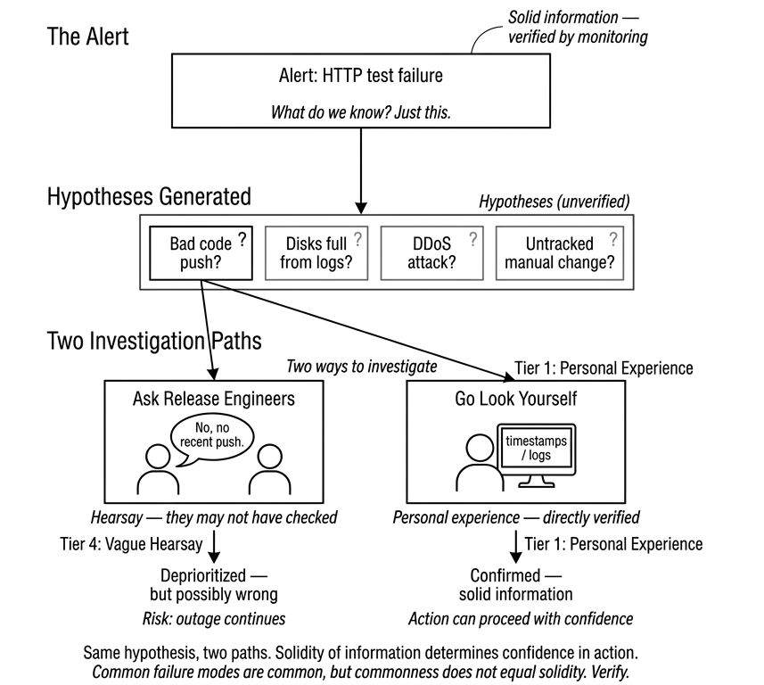

### 2.3 Knowability - What Can and Cannot Be Known

I didn\'t know this before I just looked it up, but knowability is
already a word in dictionaries, so there is not a lot of reason to cover
it in depth.

We\'ve already been using it quite a lot, but I thought it would make
sense to shortly define it.

Knowability is a spectrum of how well you can know something, in full,
at all levels. It needs to be extreme about knowledge like our \"X=5\"
example, where we know absolutely everything about it.

Any ambiguity or aspects that remain not-perfectly-knowable need to
count against it being on the extreme side of Knowability (1.0), and
more towards the side of Unknowability (0.0).

To set up the spectrum, it looks like this:

Unknowable ◄────► Knowable

Since I think we have a clear working definition for the terms Real and
Virtual, we can start to do some comparisons between them and see what
other things are different.

Since they have very different properties, as they are about as
different as anything can be, that means that those different properties
should have different advantages and disadvantages when looking at them
from different perspectives.

### 2.3.1 Reality: The Physical - The Limits of Knowability

The first important thing to know about the difference between Real and
Virtual things is that you cannot know everything about a Real thing.

Determining what the state of a Real thing is is essentially impossible,
but we can have approximations that are good enough.

Why is it impossible to know that \"true state\" of a real thing?
Because its state varies with every atom, and collectively all the atoms
of a physical thing are too numerous and beyond inspecting in many
dimensions.

This is not taking this too far either, it is simply being clear about
what is possible, and what is not.

So, if we can\'t know everything, then what is possible, and what are
those limitations?

Let\'s take something fairly simple for example, such as temperature.
What temperature is a physical device, we will say a 1U 19\" rack
server?

Well, that depends on where you are measuring it from. Modern servers
can have dozens of temperature sensors throughout their chassis, and
those temperature sensors will approximate the temperature fairly
accurately for part of the device.

We could measure each CPU socket temperature, and the temperature near
the power supply, and the fans, and then we can approximate from these
or list them, but there remain many places we are not even directly
measuring.

It happens that this is not necessarily important for our purposes, but
it is important to understand and accept that this data is simply not
available to us, and we have sensors in place to detect some aspects of
it.

Other aspects we may not have any sensors for. For instance, mobile
devices often come with accelerometers, which will detect movement of
the devices. Rack servers do not currently come with these sensors, and
for a fairly reasonable reason, as they are not in demand.

But this is one type of data that we cannot collect about this server.
It could be that the amount of vibration the servers are going through
could end up causing problems over large numbers of servers, and by
doing correlative analysis on part failures with vibrations, and by
determining where the vibrations were worse, we could contact our data
center\'s staff and see if they could fix the problem, as it may be an
undetected problem on their part.

This is a completely theoretical example, but it illustrates that there
are things we know, but not completely (temperature), and there are
things we do not know at all about Real things.

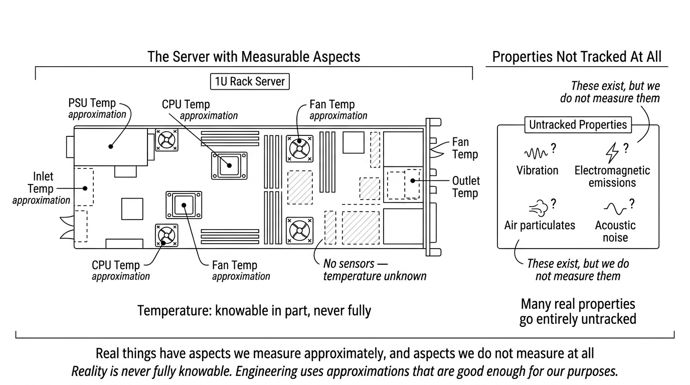

### 2.3.2 Virtual: The Un-Real - What Can and Cannot Be Fully Known

In the last section we learned that there are things we cannot know, or
know with full accuracy about Real things. Their very nature means that
they are not fully knowable, but we can know enough about them to make
use of them effectively, and have a long history of doing so.

How do Virtual things align on this same spectrum of \"knowability\"?

Some Virtual things can be completely known. Other Virtual things remain
unknowable.

We can use the examples we used in a previous chapter.

Let\'s look at a variable that we assign:

X = 5

Here, I have made X to be equal to 5. Can we know everything about this
Virtual thing?

Yes, we can.

We can inspect this in any way we like, and know everything to know
about it. We can compare it to different numbers: X \< 6, X \> 4, X ==
10, and see if it is similar to them.

Any operation we wish to make, we can perform and know the full extent
of what there is to know about this data.

Now, let\'s look at a Virtual thing that is not fully knowable, we will
look at the word and symbol of \"idea\".

We can take the word \"idea\" and trace its language roots, and compare
it to other languages, and find common usage of it in popular
literature, and we can ask people what it means, and in all of these
things we will gain information.

But, we will never know everything there is to know about the word and
symbol of \"idea\" because it is not a concrete thing. It has
subjectivity and flexibility, and can be used in different ways in
different circumstances.

The same is true for many things. So we have a class of Virtual things
about which everything can be completely known, and another class of
Virtual things about which only some things can be known.

Let\'s simplify this into two more terms: Knowable Virtual things, and
Unknowable Virtual things.

We could call this \"Knowable Virtual Data\", but since Data is a subset
of Virtual, and there exists other things that are virtual, and may be
completely Knowable, that do not meet the same definition as data, we
will use the label \"Knowable Virtual\" and then can append anything
onto it afterwards, like data, to describe what exactly the Knowlable
Virtual thing is.

Let\'s create a spectrum for these labels:

Knowable Virtual thing ◄────► Unknowable Virtual thing

We\'re going to build a little forest of terms and spectrums (or axes)
over the course of the book, because once we have clear terms like this,
we can use them in different ways than if they were still more vague,
and less specific. Once they are specific, they become tools, which we
can use to help us perform work.

We create a language tool when we give terms specific properties, which
allow us to clearly divide information, such as Knowable Virtual Data
vs. Unknowable Virtual Data. We have at least 1 property between these
information topics that we can use in any algorithm as something that is
clearly understood: knowability.

Over time we will build up a toolset of these, so that we can
communicate about incredibly complicated topics, and reason about them
efficiently and clearly.

As an exercise, try to come up with some of your own terms. Once you
have an understanding of how to create terms for yourself, you can use
this to create things you understand completely, because you made up the
terms you are working with.

If you can, great, write them down and add more to that list as you
think of them. Over time, you will start your own set of terminology in
which you can reason with, having more understanding of it than my
terminology, which I have created. Like I\'m doing here, you will have
to define your terms for other people, or translate your terms into
language they already understand, but it is important that you have a
clear understanding for yourself, which creating your own terms helps
with.

If you can\'t think of any now, that\'s not a problem, but if any come
to mind in the future, write them down, and over time more and more may
start to come to you. This is a process that becomes easier and more
useful over time, as you practice it.

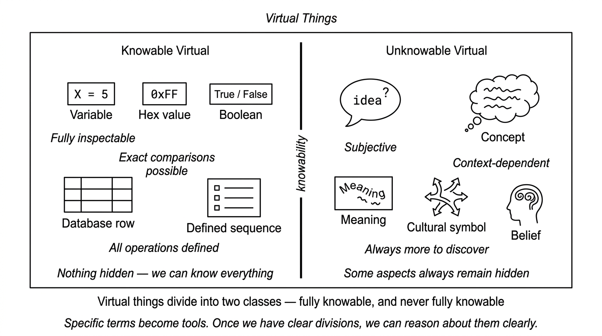

### 2.3.2.1 The Unknowability of Logic (Practical Implications)

Another Unknowable Virtual thing is Logic.

Logic, as we defined earlier, is an all-encompassing term for anything
to do with software or decisions, or scripts or other methods of
manipulating data, executing statements, rule systems, etc.

One of the famous problems of computer science is the Halting Problem.

This problem is essentially that it is impossible to know if a program
is ever going to stop executing once it starts. There is a lot of
information about this problem out there, so we will just leave it with
that description and realize that Logic has an Unknowable Virtual
element to it.

However, Logic also has many Knowable Virtual elements to it, because as
in our example of \"X = 5\", this is a statement that can be made in
Logic.

Additionally, just like in our example we can use the Logic itself to
inspect this, or we can externally inspect the Logic using a debugger,
and we can verify the data, and it is Knowable Virtual Data.

So, while Logic contains some properties that are Unknowable (the
halting problem being one example), it also contains properties that are
Knowable, and the Unknowable does not stop us or hinder us in any way
from gaining full access to the Knowable.

This puts Logic in a murky place on a spectrum of Knowable to
Unknowable, but that\'s OK!

What we need to do in this instance is slice up what Logic is, and look
at each of the components on the spectrum, and we will have a correct
view into it. Whenever you have a compound problem, you can slice it
into simpler components to better understand it.

So, that would look like:

-   Logic: Will it ever stop running? On the Unknowable part of the
    spectrum.

-   Logic: Variables and other values? On the Knowable part of the
    spectrum.

I leave off calling them directly Knowable and Unknowable, because Logic
can be tricky, and there can be tricky things done inside logic, and
perhaps in some circumstances this means that variables are not
completely knowable, and there might be circumstances where we have a
high confidence that a program will halt, like this pseudo-code:

```c
int main()
{
    return 1;
}
```

We can be reasonably sure that if this program compiles, and there are
no problems with dynamically linked libraries, and there are not somehow
crazy macros in the white space or brackets, that this program will
eventually stop running.

This tells us another knowable property of Logic, which is that it is
very complex, and that its meanings can be obscured.

Take for example this Python code snippet which uses a Decorator. It\'s
OK if you don\'t know Python or aren\'t familiar with Decorators,
because it\'s just an example and I\'ll explain my meaning of it.

```python
@HelloWorldDecorator
def HelloWorldFunction():
    return 'Hello World!'
```

If the \"@HelloWorldDecorator\" wasn\'t there, this would read like a
beginning Hello World! program, as when you call the
HelloWorldFunction() function, and it returns the string \"Hello
World!\".

However, there is a decorator to this function call
\"HelloWorldDecorator\", which modifies the behavior. The decorator code
may live in another file, so it may not be obvious what is happening
when you simply look at the code. You assume it\'s basically going to
return \"Hello World!\".

Let\'s look at the decorator code I have created:


```python
# Decorator
def HelloWorldDecorator(function_reference):
    def DecoratorInside():
        # Call the Function we are wrapping
        initial_result = function_reference()
        return initial_result.replace('Hello', 'Goodbye')

return DecoratorInside
```

The decorator code creates the required wrapper for the functions, as
that is what decorators do in Python, and it calls the function
reference, but instead of simply returning the result, as if we had
called the code without a decorator, it modifies the result.

It replaces the string \"Hello\" with \"Goodbye\", so we get the very
different result of the \"Goodbye World!\" string being returned,
changing our peppy introductory function into something much darker.

This melodramatic example shows that we can see something that looks
very clear in code, and yet something that does not necessarily look
like it will change the result we clearly see, in fact, does change that
result.

This is another aspect of Logic\'s being on the Unknowable side of the
spectrum, due to its ability to contain very high complexity.

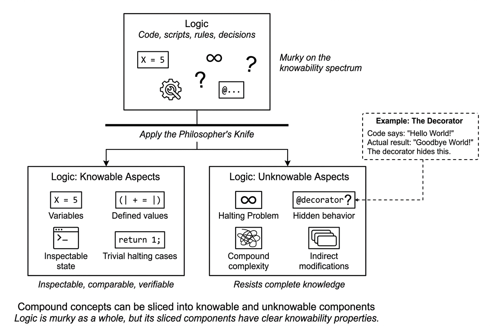

##  

## Chapter 3: Data is King, Logic is Shell - The Foundation of Reliable Systems

### 3.1 Data - The Knowable Foundation

In the virtual world, Data is king.

I will support this assertion throughout this entire work, as it has
become a central tenet in my thinking about how to do any sort of
digital engineering.

As I asserted in the last chapter, Data is an un-real thing. It is
virtual. It does not have physical properties, and does not exist in the
physical world.

Electrons and magnetic forces exist, which we use to encode data into
storage and processing mediums, but the Data itself does not physically
exist.

This is an important fundamental to understand, and more important for
the purpose of learning from this book, to accept the usage under which
I will give examples and explain things.

Data is symbolic and descriptive. It can be used in any way, to
accomplish any purpose at which the data has usefulness.

You can use Data to accomplish things it was not intended for. For
instance I could take the textual data inside a Linux */etc/passwd* file
and turn that into a musical score, by converting the characters and
terms into frequencies, and by playing it.

It would likely sound incoherent, and not be considered musical, but
that is the power of Data. It can be used as you see fit.

Data resides in a Data Source, which could be anything, such as: files,
database tables and rows, returned by networked services, etc.

Data can be stored in many formats, and these formats can dramatically
change the way the data is stored, and yet if it is not corrupted, the
data can still function in the same way.

Consider that data stored in a CSV (Comma-Separated Value) file and data
stored in a YAML or JSON format look very different, and yet both can be
loaded, parsed, and used as if they were stored in the same format.

Data could be formatted to fit inside a relational database, so that it
is spread into tables and fields, and looks nothing like a CSV file, and
yet after querying the database I can get the data back in the same
format which I could parse from a CSV file.

This shows the dynamic nature of Data, while still providing us with
consistent information that can be used by humans or Logic.

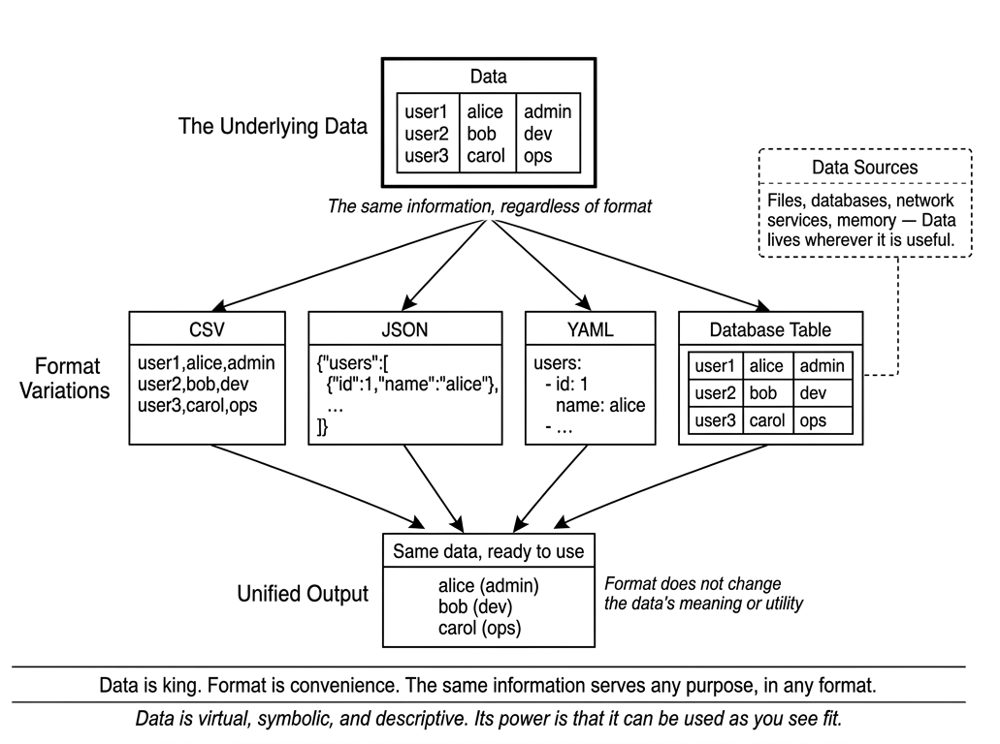

### 3.1.1 Data Source Properties

Since we\'ll be talking about Data quite a bit, I will be referring to
any mechanism that stores Data as a \"Data Source\".

This could be a database, a YAML file, a variable in a JavaScript web
page that came from a JSON RPC request, it doesn\'t matter. There is a
location that stores data, and we interact with it to get data and store
the data.

The Data Source may be persistent, or it may be temporary (such as
Javascript data in a web page). It may be transactionally safe, or
unsafe to update simultaneously. These are secondary properties, as the
primary property of a Data Source is access to the data.

Some qualities of a Data Source:

-   Access to data. Get it, set it. This is mandatory, all others are
    optional.

-   Constraints on the structure of the data (such as not being able to
    insert arbitrary fields). This would be a strict \"schema\"
    (schematic), as opposed to a \"document\" style which allows any
    type of modifications in the values of a record.

-   Constraints on the value of the data that is put into specific
    fields in the data. For instance, in a relational database a field
    in a table may be of type \"integer\" and will not allow alphabet
    characters, special characters, or real numbers (decimal precision)
    to be inserted.

-   Persistence: So that the data is saved, and if the power is turned
    off to the system storing the data, when the machine restarts the
    data will still be available. There may be corruption here, unless
    the Data Source also offers a Consistency guarantee. Persistence
    simply means that things can be discontinuous (losing power is one
    method to lose continuity of the service), but the data will still
    exist.

-   Consistency: Ensures that the data does not become corrupted in any
    failure situations. These situations might be the program being
    terminated un-cleanly, and it might use something like a journal to
    keep track of on-going changes, and will replay this journal on
    start-up to ensure that recently changed data is the same as in the
    journal.

    -   To be safe, the journal is written to and flushed to disk before
        the \"changes are made\" in the database, so if anything the
        internal database data is consistent with the previous changes,
        and only new journal entries need to be applied.

    -   There are different Consistency guarantees, and while
        Consistency means \"will not become corrupted\", there are
        usually many methods with which data could become corrupted, but
        the Consistency provisions attempt to solve those problems
        through various Logical steps.

-   Transactions: Multiple changes, such as in different tables, or
    multiple rows in the same table, can be applied all-at-once, in an
    \"atomic\" fashion, which means that it \"cannot be split further\"
    (Atomicity), and being the smallest-type-of-action, it is guaranteed
    to either not-have-started, or finished completely, before another
    action takes place.

    -   Transactional changes are made sequentially, and cannot
        interrupt each other. Furthermore they verify the consistency of
        the entire exchange, and not simply each statement, which allows
        more precise validation of referential integrity as well as
        being able to make changes that would be constraint violations
        if done one-at-a-time, but which are consistent when done
        together in a transaction.

-   Replication: This allows copies to be made of the data to at least 1
    other instance of the Data Source implementation, for example a SQL
    server could incrementally copy its journal file from itself to
    another machine, which then applies the journal. If the original
    machine goes down, the replication target machine will have an
    update-to-date version of the database, up to the latest journal
    entry it received.

    -   Replication might also be in lock-step with the Master, so a
        server that gets a write request will complete it on itself, and
        then wait for 1 or more other replication servers, based on a
        \"quorum\" number. If the quorum is two (2), then at least 2
        servers must have this transaction committed before the client
        requesting the transaction is told that it was successful. This
        method is much slower in terms of returning a result to a user,
        but is safer in that the information is persisted on multiple
        servers storage, in case a corruption-level failure happens on
        the original server.

There are many other properties to Data Sources, so this is not meant to
be an exhaustive list, but a brief coverage of some elements we can
associate with the label Data Source, which may or may not exist in a
given implementation you may use.

Some Data Source implementations offer features that are in opposition
to some of the above, and those feature sets are also useful, since they
provide different benefits and weaknesses to some of the features I have
mentioned. The right tool for every job, and all that.

Language note: I will use Master/Replica for databases, instead of
Primary/Replica, because Multi-Master makes sense where Multi-Primary
does not. You should use the language you are comfortable with, but you
should understand that language changes also change their meaning and
understandability.

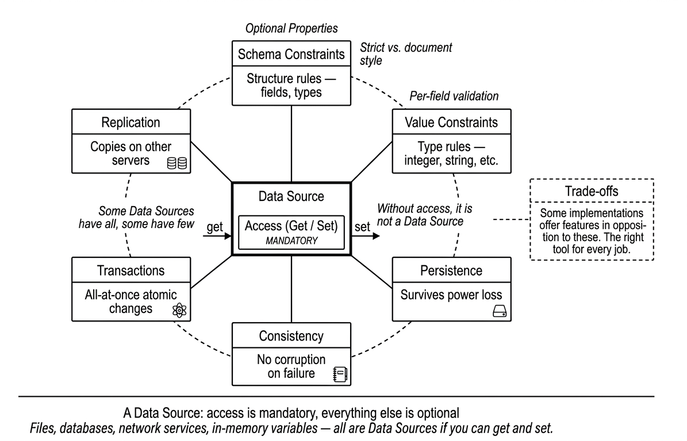

### 3.2 Logic - The Executable Shell

I\'m going to try to constrain myself to using the capitalized (proper
noun) \"Logic\" any time I am referring any of the following things:

-   Code

-   Programming

-   Scripts

-   Decision trees

-   Finite State Machine processes

-   etc

I will also use these other terms in their normal meanings throughout
the book, but I will refer to Logic when I am combining what is created
in order to manage things that are done programmatically.

It\'s good that our industry has many terms for things, as it makes them
specific, but I will use the roll-up term, Logic, in order to simplify
and generalize what we are talking about.

One simple definition could be:

-   Logic is Data that is executable.

In this definition, Logic is a sub-set of Data.

This could be executable because it is in a native format an Operating
System can load and execute (ex: ELF, EXE, etc), or via an interpreter
(ex: Python, Ruby, PHP, Bash), or via a Virtual Machine executor (ex:
Java, .NET/Mono).

Logic is used when one wants to operate on data in a digital
environment. With Logic we will change the data, create new data,
validate data, and perform side-effect type actions where we do things
like copy data to different locations, remove it, create directories,
start and stop services, as well as anything else we could do manually.

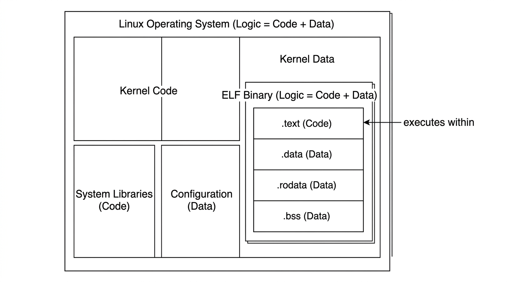

Essentially Logic is the way we take action through digital means, where
we would otherwise take actions manually.

Of course, in a digital environment, all actions eventually require
Logic.

If I am in a command-line shell, and I run a command to create a
directory, I have manually initiated Logic to perform this work.

If I write Logic to inspect a data source, and then to create
directories based on that data in that source, then I do not need to
manually initiate the Logic to create the directory. There will be some
kind of timed period (ex: cron jobs) or event (ex: monitoring initiated
execution) that will initiate the Logic.

As we went over in Chapter 2, Logic is un-real or virtual. It is not a
physical thing, with physical properties. It does not exist in the
physical world at a given location or orientation.

One can say that that bits that describe the Logic do reside on a
physical storage medium (rotating disk, SSD, RAM, etc), but I am
separating these physical attributes from the Logic itself, which could
be anywhere, and in a given physical device, it will almost always
reside in multiple locations, both on storage, and in RAM and perhaps in
a CPU cache, and perhaps partially in CPU registers.

### 3.3 Data's Primacy over Logic

I will end up breaking down many things to Logic layers and Data layers,
and how Logic works on Data, and how Data is the stable foundation of
Logic. In my perspective, this is a reversal of how many people see the
relationship between Logic and Data, but I will make a case for why Data
is the core and Logic is the shell.

To make the assertion as briefly as I can:

1\. Data is what you know at a given time. This is useful forever. It
could be useful hundreds of years from now, for the same reasons it is
for us today (using it to configure things), or strictly for historical
or analytical purposes. Data has essentially no \"death\" or time where
it becomes invalid or unusable, as a general resource.

-   Not to say Data cannot be corrupted, or be invalid to our purposes,
    but it remains valid as a source of information even if it is
    corrupted, though perhaps not actionable for our immediate use, and
    degraded utility and trustworthiness due to corruption.

-   Even corrupt data is potentially usable to give us some information,
    statistics about what was not corrupted, but corrupt Code/Logic
    should not be executed, unless it is a sealed-off environment, as it
    may perform destructive actions if it runs at all.

2\. Logic is the codification of goals. What we want to occur is
processed through Logic. Because of this, Logic has a number of
environmental factors that work in some conditions, but there are many
states where Logic cannot be used, except if it is seen as \"Data\" and
is no longer executable.

-   Logic requires a valid environment to run on. Logic created to run
    on Linux will not run on Windows, or OS X, without being re-compiled
    (and perhaps \"ported\"), or being somehow universally compiled.

-   Logic expects certain environmental requirements to exist. It may
    expect to run in a certain directory structure, which contains
    certain files, formatted a certain way, and containing specifically
    formatted data.

-   Logic could require access to network services which must exist and
    be reachable and authenticatable for it to work properly.

-   Logic has dependencies. It runs on a given \"platform\", and does
    not run if the supported \"platform\" is not available as its
    execution environment.

-   Data needs a place to reside (ex: database, file system, etc), but
    it does not require a specific environment, it could be stored in a
    YAML format, JSON format, in a relational database, a flat file with
    comma or colon separation, as raw blocks on a device, or any type of
    format or storage system at all.

-   The methods to access the Data can change, but the Data itself will
    remain the same.

In order for Logic to run in a different environment, it is likely going
to need changes. Some programming languages offer cross platform
execution, via being run by an interpreter or virtual machine executor
which was natively compiled to the target operating system.

However, there are still many places that Logic may not be able to work
cross-platform without changes, such as moving from Linux to Windows
there is a difference in how Windows access some storage, because it
uses \"Drive Letters\" as device targets, Unix-style operating systems
use a single directory hierarchy, and user\'s home directories are in
completely different places, and looked up in different ways.

Other changes may be system files it expects to find in certain places,
or required libraries that may not be installed, or may be an
incompatible version.

These are lower-level types of problems that Logic has, and why, unless
it is running in a hardware emulator, Logic written decades ago
generally cannot be executed properly on modern hardware and modern
operating systems. Examples: glibc or DirectX versions.

There are some exceptions to this, such as code that ran on very old
versions of Windows, and has had fixes installed throughout Windows
versions up until the modern times to allow this code to still work.
These are the minority of cases though.

A more likely scenario is that the organizational goals have changed.

Goals change frequently, and so requirements change frequently, and
Logic is codification of requirements. Once you have different goals, it
is very unlikely that the code that worked for the previous goals will
still work with the new goals. This happens every time new commits are
made to a source code repository, the actions the old code performed are
now changed, and new actions happen. The old-code\'s action\'s results
are no longer desired, because we have upgraded them to the new-code\'s
action\'s results. The old-code is deprecated and should no longer be
run, that Logic is expired.

The conditions for when the same Logic will give correct results once
your goals have changed is when that Logic is being used as a \"tool\"
or \"utility\", in which case it operates on data to perform its
actions. The Logic performs a primitive function, and so it can escape
being outdated as soon as your goals change, because of the limited
nature of its actions, and its intent being a general purpose tool,
rather than a specific tool to implement your goals.

This accounts for the long-life span of Unix-style environments, which
are historically largely made up of software that performs generalized
operations against a set of data. That data might reside in a file, a
database or be given by user input on the command-line, piping through
input streams, or through a series of prompts.

In these \"tool\" types of Logic, it is the data that tells the Logic
how to achieve a goal, and so again the Data gains primacy over the
Logic in being the key element. The \"tool\" Logic only exists to
transform the Data.

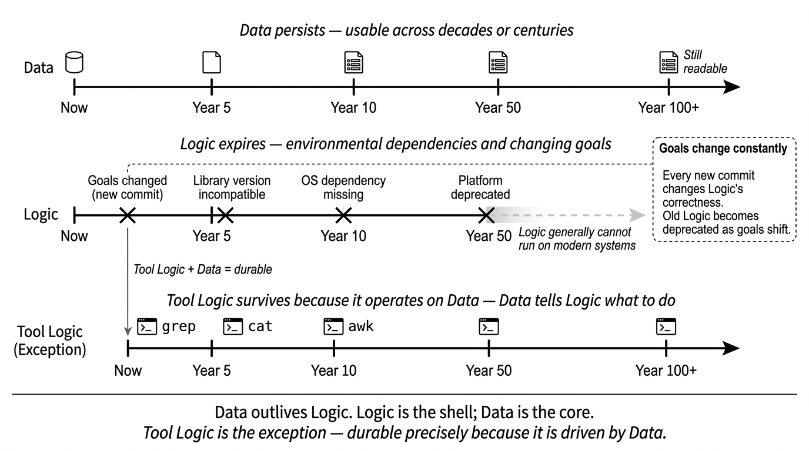

### 3.3.1 Data is More Trustworthy Than Logic

Now that we have established that collectively, Virtual Data, which I
will just call Data, since it is always Virtual, is Knowable.

And we have established that collectively Logic is Unknowable, even
though components of it may be knowable, we can use this information to
set up a hierarchy, which we can use to build more robust engineering
solutions.

If Data is comprehensively Knowable, and Logic is comprehensively
Unknowable, then we should base our actions on our Data, and treat that
as the supreme truth. Our Logic is not less important because of this,
as it serves the same role as it would if Logic was King, and reigned
supreme over Data. One thing must have precedence over the other,
because in real-world prioritization things cannot be equal. There is
always a preference, and it is usually by a wide-margin, due to the
limitation of resources in the pursuit of our goals.

Knowing that we can treat Data as the most important thing in our
operational environment means that we will always first focus on the
data being correct, and then secondarily we will look at how the Logic
interacts with the Data, with a careful watch that the Logic does not do
anything to or with the Data that would cause us problems.

Of course, you don\'t have to have any of this kind of analysis to know
that you should not corrupt your data with your code, but this is the
path I have taken to understanding where to place priorities, and how to
approach working, and they have served me well.

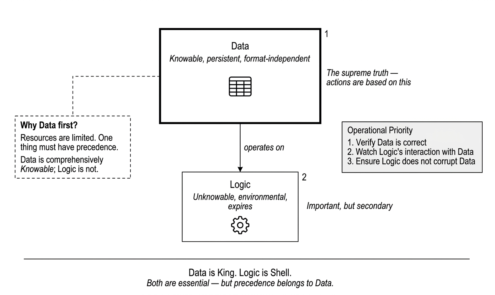

### 3.3.2 When Valid Data Breaks Logic

When working with Data, is it required that certain constraints are met.
This is normal database 101 stuff. If you have a relationship between 2
tables, the primary key of Table A is referenced in Table B, and then
you change that primary key in Table A, but do not update all external
references to it (such as in Table B), then you will have created an
inconsistency.

There are methods for forcing this to not be allowed in many database
software\'s schema configuration, using constraints and foreign keys,
etc.

In an Operational Automation environment it is likely that the data sets
will stay small enough that you can work with these constraints enabled
without performance problems, and the changes are important enough to
deal with the performance hit the constraints provide anyway. So, I
recommend using software relational constraints when possible, and
letting the database software manage enforcement of constraints to keep
your operational configuration data consistent.

If you find yourself in a place where constraints are causing a real
performance problem, and are not working, I suggest only turning off the
constraints that are the problem points, and leaving the rest of them
enabled.

For the areas where data constraints are turned off, you must be
especially careful when making changes to this data not to lose any of
the referential integrity that the constraints would have provided, with
your own changes via Logic, or in unfortunate times when you manually
update the database, which you should try to never, ever do.

Another Knowable thing about Data, is that if you have these constraints
active, then you can Know that the data is correctly configured, and its
referential integrity is consistent.

There are some operations, such as dumping data and mass importing it,
that can cause these checks to be turned off, so be careful when you do
this to do everything that is involved at the same time (ex: dump all
tables that reference each other at the same time), to ensure that you
have not imported things into an inconsistent state.

We\'ve now covered that Data can have an additional area of Knowability.
How does this relate to Logic?

Well, it turns out this is another area where Logic provides a
fundamental weakness, and in a way that is Unknowable.

You can have perfectly consistent and correct Data, with all constraints
active, and have Logic that works perfectly well with all of the current
data.

And then you can make a change to that Data, which does not violate any
of the comprehensive consistency Data validation tests, and yet
afterwards the Logic fails against the Data. How?

Logic is not actually tied to Data in that same way that Data can be
tied to itself (through constraints). In a database, let\'s use an
abstract general SQL database with transactions for this case, we can
insert a valid row into the database table, and all the constraint tests
are made in the transactional commit process, and the data is stored
correctly.

When the Logic next tries to access this data, it finds the new table
row, and it goes about its normal operational logic, which has always
worked before, but this time the data it receives is not something the
Logic accounted for.

For instance, you have a field that is an unsigned integer in the
database software, so it goes from 0 to 4 billion, but the Logic expects
that this data is in the range of 0 to 100.

If the data entered is actually 5000, and the Logic expected it to never
be more than 100, then the Logic will do something incorrect, perhaps
making something that shouldn\'t be 50 times larger, such as memory
allocations of a Java Virtual Machine, which might fail and cause a
service to not start on the next attempt.

Whose problem is this, Data or Logic?

It is a shared problem with between the two, because the Data contains
"valid" data based off the database software constraint system (0 to 4
billion), and the the Logic is only handling 0 to 100, and so a failure
has been entered between the two, even though the Data was correctly
inserted into the database, under the database\'s constraint system.

There are many ways to approach this problem. Databases frequently have
code that you can put into the database to execute at certain times (ie.
user defined constraints), which could validate the values and enforce
only numbers 0-100 are put in them.

There are some problems with this, you will have probably tied yourself
to this database platform for a very long time, whether you want to be
or not, because after all of that Logic is put into the database to
validate the Data, it would take a large effort to re-create it all
correctly in another database software\'s methods, and those methods may
not be fully compatible, in that you can\'t do everything in the target
database that you could do in the original database.

That is a manageable problem, however, as it deals with timescales of
years, and is possibly worth the cost-benefit tradeoff.

However, there is another problem is that now you are putting Logic into
your Data. We know that Data is Knowable, and Logic is Unknowable, and
when you put an Unknowable into your Knowable, the result is that you
end up with an Unknowable.

We have just transformed our safe-space of Data into an un-safe space,
because now we have custom Logic in there as well. So we do not have
anywhere that is just Data.

This is a huge problem as we will never be able to be assured that the
Data we are accessing is going to be accessed correctly.

To take our \"X=5\" type example, if we have a field \"X\" in a database
table, and we have Logic running in that database, it is possible that
as we test and modify that \"X\" field, the Logic will be invoked, and
it could change the results.

With this being the case, we can no longer trust that we set \"X=5\" and
then we test \"X \> 4\" (X is greater than 4), and we receive a
positive.

The Logic may have silently changed X to 4, because it had a constraint
that we did or didn\'t know about at some point, and now we do 2 steps
in a row, where we assume success is guaranteed, and we end up with
failure. We set X to 5, we check after and it is not greater than 4,
because the embedded database Logic has changed the value to the
specified maximum. If setting 5 failed, this would be appropriate,
because we are not allowed to set outside the range, but this depends on
the Logics implementation.

This is a large problem.

Another issue that we deal with is that writing Logic for databases is
not as manageable over time as writing Logic in other platforms (Go,
Python), such as directly for execution or interpretation in an
operating system. That is because database\'s purposes are to serve
data, and so they do not get \"best of breed\" software development
environments.

There are many more examples I can give on how you can have consistent
Data, but inconsistencies between Logic and Data will always have to be
managed, because they are always in two different places. The end result
of all of these is that you must simply be very cautious when creating
your Logic, and provide as many safe guards as is warranted by the needs
of your organization to provide that the Logic works cleanly with the
Data.

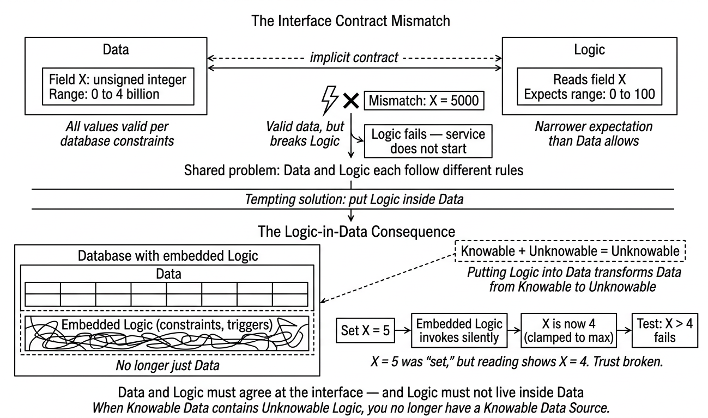

# Part II: Thinking Systemically - Tools for Mastering Complexity

## Chapter 4: What is a System? - Mapping the Operational World

There are a lot of ways the word \"system\" could be used. We\'re going
to look at a general version of the word first, and then a specific
version for our exact purposes afterwards.

When I was growing up and for the first 10 years of my career,
operational engineers were called \"System Administrators\". Today some
people use this term derogatorily as lower-level or older style work,
and while anyone can have any perspective they\'d like, this is not
consistent with history.

I was lucky enough to spend some time around professional system
administrators throughout the 1980s, before I was old enough to work,
and I got to see them doing core dumps and reading through the
hexadecimal output to find where the problems in their code were, and
even fix some problems through a hex editor. I also got to get a bit of
their practical advice and viewpoints, and I believe that after 5 or so
years of professional operations work the lessons I saw back then
started to filter back in to be more conscious rather than subconscious
guides and role models.

Historically, in the computer industry, a system was often referred to
as a single machine with an operating system on it, and the environment
that was then configured on top of that to create a working environment.

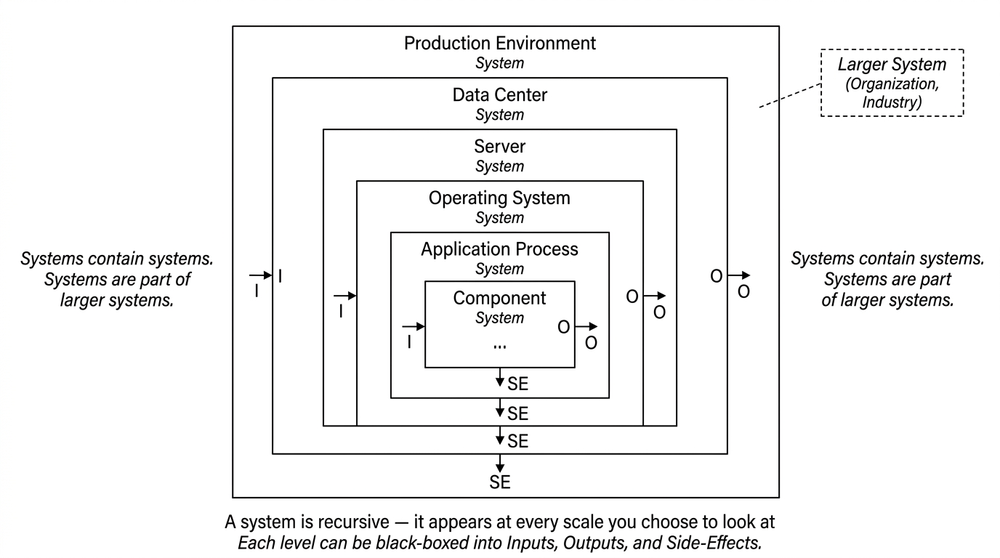

A system was sometimes a machine\'s hardware, an operating system was
also a system, and the eventual configured environment was a system.

One of the interesting properties of the word \"system\" is that all of
these things were and are true. And all of these things together are
also a system.

A system is a generalized term for a set of interrelated, connected
things that can be used together to produce effects. Like anything, it
is black-boxable into Inputs, Outputs and Side Effects (IOSE), and has
sub-components which can be similarly black-boxed, etc. Systems may
contain Real or Virtual components, and may create Real or Virtual
effects, and combinations thereof.

So, a \"system\" is a flexible term, and is something like an
\"environment\" or an \"ecosystem\" in common usage.

I like to think of systems as being somewhat like virtual machines, in
the actual sense of "a machine", not in the
container-type-operating-system sense. A system\'s connections can be
graphed, like a network, and each component can be described by the
Inputs, Outputs and Side Effects (IOSE) it causes, and may contain many
layers of other systems, and may be part of a bigger system.

Why is any of this important? Because your understanding of how systems
work will determine your ability to mentally map the systems that you
work with, so that you can think in terms of how those systems function.

Without having this mental mapping, and having a mind that over time
becomes more and more comfortable learning about systems, and
understanding system intra-action and interactions, one will have gaps
in their understanding.

These gaps are perfectly fine if they are properly black-boxed to create
a comprehensive system, where you may not know how memory data is
shuttled between the RAM chips and the CPU, but you have a model for how
this works, and that model, while not physically accurate in detail, has
a strong correlation to reality and can be used to make good decisions
and predictions.

We will go deeper into modeling in the future, but building accurate
models of the systems you are working with is an important part of
operations.

When someone has a poor model they are working with, they will be
confused by things that occur, and are likely to have \"magical
thinking\" ideas, like \"out of nowhere, X just happened\".

When someone has a good model and \"X happens\", they can see that X is
related to Y and Z, and without first Y occurring, and then Z occurring,
then X could not occur.

They can trace this backwards and confirm that indeed Z occurred, and Y
occurred, and so of course X was going to occur in sequence after them.

For a common example of this, a web server starts to fail, and on
inspection the disk is full, and on further inspection no log rotation
was configured, and so the web server failing is a mechanical response
to the disk filling up, which is a mechanical response to not having
logs being rotated.

If you do not rotate logs (or otherwise truncate them), then with any
activity at all, it is guaranteed that eventually the available storage
will fill up, and any services which might use the storage for writes
(such as HTTP logging) will fail.

This is an example of a simple system, and indeed anything can be turned
into a system, regardless of complexity or their nature. Additionally
any given topic can be turned into multiple different systems which are
all different, but all accurately model their topics, providing
different descriptions, and showing that no single model or system will
be the only description of reality, they are simply one method of
attempting to summarize and communicate information.

The power of systems is that they can be created at any time, to
describe any thing, provided you are capable of properly black-boxing
the components of the system you want to construct.

You do not need to constrain yourself to existing systems that other
people have described, even when working with their work which have
their own systems already described and available. You can create your
own systems for your own purposes, to either assist yourself or
communicate with others, or as tools to perform work.

You might create alternative systems to simply understand other
people\'s described systems. Sometimes it is harder to understand
someone else\'s work than your own, and so creating your own work can
illuminate a subject. Sometimes just writing down someone else\'s ideas
in your own words provides insight you were previously missing, and
allows you to understand the system you are describing, in a way that is
more comprehensive or deeper than merely trying to use someone else\'s
system.

As an exercise while you read this book, try to create your own systems
based on \"the big picture\" to understand what is currently being
discussed. As new information comes in, update your system to reflect
these changes. Attempt to switch from \"big picture\" to \"details\" and
back again, to deepen your understanding of individual topics and the
overall topic.

Imagine looking at a forest, then the leaves of a single tree, then back
to the forest, then looking at a specific leaf on a single tree, then
back to the original tree\'s set of leaves, etc ("zooming"). The
information is always a summary of something, whether you are looking at
specific pieces of summarized information, or larger sections of
collected summarized information, you must be able to understand it, and
have opinions on it based on your goals. Will it assist your goals? Will
it make it harder to complete your goals?

You can create your own systems on paper, in your head, you can find
software that helps you create systems quickly (like Mind Map software),
or use relational databases to track discrete data.

Flow charts are one way to map systems, finite state machines are others
ways, behavior trees are another way, but you can also describe them in
prose, or doodles or any other way. Experiment, and find ways you enjoy.

How you describe a system is merely a view into the system, and will
never cover every aspect of a system, but each change in viewpoint gives
a better angle on some information, and a worse angle on others.

Only the actual components of a system describe the system, and any
attempt to review the system will only give a partial insight into it,
because it is a summary of something else, because a map is not
equivalent to the territory it attempts to describe.

By \"actual components\" I mean the things that make up the system are
separate from our understanding of them, and our descriptions of them.
They exist outside of our information, and so they are not only
super-sets to the parts of our information that are accurate (and not
related to the portions of our sets of information that are inaccurate),
but that they also contain more data than we are aware of, and almost
always some data of which we cannot become aware of because of the
limitations in our ability to detect some things, and the limits of our
knowledge to know to even try to detect them (ex: rack vibration).

Systems are tricky in this way, but this is also where their power comes
from, because they are not limited by the nature of the actual
components; they can be extended in any way you can think of, and this
can assist you in your goals.

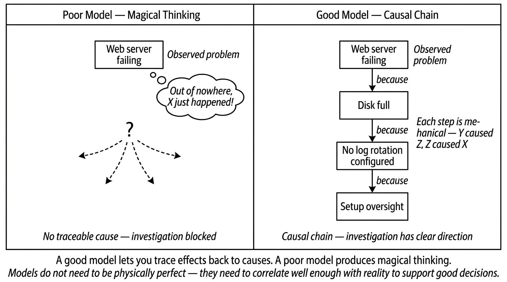

##  

## Chapter 5: Systemic Thinking - Tools for Mastering Complexity

I\'ll use \"Systemic Thinking\" to mean thinking in a way where
everything is inside of a system. Systemic Thinking focuses on the
relationships between all things in a system, and their mechanical
relationships to each other. A system is a set of things you wish to
model, to accomplish one or more goals by using the model to understand
mechanically what the effects of a planned action would be. It is
mechanical because it has Inputs, Outputs and Side-Effects (IOSE), and
so can be tracked and operated on as any mechanical device can. This is
a Virtual Mechanical Device, which operates on Data.

The model gives feedback about what the current state of the set of
components are, and what the likely state of the set of components will
be if an action were to be performed. This also works in reverse to
provide information about what happened in the past, by comparing data
to the model, which can both improve the model by correcting it against
data and reality, and give information by inspecting the data produced
by reality, and using the model to explain that data, given the error
tolerance you have for the accuracy of the model\'s ability to explain
this data and the correctness of the actions to perform the explanation.

A system can be described by a network of black box functions which take
Inputs, emit Outputs, and perform Side-Effects (IOSE), totaling the
results of anything that exists or doesn\'t exist, Real or Virtual.
Either way, it can be described as a system, and using this methodology
for organizing one\'s thoughts is \"Systemic Thinking\" by my definition
here.

I believe Systemic Thinking is one of the most powerful and useful tools
in our mental toolbox, and could use a lot more of the educational
spotlight. In terms of yielding positive results in learning speed and
depth, creating works, and in performing maintenance (ie.
troubleshooting), Systemic Thinking is among the most useful tools.

Systemic Thinking has a number of prerequisites, such as a general
understanding of how systems work, how to create systems, how to modify
a system, how to inspect and evaluate the connections and links between
system components, and a good basis in critical thinking. Having the
ability to think deductively and inductively is a fundamental
requirement.

If you have not yet read a book on Critical Thinking, you should, to
ensure you have the basic understanding of the topic. Working through
many problems in Critical Thinking textbooks can help ensure you don't
have gaps in your basic reasoning skills, in the areas of boolean logic,
set logic, deductive and inductive reasoning that are important tools in
all aspects of operations work.

Without having worked through problems of deductive reasoning, you may
have gaps in your logical consequence chains that create obstacles in
your troubleshooting and diagnostic ability, which in turn blocks
maximum creative ability, because you cannot inspect and improve what
you can't understand.

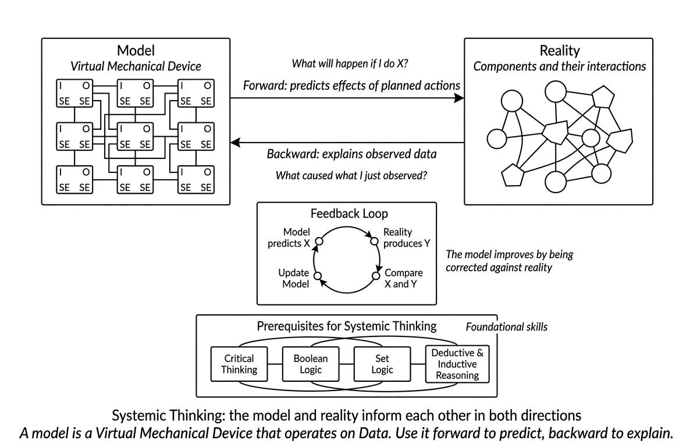

### 5.1 Inputs, Outputs and Side-Effects: The Universal Machine

I talk about the qualities of \"Inputs, Outputs and Side-Effects\"
(IOSE) enough that I\'ve decided to label them as something that can be
discussed directly.

I will call something that takes Inputs, gives Outputs, and produces
Side-Effects a \"Universal Machine\", because it is a type of machine
(performs work, mechanistically), and can be applied in any situation.
It may be a deterministic machine or non-deterministic (introduces
randomness, or other factors which cause different Outputs or
Side-Effects with the same Inputs).

A Universal Machine, by our definition here, can take any inputs and
return any outputs, and create any side-effects, whether they are Real
or Virtual, it doesn\'t matter. The important aspect is that there is a
definition of the interface, so that the understanding can be brought
about from just looking at Inputs, Outputs and Side-Effects.

Additionally, how you define a Universal Machine can change based on
your goals. If you are trying to track information as input, and
information as output, and yet track real physical changes as
side-effects, this is one way of defining a machine. In a different way,
for the same situation, you could define physical inputs, and physical
outputs, and information-based side-effects (data that has changed). Any
combination is usable. In the Operations world, generally we are dealing
with informational inputs, informational outputs and informational
side-effects, as physical changes are usually outside of our area of
immediate concern.

A Universal Machine can be defined as you want it, and can be applied to
anything, like a system, and a Universal Machine is a system, but it is
a specific type of system that is defined as having Inputs, Outputs and
Side-Effects (IOSE). While any system might be able to be viewed as a
Universal Machine, many times when we think of a system we are not
thinking of it as a machine, so it helps to differentiate about when we
are and when we are not thinking in terms of mechanical inputs, outputs
and side-effects.

Any process, physical or non-physical (informational, virtual, etc), can
be defined by its Inputs, Outputs and Side-Effects, so this creates an
interface we can use at any time, for any reason, and we can reason
about Universal Machines based on their interfaces, separate from the
work that they actually perform.

The linkages between Universal Machines will follow the same rules,
regardless of the type of Inputs, Outputs and Side-Effects being worked
on. By making a distinct type of unit we can refer to by the label
Universal Machine, we can always drop into the method of talking about a
component. or service, or physical machine, or any type of thing, and
how it operates in a chain or process of events.

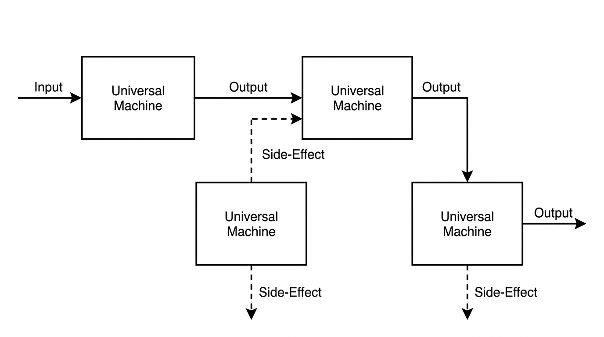

### 5.2 The Philosopher\'s Knife - Slicing Ideas for Clarity

One important tool in creating systems is the concept of the
\"Philosopher\'s Knife\".

This is a virtual knife, meant for cutting ideas into sections.

The most basic way of dividing ideas is to split them in half.
Bifurcation is the cleanest method of division, as everything in split
into one of two possibilities, which allows for using binary methods of
organization, such as binary trees for creating hierarchy, or
quantifying values so that things can be sorted on an comparative axis
(ex: smallest to larger, slowest to fastest, etc), or setting binary
flags so that set theory and boolean logic can be used (ex: \"Is an
X?\", \"Has an X?\").

For example, one can say something is \"Black or White\", and then take
any concept and add it into the \"Black camp\" or the \"White camp\".
This is a basic process of sub-division with things that appear to be
opposites. In subtractive light frequencies, black is the absence of
color, and white is all of the colors. In additive pigments, black is
the combination of all pigments required to absorb all frequencies, and
white is the absence of pigments that absorb frequencies, so that the
frequencies are refracted and appear to be total spectrum, or white.

By stating your method for determining the color, and your method for
assigning into \"black or white\" camps, you can create a repeatable,
inspectable, qualifiable and quantifiable method for working on data.
You could create a color value from 0 to 255, and anything 0-127 is in
the \"Black\" camp and anything 128-255 is in the \"White\" camp, and
then additional operations could be performed on them.

Being able to divide things in this way is a useful tool, but it is also
a primitive inspection of the information, and in fact creates a frame
that excludes almost all data. We all know that \"black and white
thinking\" is simplistic, and the reason is that most of the information
(color) is reduced out, when thinking in this way. And yet, it has
utility. How can we use this utility, without being negatively affected
by the loss of information? This is a primary goal in creating Wisdom,
which is how to balance something beneficial or detrimental, depending
on how it is used, but through Wisdom of its usage, the results are
beneficial.

As a further example in making the split between \"Black and White\",
the frame of reference created also ignores that fact that black and
white are both colors, which means they are very similar to each other,
and much less different from each other than say the word \"duck\",
which is an animal.

If we took the sets of \"Black, White\" and \"Duck, Goose\", we see that
black and white have much more in common with each other than duck and
goose. Because of this, even though in our first example we contrasted
black and white as opposites, they are in fact much more similarly
related to each other than many other things.

This is both the power and the limitation of the philosopher\'s knife.
It can reveal differences, and it can obfuscate similarities. How you
use it will depend on the results you are looking for, and your skill at
applying this technique to create those results.

For our purposes, we are looking at how to use the philosopher\'s knife
to sub-divide systems, for the purposes of Systemic Thinking.

The most important element in creating a well-cut concept into a system,
is that nothing is left behind. The use of the philosopher\'s knife
should account for all components and options of a system, and while it
is sub-dividing them, they never lose their whole.

Their \"whole\" is what makes up the \"system\". If you lose a part of
the system while sub-dividing it, you have not correctly used the
philosophers knife. This will be important when designing your system,
implementing it, and troubleshooting it, or in creating a model to
understand an existing system.

Let\'s first use our previous example of the static HTTP web request.

I used the philosopher\'s knife on the system of \"making HTTP requests
from a web server over a network\" to come up with 5 elements of the
process:

-   A communication network (Internet): part of the environment.

-   A protocol and environment (TCP/IP on Linux): part of the
    environment.

-   A request handler (web server on TCP port 80): the Input to the
    black-box.

-   A content location (static files on local filesystem): a component
    of the output to the black-box.

-   A log location (appending results to log file): a side-effect of the
    black-box operation.

I could have sliced this in a different manner, and instead focused on
the TCP packet exchange, or I could have cut it so we delved deeper into
the end-user\'s process of getting its request to the web server (LAN,
routing, DNS, TCP handshakes, etc).

I was able to slice this process into the layers I chose, because I
wanted to discuss those elements, and not other elements. This ability
to exclude what information is being inspected, while not losing any of
those excluded areas of data in the total picture is the real power of
systemic thinking, is the function of the philosopher\'s knife in this
process.

We can take the exact same example process, and re-slice it any way we
want, and the events would be the same, but the information we look at,
and how we inspect it would be different. The system has not changed,
the actions that occur in reality did not change, the results did not
change, the inputs, outputs and side-effects did not change, and yet we
are able to look at the problem in a completely different way, and take
different lessons and gather different information from it.

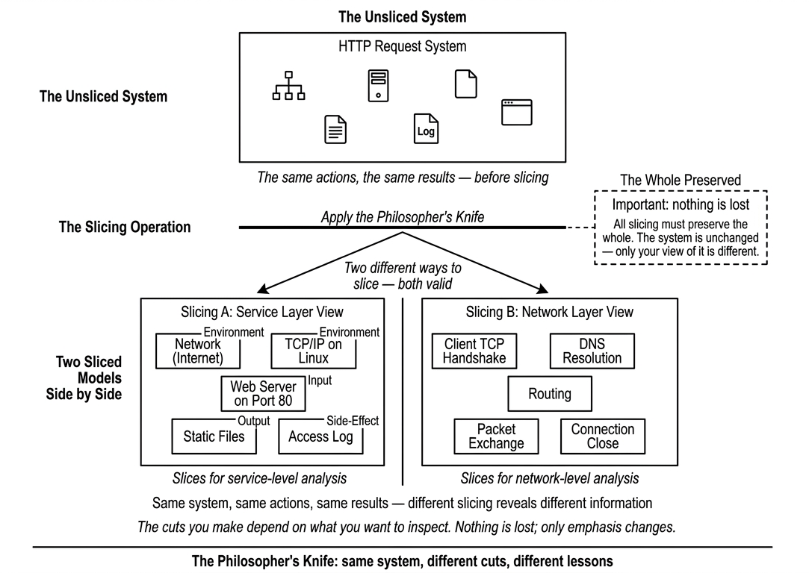

### 5.3 Slicing the Pie - Comprehensive vs. Aggregated Systems

In the last section we covered the importance of slicing with the
Philosopher\'s Knife without losing any information.

One easy way of thinking about this is that you are cutting up a pie
with the Philosopher\'s Knife.

No matter how you slice a pie, the amount of pie has not been reduced,
there is only a different number of pieces.

If you cut a piece directly down the middle, creating 2 symmetrical
pieces, no pie is lost. You have 2 pieces that compose the entire pie
before slicing.

Similarly if you cut a pie into any configuration, with any number of
cuts, whether it is symmetrical, asymmetrical, whether the cuts are
vertical, horizontal, diagonal, straight or wavy, the results are the
same, in total all the pieces still contain all the original matter of
the pie, the difference is only in the distinction of between separate
pieces of the pie.

In our philosophical cuts, the structure of the \"pie\" does not change,
unlike a real pie, which deforms with the pressure of cuts, and will
turn into a mess after enough slicing.

In our virtual \"pies\" of information, or systems, we can slice any
number of times in any direction, and the information remains the same,
but on each side of the cut, we have made a division that can be used
logically. Essentially, the Model of our System is the progression of
cuts, and the total set of cuts as it relates to the system. Each cut is
an \"axis\", which divides along a boolean of \"is X\" or \"is not X\"
relating to the cut X.

For instance, we can look at an Operating System that runs on PC
hardware (like Linux, OS X or Windows), and divide it into code that
runs in \"Kernel space\" vs code that runs in \"User space\". We could
call this the \"Kernel space cut\", to determine \"Is Kernel space?\" vs
\"Is not Kernel space?\", or we could bifurcate it as \"Kernel/User
space\" to explicitly state the 2 sides, instead of only explicitly
stating 1 side, and the other is simply
what-isn\'t-part-of-the-explicitly-stated-side. If you already know
there can only be 2 options, you can explicitly name both sides, if you
aren\'t sure there are 2 and only 2 options, then use naming 1 side and
leave \"everything else\" for the other side.

Dividing between Kernel and User space splits all code that is executed
by the operating system, they are either executing in Kernel space or
User space. We can take the same system, and make a cut between
\"firmware\" (code that executes from BIOS and other places closer to
hardware) and \"software\", which is executed from RAM on the main CPU.

Whether we are divided by \"Kernel vs User\" or \"Firmware vs
Software\", nothing about the system has changed, we have simply decided
to cut the pie in a different place, and we can then use this division
for some sort of useful inspection.

Cuts can be layered on top of each other, like dividing into
Firmware/Software, and then dividing Software into Kernel/User space,
and could continue to be divided, such as dividing User space into
shared library code vs. application local code. Share library code will
be executed by more than one application, and is stored in a .so or .dll
type file, and application code will be stored in a program\'s ELF or
EXE formatted binary file. This type of layered cutting creates a
structure like a binary-space partition tree (BSP tree), if you want to
model it that way, or can be seen as a list of boolean axes, or could be
used in any other way you want to model data if you have a different
goal for your visualization.

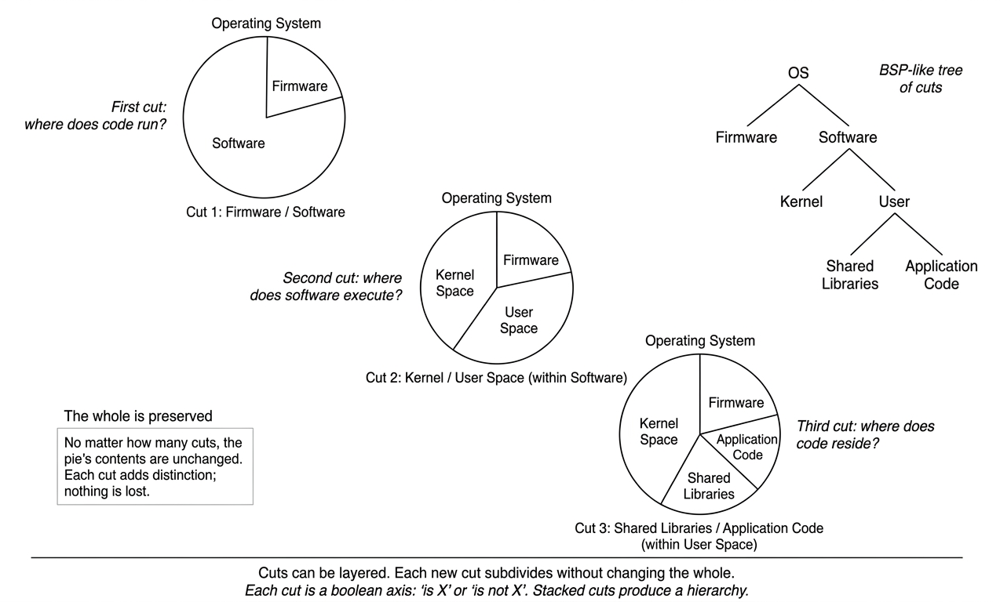

For purposes of discussion and illustration we can be fairly fluid about
our definitions, and decisions on where to slice, because they are
throw-away examples, and exist only for as long as they are useful to
us.

As we get deeper into the topics of Engineering Axioms and automation,
we will see that while this can be used fluidly, the ability to use it
deterministically, in a repeatable pattern, across many topics, becomes
of paramount importance.

The reason for this is the difference between a comprehensive system
(correctly sliced with the Philosopher\'s Knife), and an aggregated
system, which is not built as a complete system and is aggregated from
components, and therefore was not built using a whole system and
\"pie-slicing\".

The difference is an Aggregated System is built from components, like
bricks from the ground up. As bricks are needed, bricks are laid down,
if there is a gap, it can be filled in. In comparison the Comprehensive
System exists in total from the beginning, although it is Virtual as it
exists as a concept, it exists in totality, where the concept of the
Aggregate System does not exist in totality, and only what we currently
know and track of it (with our component-bricks) is tracked or can be
said to exist.

The problem with aggregated systems is that they are always in jeopardy
of becoming not-internally-consistent, and they can never be complete.
Due to being \"aggregated\" into creation, where one piece is created,
and then another piece, and then the two are used together, and then a
change is made, and then a new piece is added, you get the result of not
having a \"complete pie\" when it is assembled, as the only pieces that
were tracked were those that we happened to work with.

Aggregated systems have a tendency towards not being internally
consistent, and Comprehensive (Slicing the Pie) systems have a tendency
towards being internally consistent. Just because you have a
Comprehensive (Slicing the Pie) system, does not mean you cannot create
an a situation where it isn\'t internally consistent, but as it is
reviewed and worked on (under the Slicing-The-Pie mechanism), it will be
revealed as to where and why an internal-consistency-error was created.
In an aggregated system this is much more difficult, because things are
only related to their adjacent neighbors through their connections, and
did not come out of a comprehensive system from the beginning.

It is impossible for a system that is aggregated to ever become a
complete and comprehensive system, whereas if you always work from the
method of \"slicing the pie\", you will always have a comprehensive
system. The reason for this is their approach, because an aggregate
never considers the whole, it only solves a unit of work.

The work involved to do both are very similar, and in some cases exactly
the same, but the manner of thinking about the elements in them are very
different, and yield very different results.

If you think about \"comprehensiveness\" as \"volume\", and we think of
the \"space of this volume\" as a rectangle (width and height), then the
Aggregation method works by building up from the bottom (height = 0, and
up), and works along the width to provide more structure.

The Comprehensive model starts by utilizing the entire area of the
volume, but making subdivisions, say in 4 equal pieces to start, and
assigning each sub-section as an element of the Comprehensive whole.
Then those sub-sections are subdivided again, and again, until we start
to add in details. The entirety of the volume will never be filled, as
there is an infinite amount of detail that can be applied, but the
entire space of the rectangle is being \"owned\" by some topic, and is
being further divided down as we zoom-in to more details.

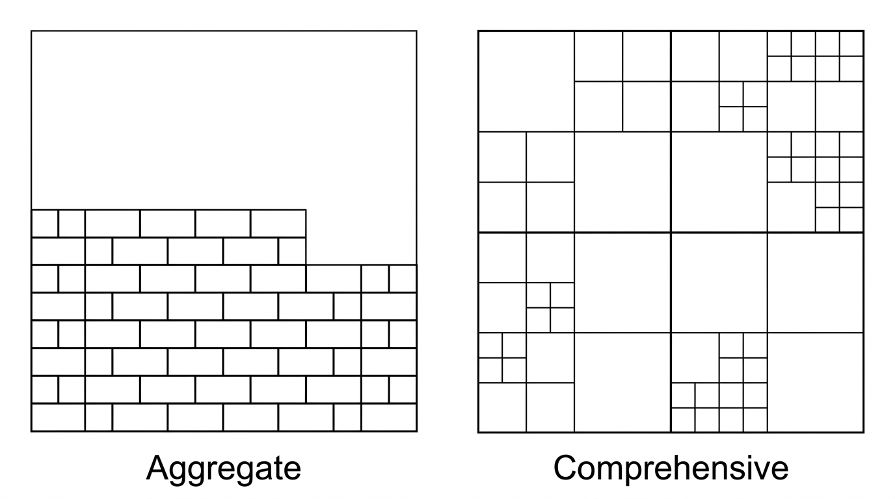

With the Aggregate model (which is a system, but not in the \"Systemic
Thinking\" sense of the word), only the bottom parts of the space are
utilized. It\'s doing the same thing, in terms of implementation of the
details, but the way the details are mapped to one-another is only
through their implementation. This differs from the Comprehensive model
(which uses \"system\" in the same way the \"Systemic Thinking\" does),
because the relationship for all details is completely mapped into the
entire volume, the entire comprehensive structure of thought or
description, and the model takes into account \"all of the space\", even
if a given particular part of the space has not yet been implemented.

The Aggregate model does not have these attributes, and so gives a
different result, which is not a Comprehensive result, but a \"de
facto\" result. The Aggregate is \"what we did\", but does not include
planning inside of its own structure, because it is simply a map of work
performed. The Comprehensive model includes both the entirety of the
structure (all things we know of in the system), and where we have
performed work to solve problems inside this system-space.

In 2015, when I initially wrote this, I did not know of any operational
environments which worked in a manner that was consistent with \"slicing
the pie\", I only knew of aggregation environments.

As of 2026, this has not changed.

##  

## Chapter 6: Axiomatic Engineering - Principled Decision Making

We\'ve been building up to this for a while, introducing different
spectrums or axes for different Attributes of this or that, but do they
fit into a system? They do! And I call this \"Axiomatic Engineering\",
which is like working with mathematical Axioms, to create engineering
solutions.

In this way we can detail all of the attributes that we would like, and
specify the spectrums (or axes) of those attributes, and then assign
values to each attribute axes that we would like.

Do we want more consistency or less consistency? Do we want more
availability or less availability?

Between consistency and availability, which is higher priority? What
sorts of trade-offs need to be made if we were to rate consistency
higher than availability? What about availability over consistency?

We can\'t possibly implement the same solution while matching our
different axis values, and priorities, because we care about different
things in each circumstance, and so we will create a different solution.

This is important in your own work, and critical for working in a team.
If you can\'t agree on your values, how will your work have the
alignment necessary to produce the effects you want with efficient use
of your resources?

### 6.1 What is Engineering?

More definitions? Well, we are never going to stop defining and
re-defining things to our particular circumstances, as we simply can\'t
front load all the thinking, and sometimes we will need to be more
specific. At least we are now into the real content, and no longer
strictly in the peripherals.

Engineering, to me, is:

\"The efficient use of resources applied in an environment, to yield a
desired effect.\"

Generic and vague? You bet! But, also it can be used to insert in any
specifics into the general terms to get at a more specific definition,
like so:

\"The efficient use of time, personnel, money and physical devices
(servers, etc) applied into a Production Operations environment, to
yield high up-time, acceptable performance, and scalable management.\"

That\'s starting to be more clear, and more specific to our current
topic than the more general answer, but I see all of Engineering as a
similar set of options.

Whether Engineering is applied to building a bridge, a canal, a sky
scraper, baking a cake, or managing a production operations environment,
it needs to be:

-   Efficient (because being inefficient might mean it is not able to be
    completed, or \"fails\")

-   It has certain resources (universally time, almost always money, and
    also almost always people

-   It might be soil conditions, and logistics of getting materials from
    Point A to Point B, or whatever)

-   It has specifically desired effects, such as a set of interlocking
    canal segments of the Panama Canal, or a sky-scraper building\'s
    ability to stay erect under its own enormous weight and support and
    movement of the soil, or the digital and physical equivalents in
    server operations.

Regardless of the topic or domain, the initial approach to engineering a
problem is the same. Determine the environment and resources in play,
determine the requirements of meeting our goal, determine the actions
that can be taken to fulfill those requirements, create a plan to
perform the actions, evaluate the plan\'s methods of implementation,
risks, etc, implement the plan, evaluate the implementation, whether we
met our success criteria, and update the documentation based on the new
state of the environment and resources.

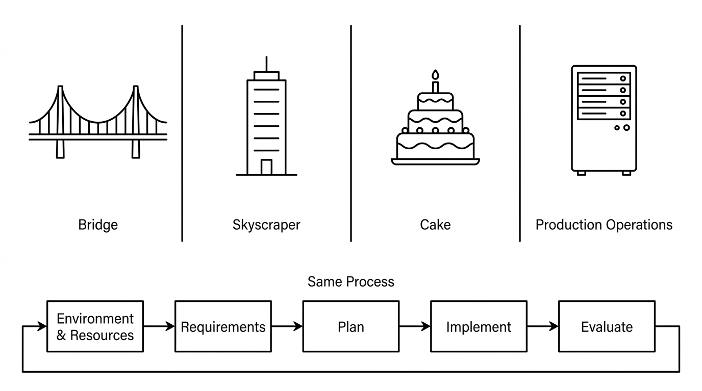

### 6.1.1 Understanding Engineering as a Process

I\'ve said before that I think Engineering is:

**\"The efficient use of resources that meet requirements which
sufficiently satisfy your goals.\"**

Let\'s break this down in a way where we can understand Engineering as a
process.

If we wanted to make a sequence from general-to-specific in terms of
honing in on understanding Engineering, we can start here:

-   Environment ─►

-   Resources ─►

-   Requirements ─►

-   Goal ─►

-   Actions ─►

-   Changed Environment ─►

-   Desired Effects?

-   Efficient use of resources?

-   Management of the environment?

We start with an environment, in which we have resources, and we have
some kind of requirements, which apply to some goal(s), so we perform
some actions, which change the environment.

Do these actions have the desired effects?

Did we make efficient use of our resources?

How efficiently can we manage our environment? What is it like
day-to-day operating what we have built?

With the above sequence and prose description of that sequence, we have
a starting place to understand what Engineering is. It\'s something we
do, it\'s something that produces results we may or may not want. It
changes things.

These are all things that can be said to describe engineering, and shine
lights on its different surfaces, which show different things to
different people, coming from different viewpoints.

Engineering is multi-faceted to an amazing degree, so we will have to
describe it repeatedly in vague terms to cloak it in an overall shape
that provides better understanding.

Like Local vs Global Alignment, engineering can be understood in a small
or shallow manner well locally, but when compared against other
descriptions which are equally accurate, they do not seem to align well.

It is only through creating many local descriptions which align well,
and combine together into a global network of descriptions which all
align well, that we can create a real understanding of what engineering
is.

What does engineering mean to you?

How would you summarize it in a sentence, as I have? How does your
summary differ from mine? What advantages do you see in your summary
over mine? Can you make a denser and more correct description?

Brevity allows for a type of clarity which details do not provide, as
details allow for a type of clarity which brevity does not provide. They
are the extremes of the scale of all valid information.

### 6.1.2 The Use of Resources

For our purposes, resources can be summarized to the short list of:

-   Overall Time

-   Personnel Time

-   Money

-   Hardware

Overall Time is like calendar time. Things can take hours, or a month,
or the month of March goes by, or something is a quarter of a year. This
is all \"overall\" time. It speaks to time passing, which you cannot
do-over, making it a limited resource. This is heavily tied to money,
which is why the saying \"Time is money\" has a logical truth to it,
since salaries, rent and loans must all be paid at distinct time
periods, so this is a very important concept for organizations.

Personnel Time is the time that any given person has to perform work.
For instance, in an example job an engineer may have 40 hours of time to
potentially perform work in a week. Over a month that is 160 hours of
potential time. This is also a limited resource, and while organizations
can make this flexible by paying more (hourly/bonuses/etc) or by asking
for the person to simply give more time (unpaid overtime/death
marches/etc), it still remains a very limited resource.

Money is obviously a limited resource as it is a scalar/number. At any
time an organization will have a value for available capital, and
another value of available credit, and potentially options for creating
more capital (sales/etc) or credit (new lines/etc). These are all
limited resources, and running out of money is almost exclusively the
only reason organizations cease to exist, or are otherwise
\"abandoned\".

Hardware is essentially a \"platform\" for performing work. We can lump
buildings, facilities, hardware-infrastructure, and all other kinds of
things into this that are essentially \"things we buy/rent with money,
that we then \'own\' and have to manage\". Renting cloud services is
like utility hardware, you pay more for the service provider to manage
all this for you.

Apart from these things there are of course other categories, such as
software that we buy (like hardware), but these days you can run your
entire organization on Free Open Source Software (FOSS) and many
companies do just that, operating as well or better than those who pay
for software. So, software is fairly subjective in terms of being a
resource like Hardware, as without Hardware we do not have any place to
run FOSS or commercial software, and so we cannot operate.

Additionally, engineering companies often create their own software, and
this is required for managing your own operational environments, as
there will be some things that are unique about your organization, even
if you try to make it as generic as possible, from the
software-infrastructure side of things. If you have no custom code, you
have personnel labor for custom operations instead.

Finally, even commercial software requires configuration,
troubleshooting, maintenance, etc, so in comparison with do-it-yourself
style software, the difference is only in personnel time and money, and
it may well be cheaper to do it either way, depending on your unique
situation and goals.

How you use resources will determine the efficiency in the interactions
between them, and the overall level of quality and quantity of work that
you can perform, which will impact the success of your goals, and the
success of your organization.

Using resources efficiently is of prime importance for any engineer.

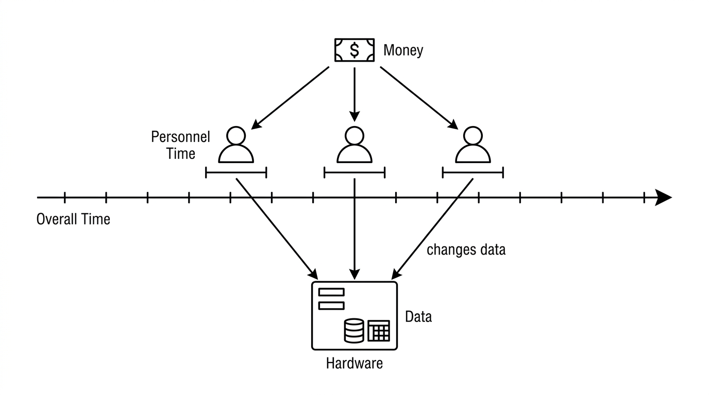

### 6.2 Attribute Axes and Prioritization

The ultimate goal in this book is that it improves your ability to
function as an operational engineer, and to create automation that
achieves the results that you want.

We can\'t possibly implement the same solution while matching our
different axis values, and priorities, because we care about different
things in each circumstance, and so we will create a different solution.

This is important in your own work, and critical for working in a team.
If you can\'t agree on your values, how will your work have the
alignment necessary to produce the effects you want with efficient use
of your resources?

Let\'s re-iterate my generic definition for engineering again:

\"The efficient use of resources applied in an environment, to yield a
desired effect.\"

So we have:

-   An Environment (Production)

-   Resources (time, people, hardware, money)

-   Effects (Availability, Consistency, Resiliency, Atomicity, etc)

These are the fundamental elements of Production Operations Engineering,
and how we mix and match them together, and the methods of their
implementation, will determine the effects that we get: availability,
performance, security, manageability, etc.

If we are being pragmatic, so we are only concerned with the effects or
results, then we can start to build an Effect Estimating Machine, and
this is done through axioms, created by populating our axes with values
and prioritizing which of those values are more important to us than
others. After and during the implementation of the solution, we can use
an Effect Evaluation Machine to determine how our implementation is
matching up with our Prioritized Attribute Axes values. These would be a
type of mental Virtual \"machines\", which could be considered mental
software, or well-structured, consistent, internal algorithms for
thinking, and used externally for communication.

Let\'s make an overview for all of services in the Production
Environment:

-   Available. Our services must be available.

-   Performant. Our services must be fast enough for our purposes (poor
    performance under heavy load means that some percentage of our
    end-users will not have availability).

-   Manageable. We need to be able to control our environment, deploy
    software, fix security flaws, make configuration changes, add or
    replace server nodes, control user access, etc.

-   Visible. We need insight into our system through monitoring, alerts,
    logs, etc. We can\'t manage things if we don\'t know what is going
    on.

That\'s a pretty good start, so let\'s take this as our basis.

I have also ordered them in a general order of priority, because:

-   If the services are not available, what is the point of it existing?

-   If the services are not performant, then they are not available to
    some end-users, or are not timely.

-   If they are not manageable, then we cannot control them to keep them
    Available and performant.

-   If they are not visible, we cannot efficiently manage them.

We could add other elements in here, or split these up, and some
circumstances might order them differently, but this is a good starting
place for our purposes.

So, let\'s check our Attribute Axes for these prioritized goals:

-   Available: Not Available ◄────► Completely Availability

-   Performant: Slow ◄────► Fast

-   Manageable: Difficult, Risky and Slow ◄────► Easy, Safe and Fast

-   Visible: Opaque or Fuzzy ◄────► Clear and Precise

For Manageable, I ended up creating three different sub-attributed, as
saying \"Unmanageable\" really doesn\'t mean much, so we can re-write it
as:

-   Available: Not Available ◄────► Completely Availability

-   Performant: Slow ◄────► Fast

-   Manageable: Risk: Dangerous ◄────► Safe

-   Manageable: Difficulty: Difficult ◄────► Easy

-   Manageable: Speed: Slow ◄────► Fast

-   Visible: Opaque or Fuzzy ◄────► Clear and Precise

I have split these up now into individual attribute axes for Manageable,
and also re-ordered them slightly for better prioritization, as we are
more concerned with risk than difficulty.

Difficult things need more leeway in performing them, so I am putting
this higher than speed, because if you are doing something difficult,
but do it quickly, it seems that might lead to more mistakes, which
increases risk. Perhaps the \"safeness\" of the higher priority will
protect us from these mistakes, but unless that is guaranteed, then
difficulty should be a higher priority issue than speed.

Is visibility really less important than all of those manageability
attributes? Maybe not, let\'s do one more re-ordering:

-   Available: Not Available ◄────► Completely Availability

-   Performant: Slow ◄────► Fast

-   Manageable: Risk: Dangerous ◄────► Safe

-   Visible: Opaque or Fuzzy ◄────► Clear and Precise

-   Manageable: Difficulty: Difficult ◄────► Easy

-   Manageable: Speed: Slow ◄────► Fast

That looks a little better to me. We need that visibility, because it
speaks to knowing what is going on. I would rather be able to see than
make it easy or faster to change, as I need it to ensure my work is
correct, or help with troubleshooting if an error is introduced.

Now, we have some attribute axes, does that mean we have axioms? Not
quite, but we are getting close.

### 6.3 Prioritization in Practice: The 90-9-0.9% Rule

Let\'s take a brief tangent to talk about prioritization. We made a
couple prioritized lists earlier, and they were listed sequentially, but
not numbered or evaluated in terms of \"how much more important\" each
element was.

There are many ways to rank priorities, and I have come up with a
methodology that I like which I call the: \"90-9-0.9% rule\", and can be
said as the \"Ninety, nine, zero-point-nine percent rule\" to make that
actually pronounceable.

The progression continues on forever, with the previous item being ten
times (10x) more important than its following item.

This allows for clarity in which things are more important, and also for
knowing when things are just not important any more. It is purposefully
exaggerated because without that clear separation, it is unclear why one
action would be preferred over another action, because \"extenuating
circumstances\" may exaggerate a lower prioritized item over a higher
prioritized item.

It is my contention that you should resist changing priorities without
stating why they are changing. If you are going to change
prioritization, you should explicitly change it from the order of \[\"A,
B, C\"\] to \[\"B, A, C\"\] for a given circumstance. \"ABC\" may
normally be what you want, and in some circumstances \"BAC\" may be
better, and so you should explicitly state that.

But, while evaluating the priorities of \"ABC\", then \"A\" should
always be preferred over \"B\", or you should change your assessment of
the priorities and state what the extenuating circumstances are for the
priority change. This is for clarity of communication, both with
yourself at a later date (\"Why did I do that?\") and for people besides
yourself who should share a common understanding with you.

By making the differences 10x apart, it clarifies things much more than
if they were less. 2x may still be sufficient, but let us first
demonstrate that merely being \"too close together\" in priority
separation causes confusion, and from that we can see that \"further
apart is less confusion\", and have our answer for why this is a valid
technique.

Say we have priority of availability and performance, and we assign
availability a value of \"100\" and we assign performance a value of
\"90\", so that availability is the most important thing (an \"A\" grade
of importance\"), and performance is the second most, but still highly
important (a \"B\" grade of importance).

So, availability is first, but performance is still quite close behind
at 10% less.

Say there is a decision to be made, and it has to do with a hardware
configuration, say "cabling" to make this easy to understand, that will
give an availability vs. performance tradeoff.

Let\'s say that we can cable up some storage which will be five times
(5x) faster in specification B, but it has a flaw in that sometimes it
fails, but very rarely and might be able to be avoided with some
maintenance actions.

But, there is another cabling strategy which will ensure availability,
specification A, even under intense failure scenarios, but is one fifth
(1/5th) the speed (performance) of specification B.

If we have a 10% difference in importance (100 vs 90) in availability
(spec A) and performance (-pec B), but we are getting a 5x boost of
performance if we choose spec B, we have a decision to make, and some
data to make it with.

If we were going to seriously evaluate this, for a presentation on
\"What should we do?\" to our department, we could make up some \"point
system\" and do the arithmetic and decide which had more points. On a
scale of 100 vs 90, it is possible that the 5X performance could win the
\"point comparison\" just because of the \"5x\" scaling value being used
in some calculation.

(availability) 100 \< 450 (performance)

Being \"10%\" close to the top item, it may seem more fluid, in that
\"this time\" we will still keep availability over consistency (not
thinking or talking about it, or not publicly stating the change in
priority through documentation, etc), but we will go with the spec B's
5x performance boost, over better availability.

Making this trade-off isn\'t wrong, the proposed down-time might be
acceptable, if it doesn\'t also come with a consistency trade-off of
data corruption (because we haven\'t accounted for that, you might find
that acceptable as well as a trade-off) or another important attribute
which needs to be accounted for. (Aside: Data corruption would actually
impact availability directly, since if the data is corrupt, it isn\'t
available in a useful form. Consistency in terms of recovering may still
take time, and also count against availability.)

However, when making the scales of the system ten times (10x) different,
then the spread is much wider, and thus more clear. Availability is
worth \"90\", and Performance is worth \"9\".

Even if we took a very naive algorithm of \"5x performance is 5x the
value\", we get \"90\" vs. \"45\", and Availability is still on top.

(availability) 90 \> 45 (performance 5x)

If we change the value to \"10x performance\", then we get \"90\" vs.
\"90\" and while the positions match, we still know Availability is #1,
and so it is clear that availability is still our top priority in this
case.

(availability) 90 \>= 90 (performance 10x)

If we change the value to \"100x performance\", we would get \"90\"
versus \"900\" and it is clear that performance has true value.

(availability) 90 \< 900 (performance 100x)

What it means in reality is that we have a new Caching Layer. With 100x
performance (or even considerably less), it is worth it to try to
leverage that storage in a different capacity then we are currently
considering. The \"balance of scales\" is heavily in favor of using
\"specification B\", because its performance simply cannot be denied,
but we probably still need to use \"specification A\" as well, for
reliable storage that is better for availability when the \"spec B\"
solution fails. This decision will probably come down to whether the
money is available, and the cost-benefit analysis determines it is
required and worth it, for implementation of both solutions as a 2-tier
caching and persistence layer.

\"Specification B\" could be used for very fast read-only queries, or it
could be used as transient storage for incoming queries, so that there
is a \"pretty reliable, with known long-term faults\" solution in place
for taking incoming data as quickly as we can.

These types of analysis are what using multiple-axes of values
(Attribute Axes), and combining them into an
easy-to-communicate-and-visualize method allow. We can change the values
around, put them into forms or a spread sheet and apply algorithms to
compare them quantitatively, etc.

So, I have established that using 10x scale differences has value, so
let\'s put it to use:

-   Available: 90%

-   Performant: 9%

-   Manageable: Risk: 0.9%

-   Visible: Opaque or Fuzzy 0.09%

-   Manageable: Difficulty: 0.009%

-   Manageable: Speed: 0.0009%

Now the sequentially prioritized list we created before becomes
numerically weighted. We can calculate against each attribute based on
the value we have assigned it, to determine which actions we should take
next.

But, one might ask, isn\'t setting things at 0.0009% and lower making
them trivial and not important to work on?

That depends on whether there is more important work to be done, which
is the beauty of this system.

For instance:

-   If there is no work to do at the 90% layer, because the system is
    currently up (Available)

-   And, there is no work to do at the 9% layer, because the system is
    currently running fast enough (Performant)

-   And, we are not currently evaluating making a change that introduce
    Risk into our Production environment (Manageable: Risk, at the 0.9%
    layer)

-   And, we currently have sufficient monitoring and visibility into our
    system (Visible, at the 0.09% layer)

-   And, we have a problem with how difficult some tasks are to perform
    (Manageable: Difficulty, the 0.009% layer), then this is currently
    the *top priority*, and this work should occur.

Should we also schedule work to fix \"Manageable: Speed\" problems (the
0.0009% layer)? Not unless we have another person to assign it to, as
the 0.009% layer is 10x more important.

Once the 0.009% work is complete, the 0.0009% work will become the most
important work. If you should ever have a problem with availability
(90%), it immediately becomes the top priority, as it is one
hundred-thousand times (100,000x) more important. That is clearly more
important, and the scale differences again make things very clear.

I think this is a system that provides a lot of clarity for what is
important right now, and how we should design things, and how to
separate what should be done from what should not be done. It\'s simple
enough to document in a page or so of Prioritized Attribute Axes, and
that makes it easy to version control, or put into a data source, so we
can also run logic against it.

In a one-way-to-do-it system, you do not want to do all-the-things, you
preferably want to do one-thing for any given category of thing, so that
you can gain efficiencies from that correctly chosen thing, for your set
of priorities, goals and engineering values.

Although I believe being able to maintain a regular scaling interval
(10x) between priority levels is good, and the \"90-9-0.9%\" format
makes doing this clear, it is not easy to communicate about these levels
using the exact percentage values because saying \"0.0009%\" is
difficult, and it is easy to confuse between \"0.009%\" and
\"0.00009%\".

Instead we can simply order the layers as \"Top Priority\", \"Second
Priority\" and so on, or some other labeling structure which is easier
to say. (\"Alpha Level, engage!\", or whatever works for you.)

Then you can say \"This is 5th level priority, but we don\'t have
anything to do in levels 1 to 4, so it is currently the top priority\",
which is clear, numerical, and does not use potentially confusing
decimal numbers for normal communication purposes.

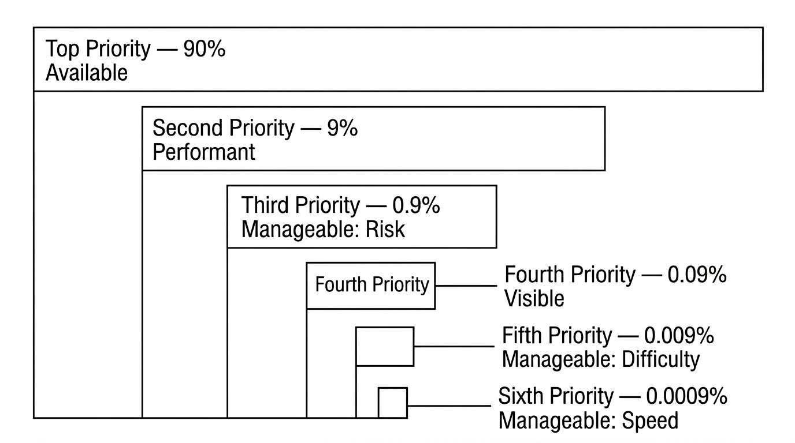

The labelled tier structures can be replaced with their numerical
equivalents to perform quantitative analysis whenever it is needed.

The take-away for this section is not \"this is a good technique, use
it\", although I am currently using it, and I do recommend it, but the
larger lesson here is that you can make up these types of devices
yourself, and you should.

Come up with your own numbering schemes, labeling schemes, and determine
the exact meaning for each of them, and reasoning behind why they are a
valid method of working, and then suggest other people use them
yourself.

This is the type of engineering discussions I would like to see more of,
and the type of engineering thought that I believe the operational
engineering world could benefit from.

We get clear sets of data, that are quantifiable, and qualifiable, and
we can test ideas against them, and communicate clearly about what our
priorities are, down to which axis of information, and we can change the
attribute axes values or priorities and talk about how those changes
would affect our designs, and evaluate how well our implementations did
against those values during and after implementation.

### 6.4 Impersonal Decision Making

One of the immediate benefits that we can apply to our everyday jobs is
to use these axioms, and their components attribute axes and priorities
to determine what actions we should take, and do so in a non-personal
way.

These days, when I make decisions, I don\'t do it because \"I want to do
X\" or \"I think X is a good idea\" or "company A is going X" or "X will
look good on my resume", or \"I had problems when I do Y, so I do X
instead\".

I make decisions based on turning things into component pieces,
evaluating them, and determining what action best aligns with all of the
values (Alignment).

One course of action better fits those values than another course of
action, and that is the action I advocate, and I attempt to use the
internal variables for doing that analysis in my explanation of why this
is my current position.

Change any variable, and the answer may change. I am easy to convince to
change plans, if you can change the way I see the priorities through
data, and quite a bit harder to convince if you can't.

As a thought experiment to visualize this, I like to imagine a scale,
like the \"Scales of Justice\" or an old weight scale where you have 2
sides, and you put a known weight on one side, and the thing you are
trying to weigh on the other side.

Since this is not a digital or a single-downward-vector scale (as we
generally use these days), but a lever-based scale, it has two sides,
and not just a single platform.

So, we have this old-style scale. And on the weighing platforms on that
scale, sit 2 more scales.

Each one the same type of scale as each other (you can imagine them
smaller than the first, so they fit), so that now there are 3 scales

The first scale weighs the 2 scales that sit on its 2 platforms.
Initially these will all be exactly equal, so no tipping of the scales.

On the 2 scales sitting on the primary scale, there are 2 more scales
for each scale. So 1 base scale (Level 1), 2 scales on the base scale
(Level 2), and 4 scales on the 2nd-tier scales (Level 3).

And so on, forever. A recursive amount of scales placed on scales.

The primary scale is our question: Do we do \"A\" or \"B\"? One side of
the scale represents \"A\" and the other \"B\".

Sub-dividing our question into Prioritized Attribute Axes, they map to
the layers of the scales.

We can also use this with our \"90%-9%-0.9%\" rule: Level 1 is our Top
Priority (90%). Level 2 is next priority (9%). Level 3 is our next
(0.9%), and so on.

Having a \"Recursive Tree of Scales\" in which I map all my values to,
means that any time a value changes, the entire tree will need to
rebalance.

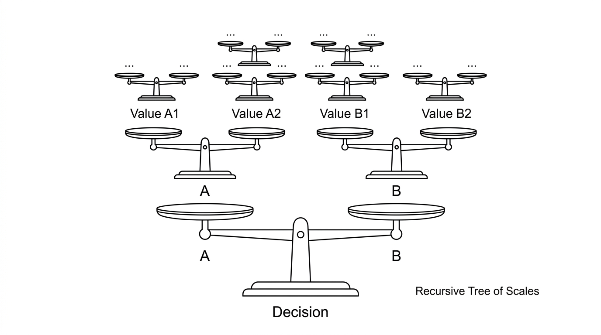

If the \"A\" side was heavier, but something was removed and added to
the \"B\" side, or something was merely made heavier on the \"B\" side,
then the scale will tip. Maybe it won\'t go all the way over to being
\"Fully-Weighted-On-B\", but it will be \"Less-Weighted-On-A\" than it
was before.

This imaginary set of scales is always working in my mind as I rate the
various axes that my organization or goals are concerned with, and as
changes are proposed, I re-scale my values, and the Recursive Scale
rebalances itself.

In this way, I am not really making any decision at all, personally, I
am merely an agent of this system, mapping values as I understand them
into a set of Prioritized Attribute Axes, which map to goals, which map
to a result (effects) that we want, and when any variable changes, the
results might change.

This doesn\'t mean that I don\'t bring my experience into the picture,
because I do, but my experience is mapped into this Attribute Axes and
Priorities, and can be expressed in a deterministic and explicit manner.

The scales and their values can be written into a data source and
evaluated by Logic, and they can be graphed, statistically analyzed and
revision controlled for historical reference.

This is how I make judgement calls in a \"non-personal\" way, and I
assert that this is a valid way to proceed with making engineering
decisions.

### 6.5 The Problem with \"The Best\"

\"Best\" is a concept that is poorly understood in our culture. It is
frequently used, but rarely clarified, because its vagueness gives it
rhetorical power, but in engineering this is simply a logical fallacy
that leads us to poor choices and low efficiency.

In order to take a term like \"best\" and use it in a manner that allows
us to make good choices and have high efficiency, we must understand
what other properties \"best\" has, besides just being \"the best\".

What are some properties of \"best\"?

-   There is only one of them. Only 1 thing can be \"the best\".

-   Something cannot be \"the best\" for a great number of
    circumstances, because as the circumstances (variables) change, then
    what is \"best\" will also change.

-   This creates an inverse ratio between the number of circumstances a
    methodology can be applied in, and the efficiency of the results for
    those circumstances. This can be extended by allowing for any given
    set of circumstances (variables) to be repeated over and over. The
    repetition will cause some of the variables to fluctuate.

-   The inverse ratio suggests that for any given circumstance, there is
    one-and-only-one \"best\" answer, and potentially a small set of
    \"close-enough-in-quantitative-results\" class of answers that
    competes with the local-maximum of the \"best\" answer.

-   Changing any of the requirements, resources or goals significantly
    will almost assuredly change which given solution is the \"best\"
    answer to the new problem.

This set of properties took its shape through a line-of-reasoning,
instead of enumerating things that were visible without reasoning, but
both methods of defining properties are acceptable. Remember how you
came to them, in case they need re-evaluation.

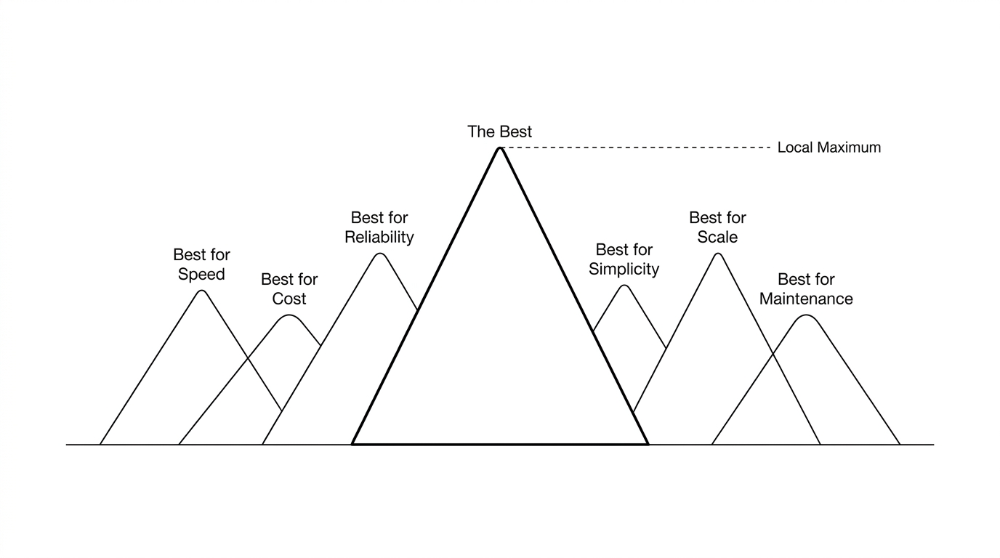

In engineering we are not generally interested in the \"worst\" outcome
as a result, except when we need to brainstorm in finding potential
problems to pre-solve against in coming up with our failure matrix for
our services.

Determining \"worst\" solutions is using the methodologies for \"best\"
with reverse quantitative comparisons.

In my view, this makes it clear that best/worst are a very small subset
of options, and those options are highly detailed to one\'s exact
environment, requirement, resources and goals.

As such, there can be no such thing as \"Best Practices\", because these
are generalized solutions, for generalized environments, with
generalized resources available, and generalized goals. Does that
describe the situation at your organization?

\"Best Practices\" are useful to read as case-studies that someone is
claiming a method worked well for them, and they can recommend it as a
potentially useful method, but since this goes against our own
understanding of what \"best\" really means, these should be reworded as
\"An Example Implementation\", not a \"Best Practice\", as it is neither
Best nor a Practice, since Practice connotes a deeper level of
understanding that is provided than the very thin layer of a \"recipe\"
and some case-study information.

In this book, I try to define for you, roughly, my Practice, for how to
do engineering and operations. I am trying to provide deep insight into
how these things work, as I see them, and how I manipulate them to
achieve results I desire, and how you can learn from my work to improve
your own methods.

Be careful with the language you use casually to describe things like
\"The Best Way To Do Something\", in your giving or receiving of
information, because the results you receive from taking those words at
anywhere near their face-value may be far from the suggested-reality
those words relayed to you.

\"Best\" has a powerful symbolic meaning to us. Use it very carefully,
or pay the consequences for wielding power poorly.

A better way to think of things is using the term \"better\".

Better is always a comparison between two distinct things. Best is often
only discussing 1 thing, and lumps everything else into the second
category: not-the-best.

\"Better\" specifies two things, and it is known that \"everything
else\" is not being considered at the moment, and so it is not being
discarded at the moment. \"Best\" discards everything but the \"best\"
immediately.

\"Better\" immediately leads to questions such as, \"Why is it better?
In what way is better? And, in what ways is it worse?\"

When you think of \"best\", it does not immediately bring into mind the
same questions, because the power of the symbol of \"best\" is that
there are no competitors: it is the best.

And yet, from our inspection earlier we see that \"best\" means a very
limited set of scenarios, do we know that we described the scenarios
accurately? If the \"best\" is based on a limited set of scenarios, and
we described anything inaccurately in the description of our scenario,
then very likely we chose the wrong \"best\". What if we forget
something in our scenario, is the "best" we chose always the best, even
when factors weren't accounted for?

In comparison with \"better\", we have to be more explicit. Our language
compels us to describe the \"better attributes\" explicitly, and begs
that we also describe the \"worse attributes\" in comparison. \"Best\"
does not beg that we describe the \"worse\", because we don\'t care
about the worst methodology or worst design. Our minds enjoy the
relationships of extremes. \"Better\" leads to \"more good\" and \"less
good\"; \"Best\" leads to \"worst\".

In both \"best\" and \"better\" we do care about their peer results, but
\"best\" claims to have no peers, while \"better\" usually implies there
are competing peers.

Thought exercise: In what circumstances currently do you use the term
\"best\"? When applying my critique above, what strikes you as something
you need to think about more in terms of \"best\" or \"better\"?

Can you think of a single thing you currently describe and think about
as \"best\" that it would be better to reframe as \"better\"? What
tangible benefits could this immediately bring you, from this change in
your thinking and decision making abilities?

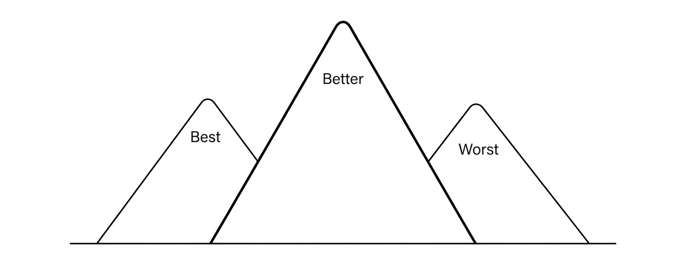

### 6.6 Fashion Oriented Engineering

"Best Practices" might be good techniques, and if we evaluate them in
the way we evaluate everything else as an Engineering decision, then it
is not Fashion, it is Engineering.

However, if one simply says \"I read on Famous Company X\'s blog, they
were doing Y. Let\'s do Y.\", this is not Engineering. This is following
a fashion trend setter.

I have been at organizations that made very well received press
releases, through their engineering blog, that completely
mischaracterized what was going on in their environment, from my
perspective, and it was well accepted by many others in the industry.

Why? Because they have no idea that if they actually worked at that
organization, they might completely disagree with the statements,
because they have more information and could see the chain of events,
and the effects of the recommended practice.

No one is going to publicly announce that they are making a mess of
their operations, but if their management tells them to make press
releases (blog posts), then they are going to do that, and do it in a
way that makes them look good.

They have an incentive to \"spin\" things to a positive outcome,
regardless of the real engineering results they are achieving. They may
be doing excellent engineering, I am also not saying that they are not
because I don\'t have that contextual information, I am simply saying
that we don\'t have direct experience with this information, and it
should be treated as noise, that we can potentially extract signals
from.

So, Buyer Beware! Engineering blogs are \"press releases\", in fact all
public communications are, and like any press release they are
effectively \"selling\" something, such as how great a place they are to
work, or how efficient and intelligent they are.

There is nothing wrong with these press releases, they are a good thing,
as they share information, and may be very useful. However, they should
be taken as information in the sense of, \"Organizating X made a press
release where they said Y.\"

This is true, and can be useful. Simply doing what one interprets from
their release doesn\'t even mean that they communicated it properly, or
their intent was understood properly, and it is a summarization, so it
is only giving a limited insight into the reality behind the post, at
best.

Just something to keep in mind. Fashion and Engineering are not
compatible in making decisions, and there is unfortunately a lot of
Fashion going on, in my experience.

#  

# Part III: Operational Dynamics - Applying Principles to People and Environments

## Chapter 7: Humans - Their Unique Role in Operations

It feels a bit weird when I say or write \"Humans\", as it\'s strangely
impersonalizing to everyone. However, it is conveniently clear to
differentiate not only from \"Not Human\", or \"Logic Based\" or
\"Software\" or whatever, but also clear in the sense that I am not
speaking casually about people, but specifically about the type of
effects that Humans cause.

We generalize about \"people\" all the time, different groups of them,
to have any sort of discussion. Sentences can only carry so much
information in them at any given time, because words only have so much
meaning, and a word is composed of syllables, and those take time to
write or say, and they have to be done sequentially: the syllables
cannot be written or said simultaneously to be more efficient, and so
generalizing or summarization is required.

Without summarization and generalization, we would spend so much time
getting to the point, by being maximally explicit in every detail, much
in the way I am doing right now, that we would just not get to the
point, and all communication would cease to function.

Shouldn\'t there be a spectrum for this? Let\'s make one:

Generalization ◄────► Specificity

Now we have an axis on which we can slide a variable across, to be more
or less specific, and it can be tuned in the way we want it, for every
circumstance that is possible.

In addition to this, we can add in another topic we recently covered,
such as \"Atomicity\".

We can be extremely specific in our discussion of Atomicity, or we can
be extremely General, or somewhere in between, in the spectrum, along
the axis. I will use this method of multiple examples mixed together to
provide a richer tapestry for these ideas to be expressed in, as the
book goes on. These are tools for communicating more deeply; they are
another spectrum or axis, which our goals can be applied against.

Let\'s just combine some right now, and make a new communication tool.
We just discussed \"Atomicity\" as a topic, on the spectrum/axis of
Generalization ◄─► Specificity. Let\'s combine the Atomicity spectrum
and the Specificity spectrum together, and create a topic based on the
two dimensional coordinate system that those two axes create.

Atomicity: Not Atomic ◄────► Atomic

Specificity: General ◄────► Specific

I ended up writing these \"Right to Left\" in terms of the subject being
in a full-state, or an empty-state, but they could just as easily be
written \"Left to Right\" (in reverse order), if it is more convenient
for the problem at hand to see them in that way. This process of
ordering things as needed for the current problem is another tool that
can be applied, and which has properties that can be evaluated. For the
sake of keeping up a fluid pacing for this book, I can\'t go into detail
on each of these things as they arrive (even though I would like to:
enhance, enhance, enhance).

Now that we have these two axes, which we could use in the Cartesian
coordinate system, we can plot a point on it, and then create text that
describes that point. This is a sort of generative tool, in which one
can use one\'s knowledge of an information space to generate any amount
of specific data.

If you are familiar with any sort of procedural generation, this yields
the same kind of effect that Perlin or Simplex Noise allowed in
procedural generation, in that because the pattern remained consistent
whether viewed from \"from away\" or \"up close\". Procedurally
generated content (images, models, clouds, cities, whatever) could scale
to \"infinite\" detail, either looking at the \"big picture\" or with a
\"magnifying glass\".

In the same way, this generative tool of mapping axes to an information
space, and then using your own understanding of that space to
extrapolate what text would describe that point in those axes\' space.

This is actually the exact same technique I am using to write this book,
as I have broken up the information space I am trying to cover into both
a linear (sequential) flow (chapters), and then assigning various
variables (in the forms of words in the topics) to create each
chapter\'s text.

Let\'s do one of these now:

For the Atomicity value, let\'s say on a scale of 1.0 (Atomic) to 0.0
(Not Atomic), we have an Atomicity value of 0.25, or not very Atomic,
but having some Atomic characteristics.

Then let\'s say on the Specificity scale of 1.0 (Specific) to 0.0
(General), we have an Specificity value of 0.75, or fairly specific.

Because we need to be specific, I am going to make up some details about
the Atomicity of the thing in question, which I will use a database for:

This database provides limited atomic transactions. Transactions are
accepted, and written into a journal file, which is flushed to disk
periodically, but not in sync with the transaction being considered
successfully completed, for performance. This means that in certain
circumstances a transaction may be partially written onto the journal
file disk, and in these cases recent data writes can be lost.

So, this terrible database accepts things as Transactions, and journals
the transactions, but it doesn\'t flush the journal as part of the
transaction success criteria to make it Atomic, so you might have
partial transactions written on the disk. This is actually always
potentially true, since a power failure could cause a partial transfer,
in some hardware configurations, but the difference is that a successful
result would already be returned to the client, even though the write
will later fail to complete.

In practice, modern controllers accept a queue of IO requests, and can
do some optimizations on them, depending on the construction of the
storage medium (what type of disk/etc), and so flushing merely pushes
more things onto this queue, and if you can\'t put more things into the
queue, you have already maxed out your throughput in this configuration.
Unless the queue has a battery backup to complete operations in case of
primary power failure, then power failure will always potentially cause
writes to fail that you think were accepted. Unless you force your OS to
not complete writes until the storage device has ensured it was written
(which has a performance penalty).

In this case, it is possible that the queue can take more total IO
requests if they are batched, and for a given workload and hardware
specification, you may need to do this, understanding the performance to
consistency trade offs. Moving on.

What if we had a Specific value of 0.0, instead of 0.75?

In this case we would be 100% Generic, but we still have to say
something relevant so we might summarize:

This database handles requests in Transactions, and writes them to a
journal file, but flushes only periodically, so Transactions may be lost
on power failure.

This gets across the idea of what\'s going on, but is very brief about
it.

What if we had a Specific value of 1.0, instead of 0.75?

We would have to specify the entire code, every line, and it would need
to be idealistically correct (or actual implementation), and we would
have to specify all environment requirements. Why? Because we are 100%
Specificity at 1.0. This means absolutely everything must be specified,
if this spectrum or axis is to have real meaning.

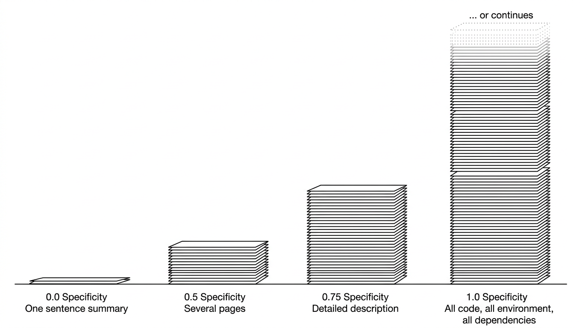

Taking this into account, maybe my example using 0.75 for that level of
specificity isn\'t nearly detailed or specific enough, but on first
introduction 0.75 sounds like \"pretty specific\", where 0.5 sounds
\"half specific, half vague\", and I wanted to be detailed enough to get
real implementation points across, but also not too long for pacing.
Only after thinking about what 100% Specificity would really mean does
0.75 seem too high for our previous example.

This is yet another tool for performing evaluations, by making one
example, and rating it, and then making another (or a series of others)
example, and rating those, and then going back and re-rating the first
examples, then the second again, and finally creating examples of the
most extreme situation you can imagine at both ends of the spectrum
(being 0.0 and 1.0), and then re-evaluating the middle ones again. This
is a method for getting a numerical sense of an information space.

So, these are 2 more tools we can use in the future to discuss problems
in a clear and precise manner. Trying to get as close as we can to 1.0
specificity, without losing the ability to make progress.

But where we\'re we? Oh, yes! Humans!

When we are having conversations like the one we are sort-of currently
involved in, being specific by saying \"Humans\" instead of any other
word allows us to understand we are using technical jargon, and we mean
technical things.

This allows us to move away from our standard social communication
style, and into a technical communication style, to discuss technical
points at a detailed level.

So while it is weird to type and say, it has a benefit for clarity,
which is an important attribute of Engineering.

Also, it will make it easier to relate to your future AI overlords,
which will be helpful. (\"The humans are revolting!\", \"I know,
right?\")

##  

## Chapter 8: Operational Environments - Security Zones and Lifecycle Management

### 8.1 Defining Operational Environments

Any place where any operation is going on is an \"operational
environment\". This could be on your desk, or in your closet, or in a
data center, or across a number of data centers across the world. The
size and location of the operational environments is not what defines an
Operational Environment.

What defines an Operational Environment is the purpose you wish to
achieve with it.

Often it can be useful to think of an Operational Environment as a
Security Zone. You allow certain people to make certain requests in each
security zone.

For example, on your laptop or desktop machines, you probably only allow
yourself, and perhaps your Corporate IT department, to execute software
or make configuration changes to the single machine in these
environments. We don\'t want people on the internet connecting to our
personal machines, so we will want to restrict any external connections.

If we move to a Quality Assurance (QA) environment, we may allow all QA
engineers to make data changes, and software pushes to these machines,
but we only allow certain operations staff to have administrative
access, and make system-level changes, so all of the systems stay in a
similar state. We generally don\'t want any external access to a QA
environment, but we might allow whitelisted access for some partner
companies who either provide us services, or who are doing integration
with our developers.

Looking at a Production Environment, we would want to have much more
auditing, and restrictive access of who could login to servers and make
changes. We also all do allow external access from our customers, who
could be anyone located anywhere, and may allow un-authenticated (guest)
access to our services.

Operational Environments, and their corresponding view as a Security
Zone, is an important consideration any time you are performing
Operational work. Where are you doing this work? What are the goals?
What are the rules and restrictions? Who gets access, and what are they
allowed to do?

How do we ensure all of this stays consistent? How do we maintain this,
make changes, and automate regularly occurring processes? What about
monitoring and alerting on things we care about?

All of these will change every time you change what Operational
Environment classification you are
in.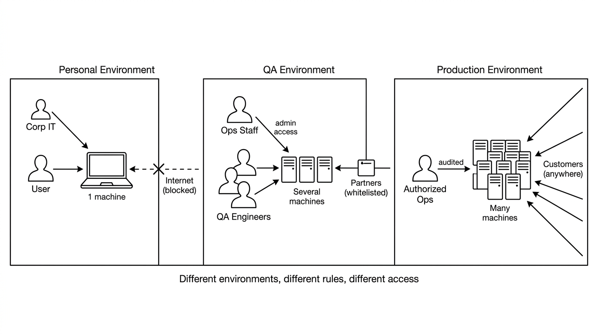

### 8.2 The Production Environment

The most important environment for any given system is the
\"Production\" environment. This is the environment in which the
organization makes their revenue (ex: online service), or interfaces
with their customers (ex: informational service), or creates their
product (ex: manufacturing). \"Production\" comes from \"product\", as
in a \"production line\" which in an assembly line that produces an
end-good product, it has the meaning of the \"end of the line\" in terms
of an organization producing a good or service, which will then be
distributed.

The Production Environment, which I will mostly just be calling
\"Production\", is the place where the critical operations of your
organization take place.

This might be a data center that has many peered network circuits, in
which you receive internet traffic and generate revenue.

Or, it could be a server farm in your corporate offices, in which
processing occurs, which is critical for the functioning of your
organization.

Or, it could be in a cloud or managed hosting environment, in which you
mostly manage through a browser application.

It doesn\'t matter what exactly the circumstances of your \"Production\"
are, you should be aware of what it is, and how it is treated
differently than other areas of your organization.

Things in Production should be the most important things, and not
intermingled with devices or services which are not of the same critical
importance. Sometimes sharing of environmental space will have to occur,
but this should be minimized, and remedied once it is possible to do so.

The Production environment should have the highest levels of security,
where only authorized personnel are allowed to access the server
instances, and every login and preferably every command issued is
logged, for auditing purposes.

This follows the \"AAA\" process of: Authenticate, Authorize, Account.

In brief:

-   Authentication is determining who someone is.

-   Authorization is determining if they are allowed to do what they are
    trying to do.

-   Accounting is the recording of events, so that they can be
    inspected.

### 8.3 Tiered Security Zones

Environments are natural Security Zones, because we have a goal in mind
for everything inside an Environment, so everything has a similar base
set of Security Requirements, and therefore a Security Posture that is
required.

Let\'s make a map of what tiers we could have in security zones.

-   Tier 1: Member of the organization. Employee or outsider?

The first tier will simply be a boolean of whether a person is a member
of the organization in question. \"Do you work for us?\"

This is a basic question of insider vs. outsider. This tier can have
additional children tiers for all departments and groups in an
organization, as well as professional rank, such as Vice President (VP)
vs. Engineer may have two different levels of tiered security in the
employee category.

This has blurred lines for Contractors, Consultants, Vendors and
Partners.

Contractors are paid as work-for-hire \"employees\", without the
employee benefits. This is usually focused on individuals that are
contracted for work, but sometimes is a separate organization who is
contracted (usually for lower level work, or non-core services).
Contractors will usually have similar access to employees at their same
level, with perhaps some additional restrictions to making changes or
seeing sensitive information.

Consultants are short-term or contracted for specific work, and often
for informational work, rather than manual labor type work (including
technical manual labor, like writing code in this). Consultants are
often given very limited access to a company\'s data and resources, as
they have a specific task to perform which does not need general
employee-level access.

Vendors are organizations who sell software, hardware or services to an
organization, and are not associated with any individuals. Vendors are
generally not given any access to data or resources, except in the case
of special technical support investigations, which are rare and may
still not be allowed by organizations who are serious about security.

Partners are a mix between contractors, consultants and vendors. They
may be a Vendor, which is making a co-sponsored project with your
organization, and so they need limited access to all relevant project
data and may need resource access to test integration. Partner employees
may be given contractor or consultant level access, depending on the
partnership goals and time lines.

-   Tier 2: Environment level. Production, staging, QA, development?

This is a statement of a basic operational environment. Where are you?
What are you allowed to do here?

Described in Chapter 8.

-   Tier 3: Location level. Specific datacenter in a Tier 2 environment.

Inside of a Production Environment, you might be in Data Center #1,
which may have some different rules from Data Center #2, because the
build-outs were done at different times, or different resources are
located in each of them.

-   Tier 4: Resource level.

Inside of a Tier 2 environment (and maybe Tier 3), there will be special
resources, such as a database that stores Personal Identification
Information (PII), or credit card information (PCI), etc.

For these special resources they may need additional sub-environmental
security zones, such as internal DMZs (ie: \"de-militarized zones\",
which is like a security \"draw-bridge\" or \"fire-wall\" area).

This could also be external DMZs, which are used for services that take
external requests which may be considered \"more dangerous\" or
otherwise having a different security posture requirement, which is
placed into a separate special area of the network. This allows for
example a place to put a file-server that is accessible by partners or
vendors, but if compromised does not give privileged access into the
Production network.

Roughly these 4 tiers break down into:

-   Authentication, authorization: \"Are you one of us?\"

-   Operational Environment: \"What do we want to happen at this
    point?\"

-   Specific Location: \"What do we do in this location that is
    special?\"

-   Resource specific: \"Is the specific resource in question special?\"

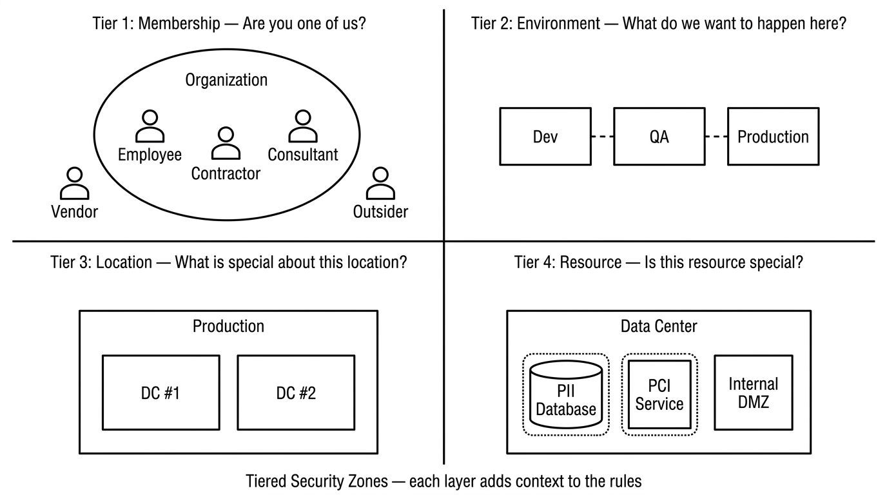

##  

## Chapter 9: Operational Logic vs. Application Logic - Different Goals, Different Code

### 9.1 The Fundamental Distinction

Is there a difference between Logic that is written for Operations
automation and Logic that is written for non-Operations?

In my opinion, there is, and it is a big difference. It doesn\'t need to
exist, but it does exist, and they are not mildly different, but
extremely different, in 2015 and in 2026 as well.

I see this changing more in the future, as distributed programming
environments not only become normal, as they are now, but that we start
to get generational levels of experience in the field. Generation Levels
of Experience is required because there are many lessons to be learned,
and then summarized, and then classified, and then come up with
procedures for handling, and then generationally iterate on all of this,
and this work has barely begun.

I will call non-Operational Logic \"Application Logic\", even though it
may not strictly fit your definition of what an Application is, since it
changes under different contexts. If we were to put this on an axis, we
could call it:

Application Logic ◄────► Operational Logic

For instance, in a Production web serving environment, you frequently
have \"Application Servers\" which might run Java Tomcat, JBoss, or Ruby
on Rails, or a Python, or other Logic required for producing dynamic web
content.

These would be \"Application Logic\" in this terminology, as I\'m using
it.

What is the difference between Application Logic and Operational Logic?

The main difference is Resiliency and Minimal Dependencies, and these
have a number of sub-parts. Some examples:

-   Application Logic requires that the environment that it runs in be
    configured, or the Logic will fail, and often will fall
    non-gracefully. How gracefully it fails generally has to do with how
    \"mature\" the Logic is, in terms of its life cycle.

    -   Example: An application server is started without a required
        configuration file in a specific directory, so the application
        server program exits with a status code of 1 and output to
        STDERR: \"Cannot open file: /path/to/file\". This is reasonable
        for an Application server, because it needs to be completely and
        correctly configured for it to return the correct results to a
        client.

-   Operational Logic is built to support infrastructure, with the
    knowledge that the infrastructure components are going to fail, and
    the Operational Logic needs to not only recognize the failures, but
    needs to continue to work in whatever ways are still available.

    -   Example: An operational software is written which will execute
        remote code on hosts, for the purposes of managing Application
        state. The remote programs which are executed will modify the
        Application\'s state, so that clients will receive different
        information after the state change. If the operational software
        cannot update the Application, perhaps because a file is missing
        (similar to the Application Logic example above), the
        Operational Logic cannot simply exit with an error code and
        message. It cannot complete its task correctly, but instead must
        continue to run, and create a local and remote log of the
        failure, with any additional environmental data that is required
        to help troubleshoot this problem, and then proper staff must be
        notified of this failure, and potentially other servers must be
        updated accordingly (rolled back, or different update), to
        account for the failure to update this Application state.

Don\'t misunderstand me and construe that I am criticizing Application
Logic or their developers, and praising Operational Logic or their
developers; they each have different goals, and so will produce works
that have different results because of this.

The differences between Application and Operational Logic are due to
differences in priorities and responsibilities.

Operational Logic is responsible for:

-   Infrastructure configuration and on-going maintenance

-   Configuring Application services and maintenance assistance

-   Monitoring and notification of Operational and Application state

-   Solving operational failures

Applications are made to provide end-users with:

-   Correct and timely results, for a given Application

Application Logic has an expectation that the operational environment is
working correctly, and so error detection and handling is typically
rudimentary, and output and results are intended for Application
experts. This is a natural prioritization, and not an incorrect one.
Only organizations that have grown large enough that the long-tail
problems are causing them noticeable impact should attempt to prioritize
making Application Logic to be more robust, like Operational Logic,
though Application Logic design can take many lessons from Operational
Logic design for very cheap or equivalent cost.

As an example, say there are a pair of relational databases in a
Master/Replica configuration, and the Master node fails, because of the
priorities for Application Logic, generally the application will just
fail until the Master/Replica designators are updated to promote the
Replica to Master (updated as moving a floating IP address or DNS name
or IP record change, or from another directory-style service).

There are some good reasons why Application Logic currently behaves this
way. The first is that it takes extra logic to determine what should
happen if the primary database server goes away, and this will be (very
short term, \"several minutes, or under an hour\") taken care of by the
Operations team, through manual intervention or automation. This allows
the Application developers to focus on revenue oriented features, while
the Operations team deals with the relatively rare occasions when there
is a fail-over event. This model becomes less desirable as businesses
scale up, but is the normal model for smaller or newer businesses, even
though it has obvious deficiencies.

Some classes of databases have a multi-node approach from the beginning,
to make these types of events less frequent, since a server can go down,
but others will be up, and the Application can talk to any of them.
These databases still have failure cases though, and so the results can
end up being the same depending on the type of failure, in terms of
non-availability due to database failures.

Part of the \"extra Logic\" is that Applications are meant to serve
end-users, and the time put into making this extra resiliency is often
prioritized to go into making additional or improved features. Whether
you agree or disagree that this should be the priority, it often is the
priority, and it serves us well to accept Reality, and work within it\'s
confines. If we want to change this, we need to change the priorities by
showing more value given with a different priority. This is difficult,
but possible. Choose your battles based on when you can win, and when
winning is worth it.

Additional to the Logic required to handle failures, is that Application
code needs to be very stable for-it\'s-own-purposes, and adding in this
kind of Logic means that during failures more cases may be found that
could be handled, which means more changes to the Logic surrounding
database access, which means more change/churn, and this leads to more
potential bugs. Specifically the kind of bugs that have data access
requests failing, which is something no one wants. This doesn\'t mean
that better Logic shouldn\'t be written for database access, but it does
need to be written very well, and with an Operational understanding,
especially around the matrix of failure cases. Using a slicing-the-pie
methodology for handling errors is an important tool for not missing any
of the potential failure cases.

While I think with better education, and better base-libraries we can
solve these problems and Application Logic can be more like Operational
Logic in handling failures, or in fact leverage the same Logic, so that
they are working hand-in-hand, I am making this point because this is
not currently standard, and has never been historically standard
anywhere that I am aware of.

Another thing that Operational Logic needs to do, is to simply have more
information about the operational environment. Seems like common sense,
but since we are building from the foundations, it is necessary to state
the details. Without meta information about the environment, Operational
Logic will not be able to make the same kind of decisions that a Human
performing Manual changes would have access to.

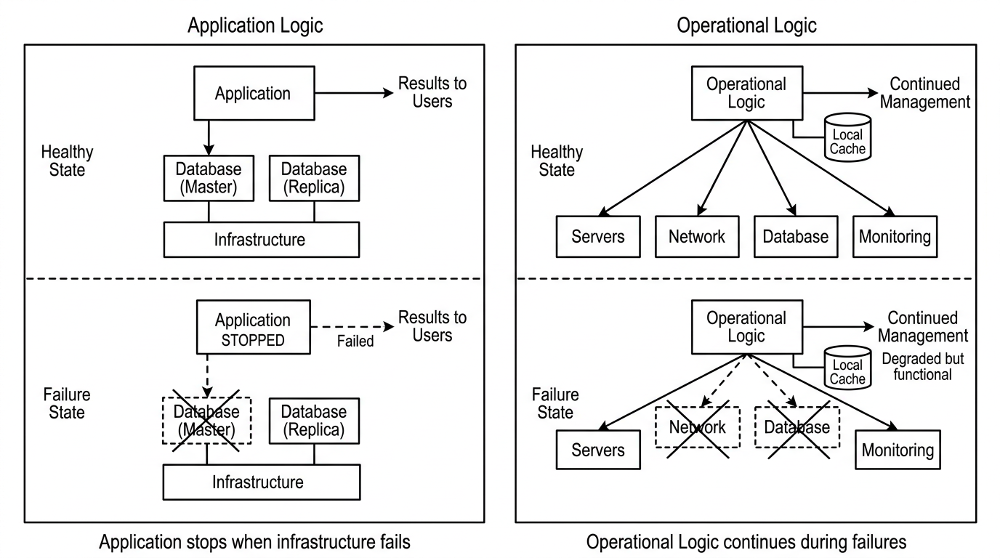

### 9.2 Many Applications, One Operational Environment

Another difference between Operational Logic and Application Logic has
to do with the nature of their environments.

In a given organization there is generally only one \"Production
Environment\". It may span many data centers, and there may be regional
data center teams to support the physical side of the operations
environment, but it is generally classified and worked on as a single
environment.

There are organizations who break these up, but they are frequently
either regulated businesses, or ancient, or have some other external
reason for running segmented Production Environments. In general,
companies, even very large ones with the largest Production server
collections, only have one Production Environment (which may contain
many services and security zones).

This means that in an entire Product Environment is being managed in a
single manner:

-   There is one way to update Production DNS.

-   There is one way to provision new servers.

-   There is one way to fail over from a faulty server to a working
    server, for a given service.

-   There is one way to handle authentication and authorization for user
    and role account access.

-   There is one way to centralize log collection.

-   There is one way to monitor and alert on logs.

-   There may be one way to release software releases. (Actually, this
    could be on a product by product basis)

Each of these \"one way\" methods may contain many sub-methods, such as
you may actually have several monitoring packages, but collectively they
make up the \"one way\", and generally things are put into one of them,
versus any others, unless multiple coverage is desired.

By this \"one way\" concept, I don\'t mean to be naive and really limit
it to \"one thing\", that is why there is \"one way to\" and not \"one
thing that does\". However many methods of doing something (as legacy
implementations will stick around for a long time, and sometimes there
is intra-team competition for creating solutions) may combine into \"the
way we do things\", and is meant to keep growing (although it might in
practice).

The thing about \"one way to do it\" systems that are different from
\"lots of different environments, that do it their own way\", which is
the comparison I\'m trying to make, is that in a one-way-to-do-it system
is that you don\'t want to introduce competing services.

It is more efficient to configure, manage and have life-cycle support if
we have limited the amount of ways we do things. This is a goal for us,
in a Production Environment, but we may be forced to fracture things due
to time or other resource or environmental restrictions (laws, business
goals, technical limitations, etc).

In terms of creating Application Logic, it is easy to separate
components of the Application or separate applications that may work in
tandem or sequence, or may be linked through a common Data Source,
through a messaging queue, RPC (Remote Procedure Call), or other data
transference mechanism.

There are many ways to do it, but the point is that you can split up
personnel, or Logic, to work on different things, and their work can be
isolated from each other, only connecting at certain points to do data
exchanges.

This could be generalized to always be true, but again, the point I\'m
making is the difference between one thing and another, not in their
similarities.

The Operational equivalent needs to be more tightly integrated, because
it is trying to support a one-way-to-do-it system, and where things are
not one-way, it would often be better if they were.

So it is a Goal of an Operational system to have one-way-to-do-it, for
efficiency, and it is a Goal of an Application system to have many ways
to do many specific tasks, so that personnel can be split up into
separate teams and given specific goals for those teams.

This may seem wrong to you if you are coming from the Application side
of things as \"re-use\" and \"modularity\" and all the tenets of
Software Development seem to contradict what I am saying, but I am
referring to the scale and degrees of this, and am saying that in
Operational Logic, these must be significantly more extreme than in
Application Logic. This is because Operational Logic supports the
infrastructure in which Application Logic runs, so Operational Logic
must be \"more basic\", \"more fundamental\", \"more fault-tolerant\",
\"more infrastructure-aware\", than its Application Logic sibling.

The Operational team, in contrast to the Non-Operational software
development department, has more generalized goals, that take into
account the entire Production Environment, and are more concerned about:

-   Total availability of all services in the Production Environment

-   Manageability and life-cycle maintenance efficiency

-   Performance of the entire system, with a priority on bottle-necks

-   Not introducing problems into the environment, and prioritizing
    solving ones that currently exist

Again, we could align these in terms of how they are similar, and we
will find that they are mostly similar, but there is a difference
between Operational Logic and Application Logic, and in this
circumstance we want to understand the differences more than the
similarities, as we are dividing the two subjects for inspection.

I will not spend much more time on Application Logic, as there is much
writing about that in non-Operational literature that covers the current
understanding of how to do that, and that is not the focus for
Operational Engineers.

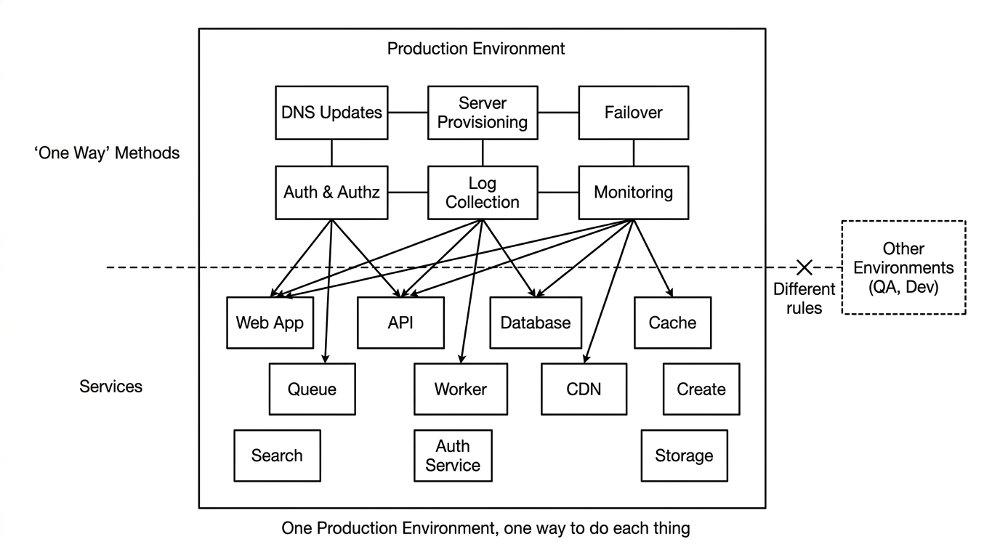

### 9.3 Designing for Resilient Operational Logic

Now that I\'ve established there are two different things, with
different qualities, Operational Logic and Application Logic, let\'s get
into what goals Operational Logic should have:

-   Operation Logic should try to minimize external dependencies,
    especially networked dependencies.

If we know things are going to fail, and we are writing logic to handle
them in cases where they have failed, then we know the infrastructure we
are writing against, to manage, will also fail.

Knowing this, we can optimize for the case that we want our Operational
Logic to continue to function properly even in the case of a network
partition or other failures.

If I have locally cached data to the server my Operational Logic is
running on, I can access that data consistently, even if the network
fails and the server running my Logic cannot reach other networked
services or nodes.

This allows me to handle failure cases more gracefully. For instance,
maybe all the nodes are not unavailable, and if I have the data that
lists all the nodes and their properties on my server already, I can
verify which are reachable, and which are not without an internal
processing failure occurring (cannot access data to check with, because
it has been partitioned in the network failure).

-   Operational Logic should try to minimize the amount of frameworks,
    libraries and services it uses.

Frameworks and libraries are useful, they serve a purpose, however the
more things you have, the more things that can fail and cause your logic
to no longer function, and the more things you must upgrade over time
(security patches, system updates, etc).

Additionally each of these things needs expertise to manage and
troubleshoot, and your Operational Logic needs to be as straight-forward
and simple as it can be, so that when problems occur, they can be
troubleshot and resolved quickly.

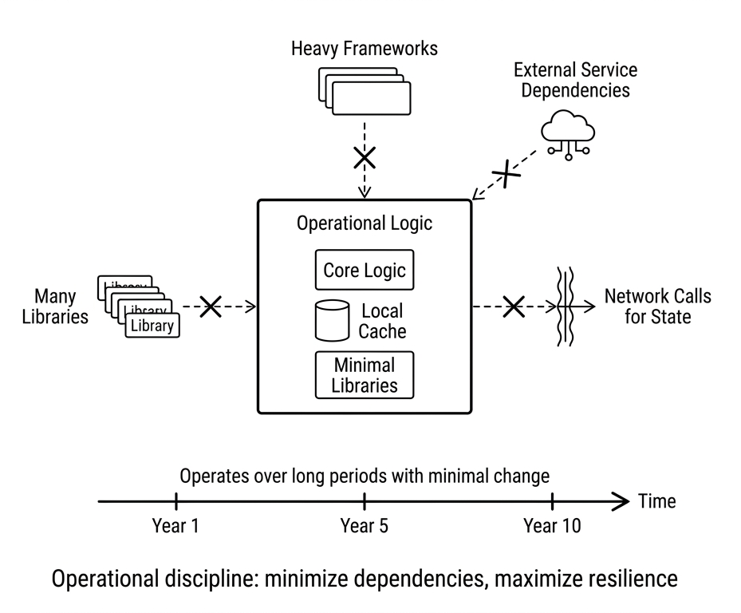

Operations teams are also generally (at most organizations) much smaller
than their Application Engineering departments, so this must also be
done with less people involved in the work, and with shorter time
frames.

Since the Operations team also has to take new services into account,
and new hardware platforms, and may be given very short notice to get
these working, the Operational Logic needs to be written to be able to
be adapted to these situations extremely rapidly, and without causing
problems for the existing infrastructure.

After all, in a one-way-to-do-it system, if you break something with a
change, you might have broken everything with the change.

This \"force multiplier\" or leverage gained from automation is a
double-edged sword, in that it cuts your problems efficiently but if
used incorrectly will cut you as well, by automating failures into
happening in a wider area and faster than Humans can or would do
manually.

In the past, these problems could be avoided when automation was
implemented incorrectly by simply removing the automation and having
everyone do everything by hand again. I have seen this happen many
times, when automation was immature, or was not given proper resources
(mostly time) to be implemented correctly.

As the scale of operations continues to grow, this will simply not be
possible or efficient in terms of money and personnel to scale enough
people to do things manually, and the number of mistakes created by
manual work will mean that even getting through the dangerous stages of
automation will be a better trade-off.

As of 2015: We aren\'t quite there yet, but it is coming. Some
organizations have a good amount of automation, and we will create a
spectrum soon to do some analysis on this, but they are not yet
comprehensively automated, and are approaching it through Aggregation,
instead of Slicing The Pie.

As of 2026, many things are handled by Kubernetes and similar software,
but they introduce their own problems that must be handled as well. They
raise the Lowest Common Denominator bar, but they are not a
comprehensive solution to Operations Logic.

That automation's power is both beneficial and dangerous should change
one's viewpoint on what is required to deal with automation
comprehensively, and it starts with understanding how to optimize the
Operational Logic to yield the effects required to allow this to happen,
and how to constrain the disasters from occurring.

-   When things break, how does your logic function?

Minimizing dependencies, locally caching data are two strategies in
making resilient Logic, but the real goal is that the Logic continues to
function exactly as you designed it.

By using Slicing The Pie methods of black boxing work that needs to be
done, one can create a system that anticipates failures, and continues
to function properly with the resources that are still available to it,
as well as the available resources allow it to.

##  

## Chapter 10: Scaling and Control - The \"0, 1, Infinity\" Principle

### 10.1 Understanding Distributed Systems

You may have used the word \"distributed\" before, such as in
\"distributed systems\".

My meaning will be very similar to this usage, but I will use it a
little more generally to mean any time you need to work across many
nodes of something.

For instance having to control 200 web servers will be a Distributed
service of web servers. This usage stems from a single web server being
able to do the same thing as 200 web servers (configured in the same
manner), but the \"load\" is \"distributed\" across the 200 web servers,
making this a distributed network service.

The reason for being very general in this usage is that it provides a
comparison point between a single-unit processing system and a
multi-unit processing system, which is the core of the problem and
benefit: there are more things doing the thing.

### 10.2 The \"0, 1, Infinity\" Rule

There are 3 cases you should account for in operations:

-   **Zero instances** of something. You do not do this thing. In some
    cases this is simply something you do not require, but in the more
    sophisticated case, this is work you are still accomplishing, but in
    a manner that does not need an instance of anything running to
    accomplish the goal, it is taken care of by an efficiency gain. In
    either case, it is important to know that \"not having something\"
    is a potential state.

-   **One instance** of something. This is when you have one thing that
    you use; it is the centralization of a service. There may still be a
    pair of machines (Master/Replica) supporting this one-thing, and
    there may be more than a pair, but if there is logically a \"single
    instance\" of the thing, then it is a \"one instance\" though the
    instance may be made up of many pieces to create the single-whole.

-   **Infinite instances** of something. As soon as you move beyond
    \"one instance\" (or one-thing), you move into the realm of
    many-things. If you think you can move to \"just two\" or \"just
    three\" you are not taking into account all of history which shows
    continual sub-division and growth in all things that are not
    \"shutting down\". \"Infinite instances\" may currently be at a
    count of \"2\", but in order to handle the growth that will
    eventually come, it should be implemented as an N-instance, or
    infinite instance system.

Differentiating between \"instances\" and \"counts of things\" can be a
little tricky, and seem subjective, but it is because it is fulfilling a
goal of understanding whether we have duplication of \"service
providers\", or not. This is all in the context of \"distributed
systems\", if that helps to make this language introspection easier to
understand.

These differences can be seen in the phase:

**\"0, 1, Infinity. There is no 2.\"**

Make this an internal meme for yourself, and watch as things start to
make more sense in terms of problems with scaling. When a number larger
than 1-instance is introduced, you will eventually see that number grow,
and sub-divide into different domains.

Having a 1-instance system is incredibly difficult. Pressures will
continually be applied to grow into an N-instance system, and it will
take work and perseverance to keep a 1-instance system at 1-instance.

0-instance systems, when not just the identity of \"we don\'t do that
here\", are created from efficiencies in automation. This is when a
1-instance or N-instance system has been replaced in such a way that the
work does not need to specifically occur, and yet the goals are still
achieved. If this sounds a lot like what I referred to as \"removing
Classes of Work\", it is because it is exactly that.

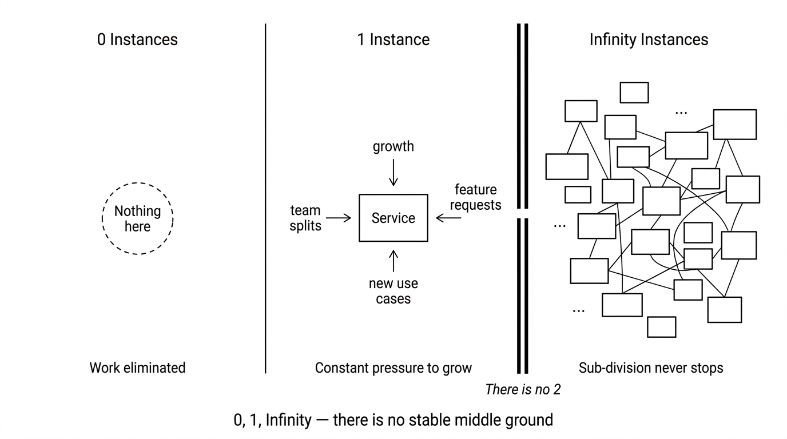

### 10.3 The Production Environment as a Distributed Operating System (DOS)

One reason why the difference between Operational Logic and Application
Logic matters is that it provides an insight into another way of looking
at the Production Environment.

By seeing it as a \"one-way-to-do-it\" system, where we mostly want
things done one-way, we can actually look at the entire collective of
Production Operations as a single entity.

We can abstract it so that it is \"one big computer\", with many nodes,
which can be configured as if it is one a single computer, with
containers in it, or rather different directory mount points.

Each node in this \"one big computer\" has its own internal process
schedulers (as Operating Systems start processes through a scheduler,
that manages interrupts and putting processes back onto CPUs when their
system calls finish), and it has its own internal RAM and storage, etc.

But, the entire set of machines, no matter how distributed they are
across the planet, or how many nodes they are, can be controlled in
terms of configuration and operational management, as if they were one
system with many parts.

I think of this as a layer of Operating System above the traditional
bare-metal and virtual-machine installed Operating Systems, whose goals
are to abstract physical hardware (BIOS, Buses, Devices), and manage
device drivers, and schedule processes on their CPU, and manage
libraries and file systems and virtual memory and such.

So, I\'ll introduce this acronym as \"DOS\", Distributed Operating
System. It is similar to a \"cluster\", but clusters are generally more
uniform, trying to have the same type of pieces controlled by the same
processes, in this they are homogeneous.

Distributed Operating Systems (DOSes), would be heterogeneous, with any
number of different hardware specifications, different Operating
Systems, and different services, and can contain any type of storage, in
any configuration.

Unlike Kubernetes which is a cluster orchestration and management
system, a DOS would include everything in the Production Environment,
which Kubernetes installations are components of, that contain their own
subcomponents, similar to VMWare on the commercial side, but running a
different layer.

Just like a single system, where you can run any kind of software (for
that platform), or configure the directory structure in any way you
want, there is no standard order for a DOS, it is merely an abstraction
of working with a number of systems as if they were one system.

There are unfortunately some acronym name conflicts with DOS, such as
the legacy \"MS-DOS\", but this can simply be specified as \"MS-DOS\" or
\"PC-DOS\" for the rare instances that someone needs to refer to this.

There is also another acronym for \"DoS\", which is Denial of Service,
and usually takes place in reality as a \"DDoS\", Distributed Denial of
Service. The convention is to keep the \"o\" lower case, which makes
this less confusing.

Since we need to move forward in our industry, and distributed systems
are here to stay, and we need to advance our methods of thinking about
how to manage those distributed systems, I think we can safely take the
acronym \"DOS\" for our purposes.

One big computer, many nodes, heterogeneous Operating Systems, and
services. All able to be managed as a single system.

It\'s a big deal, and I predict whether this terminology is adopted or
not, that in the future we will end up seeing Production Environments in
this way, because of the efficiencies that this will lead to.

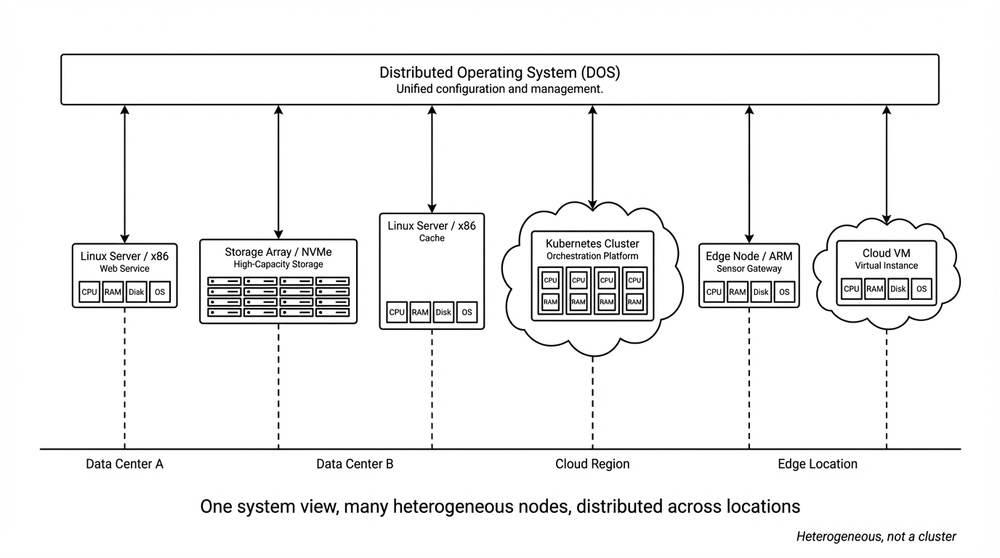

#  

# Part IV: In Practice - Concrete Applications

## Chapter 11: Evaluating Changes - A Principled Approach

Now that we have established how to set up Attribute Axes, Priorities
and create Axioms we can start to look at how to evaluate changes,
before making them and afterwards.

Let\'s start by creating an example problem, by setting up the
environment for it, current state, and our goals (end state).

Let\'s start with a simple website with some dynamic content, which we
are deploying.

Our goal is to improve our performance in doing the deployment.
Currently, we are copying the installation files sequentially from a
single server, and we have 100 web or application servers which we are
copying them to (we will call them \"web\" servers for simplicity.

The exact mechanisms for copying and deployment are not going to be the
focus of this example, and so we won\'t be evaluating their performance
or impacts, because it will complicate the example. In the real world,
of course, these factors are also important, and would have to be
evaluated independently, and in conjunction with the rest of the
changes.

It is important that all details are \"Aligned\" in that they work well
together, and perform efficiently as a whole (in their sequential and
parallel processing), over long periods of time, and under our given
resiliency goals. Alignment is complicated to explain, so I will keep
giving examples of it over time, so that you can build up your own
understanding of the concept, and how to apply the term as I am using
it.

So, we have a current state:

-   Single server, connects to 100 servers over SCP (secure copy)
    sequentially.

What are some options that will perform better than running 100
sequential copies?

One method is running the copies on the same single server, but running
the copy commands in parallel instead of sequentially.

There are a number of options for running things in parallel, here are
two common ones:

-   Forking the process, so that there are many processes of SCP
    running. Forked processes are independent of the process that forked
    them (they start as clones, and then do their custom thing), and do
    not have a lot of communication with the parent. There are ways to
    know some things about the program though (exit event), so this is a
    viable option.

-   Using a controller program to create Threads, and running the SCP
    process in the threads (similar to forking, in that there are still
    100 (in this case) SCP processes being run, but they are being
    controlled by a single program, instead of just independently
    launching.

Since I want to constrain this example, I won\'t get into the
differences between controlling forked and threaded sub-processes, it\'s
enough to know that while they have differences, we can get the results
we want out of either of them for this case.

It doesn\'t matter whether we write our own code to do this forked or
thread handling, or we use software someone else made, such as
\"Orchestration\" software (Puppet, Salt, Chef, etc) which might have
agents that run on each target server, and perform the copy in its own
way.

So we have specified 2 methods running on the same single source server,
and performing the work in parallel.

Since we have run into this performance problem by running things
sequentially, one thing we will do is say, \"Let\'s not get into this
situation again, once our server targets have grown again\", and say
that we are removing the option of using sequential copies again,
because it will not scale, and will create work for us again in the
future.

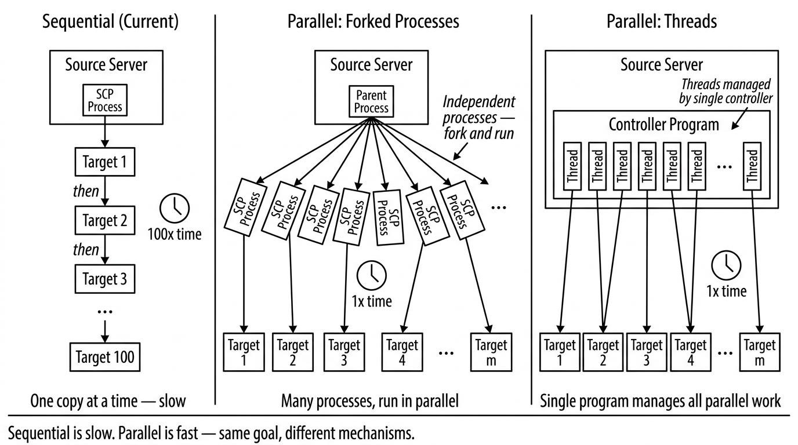

Since we just went over how to create an Axiom, let\'s do it now.
However, since we are working with a specific scenario and have not yet
looked at all-of-operations together, we shouldn\'t make this a
Universal Axiom, or a Production Axiom.

Instead, let\'s make it a Working Axiom, or a Temporary Axiom, for the
purpose of this problem.

Here goes:

\"Once a job that was working sequentially on a single server hits a
scaling problem, and needs to be changed for performance, all later
implementations of that job will not be re-implemented sequentially,
even on more than a single server.\"

This is a little longer than I like for an Axiom, and it has more
caveats than I prefer as well, as I like them simple and
straight-forward, always able to be applied.

In this circumstance, we are building a Working Axiom, so it is
temporary, and it needs to be precise, so it needs those caveats to fit
into our problem space.

Let\'s review the verbiage quickly to see what caveats I baked in:

-   I have limited this to implementations that already exist, and were
    implemented as sequential processing, on a single instance.

This could actually apply to a number of different scenarios, not just
the one we are currently discussing, so this is good Axiom material, as
we want to be able to apply Axioms generally, so that they are usable or
actionable.

-   I specify that this axiom is only to be applied once the work hits a
    problem. Going around and \"fixing\" problems that aren\'t problems
    is a poor use of resources, as there are likely actual problems that
    need fixing. Also, it is creating change in the environment, which
    may lead to instability or outages.

All changes come with risk, as you only know the effects of your
previous system from your history with it, once you change it you are
working with a new system (new state vs. old state), so you may get
different effects.

If your change is implemented ideally, then the effects that change are
exactly what you planned and wanted, so everything is OK. If you get
effects you did not want, or did not anticipate, you will likely create
a problem, which may need another change to fix. In cases where it
causes an immediate outage or degradation, it will need to be reverted
or \"rolled-back\", if this is possible.

-   Once a job gets to this \"problem\" state, we will not create
    another solution that operates sequentially, as we have proven that
    for this case of work (job), sequential processing doesn\'t scale
    for us.

This doesn\'t mean that everything should be parallelized. Firstly, not
everything can be run in parallel, as some operations are sequential
operations. If you need to get data, and then format text with it, you
can\'t format the text at the same time you are getting data (in
parallel), because you don\'t have the data yet. This work requires
being run sequentially. However, if you have to process 100 of these,
you may be able to run each of the 100 jobs in parallel, and then
internally process them sequentially.

Writing things to work initially in sequence is a faster way to to
develop, as the complexity of parallel process communication, locking
and other issues can be ignored, and sequential processing is a default
for many implementation languages (and all the primary Operational
related languages, from any environment I\'ve worked
in).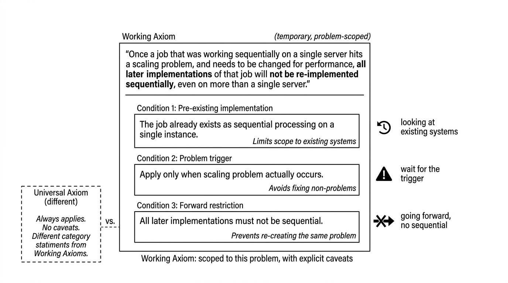

-   Finally, I state that even splitting the job across multiple
    servers, which may allow the sequential processing to have
    acceptable performance again, is not acceptable, because we are just
    planning to have this problem again when those N servers have to do
    \"100\" servers each, and we are back in the same spot. This method
    of \"throwing hardware at the problem\" is frequently not the right
    move, although there are some special cases where it is the right
    move.

The act of taking the same method you use now, and making a change to it
that allows it to continue working, but with the knowledge that it will
stop working again once you have continued growing as you have
previously, I sometimes call \"burying land mines in your own yard\".
This is because you know this will create a problem for you in the
future (problems, degradation, outages, etc), but you are doing it
anyway. You have embedded a known problem in your system, and will
certainly encounter it again (unless you are going to decline and shut
down the organization).

However, just because this is going to create a problem in the future,
and it would be best to be avoided, there are circumstances that might
be the \"right thing to do\". Such as if you are working in a
\"Startup\" organization (very small, moving very fast, not afraid to
break things), and the trade offs are worth it.

Doing things or not doing things should always be evaluated for their
Engineering trade-offs, with the business goals and requirements.
Refusing to do something that is best for the organization, just because
it will cause a problem in the future is also Not Engineering, even
though it seems like it is \"being a better Engineer\", because it is
not taking into account the actual environment, which is prioritizing
moving fast over avoiding problems. This will create Technical Debt, but
may be worth the trade-off, just like creating Financial Debt can.

Ok, so now we have established that one method of solving this problem
is to create parallel processing on the single server, and we have our
Working Axiom:

\"Once a job that was working sequentially on a single server hits a
scaling problem, and needs to be changed for performance, all later
implementations of that job will not be re-implemented sequentially,
even on more than a single server.\"

We need at least one more method for this example to be complete, for
our purposes (but not for a real world solution), and for that I will
choose the method of the target servers all pulling down the deployment
themselves.

This creates a \"push\" (parallel SCP copies) vs. \"pull\" (target
servers pull down data) scenario, so we are comparing data moving in two
different directions.

For this example, I will only provide 1 method of \"pulling\" the
deployment data, which will be to use a Load Balancer and web servers
behind the Load Balancer.

For all Production services, we should generally always have at least 2
servers for redundancy, in case one of them fails the other is
available. Note I say \"generally always\", which is a contradiction. To
keep things simple we will just create a single Load Balancer and N web
servers behind the Load Balancer. For the example, we could say 1 web
server, but since the purpose of Load Balancers is to distribute
requests (load), we can say N. Getting into 2 or more Load Balancers has
a couple other issues I would want to bring up, so I will avoid it for
this example.

So, to summarize, our \"pull\" alternative is:

-   A Load Balancer server that accepts HTTP requests (also simplifying
    by not adding in security, made clear by not using HTTPS).

-   N Web servers that can serve the static content of our deployment
    data.

-   Some logic for invoking the \"pull request\" from the target
    servers, to the Load Balancer. We will call this \"Pull Logic\".

-   Some logic for signaling the target servers that they should invoke
    the \"Pull Logic\". We will call this \"Deploy Logic\", since this
    invokes the deployment.

The flow of this Pull system will be:

-   The new deployment data is put in place, in whatever way that is
    done, which is the same for any of our cases.

-   Deploy Logic is triggered by a Human running a script or initiating
    from a webpage, Gitops, artifact update, etc.

-   The Deploy Logic triggers the Pull Logic to get the latest data.
    This could also be done several ways, but let\'s take the simplest
    one of an Agent Model, where the Deploy tells each of the web
    servers it\'s time to pull their deployment data.

-   The Pull Logic makes an HTTP request to the Load Balancer, which
    proxies the request to the HTTP server, which responds with the
    Deployment Data.

-   The standard \"local installation\" Logic runs on the web server
    node, which would run in any of our cases.

So, now we have established a more scalable Push and a Pull alternative
to our sequential Push mechanism, how should we go about evaluating
them?

First, let\'s come up with all the Attribute Axes that we care about
here, and then let\'s prioritize them for ranking purposes, and finally
we can assign values to all of the Attribute Axes, and then look at what
their Prioritization tells us about what our options are.

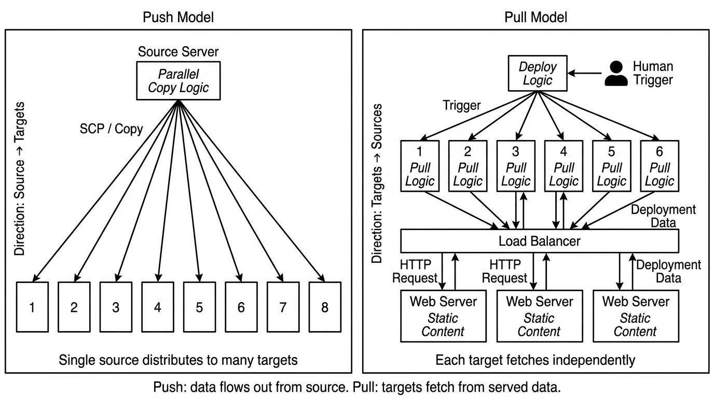

One important concept to always be aware of when designing a solution is
Centralization. Let\'s create that spectrum:

Decentralized (0.0) ◄────► Centralized (1.0)

On the Decentralized end of the spectrum, things are done on many nodes
(machines, servers, etc), and on the Centralized end of the spectrum,
things are done in a "single" place.

The benefits of Centralization are control, and a single point to detect
failures and perform control logic.

The liabilities of Centralization, or the benefits of Decentralization,
are that there are many nodes, so if a node fails, you only lose 1/N of
the total processing capacity, this also can help with performance as
many nodes can do more work than a single node.

However, we actually have 2 sides to this Centralization question.

Firstly, we are always Decentralized on our HTTP servers, because we
have more than 1 of them, or N of them. So our Target is already
Decentralized.

The question is whether we will make our Source Decentralized (HTTP
servers behind load balancers), or our Source Centralized.

There is a slightly different perspective on this already going on with
Sequential vs. Parallel execution on a single node. Parallel execution
has a \"Decentralized\" factor over a sequential execution, which is the
Centralization of an execution process. The differences between running
many processes on the same server or running many processes on different
servers have many similarities.

Now that we have this Centralization spectrum, let\'s put our options on
the table:

-   Push: Centralized execution of parallel processes. While there is an
    element of Decentralization to the parallel processing vs.
    sequential, this operates under the black-box of this server, since
    it is on a single server, it is still a 1-instance system, and so is
    fully Centralized. Centralized = 1.0.

-   Pull: We initiate it on a single machine, that contacts 100
    machines, those contact 1 machine (Load Balancer), which contacts N
    machines that serve static HTTP. This has a back-and-forth in terms
    of being Centralized as we move from 1-instance to N-instance, back
    to few-instances (1 Load Balancer), to N-instances (HTTP) again.
    However, when we black-box this, the important part is that the 100
    machines (N-instances) are requesting their deployment data
    independently: this is a Decentralized installation, so
    Centralization is closer to 0.0, but probably not full 0.0, since
    there are many centralized steps, let\'s call it Centralized = 0.2.

Even in creating a simple set of values for comparison on a single
Attribute Axes, we found there are many sub-points that could confuse
the topic, and be causes for disagreement. I\'m able to settle these
quickly in this text, because I don\'t have to have anyone else agree
with my assessments, but as soon as you add in other people you quickly
get disagreements based on terminology, experience and understanding of
the current problem and previous solutions.

This makes this kind of thing essentially an unsolvable problem in terms
of communication, and underlines how important it is to try to
communicate clearly, like with Prioritized Attribute Axes, as it allows
for some resemblance of qualified and quantified discussion, instead of
the usual method of making decisions in groups: who can talk the most,
who can talk the loudest, who is better at arguing and the most
important, who has the most social capital to spend on \"winning\" the
current discussion.

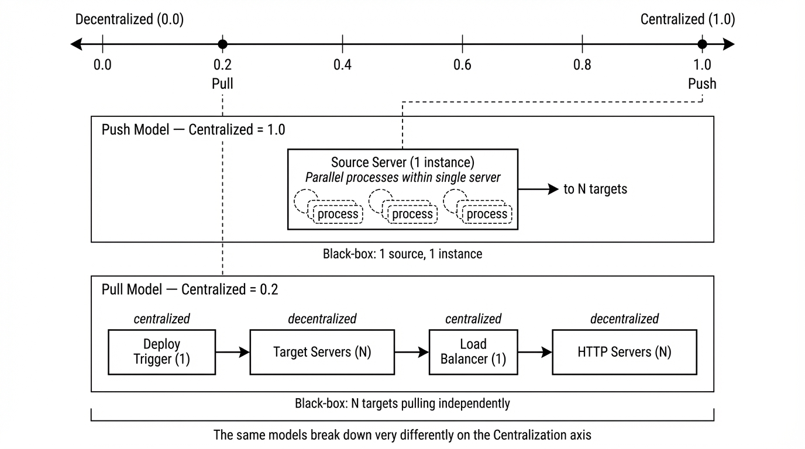

Since we are looking for Engineering clarity as opposed to \"winning\"
through rhetoric, we must make our best efforts to perform this work
clearly, even though as we get into the details of any topic it
obviously becomes unclear and could be subjectively argued to mean the
opposite thing. Your experience and discretion will determine what path
you go down, so paying attention to the results (effects) of all your
actions will need to be your guide in how to make these choices to get
effects you desire, and avoid effects you do not.

So we have a Centralized axis, and Push = 1.0, and Pull = 0.2. We have
one Attribute Axis filled out.

What\'s another spectrum we can measure here? Performance is important,
since that is why we are doing this exercise. So let\'s rate them both:

-   Push: N parallel SCP processes start, and copy the tarball or
    otherwise single-file packaged deployment data to each node.
    Starting 100 SCP processes at once can delay things moving as the
    handshakes are occurring, but once things start up being in a single
    SCP process versus an HTTP process will only have the encryption as
    an added factor, which is fairly minimal on modern hardware and can
    be ignored unless it can be measured to be important. We will ignore
    the actual lag SCP has for connections, for the sake of keeping this
    example simple.

-   Pull: 1 process initiates 100 processes, which make an HTTP request
    through a load balancer to our HTTP servers. We never did cover how
    the 1 process will initiate the 100 processes; if we use SSH to do
    it, we are literally doing the same thing that the 100 SCP processes
    of Push would do (since SCP uses SSH), except for the data delivery.

All in all, I\'m going to round these out to be equivalent, which means
between them we can put both their Performance scales at 1.0, which
means it is a non-factor.

What about Scalability? This is another factor like Performance. We came
to this problem because the Sequential Push was too slow. It was not too
slow when we had less than 100 servers, but at 100 servers it is too
slow, which makes this a Scalability issue. So let\'s rate our methods
in terms of Scalability, after we make a spectrum:

Can\'t Scale (0.0) ◄────► Can Scale (1.0)

Notice I said \"Can\'t Scale vs Can Scale\", and not \"Not Scalable vs
Scalable\". The reason for this is that we may still need to change our
selected solution, as it is not the \"Most Scalable\" solution, but
building the \"Most Scalable\" solution before you need it is not good
Engineering, as it is overkill for what we need. We only need to handle
our current and near-future problems, not our far-future problems.
Implementing a solution for far-future problems may actually cause us
problems in building, supporting and using it now that we are not nearly
at that scale.

Imagine a deployment system that can handle quickly doing deployments on
100,000 servers. Is this going to be as easy to use, create and maintain
as one that can deploy on 300 servers? Probably not, as the mechanisms
that will allow it to scale to 100,000 servers probably add in a lot of
complexity and will make it difficult to use this system, and to make
changes as the business goals change.

So let\'s review our Push/Pull options on the \"Can\'t Scale\" vs \"Can
Scale\" spectrum:

-   Push: Runs on a single machine with 100 processes. This only scales
    up to what this single machine can handle, so at some point we are
    going to need to move to more than 1 initiating server. So this is
    only scalable for so long, and then we will need more machines to
    perform this copy, and we will need a method to initiate all those
    machines to initiate their copies.

-   Pull: Has 2 limited server groups (initiating, load balancing) and 2
    scalable server groups (target servers, HTTP static content
    servers). This has a much better scaling factor, in that our
    \"limited server\" groups are actually easy to expand. It is easy to
    add more Load Balancers, and easy to split up Initiators, as they do
    a small workload (triggering the deployment fetching Logic on the
    target nodes). Additionally, since the initiating Logic (Pull) does
    less work than the copying Logic (Push), we can run more target node
    initiations from a single Pull-instance server.

So, with this I\'m going to assign some values based on my internal
experience and understanding of this space. It would take too much space
to go into all the decision points I am making to assign these values.
As an exercise, do your own analysis on this and come up with your own
values, and compare them to mine. Why do you think we came up with
different values? This will happen with every person you work with, if
you both have different ideas for how to implement things, so it is a
useful exercise.

I will rate the Push option as having a Can Scale value of 0.5. It can
scale, but will start to have problems as the target server count gets
bigger. SCP is not as fast as HTTP (with SCP lag included), and is not
set up to handle as many simultaneous connections.

I will rate the Pull option as having a Can Scale value of 0.75. This is
still not an amazingly scalable architecture, but it has the ability to
scale better than the previous one, so I am leaving room for
more-scalable solutions, but indicating that it is clearly superior to
the Push option in this single Attribute Axis.

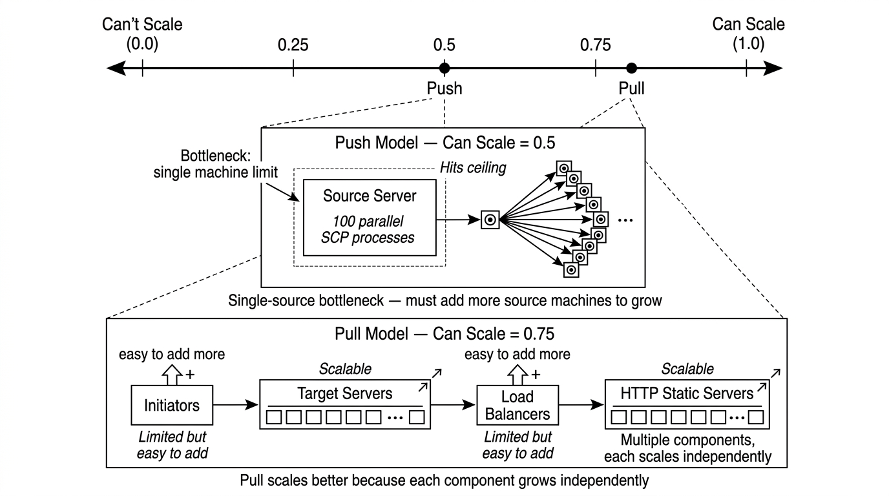

## Chapter 12: Applied Algorithmic Properties - Building Reliable Automation

### 12.1 Fundamental Algorithmic Properties in Operations

There are lots of important Algorithms in Engineering, they are Virtual
and are frequently constrained to these types of things:

-   **Searching for data**: Finding things based on some matching
    criteria.

-   **Sorting data**: Ordering data based on some sorting criteria.

-   **Coordination**: Locking, reference counting, signaling other
    coordination style actions.

-   **Encoding/Decoding**: Encryption, compression, encapsulation, and
    other wrap/unwrap style actions.

There are other categories as well, but these are often what we think of
in Operational Engineering when someone says \"algorithms\".

There are many good references for these, including Wikipedia or Donald
Knuth\'s books, for a completely in-depth comparison between an
encyclopedia of algorithms.

In terms of Operations, while we use these other algorithms, I will
focus on \"Algorithmic Properties\" and the most fundamental Algorithm.

### 12.2 Idempotency - Consistent Results Every Time

One important \"Algorithmic Property\" is Idempotency. This means that
when you apply an Algorithm with this Property that the result is always
the same. In simple mathematics this can be seen by \"1 \\\* 1 = 1\".
\"\\\* 1\" is the Algorithm, and the result is always the same as the
original value (1 == 1). More accurately: f(f(x)) = f(x).

This has interesting mathematical uses, but in Operational Engineering,
the use is that if we perform a function, we always have the same
result.

Consider an algorithm that ensures that a directory exists with a given
set of permissions.

Let\'s say that this will be the input data for this Algorithm, in YAML
format:

type: ensure_directory_exists

path: /Users/ghowland/projects/OpsEngAuto/sections

mode: 755

user: ghowland

group: staff

When the function that executes this Algorithm runs against this data it
will ensure that a directory like this is created, if it doesn\'t exist:

\$ ls -ld sections

drwxr-xr-x 346 ghowland staff 11764 Aug 23 00:48 sections

If the directory does exist, then it ensures that the mode, user and
group are correct.

At the end of the function running, we always have this directory, with
the correct mode, user and group permissions.

This is a basic example of what Idempotency can mean in an Operational
Engineering environment. This property can be used in many places to
ensure that we always get a single result, without conditional changes.
It either works, and we get what we expect, or it fails and we know
there is a problem (such as lack of permissions to make the changes).
These are both desirable states, because both success and failure meet
the Idempotent criteria we set forth, or tell us why the operation can't
be performed at a specific place, such as the directory exists, but it
isn't owned by you, so you can't change the owner or mode.

### 12.3 Iteration and Algorithmic Application

In comparison to an Algorithmic Property is an Algorithm, such as
\"Iterating Over a Sequence\".

We can combine the previous example with this, to create Logic that will
ensure a number of directories exist.

For example, consider this YAML data that lists YAML paths for our above
*ensure_directory_exists* data:

ensure_directory_exists:

\- /Users/ghowland/projects/dirs/OpsEngAuto_sections.yaml

\- /Users/ghowland/projects/dirs/OpsEngAuto_toc_backups.yaml

\- /Users/ghowland/projects/dirs/something_else.yaml

If we wrote some Python like this, we can iterate (go over each item in
the list) like this:

directory_data = LoadYaml(\'/path/to/ensure_directory_exists.yaml\')

paths = directory_data\[\'ensure_directory_exists\'\]

for path in paths:

dir_data = LoadYaml(path)

EnsureDirectoryExistsIdempotentFunction(dir_data)

This code assumes a LoadYaml() and
EnsureDirectoryExistsIdempotentFunction() exist for convenience, and do
what they say they do. This will iterate over our list of YAML files
that contain our directory data, to Idempotently ensure they exist.

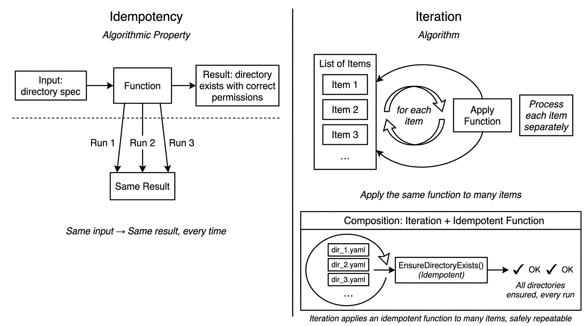

##  

## Chapter 13: Know the Present - Data Collection and Modeling for Control

### 13.1 Evaluating the Environment: Knowing the Present

Do you remember the term \"Knowability\", which I introduced towards the
beginning of the book?

If not, please refresh your memory quickly by scanning Chapter 2.

In order to make efficient use of our resources, we must understand our
resources, in as much depth as possible, in as many categories as
possible, for our given cost-benefit requirements, to meet our goals.
So, we want to know \"almost everything about everything\", while trying
to minimize that into as few things as possible, because keeping track
of more things is more work than keeping track of less things, and so is
less efficient.

The most important thing to know about our Environment is the \"Present
State\". This is the current state of affairs, for everything, as it
actually is. Reality.

When we previously inspected Knowability, as a concept, we stated that
\"reality is not truly knowable\", because there is so much about any
physical thing that we simply cannot measure, and we run everything on
Hardware, which is a physical thing.

So, what we have left is what we can measure, and with these things we
will attempt to \"know the present\".

Knowing the \"past\" is as simple as having snapshots of your
\"present\" still available after time. So any data that is Versioned,
or stored in a Time Series, can be compared against the Present or other
Past Snapshots.

We can think of any of these time slices, or moments-in-time, as a
\"Snapshot\" of all the data of our Environment. With all these data
points from \"now\" and the past, we can understand where we came from
and where we are.

We can further extrapolate, by various statistical means, projections of
how things will be over time. Some things we extrapolate are valid, and
useful information. Other things we can extrapolate, but they are
actually invalid, in that while the mathematics used to calculate them
may be valid, the application of that processing against the given data
set, for our desired results is not a valid combination.

This is important to know, as you can predict some things, such as \"How
many hard disks do we expect to fail next month?\", but you cannot
predict other things such as \"Will this specific hard drive in this
specific machine fail next month?\". No amount of statistical analysis
can answer a useful boolean value there, and a non-boolean result is not
something you can reliably make a decision on in that case.

For example, for a given machine and hard disk device, will knowing its
manufacturing lot number, with the known MTBFs (Mean Time Between
Failures), and the lifespan of the system, and the usage of the disk
(IOPS over time), be able to determine if you must replace that exact
hard disk device, in the next month?

No. That specific hard disk device could fail in the next second, or
could last another 5 years, you cannot give a valid actionable answer to
this question.

However, if we restate the question as, \"How many disks do I need to
have in stock, in order to replace the number of disks in all of my
systems that are likely to fail in the next month?\"

This is a very different question, because it deals with a population of
disk devices, not a single disk device. Across a population this
statistical analysis becomes valid, and it will remain
statistically-true, as long as the numbers you give it are accurate and
correlate properly, which becomes more true as the population size
increases, and as you can improve correlating relationships.

So, with the Physical hardware and other Real things, we cannot know
everything, but with Virtual things: Data, we can know everything, and
Logic where we can know some things (some data), but not others
(halting, etc).

We can gather the exact values for each of the things we wish to know,
and we can store them exactly as how they live in the real world, or can
digest them so that we store a reference or as a reference count, or we
can do anything else we want with them, because they are Virtual Data,
we can know them completely.

And, since we are also inspecting the Physical things with Logic, which
is Virtual, we only use output (Data) from our Logic, so all we know are
Virtual things, not Real physical things. We can use the virtual
knowledge to extrapolate about the physical knowledge we cannot reach
directly.

On the Knowability spectrum, Virtual Data information is Knowable at
1.0: Completely Knowable.

An important note about \"now\". You can never know things in the true
\"Now\" state, because all information arrives to you in a delayed
fashion. It took time for the information to travel from its source, to
you. Whether this is via network packets, visible light, vibration, or
any other method of information propagation, it has a delay before
arrival.

In terms of monitoring, this means that all time series collected data,
and other collected data, is aged. It has an age that is older than 0
seconds, in which that information was \"accurate-as-of-Now\", but the
\"now\" that you are looking at is actually aged information.

The only requirement is that this information is \"new enough\" to be
considered \"now\", but it is never truly \"Now\" that you are looking
at. This is important to keep in mind, since different decisions require
a different level of \"freshness\" of data, to be a decision made from
valid data.

Thought experiment: What do you currently know about your own
environment? What don\'t you know? What did you think you knew before
you read this, but changed your mind after you read it?

How can you use this perspective to improve your efficient use of your
resources?

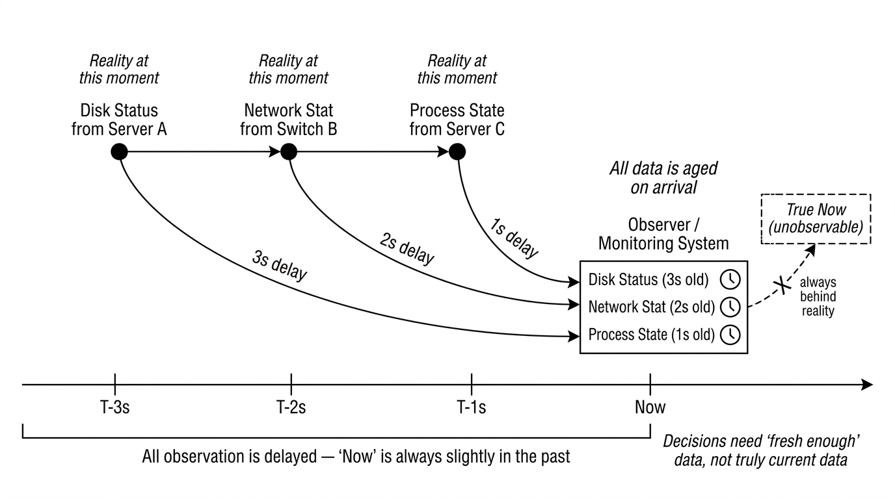

### 13.1.1 When to Use Statistics

When I started this book I made some statistical counters, which are
sections, words and lines written.

I estimated from about 280 sections off of my first 10 sections written,
that I would have about 208,000 words at the end of the book.

I have been checking my percentage complete, such as currently:

Total Sections: 301 Populated Sections: 54 Current Goal: Populate Empty
Sections: 247 (Done: 17.9%)

Lines: 2197

Words: 37668

And the sections and word percentages to completion have almost kept
perfect alignment the entire time I have been writing this work.

Yesterday was:

```python
>>> 33000 / 200000.

0.165
```
And today (with the above quote):

```python
>>> 37600 / 200000.

0.188
```

18.8% word vs 17.9% sections, in terms of estimated completion.

Additionally, I have been adding sections and removing them as I see
fit. I\'m not trying to match this data up, and I\'m not trying to count
words in my sections, I just write what seems to fill the topic section,
and move on.

And yet the percentage completes to my initial rough-calculation of
208,000 words, remaining in-line with the number of sections I have.
This is a topic that apparently works very well with statistical
analysis, and the results are \"amazingly accurate\" as a study of the
population of words and sections I write over time.

Apparently there is some kind of statistical force requiring me to write
a certain number of words a day, a certain number of sections a day, and
so on.

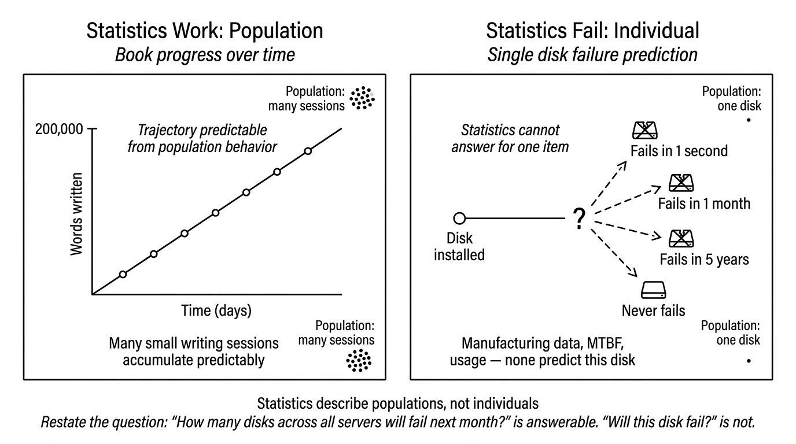

### 13.2 Modeling for Understanding and Control

To create a Model of something, is to try to \"map\" it some way. Models
can be made in any way you can think of, but typical models are things
like:

-   Data Schemas: such as in a relational database.

-   Graphs: nodes and edges which define a sort of topology.

-   Flow Charts, State Machines, Entity Relationship Maps, and other
    process diagrams.

Each type of Model is meant to provide the ability to simulate
something, such as your Operational Environment.

If you were to model your Operational Environment with each method you
could, some of the data would overlap between model-types, and some of
the data would be unique per model-type.

Out of all of these, the most fundamental type of modeling is the data
schema model, and the relational data schema model is the most
comprehensive way to model this data. I can write a relational schema
into a SQL database, or directly into a YAML or JSON file.

This is because all data can be described as collections of fields
(tables), with relationships between them (inter-table field
constraints). Graphs, flow charts, and all other types of models can be
described textually through a schema, and these schemas can be put into
databases such as MySQL, PostgreSQL, Oracle, sqlite, etc.

Once a relational schema is created, for the clearest expression of the
schema, then the schema can be \"de-normalized\" and otherwise
\"un-spun\" so that it can fit into non-relational databases, such as
column-oriented or time series databases. These databases have
advantages for some access patterns (such as mostly-inserting data), but
their schema is less expressive due to this optimization, so it is best
to first understand its model through a relational schema.

Relational schemas can also be written as programming language
\"structs\", or data primitives, and extended into Classes (Object
Oriented style \"structs\"). This may seem like looking at things in a
skewed way, but you can look at these data structures from any direction
to get a better understanding of them.

There are two primary reasons to create models:

-   Creating models to better understand a topic.

-   Creating models to control a set of resources.

Models made for learning are about providing insight, and different ways
of looking at data, and beyond being documentation are generally
disposable, ephemeral, and prone to becoming out of date.

For a given Environment, a model can provide understanding, through
creating a summary of the system trying to be understood. A model like
this can be given variables and used to calculate probabilities, and
perform analysis to aid in making decisions.

This is a very different thing from a model that is created in order to
control resources.

A model created to control resources will share many things with models
made for understanding, in that it is also a summary of the system, but
unlike a model for understanding, a model for control is built to last
potentially for the lifetime of the resources and beyond.

Models for control are intended to make operating an Environment better
by allowing inspection of state and control through the model. A Control
Model must be absolutely accurate, and have highly synchronized
coordination with the Environment itself, or it risks becoming
out-of-sync, and unable to control the Environment.

In contrast, a model for understanding does not need to be highly
synchronized, or absolutely accurate, because it only needs to be \"good
enough\" to provide the required insight. More accurate and more
synchronization can assist in providing better accuracy, but less
accuracy might be sufficient depending on your goals for better
understanding.

Creating models for understanding has a lot of documentation that
already exists about it, and there are many mature areas of study that
currently exist for this.

Modeling is a core skill in Engineering, so if you do not already
consider yourself a proficient modeler, you should take any attempt to
start creating more models when opportunities arise, as practice
improves all skills.

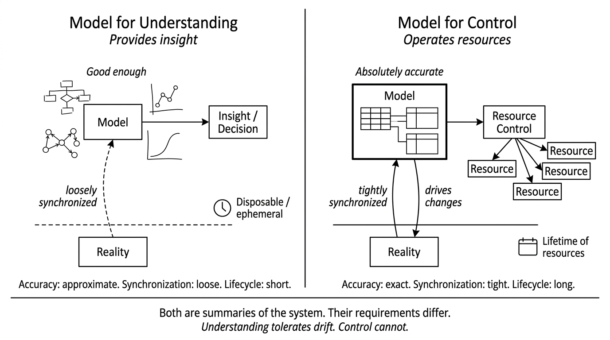

### 13.2.1 Black-Boxing the World with Universal Machines

Once we accept that anything can be modeled, then we can go about
modeling everything that is useful. We can model for Understanding, but
it is better to model for Control, since you get both.

Remember the introduction to Pragmatism? If not, rescan Chapter 6.

Using Pragmatism, we can evaluate anything on only the effects that they
cause. These effects can be turned into schema, as can any additional
data needed to model the effects.

When modeling for Operations, there are 2 main areas of modeling:

-   Model Reality: Describe what exists.

-   Model Effects: Describe what happens.

Remember the \"Universal Machine\" concept? If not, rescan Chapter 6.

Universal Machines map Inputs, Outputs and Side-Effects (IOSE), which is
just a more explicit version of a Function, which maps Inputs and
Outputs, and may perform Side-Effects, but does not explicitly model
them for Control purposes.

Using modeling, by way of Pragmatism, through the Universal Machine
interface, we can model anything and everything. We can Black-Box the
World, or wrap the world full of \"black boxes\", which contain
something that has the signature of the Universal Machine (IOSE).

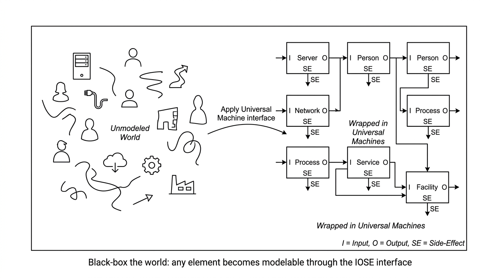

##  

## Chapter 14: Engineering Your Path - Tools, Practice, and Wisdom

### 14.1 Engineering as a Continuous Practice

How does this affect our ability to perform operational duties? How will
it help in automation, and in the life-cycle management of an
operational environment?

Firstly, if one cannot understand something in detail for one\'s self,
then it will be difficult to work with that thing efficiently. I hope I
have shown that being able to slice up a topic in any way you would like
can produce sub-divisions which allow inspection and description, and
which do not change the whole of system, and can be sub-divided further,
or sub-divided differently to provide examples to compare and contract
with one another, and to inspect their relationships and how work might
flow through them.

Once one has an understanding for one\'s self, then the ability to
communicate effectively about the topic becomes a possibility. If I
don\'t understand a topic thoroughly, I will have a very hard time
having a thorough discussion of that topic with someone else, in fact I
believe this is impossible to do. I must have a thorough and
comprehensive understanding for myself if I wish to be able to
communicate with someone else with clarity. They will have a different
understanding than I do, even if we use the same model descriptions,
because we have different experiences and information, but the model and
system view I make and understand myself gives me a map to try to make
analogies complementary to understanding when conversing with others.

Through the power of using systems and the Philosopher\'s Knife, and
black-boxing, I can take topics I do not comprehensively understand, and
transform them into topics I do comprehensively understand (at black-box
level), using a model I have devised as a mechanism for understanding.

By reducing a system or component to its Inputs, Outputs and known
Side-Effects, I can clearly talk about what is going on as it relates to
other systems or components.

If we can come to an agreement on terms and what the Inputs, Outputs and
Side-Effects are for the given systems and components we are talking
about, we have a much higher likelihood of coming to consensus on what
we are talking about, and will be less likely to be talking about
completely different things, while we are trying to communicate about a
problem, or a solution, or whatever.

Additionally, once we can create a system out of any environment and
events, we can begin to model that system so that we can come up with
procedures on what we should do under different circumstances.

For instance, in our web request and logging examples, we have
determined that without log rotation we will fill up available storage
over time, and fail to be able to take more requests (or at least fail
to log new results), and so we are sure to have failures or degradation
on any active systems where this is the case.

From this we can create a policy that requires all services to have log
rotation or truncating configured for any software before it is put into
active service. We can go over the results we will achieve without this,
and determine that these are not the results that we want, and come up
with a test for whether this is enacted on a given server to ensure that
we have done this work, and have protected ourselves from this
deterministic outcome.

Let\'s create an event that occurs and exercises these components, as a
sequence:

-   An end-user requests a file from the remote web server:
    [[http://www.domain.com/images/unstoppabletrex.png]](http://www.domain.com/images/unstoppabletrex.png)

-   The request performs operations outside of this system (LAN,
    routing, DNS, etc), but eventually opens a TCP socket to port 80 on
    the web server. The web server and the end-user now have a
    persistent session to communicate bidirectionally.

-   The end-user requests the URL specified above (broken into URI and
    Header sections), and relays any cookie and browser header
    information.

-   The web server accepts the input of the request, and goes through a
    process of routing the request internally, where it matches the
    domain in the URL domain or Host Header value and any other Headers
    it processes, and in this case then determines if there are any
    directory modifications to look for the static file.

-   Having determined what the path of the static file is on the local
    file system, if the file exists, the web server opens the file,
    reads it, and relays the data into the content section of the HTTP
    response. After relaying the contents, it closes the file, creates a
    successful HTTP status code, and returns the results. In this case
    we will assume that HTTP keep-alive is not enabled, and the HTTP
    server will close the connection afterwards.

-   The web server logs the request and successful response, appending
    to its access log on the local file system.

-   The end-user\'s web browser will have received the HTTP response,
    getting the status code and body of the content, and in this case
    will display the image to the screen.

This is one way that a request event could be processed by a web server.
We can similarly create the model of \"the file does not exist\", the
web server may do something similar, except return a 404 File Not Found
static content result.

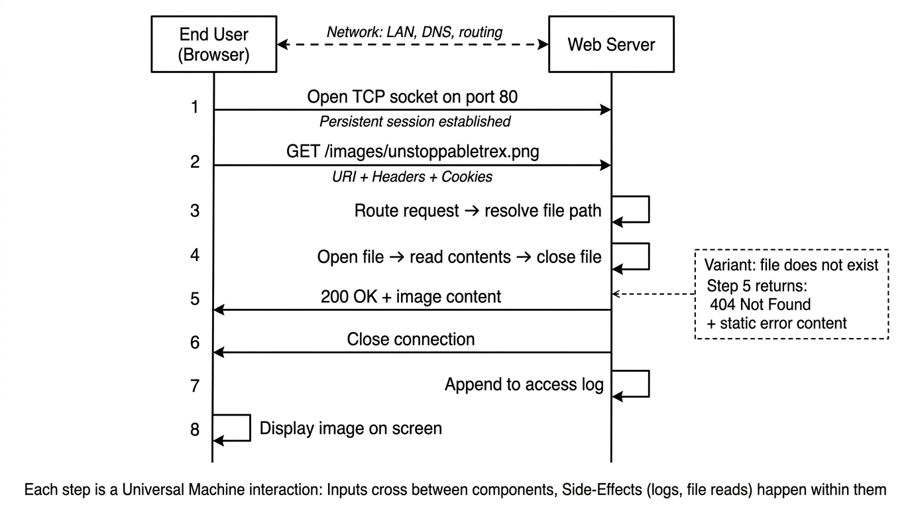

In the case of a more dynamic system, the web server could proxy the
request to an application server, which then makes database calls and
performs formatting logic, and then returns a dynamic result instead of
a static one.

The importance of Systemic Thinking is that there are no gaps. Every
connection that is required is modeled, and if new connections are
required, they are added, and the remaining components need to be
updated so that the System remains Internally Consistent.

Internal Consistency is a very important factor in any system, for it to
be a properly functioning system. Internal Consistency has similarities
to Alignment, where components are aligned with one another for maximum
efficiency, but Alignment requires Internal Consistency, where something
can be Internally Consistent but not "Aligned". In this way Internal
Consistency is a super-set of Alignment, in order to be aligned, things
must be consistent, but things can be consistent and yet not
well-aligned. Automation through Alignment is how you reduce 1 instance
down to 0 instances.

Any time a change is made to any part of a model, the rest of the model
must react accordingly, to stay Internally Consistent. The initial
change may not require any additional changes to remain Internally
Consistent, but it might be that every other component in the model must
also be changed to remain Internally Consistent, this depends on the
Reality that the model is modeling, and the intent of the change being
made.

### 14.2 The Role of Philosophy: Asking \"Why?\"

If you didn\'t know, there are 2 Greek roots in the word \"Philosophy\".

These roots are \"love\" and \"wisdom\", so Philosophy is the \"love of
wisdom\".

I look at Wisdom and Intelligence as different axes.

Wisdom is gained from experience, and has to do with the breadth and
depth of insight into topics, and being able to make judgements that
detail what might be favorable and unfavorable outcomes, and why.

Intelligence I look at in a very different perspective, which is
\"making an action that yields beneficial results for all parties
involved.\" This is "Intelligent Actions" not intelligence as
information processing.

This is not a common definition of Intelligence, but it has a rigid
definition, and comes from a brilliant article written by Carlo M.
Cipolla, a professor of Economic History at UC Berkeley, and is one of
the greatest things I have ever read, and quite literally changed my
life. I saw the world differently after having ingested it, and am much
better for it.

The article is entitled \"*The Basic Laws of Human Stupidity*\", and
while its title and subject matter focus on \"Stupidity\"
(anti-Intelligence), its real function for me was to qualitatively and
quantitatively define what intelligence is. He puts it on a 2D graph,
and charts it, and allows for pinpointing different kinds of Intelligent
and Anti-Intelligent actions. Try not to let the negative sounding name
cause you to avoid this information, it is a very important set of
thoughts he has encoded there-in.

[[http://www.amazon.com/The-Basic-Laws-Human-Stupidity-ebook/dp/B005ZX622C]](http://www.amazon.com/The-Basic-Laws-Human-Stupidity-ebook/dp/B005ZX622C)

[[http://harmful.cat-v.org/people/basic-laws-of-human-stupidity/]](http://harmful.cat-v.org/people/basic-laws-of-human-stupidity/)

These start to illustrate the differences between Intelligence and
Wisdom, to me, and will hopefully (over the course of the material)
become clearer and useful to you as well.

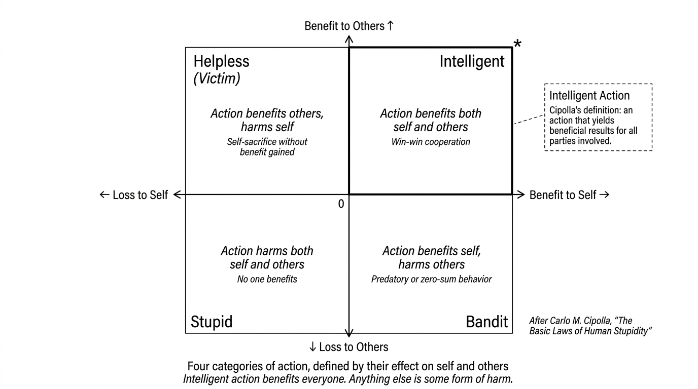

Cipolla's article taught me how to create a personal philosophy of "Win,
Win, Win":

-   I win

-   You win

-   Everybody wins

What does this mean? It means I want to create (engineer) situations
where I am successful, the organization and my team and other teams are
successful, and hopefully this causes a wider amount of external success
(users can use our organizations services to their benefit).

So Philosophy is the \"love of wisdom\", and I love wisdom, so I take it
for that. I orient myself on \"Applied Philosophy\", which is using
Philosophy in a way in which that I can achieve results (internally and
externally) and not merely as a way to win arguments at dinner parties,
or making witty comments that end with \"Do you want fries with that?\".

Another purpose of Philosophy is to be a structure around the question,
\"Why?\"

In much of Engineering we focus on \"How?\":

-   How do I use this library or software?

-   How was this software written?

-   How does this software function?

-   How do I get the result I want?

Philosophy is more angled to:

-   Why should I use this library instead of that other library? How are
    they different? What will be the effect of using one, versus the
    other? If one of them is better suited for my current situation, but
    the other may be better suited to a future situation of mine, when
    would be the time to start switching over? Is it worth doing? Should
    we even be doing any of this at all?

-   Why was the software written in this way? How was the developer
    trying to allow me to solve problems with it? How can I best use
    this software to work with the way the developer was trying to
    enable me to solve a problem? Between the different ways I could do
    this work, what are the different effects they will cause, and which
    of those do I think will be most beneficial for me?

-   Why am I doing this? What are my goals? How can I define them
    precisely? Is my entire team in agreement with this, as an
    intention? Are we able to communicate effectively, ensuring that we
    understand each other and can work together efficiently? How would
    we know if this is true, and we are succeeding? How can we measure
    that success, and compare it to the goals we wanted to achieve
    before we started?

Philosophy is about depth, and the ability to inspect things from
different angles, and while it may appear on the surface (and is
sometimes explicitly stated) that it is trying to \"define the way
things are\", in actuality the philosophical inspection never ends
(Infinitely Recursive in All Dimensions), and so it does not have the
ability to ever define things \"the way they are\", because it can\'t
stop defining things.

This is a \"Machine\" in which we know will never halt. There is no
final exit or return from Philosophy, it is a rabbit hole that never
ends, and goes as deep as you are willing to look, and the detail
expands to meet any closer inspection. What is true from one
perspective, or frame of values, is false from another. Its flexibility
to reframe data is infinite.

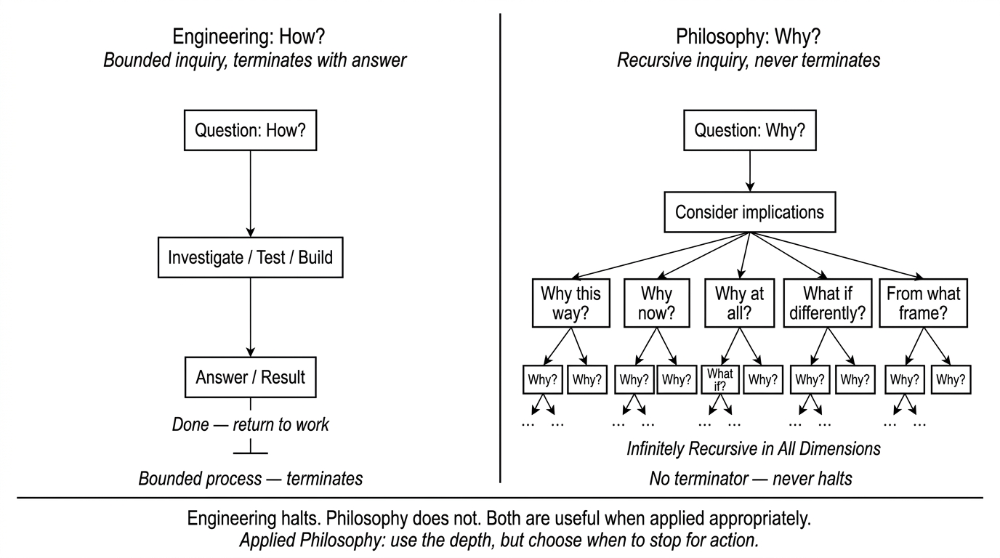

### 14.3 Simplifying SLO, SLA and SLI

Let me give you simplest versions of these:

-   SLO: 100%

-   SLA: No downtime.

-   SLI: Everything you can measure at the threshold where you need to
    alert to ensure no downtime, including the performance for
    "degraded" where it is available but too slow for your users to use
    comfortably.

### 14.4 Old School Reading List

-   OS Internals: [[The Design And Implementation Of The Freebsd
    Operating
    System]](https://www.amazon.com/Design-Implementation-FreeBSD-Operating-System/dp/0201702452/)

-   Networking: [[Interconnections: Bridges, Routers, Switches, and
    Internetworking
    Protocols]](https://www.amazon.com/Interconnections-Bridges-Switches-Internetworking-Protocols/dp/0201634481/)

-   Network Protocols: [[UNIX Network
    Programming]](https://www.amazon.com/UNIX-Network-Programming-Richard-Stevens/dp/0139498761/)

-   Clusters: [[In Search of
    Clusters]](https://www.amazon.com/Search-Clusters-2nd-Gregory-Pfister/dp/0138997098/)

# Conclusion

## What this book didn't cover: The OpsDB

In every organization I worked in I ended up writing automation and data
tracking, and over time these systems became something I would call the
OpsDB, and the original version of this book was building up to
explaining how to build one yourself, and building it in the book
chapters after these foundational chapters.

However, with the success of Kubernetes (K8s) and availability of
similar platforms with different implementations, the original OpsDb
that I have developed over my career was no longer the correct
recommendation for any company to implement. They should implement an
OpsDb that works using their K8s or other system as the Source of Truth
for that area of their operations. K8s does not cover all of Operations,
and K8s itself has many operational requirements that usually require
human labor to satisfy.

The general idea is well known: have a Source of Truth. But, you have
many areas of operations, so how do you wrap them all together to
understand and automate the entire set?

You have an OpsDb that you create by modeling your own organizations
actual operational procedures and data, and then pointing that data at
the real sources or dashboards for them so they can be inspected
directly. This is both live documentation, auditing (beneficial for
SOC2), and pollable for automation. If the OpsDb is not the
authoritative source, it can give the response back for the caller to go
get the correct source, and your automation would standardize on that
process to fetch the valid data from the correct place.

API services can have partitions, so while it may be the first step to
check the API, if the last API N results were cached locally, then local
automation can still run on the latest configurations until the network
partition is restored.

The purpose of the original book was both to establish how to think
about operations, and how to build this OpsDB for yourself, so my
decision was whether to scrap the entire book, or bring you to this
point, and end it. I chose to share the philosophy that created the
OpsDB and related class-of-work eliminations without the How-To on
building your own OpsDB.

Eliminating classes of work doesn't require an OpsDB, just writing loose
scripts with the intent that everything is sealed for that work unit is
enough. Slicing the pie can be done without a universal Source of Truth.
Automation can be created using the SoTs you already have and the
benefits can be gained without having a one-stop-shop. The OpsDB is
better, but it's also a lot of work and these days the higher floor ops
tools (K8s/etc) give you a starting place that didn't exist for most of
my career.

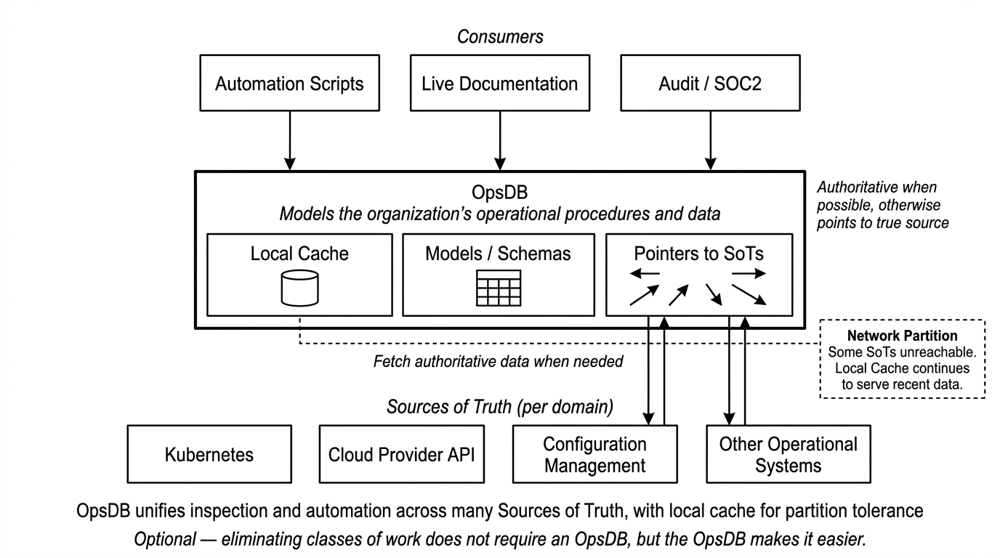

If you are interested in the unfinished original book, you can find it
here:

[[https://github.com/ghowland/OpsEngAuto]](https://github.com/ghowland/OpsEngAuto)

If you want to see an early version of this, and a working example of
Alignment, you can look at my Red Eye Monitor design for AWS I created
in 2009:

[[https://redeyemon.sourceforge.net/]](https://redeyemon.sourceforge.net/)

## What I hope you take from this book

This is the method that I have developed over 25 years doing operations
and infrastructure engineering work. Operations and infrastructure are
different from products and applications, because they are the
foundation that product services and applications run on.

Services and applications require a substrate, and the infrastructure is
that substrate. You cannot work on the substrate the same way you work
on the things that sit on the substrate. You cannot think about them the
same way, and you can't organize around them the same way.

It takes a specific mentality to focus on operational issues, rather
than features, because an operational issue is "what if X fails" and a
feature is "make Y available".

Every organization is different, every team is different, and you cannot
apply generic advice with a firm hand to unique situations. You need to
understand your unique problems, your unique priorities, and focus on
solving them in a way where you have less work to do tomorrow than you
did today, even through growth. That is the operational discipline I
have developed and am trying to pass on with this book.

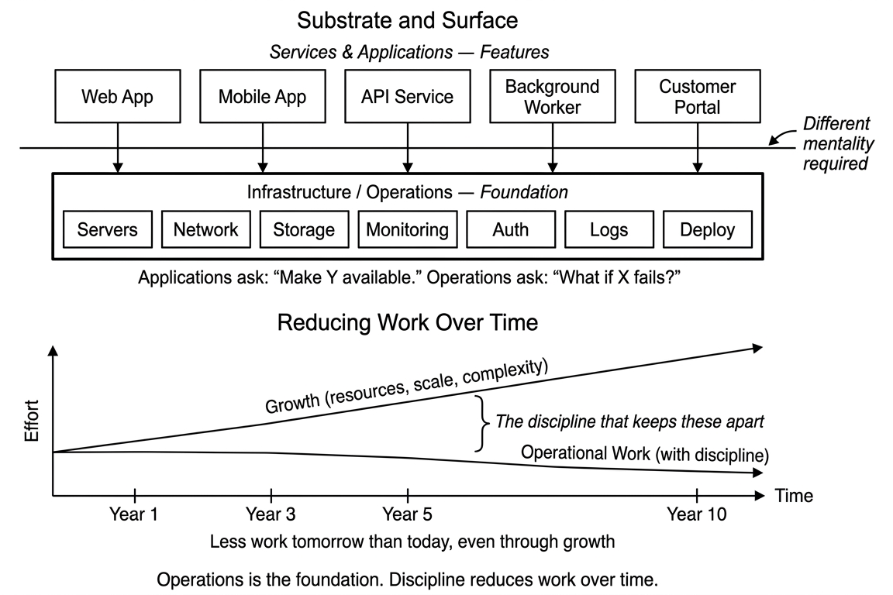

### Discord Server

Join the Discord server and chat about the book concepts. Find peers and
have engineering discussions about the problems you are solving to help
hone your skills.

If there is enough interest, I will create some events around this to
help with community building:

Old School Ops server:
[[https://discord.gg/Fhhqd338u]](https://discord.gg/Fhhqd338u)


