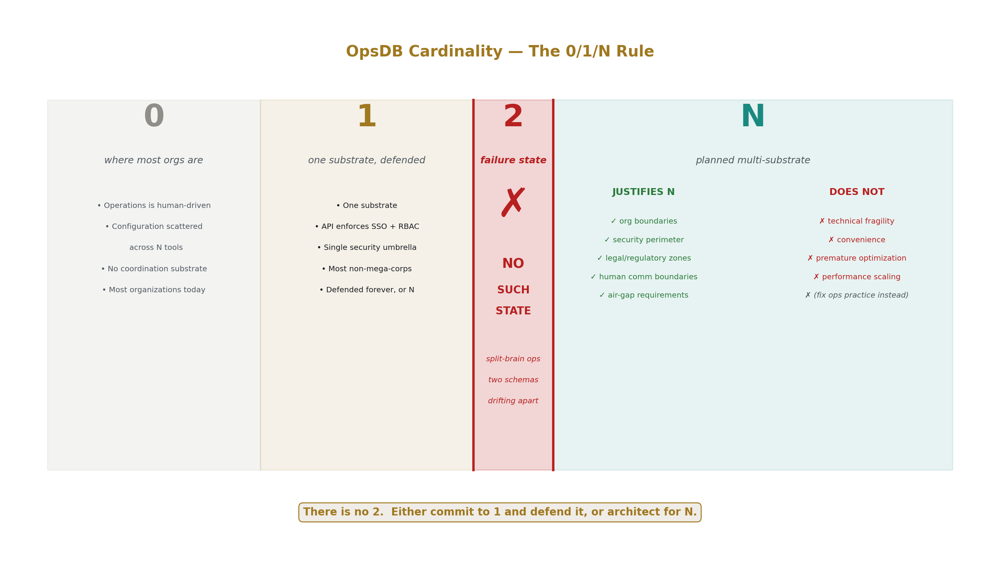
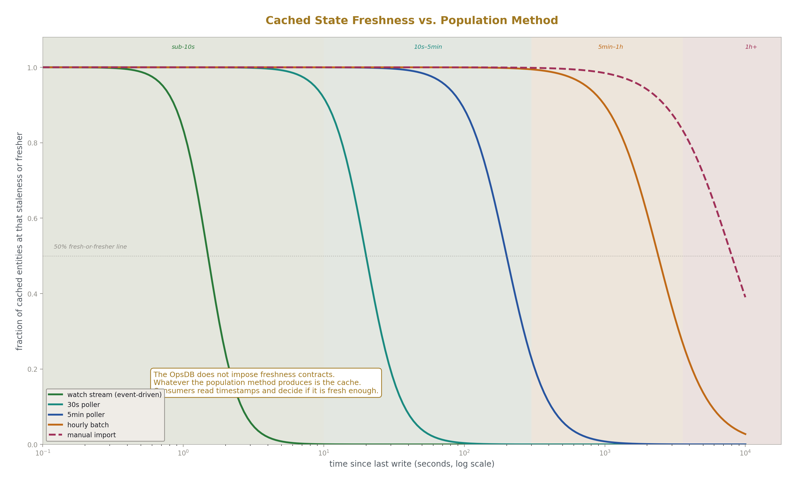
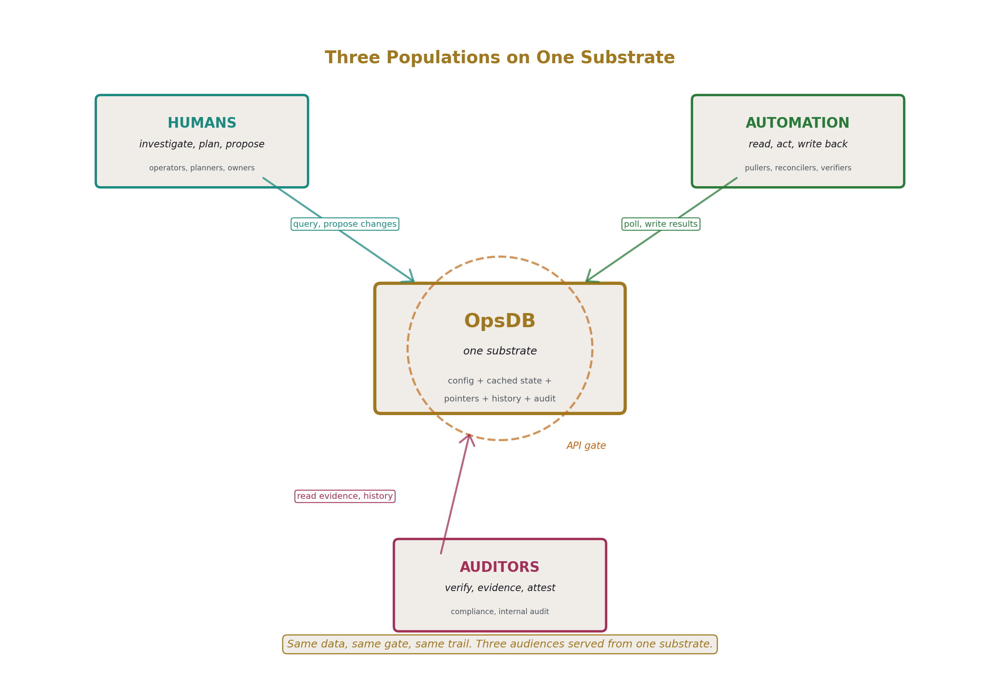
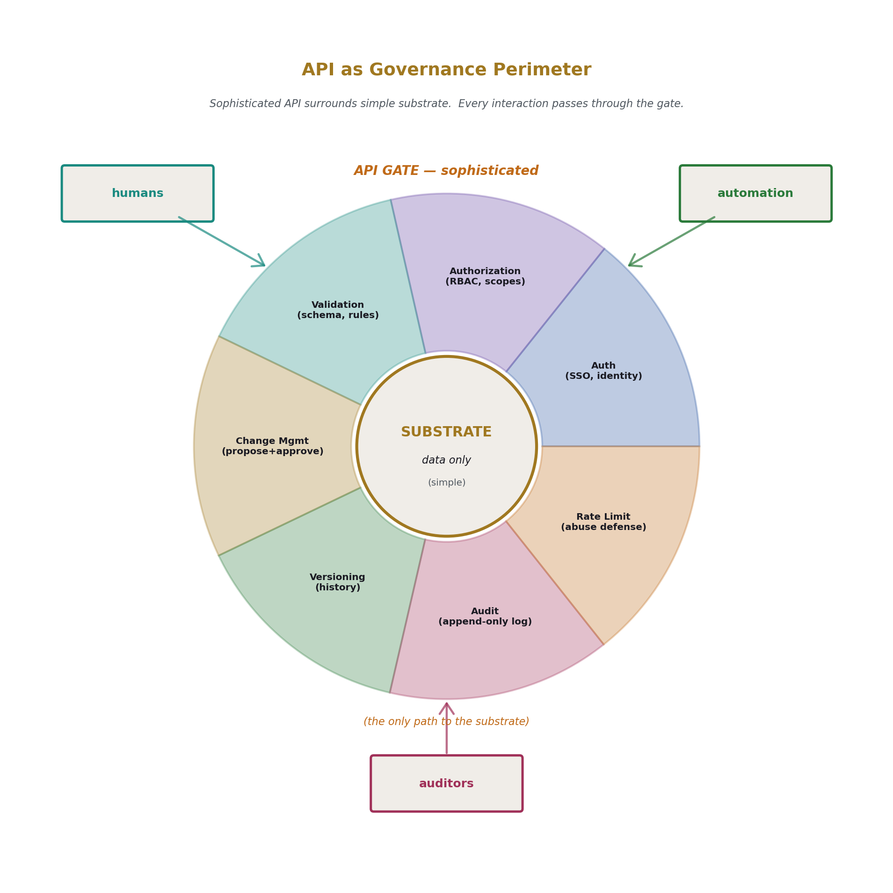
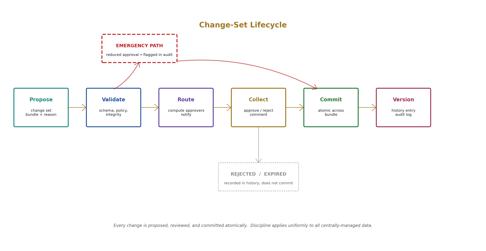
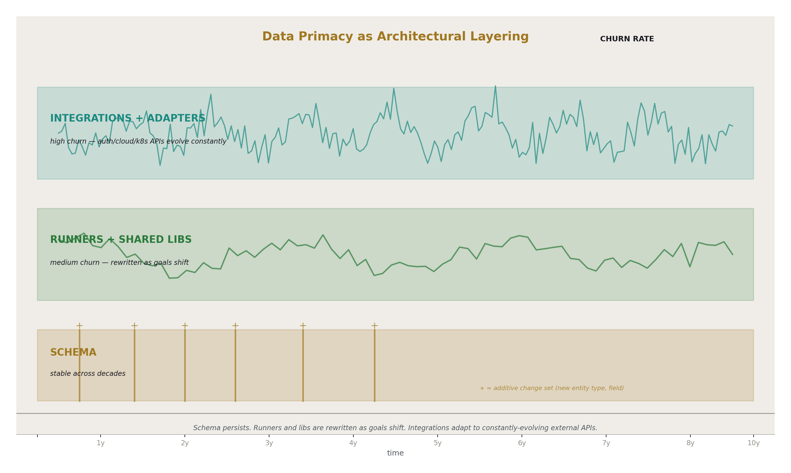
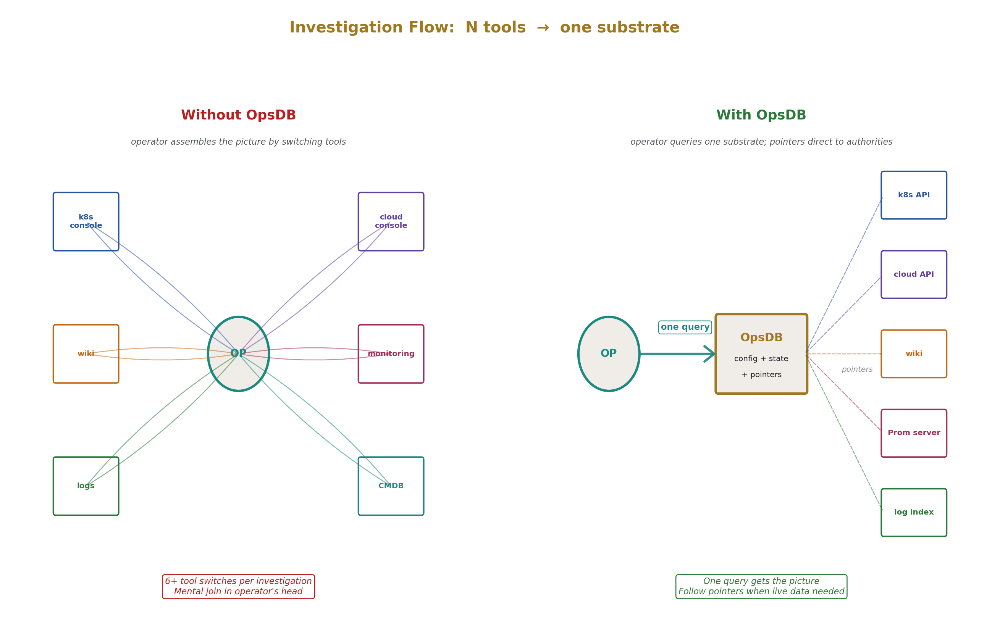
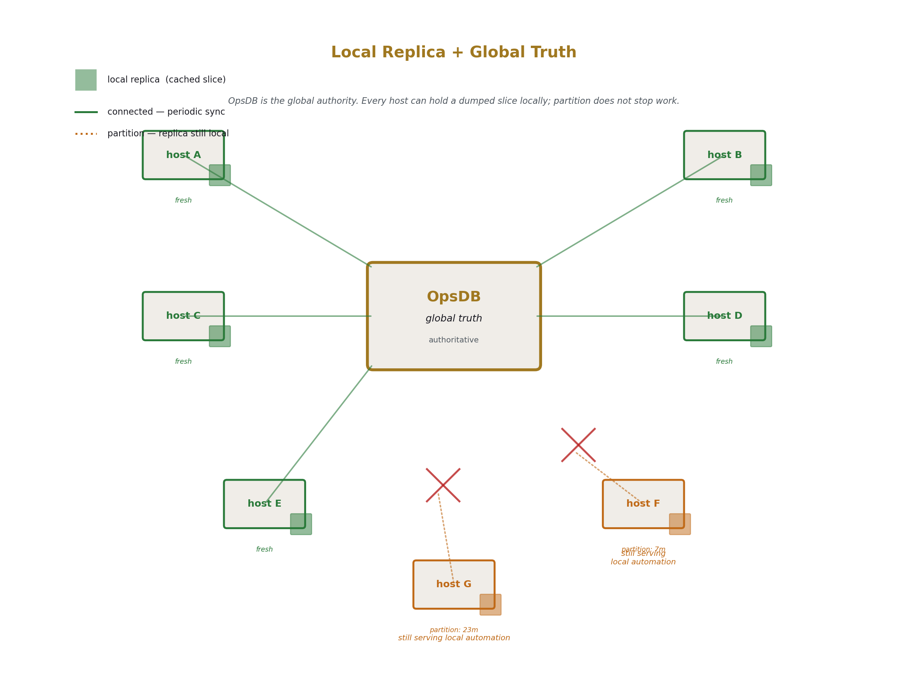

# OpsDB Design
## A Centralized Data Substrate for Distributed Operating Systems

**AI Usage Disclosure:** Only the top metadata, figures, refs and final copyright sections were edited by the author. All paper content was LLM-generated using Anthropic's Opus 4.7. 

---

### Abstract

The OpsDB is a centralized data substrate that serves as the single source of truth for operational reality across a Distributed Operating System (DOS). It holds all centrally-managed configuration, a sized cache of pulled observed state, pointers to authorities for everything else, schedules and policies, runner enumeration and metadata, structured documentation references, and complete history. It is consumed by three populations: humans operating the system, automation runners performing decentralized work, and auditors verifying compliance and control. The OpsDB is passive — it answers queries and accepts writes — while a sophisticated API in front of it enforces authentication, authorization, validation, change management, versioning, and audit.

A Distributed Operating System (DOS) is the conceptual unit the OpsDB serves: any environment operated as a single coordinated system spanning many heterogeneous nodes — production datacenters, staging clusters, corporate infrastructure, employee fleets — where many machines, services, and policies are managed coherently as if they were one large operating system. A DOS is not defined by the underlying substrate (bare metal, virtual machines, Kubernetes clusters, cloud services, SaaS integrations can all participate) but by the operational coordination that unifies them: shared configuration management, shared policies, shared identity, shared monitoring, shared change discipline. An organization may have one DOS or several, and each DOS may have its own OpsDB or share one with others, depending on the cardinality decision specified in §5.

The OpsDB cardinality is 1 or N, never 2: a single OpsDB for organizations that fit under a single security umbrella, multiple substrates for organizations whose structure (security perimeters, legal or regulatory zones, organizational boundaries) prevents a single substrate. This paper specifies the OpsDB's design goals, architectural commitments, content scope, consumer model, the API as security and governance perimeter, and the construction disciplines that produce a stable, queryable, comprehensively-modeled substrate. Implementation choices and schema design are out of scope for this paper.

---

## 1. Introduction

### 1.1 The operational reality this paper addresses

Operations engineering today is fragmented. Configuration lives in many tools — cloud consoles, Kubernetes manifests, Salt states, Ansible inventories, vault paths, DNS zone files, monitoring configurations, identity provider settings. Observed state lives in many monitoring systems — Prometheus instances per region, Datadog accounts per business unit, custom metric pipelines for specific applications. Runbook prose lives in wikis, Notion pages, README files, and shared drives. Audit evidence lives in tickets, screenshots, Slack threads, and email archives.

The human operator's job is to assemble a coherent picture from these scattered sources. When investigating an incident, the operator switches between five or ten tools, holds the picture in their head, and produces a diagnosis. When changing configuration, the operator updates one tool and remembers (or forgets) to update the others. When responding to an audit request, the operator chases evidence across systems and produces a binder.

Automation built against this fragmentation reproduces it. Each script knows one slice of the operational reality and reinvents the rest. Two scripts written by two people for similar purposes will use different conventions, different authentication patterns, different retry logic, and produce different shapes of output. Consistency is impossible because the substrate is inconsistent.

This is the failure state the OpsDB is designed against.

### 1.2 The OpsDB proposition

A centralized data substrate that holds everything operationally meaningful — configuration, cached observed state, pointers to authorities, schedules, runners, metadata, documentation references, history — and serves it through a unified API to humans, automation, and auditors alike.

The OpsDB is the structural commitment to "data is king, logic is shell" applied to operations. It commits to having one place where the operational world is described. It commits to a single gate through which all interactions with that data pass. It commits to making the data structured, typed, and queryable. And it commits to keeping these properties stable across the constant churn of surrounding logic.

The OpsDB is not a tool that an organization adopts; it is a structural commitment that an organization makes. The tooling around it — storage engine, API implementation, runners, shared libraries, dashboards — is replaceable. The commitment to having an OpsDB at all is what produces the operational consequences.

### 1.3 What this paper specifies

The design of the OpsDB. Its goals, its architectural commitments, its content scope, its consumer model, its governance disciplines, and the rules that define what an OpsDB is and what it is not.

### 1.4 What this paper does not specify

Implementation choices are out of scope. The OpsDB can be built on Postgres, Cassandra, FoundationDB, CockroachDB, or other suitable storage engines. The API can be REST, gRPC, GraphQL, or a custom protocol. Deployment topology can be single-region, multi-region, multi-master, or other configurations. These are all valid implementations of the design specified here; none is privileged.

Schema design is out of scope. Specific entity types, relationships, fields, and naming conventions are not given. The paper specifies what the OpsDB *holds* at the level of categories — configuration, cached state, pointers, schedules, runners, metadata, history — but does not provide the table definitions or relational schema.

Specific runner implementations are out of scope. Runners are described as a class of consumer; particular runners (a PVC repair runner, a tape backup verifier, a credential rotator) are not designed.

The paper specifies the design. Building one is a separate concern.

### 1.5 Document structure

Section 2 covers terminology and the DOS context. Section 3 specifies the design goals. Section 4 covers the architectural commitments. Section 5 covers the cardinality rule. Section 6 covers content scope. Section 7 covers the three consumer populations. Section 8 covers the API as governance perimeter. Section 9 covers versioning and change management. Section 10 covers audit and compliance. Section 11 covers runners and shared libraries. Section 12 covers the data flow patterns. Section 13 covers what does not belong in an OpsDB. Section 14 covers the construction discipline. Section 15 closes.

---

## 2. Terminology and context

### 2.1 Distributed Operating System (DOS)

The unit the OpsDB serves. A DOS is any environment operated as a single coordinated system: production, staging, QA, development, corporate infrastructure, employee fleets — anything where many machines, services, and policies are managed coherently as if they were one large operating system spanning many nodes.

A DOS is heterogeneous in substrate. Bare metal hosts, virtual machines, Kubernetes clusters, cloud services, SaaS integrations, network equipment, employee laptops — all can be part of one DOS. What unifies them is the operational coordination: shared configuration management, shared policies, shared identity, shared monitoring, shared change discipline.

A single organization may have several DOS instances. Production is typically one DOS. Corporate infrastructure (internal services, build systems, identity providers) may be a separate DOS or part of production. Employee laptops constitute their own DOS, often managed by IT through different mechanisms but operationally coherent in the same sense. Each DOS has scope and boundaries; each may have its own OpsDB or share one with others, depending on the organization's cardinality decision (§5).

### 2.2 OpsDB

A centralized data substrate, accessed through a sophisticated API, holding all operationally-meaningful data for one or more DOS instances. Passive: answers queries, accepts writes, never invokes work. The OpsDB is named singularly even though an organization may have multiple OpsDBs (the N case, §5); the term refers to the design pattern, not a count.

### 2.3 Runner

A small, single-purpose piece of automation code that consults the OpsDB, performs operational work using shared libraries, and writes results back. Runs on its own schedule on its own substrate. Decentralized — many runners exist, each handling one slice of work, none orchestrating any other.

### 2.4 Authority

The system that owns a particular slice of operational reality. Kubernetes is the authority for workload state in clusters it runs. Cloud control planes are the authority for the cloud resources they provision. Vault is the authority for secret values. The identity provider is the authority for who exists and what groups they belong to. Monitoring systems are the authority for time-series metrics. The OpsDB is the authority for centrally-managed configuration and for the directory of where everything else can be found.

The OpsDB caches data from authorities and points at them for live queries when the cache is insufficient or stale.

### 2.5 Source of truth

For data the OpsDB owns, the OpsDB itself is the source of truth. For data owned elsewhere, the cited authority is the source of truth. The OpsDB is always the source of truth for *what authority owns what* — the directory of authority pointers — even when not the source of truth for the data those authorities own.

### 2.6 Change set

A bundle of N proposed changes to OpsDB data, submitted with a reason, routed for approval, committed atomically when approved. Analogous to a pull request in source control: a coherent unit of intended change, reviewable as a whole, applied as a whole.

### 2.7 Conventions

OpsDB-specific terms in **bold-italic** on first use within a section. Reference to mechanisms, properties, and principles from HOWL-INFRA-1-2026 are noted where relevant; the present paper assumes familiarity with that taxonomy.

---

## 3. Design goals

The goals the OpsDB design is solving for. Each is stated as a claim the OpsDB makes about itself when properly built — not as a feature list, but as a property the design commits to providing.

### 3.1 Single source of truth for operational data

Within a DOS, there is one place to find any operational fact. Either the OpsDB holds the fact directly (centrally-managed configuration, cached observed state) or the OpsDB points at the authority that holds it (the directory of where to find anything not held locally). A human or a script with one connection to the OpsDB can find any operational fact in scope, either by reading it or by following a pointer to the authority.

The consequence: investigation, automation, and audit do not require knowing N tools. They require knowing the OpsDB and using its directory to reach authorities when needed.

### 3.2 Common substrate for humans, automation, and auditors

All three populations query the same data through the same gate. Consistency follows from shared substrate. A human investigating an incident sees the same picture an automation script sees. An auditor verifying a control reads the same evidence the runner that produced the evidence wrote. No population has a privileged separate view; no population needs translation between its language and the others' languages.

### 3.3 Data primacy applied to operations

The OpsDB is data; surrounding logic — runners, shared libraries, pullers, dashboards, integrations — is shell. The OpsDB is the long-lived center; logic churns around it.

This is the central design commitment. Without it, the OpsDB becomes another tool among many, and the fragmentation problem returns. With it, the OpsDB is the architectural anchor that allows everything else to be replaceable.

### 3.4 Comprehensive scope, aggregate construction

The schema models the whole operational reality the organization wants to coordinate. Not server and network only; not Kubernetes only; not cloud resources only. Everything operational — including manual processes, scheduled compliance work, vendor management, contract renewals, employee fleet status, and any other domain the organization performs operationally.

The schema is built incrementally because no team can teleport to a finished schema. But each piece is added with comprehensive thinking — slicing the pie at the level being added, asking what's missing, refining when new things don't fit. The construction is aggregate; the thinking is comprehensive.

### 3.5 Protection of operational data through one gate

The API is the only path to OpsDB data. Authentication, authorization, validation, change management, versioning, and audit are enforced at the gate, uniformly, across all of operations. There is no out-of-band path that bypasses these disciplines.

### 3.6 Stable schema across logic churn

Runners, libraries, Kubernetes APIs, cloud providers, and ops practices change constantly. The OpsDB schema absorbs change additively. Existing data and existing readers remain valid as new entity types, relationships, and fields are added. Removal of schema elements is rare and careful.

The consequence: a runner written against the schema five years ago can still run today against the same schema, even if the surrounding implementation has been entirely replaced.

### 3.7 Queryable history

Every prior state of every centrally-managed entity is reconstructible to the retention horizon configured for that entity. "What did this look like at time T" is always answerable for entities and time periods within retention. Rollback to a prior state is a query plus a change set, not an out-of-band recovery operation.

### 3.8 Partition tolerance via local replicas

Slices of the OpsDB can be dumped to any host or pod, allowing automation to continue during network partitions and bootstrap of disconnected systems. The OpsDB is the authoritative substrate; local replicas are caches with explicit freshness.

### 3.9 Horizontal scalability of substrate

The OpsDB can be horizontally scaled, multi-master, or replicated across regions, without changing its consumer-visible interface. The substrate's scaling characteristics are an implementation choice (§1.4); the design commits to supporting horizontal scale at the architectural level.

### 3.10 Independence from any single authority

The OpsDB is not built on Kubernetes, not built on a specific cloud, not built on any one tool that it might also model. Authorities come and go; the OpsDB outlives them. A reorganization that replaces Kubernetes with a successor platform does not require replacing the OpsDB; the OpsDB's representation of "workload state cached from the workload platform" is updated to reflect the new authority, and the rest of the substrate is unchanged.

---

## 4. Architectural commitments

The structural choices the OpsDB design makes, presented as commitments because they are non-negotiable parts of the design. Violating any of them produces a different system that may be useful but is not an OpsDB in the sense this paper specifies.

### 4.1 The OpsDB is passive

It answers queries and accepts writes. It does not invoke runners, fire triggers, push changes, schedule work, or initiate any activity in the world. The API is the entire interface to the OpsDB, and the API is request-driven.

This is a load-bearing commitment. An OpsDB that pushes work becomes an orchestrator, and orchestrators are stateful, complex, and operationally fragile in different ways than data substrates are. The OpsDB stays simple by refusing to perform actions; runners take responsibility for action.

### 4.2 The API is the only path

No SSH-into-the-database. No out-of-band tools. No shadow paths. Single source of truth requires a single gate enforcing it. If alternate paths exist, the gate's disciplines are advisory rather than enforced, and the OpsDB's claims about access control, change management, and audit become unreliable.

Direct database access exists for substrate operators (DBAs, infrastructure engineers responsible for the OpsDB itself) under separation-of-duties controls. Such direct access is itself audited and limited to maintenance operations that cannot be expressed through the API. It is the exception, scoped narrowly, and visible in the audit trail.

### 4.3 The substrate is independent of the storage engine

The schema is the long-lived artifact. The storage engine — Postgres, Cassandra, FoundationDB, others — is a current implementation choice. The OpsDB is portable across storage engines because the schema is the design.

This commitment shapes both schema design and API design. The schema cannot rely on storage-engine-specific features (full-text search syntax, vendor-specific JSON paths, proprietary indexing) in a way that would prevent migration. The API cannot expose storage-engine semantics that callers would come to depend on.

### 4.4 The API holds all governance

Authentication, authorization, validation, change management, versioning, and audit — all at the gate, all uniform across all data the OpsDB holds. The substrate stores what the API hands it; it does not enforce policies of its own that the API does not also enforce.

This is the right division of labor. The substrate is well-understood (a database). The API is the active layer where governance happens. Concentrating governance at the API means the disciplines are uniform, the implementation is centralized, and the substrate stays simple.

### 4.5 Decentralized work through shared substrate

Many runners on many substrates, each independent, each polling or templated from the OpsDB. The OpsDB is the rendezvous, not the orchestrator.

Runners coordinate implicitly through shared data. They do not message each other directly. They do not depend on each other's runtime presence. A runner that crashes does not affect any other runner; the next cycle of the crashed runner picks up where it left off, reading current state from the OpsDB.

### 4.6 Configuration as data, logic as shell

Schedules, policies, runner enumeration, change management rules, retention policies, escalation paths — all data in the OpsDB. The logic that interprets them lives in runners and the API; both are replaceable; the data persists.

A new schedule format, a new policy expression language, a new approval workflow — these are changes in how data is interpreted. The data they express may be expressible in the existing schema with new conventions, or may require additive schema changes. Either way, the data outlives the logic that processed it.

### 4.7 Service and authority pointers as first-class content

The OpsDB holds the directory of where every operational fact can be found, even when it doesn't hold the fact itself. This is one of the OpsDB's primary functions: to be the place humans and automation go first when they need to know where something lives.

The directory is itself structured data, with its own entity types and relationships. Pointers to Prometheus servers, vault paths, wiki pages, runbook URLs, monitoring dashboards, code repositories — all expressed as typed entities the OpsDB holds.

### 4.8 Local replicas are valid use

Any host or pod can hold a dumped slice of OpsDB data for local automation under partition. Replicas are caches; the OpsDB is authoritative. The replica's freshness depends on when it was dumped or last updated; consumers of the replica decide whether the freshness is sufficient for their purpose.

### 4.9 Schema evolution is a governed change

Changes to the schema itself go through the same change-management discipline as data changes, with stricter rules. New entity types, new relationships, new fields are added through change sets that require approval, are versioned, and are audited.

This commitment prevents schema drift. The schema is the long-lived artifact (3.6); its evolution must be deliberate.

### 4.10 No 2

The cardinality of OpsDBs in an organization is 1 or N. Two is a failure state. This is given its own section (§5) because it is structural enough to warrant separate treatment.

---

## 5. The cardinality rule: 1 or N

### 5.1 The three states

Organizations exist in one of three states with respect to OpsDBs:

**0 OpsDBs.** The state most organizations are in today. Operations is human-driven and ad hoc; configuration lives in N tools; monitoring lives in N other tools; documentation is scattered. This is not a state where everything is automated and there is nothing to coordinate; it is the absence of a coordination substrate.

**1 OpsDB.** The target state for organizations that fit under a single security umbrella. Everyone with operational access can be served by one substrate, with the API enforcing what each population sees and can do.

**N OpsDBs.** The target state for organizations whose structure prevents a single substrate. Multiple OpsDBs, each independent, each with its own scope and security perimeter, possibly with controlled cross-OpsDB references.

### 5.2 The 0/1/∞ principle applied

"There is no 2." Two OpsDBs means split-brain operations: two query surfaces, two schemas drifting, two places for things to be, two governance models, two audit trails. An organization is either committed to 1 (and defends it) or committed to N (and architects for it).

The principle from the taxonomy paper applies directly. An organization that has 1 and adds a 2nd has not just incrementally added capacity — it has changed its operational structure in a way that begins the slide to N without admitting it. If the structure genuinely requires N, plan for N. If it doesn't, refuse the 2nd.

### 5.3 When 1 is the right answer

Organizations small enough that "everyone with operational access" is a single trusted population. The API enforces access control, but the substrate is single. Most non-mega-corp organizations should target this state.

What "small enough" means in practice: the security perimeter is one. There is one identity provider for all operational users (or a small number of federated providers that present a unified view). There is one set of operational policies that applies, with role-based variation. There is one compliance scope, possibly with sub-scopes for sensitive data classes. The organization can answer "who has access to operational data?" with one answer that covers all relevant cases.

This describes most organizations under, roughly, 1000 employees, and many organizations far larger when their structure remains coherent. The threshold is not headcount; it is structural unity.

### 5.4 When N is the right answer

Organizations where structural boundaries make a single substrate impossible:

- **Security perimeters where API access control is structurally insufficient.** Some organizations require that data be physically and operationally not in one place — that even the OpsDB operators cannot see across boundaries, that breach of one substrate cannot expose another. API-layer access control is not sufficient for these threat models; substrate-level separation is required.

- **Legal and regulatory zones with data residency requirements.** GDPR, sectoral compliance regimes, government data classifications, country-specific data sovereignty — all may require that operational data for a given zone reside physically in that zone and not be accessible from outside. One OpsDB cannot satisfy multiple incompatible residency requirements.

- **Organizational boundaries between independently-operating units.** Mega-corps with business units that operate as effectively separate companies. Recently-acquired organizations during integration phases. Federated structures where unified governance is impractical or undesirable.

- **Human communication boundaries.** Teams and organizations that don't share an ops substrate because they don't share processes, conventions, or coordination cost beyond what shared infrastructure would impose. Two organizations under one corporate roof that each operate independently are better served by separate OpsDBs than by a shared one neither would use coherently.

- **Air-gap requirements.** Classified environments, high-security industrial control systems, or other contexts where the operational substrate must be physically isolated from networks that would reach a shared OpsDB.

### 5.5 Reasons that justify N

Summarized: structural boundaries grounded in *who the humans are* and *what rules apply to them and their data.* Org structure, security perimeters, legal/regulatory zones, human communication boundaries, air-gap requirements.

### 5.6 Reasons that do not justify N

**Technical fragility.** "We need a separate OpsDB to protect prod from corp tooling experiments" or "we need to isolate so a bad migration can't take everything down." These are not structural reasons. They are signs of inadequate ops practice. If migrations corrupt the database or queries take down production, the fix is competent operations, not architectural fragmentation. Splitting will not save you from incompetence; competence is required regardless.

**Convenience.** "Two would be easier to manage." Convenience is not a structural argument. Splitting introduces operational overhead — two query surfaces, two schemas, two governance models — that exceeds any convenience gained unless real structure forces it.

**Premature optimization.** "We might need to split eventually." Stay at 1 until structure forces N. Architectures designed for hypothetical futures often miss the actual future and pay overhead for a split that is never needed, or pay overhead for a split that is needed differently than imagined.

**Performance scaling.** "One OpsDB cannot serve our query load." Horizontal scaling within a single OpsDB (read replicas, sharding by namespace, caching) addresses performance. Splitting for performance is a sign that the substrate's storage engine choice is wrong, not that the cardinality should change.

### 5.7 Defending 1

Once committed to 1, the organization refuses ever to allow a second substrate. The moment a second appears, the organization has either become a structural-split org (and should plan N comprehensively, not bolt on a second) or made a mistake (and should consolidate back to 1). There is no stable "almost 1" state; the second substrate either grows into legitimate N-architecture or it should be removed.

The discipline of defending 1 means:

- Every request for a "small separate OpsDB for our team" is refused unless structural reasons require it.
- The shared OpsDB is improved to absorb the use case the requesting team had — a new namespace, a new entity type, scoped permissions, a new query endpoint.
- The cost of saying yes to a second is recognized as architectural, not just operational. A second is not a small accommodation; it is a step toward N.

### 5.8 Architecting for N

When N is justified, the architecture supports it natively rather than treating each substrate as an island.

**Each OpsDB has its own identity.** Substrates are named, addressable, distinguishable. Cross-OpsDB references include the substrate identifier.

**Cross-OpsDB references are first-class.** Entities can point to entities in other OpsDBs through structured references. The reference is a typed pointer — substrate identity plus entity locator — and is resolvable when the calling context has authorization.

**Federated reads are possible with policy controls.** A query that needs data from multiple OpsDBs can be expressed; the API at each OpsDB enforces what is and is not resolvable from the calling context. Cross-substrate writes are typically not supported; each substrate is its own write authority.

**Same code, same schema, separate substrates.** N OpsDBs do not mean N different OpsDB products. They mean the same OpsDB design instantiated N times, with separate data, separate operators where appropriate, separate networks where required.

**Operators may differ across substrates.** A government-zone OpsDB may have different operators than the commercial-zone OpsDB. The substrates do not share operational personnel where the threat model demands isolation.

---

## 6. Content scope

What the OpsDB holds. The full taxonomy of OpsDB content, presented as categories rather than as a schema.

### 6.1 Centrally-managed configuration

Configuration data the OpsDB owns as source of truth. What the organization has chosen to centrally manage rather than fragment across tools.

This is the foundational category. When the organization decides "this configuration should be coordinated across the DOS," the configuration goes in the OpsDB. The runners that need the configuration read from the OpsDB. Changes to the configuration go through the OpsDB's change-management discipline.

What counts as centrally-managed configuration is an organizational decision, not a fixed list. Network topology, service deployment specifications, on-call rotations, escalation policies, retention policies, alert thresholds, security policies, scheduling rules — anything the organization wants coordinated through one substrate becomes centrally-managed configuration in the OpsDB.

### 6.2 Cached observed state

Pulled snapshots from authorities. The OpsDB does not replace authorities; it caches enough of their data that automation can reason locally without N callouts to N authorities per logic execution.

The cache is sized to the DOS. A small DOS may cache nearly all recent state from its authorities. A large DOS caches a meaningful subset — recent state, important entities, summary statistics. The cache is not a replacement for Prometheus or Datadog; it is enough cached data to support operational reasoning, with pointers to the monitoring system for queries the cache cannot answer.

Freshness depends on the population method. Pullers run on schedules; their cadence determines how recent the cache is. Some authorities support push or watch streams; cache freshness for those approaches real-time. The OpsDB does not impose freshness contracts; it holds whatever the population method produces, with timestamps so consumers know the age of the data they are reading.

### 6.3 Authority pointers

For everything not held locally, the directory of where it lives. The OpsDB knows which Prometheus server holds which metric. Which cluster runs which service. Which vault path holds which secret. Which wiki page documents which service. Which log aggregator indexes which log stream.

Authority pointers are typed. A pointer to a Prometheus metric includes the server identity, the metric name, and any labels that scope the lookup. A pointer to a vault secret includes the vault identity, the path, and the version reference. A pointer to a wiki page includes the URL and the last-verified-valid timestamp.

The directory grows alongside the rest of the OpsDB. As new authorities are integrated, pointers to them are added. As entities are deployed, their pointers to relevant authorities are recorded.

### 6.4 Service and data directory

A specialized form of authority pointer: structured lookup that returns the right coordinate for any operational question.

"Where is this metric?" The OpsDB returns the Prometheus server, the metric name, and the labels needed to query it.

"Where is this log line?" The OpsDB returns the log aggregator, the index, and the query template.

"Where is this runbook?" The OpsDB returns the wiki URL and the last-checked-valid timestamp.

"Who is on call for this service right now?" The OpsDB returns the team, the schedule, the current on-call person, and the page mechanism. (This is dynamic — the answer at 3 AM Tuesday differs from the answer at 3 PM Friday — and the OpsDB resolves the schedule against the current time.)

"Which Kubernetes cluster runs this service?" The OpsDB returns the cluster identity and the API endpoint.

"Where do I configure this service?" The OpsDB returns the config repository, the path, and the deploy method.

The directory is the answer to "where does this live?" for every operational question. Both humans and scripts use the same lookup. The result is the same. Consistency follows from a single shared directory.

### 6.5 Schedules and operational calendars

When runners run. When backups happen. When certificates expire. When credentials rotate. When compliance audits are due. When manual tasks (tape rotations, vendor reviews, license renewals) are scheduled.

Schedules are data. They are queried by the runners and humans that act on them. The schedule for "rotate this credential every 90 days" is a record in the OpsDB; the runner that performs the rotation reads its schedule from the OpsDB. The schedule for "tape backup every third Tuesday" is a record in the OpsDB; the verifier runner that checks whether the backup happened reads its schedule from the OpsDB.

Calendars are a related concept: aggregated views of schedules across entities. "What scheduled operations occur in production this week?" is a query over the schedule data. "What credentials expire in the next 30 days?" is another. The OpsDB serves these queries because the schedule data is structured.

### 6.6 Runner enumeration and metadata

What runners exist. What they do. Where they run. What schedule they follow. What targets they affect. Who owns them. The OpsDB does not hold runner code; it holds runner *deployment metadata*.

Each runner has a record. The record includes the runner's identity, its purpose, the substrate it runs on, the schedule it follows, the entities or namespaces it affects, the team that owns it, the support contacts, and pointers to its documentation and source code (in a code repository, not in the OpsDB).

The runner enumeration is the answer to "what automation exists?" An auditor querying the OpsDB sees the full set of runners and what they do. A human investigating "why did this configuration change?" sees which runner made the change, when, and on whose authority.

### 6.7 Structured documentation metadata

Owners, stakeholders, support teams, common patterns, links to wikis and runbooks, last-reviewed dates. The structured metadata layer over the unstructured prose layer.

The OpsDB does not replace the wiki. The wiki holds the long-form prose, the diagrams, the historical context, the design rationale. The OpsDB holds the *structured metadata* about the entity the wiki documents: who owns it, who's on the support rotation, what runbooks apply, when the runbook was last tested, what dashboards are relevant.

The structured metadata is queryable by both humans and scripts. "Which services have no listed owner?" "Which runbooks haven't been reviewed in 12 months?" "When this service alerts, who do we page?" None of these questions can be answered against a wiki without scraping and parsing. All of them are direct queries against the OpsDB's documentation metadata.

The amount of metadata is the organization's choice. The point is consistency: whatever the organization decides to track, it tracks the same way for all entities of a given type. Inconsistent metadata is worse than no metadata; scripts have to handle the irregularity, and humans cannot trust what they see.

### 6.8 Policies

Security zones, compliance scopes, data classifications, escalation paths, change-management rules, retention policies, schedule policies. All declarative, all data, all queryable.

Policies are expressed against the schema. A change-management rule expressed as "changes to entities of type X in namespace Y require approval from group Z" is a policy record. A retention policy expressed as "keep N=∞ history for entity type X, keep last 90 days for entity type Z" is a policy record. A security zone expressed as "entities matching selector S belong to security zone P, requiring controls C1, C2, C3" is a policy record.

Policies are interpreted by the API (for change management, validation, access control), by runners (for behavior in their domain), and by auditors (for verifying that controls are in place). The same policy data drives all three uses.

### 6.9 Version history

Per-entity history of every change, with attribution, retention configurable per entity type. Discussed in detail in §9.

### 6.10 Audit log

Every API action recorded with identity, timestamp, action, target. Append-only. Distinct from version history: the audit log records *all* actions including reads where required, while version history records *changes* to data. Discussed in §9 and §10.

### 6.11 Change-management state

Pending change sets, approval status, approval records, expired or rejected proposals. The full trail of every change that has been proposed, whether or not it ultimately committed. Discussed in §9.

### 6.12 Cross-OpsDB references (when N)

For organizations operating in the N-OpsDB pattern, pointers to entities in other OpsDB instances. Each reference includes the substrate identity, the entity locator, and may include policy hints about resolution. Discussed in §5.8.

### 6.13 What "all of ops" means

The scope of OpsDB content is not server, network, and cloud only. It is everything operationally meaningful that the organization performs.

Server, network, cloud configuration: yes.

Kubernetes state: yes.

Tape backups (still performed by some organizations for archival or compliance reasons): yes — schedule, verification, evidence, storage location, contract details.

Password rotations and credential management: yes — what credentials exist, when they last rotated, what depends on them.

Certificate inventory and renewal: yes.

Vendor contract management: yes — when contracts renew, what they cover, who owns the relationship.

DNS registration expirations: yes.

Compliance audit calendars: yes — when audits are due, what evidence is required, what's been collected.

On-call schedules: yes — who is on call for what, when.

Office key card deactivation when employees leave: yes (for organizations whose corp-employee DOS includes physical access).

Laptop fleet patch status: yes.

Internal SSL certificate inventory: yes.

Per-team incident response playbook references: yes.

Vendor account credentials and last-rotation dates: yes.

If the organization performs the activity as part of operating itself, the OpsDB can hold its data, and automation can be built against that data. The alternative is paying humans to remember and follow up — which they will sometimes forget, sometimes do inconsistently, and always do at higher cost than a script polling the OpsDB.

This is the *removing classes of work* principle from the taxonomy paper applied through the OpsDB at scale. Every domain of follow-up work that lives in someone's head or in a calendar reminder is a candidate for moving into OpsDB data and automating verification.

Server, network, and cloud is one segment of operations. The OpsDB holds all segments.

---

## 7. The three consumer populations

The OpsDB is not built for one audience. It is built for three distinct populations whose needs converge on the same substrate.

### 7.1 Humans

Operators investigating incidents, planning changes, querying state, building dashboards, reviewing approvals. The OpsDB serves them via UIs (dashboards, query interfaces, approval tools) that sit on top of the API.

Human use of the OpsDB is exploratory. An operator investigating a problem follows pointers, joins across entity types, looks at history, queries observed state and configured state side by side. The schema is structured enough that exploration is possible — the operator can navigate from "this service" to "its dependencies" to "their owners" to "who's on call for those owners." The OpsDB serves human investigation by being the place where the picture can be assembled.

Human use is also proposing changes. An operator who wants to update a configuration submits a change set through the API. The change-management discipline routes it for approval. Once approved, the change commits and runners pick it up. The operator does not edit configurations directly in N tools; they propose changes against the OpsDB.

### 7.2 Automation

Runners performing operational work. They read OpsDB to know what to do; they write back to record what they did. Pullers populate the cache; consumers read the cache. Reconcilers compare desired and observed state; verifiers check that scheduled work happened.

Automation use of the OpsDB is structured. Each runner queries for specific data shapes, performs specific work, and writes specific results. The runner's interaction with the OpsDB is narrow — it does not need to navigate the full schema, only the parts relevant to its purpose.

Automation accounts authenticate with scoped credentials. A puller for Kubernetes state has read access to the cluster API (via the cloud or in-cluster authentication) and write access to the Kubernetes-cached-state slice of the OpsDB. It does not have access to other slices. Each runner's permissions are minimum-necessary.

### 7.3 Auditors and compliance functions

Continuous read access to all evidence, history, and approvals required for compliance regimes (SOC 2, ISO 27001, PCI-DSS, HIPAA, FedRAMP, GDPR, SOX, others). The OpsDB serves as the evidence substrate, not a separate compliance system.

Audit use is verification-oriented. An auditor queries to verify that controls are in place, that they operated as intended over the audit period, and that evidence is complete. The queries are read-only, broad in scope, and focused on history and structure rather than on specific operational decisions.

Auditors do not have a separate substrate. They have read-only scoped access to the same OpsDB the operators and runners use. The same data; a different access role.

Findings result in change sets through the regular API. An auditor identifies a gap; the fix is a change set proposed and approved like any other change. The audit findings, the change sets they produced, and the resulting changes are all in the OpsDB and visible to subsequent audits.

### 7.4 Why one substrate works for three populations

Same data, same gate, same trail. The disciplines applied for one population benefit the others.

Change management for humans also produces audit evidence — every operational change has an approval trail.

Versioning for rollback also produces point-in-time reconstruction for auditors — "what did this look like 90 days ago" is the same query for both purposes.

Schedule data for runners also produces compliance task tracking — "did the quarterly review happen" is a query over the same schedule and history that the runner uses.

Structured ownership metadata for human routing also produces compliance evidence of accountability — "who is responsible for this control" is the same query as "who do we page when this alerts."

The OpsDB is one substrate doing many jobs because the underlying data is the same data and the disciplines compose.

### 7.5 Different access scopes, same surface

SSO and groups and RBAC at the API layer mean each population sees what they're authorized to see. Auditors see read-only access to evidence and history. Operators see scoped read/write to their domain. Runners see narrowly-scoped credentials per runner. All from one API, one schema, one substrate.

The access policies are themselves data in the OpsDB. "Group X has read on entity types A, B, C in namespace N." "Service account Y has read on entity types A, write on entity type B's status fields, and no access to others." These policies are change-managed and audited like any other configuration.

### 7.6 The shared vocabulary effect

Humans, automation, and auditors talk about the same entities, fields, and relationships. No translation between operational language and audit language. Investigation queries, automation queries, and audit queries are different reads against the same data.

This is not a small benefit. The translation cost between operational and audit vocabularies is one of the largest hidden costs of fragmented systems. An operator who says "the service was reconfigured at 2:14 AM" and an auditor who says "an authorized configuration change was applied to the entity" are talking about the same event, but the systems they query may not connect those statements. The OpsDB makes them the same query result.

---

## 8. The API as governance perimeter

### 8.1 The API is sophisticated, the substrate is simple

This is a deliberate division. The substrate is a database; databases are well-understood, with mature tooling, predictable scaling characteristics, and known operational patterns. The API is the active layer where all governance happens.

Concentrating sophistication at the API means:
- The substrate stays portable across storage engines (4.3).
- Governance is uniform across all data the OpsDB holds.
- Substrate operations (backup, replication, sharding, failover) are not contaminated with policy logic.
- The API is the one piece of software that needs to be audited for governance correctness.

The API earns its complexity. The substrate stays minimal.

### 8.2 Authentication

SSO integration with the organization's identity provider. Service-account authentication for runners and other automation. Per-identity attribution of every action.

The API does not maintain its own user database. Authentication is delegated to the identity provider; the API consumes assertions about who the caller is and what groups they belong to. This means:
- Identity changes (new employees, departures, role changes) propagate through the existing identity infrastructure.
- The OpsDB's access control reflects organizational reality without separate maintenance.
- Authentication failures are diagnosed in the identity provider, not in the OpsDB API.

Service accounts are typically managed by the same identity infrastructure, with credentials issued per runner (or per fleet, when granular per-runner identity is impractical). Each runner authenticates with its own identity, and its actions are attributable to that identity in the audit log.

### 8.3 Authorization

Group and role-based access. Per-entity-type, per-namespace, per-field access controls. Read scopes, write scopes, approval-only scopes.

The granularity is fine. A finance auditor may have read access to all entity names but not to all field values (some fields contain confidential information). A service owner may have read on all entities in their service's namespace but write only on the entities owned by their team. A runner may have read on all entities matching its target selector and write only on the status fields of those entities.

Authorization rules are themselves data in the OpsDB. Adding a new role, scoping a new service account, changing what a group can do — these are change sets that go through the change-management discipline (§9). Access policy is not configured in side-channels; it is part of the operational data the OpsDB governs.

### 8.4 Validation

Schema enforcement on writes. Value constraints. Referential integrity. Semantic checks beyond the schema.

Schema enforcement: writes that don't match the schema are rejected. Required fields are present. Optional fields, when present, have valid types.

Value constraints: numeric ranges, enumerations, format validations (URLs, hostnames, identifiers). Expressed in the schema or as data referenced by the schema.

Referential integrity: a relationship that references an entity must reference one that exists. Removing an entity that is referenced fails unless the references are also removed in the same change set or unless the schema explicitly allows dangling references.

Semantic checks: cross-field invariants ("if status is X, field Y must be set"), policy-driven validation ("changes to this field require this metadata field to be updated"), conflict detection ("this proposed change conflicts with another change in flight"). The semantic check layer is where domain-specific rules live, expressed as data the API interprets.

### 8.5 Change management

Proposal acceptance, approval routing, approval collection, atomic commit when approval rules are satisfied. Discussed in detail in §9.

### 8.6 Versioning

Automatic version creation on every committed change. Retention per entity type. Query interface for historical reconstruction. Discussed in §9.

### 8.7 Audit

Every API action recorded with identity, timestamp, action, target, result. Append-only. The audit log is itself OpsDB data, queryable through the API, with appropriate access controls (typically read-only for auditors, append-only for the API itself).

Tamper-evidence is supported through cryptographic chaining where stricter audit requirements demand it. Each audit log entry includes a hash of the previous entry; modification of historical entries breaks the chain and is detectable. Whether this is required depends on the compliance regime.

### 8.8 Rate limiting and abuse detection

Prevents accidental or malicious overload of the substrate. Per-identity, per-endpoint limits. Detection of anomalous query patterns (a service account suddenly making 100x its normal query volume, an analyst running a query that would scan every entity in the OpsDB).

Limits are themselves data in the OpsDB, expressed as policies (§6.8). Adjusting a limit is a change set.

### 8.9 Read scaling and tenant-aware caching

Read-heavy queries served from caches. Caches partitioned by access scope so different callers' views don't bleed.

The cache lives between the API and the substrate. Repeated queries for the same data hit the cache rather than the substrate. Cache invalidation happens on writes (the API knows what changed, invalidates the affected cached views).

Tenant-aware caching means a cached query result for one access scope is not served to a caller in a different scope. The cache key includes the access scope. This prevents the failure mode where a permissive cache hit serves data the caller should not see.

### 8.10 The API is versioned

API contract changes are themselves change-managed. Existing runners and integrations remain valid across API evolution; new capabilities are added through new versions, with old versions supported until consumers migrate.

API versioning is distinct from schema versioning. Schema evolution is additive (new fields, new entity types) and does not typically require API version changes. API versioning addresses changes in the contract — endpoints, request shapes, response shapes, semantics. New API versions are introduced rarely and supported for long periods.

### 8.11 The API is the only path

Reaffirmed: no out-of-band access. The disciplines specified in §8.2 through §8.10 are enforced because the API is the only way to interact with the OpsDB. If alternate paths existed, the disciplines would be advisory, and the OpsDB's claims would be unreliable.

Direct database access exists only for substrate operators under separation-of-duties controls, as noted in §4.2. Any direct access is itself audited and limited to maintenance operations that cannot be expressed through the API. It is the exception, not the alternative.

---

## 9. Versioning and change management

### 9.1 What gets versioned

Centrally-managed configuration. Policies. Schedules. Metadata. Schema itself. Most centrally-owned data — the data the OpsDB is the source of truth for.

When a change is committed to versioned data, a new version is created. The new version becomes current; the old version is retained per the retention policy for that entity type.

### 9.2 What does not get versioned

Cached observed state: too high-volume to version meaningfully, and the authority is the source of truth anyway. Recent observed state is preserved through the cache's natural retention; older observed state can be queried from the authority directly.

Audit log: append-only by construction. Every entry is permanent (within retention); there is no "version" of an audit entry because audit entries are not modified.

Runner result writes: append-only when the result is intended as evidence (the verifier wrote that backup B happened at time T with ID X). Modification of evidence after the fact would defeat the purpose; results are recorded once and not edited.

### 9.3 Retention policy

Per entity type, configurable. Could be infinite (keep all history), time-bounded (last N days), count-bounded (last N versions), or hybrid.

The retention policy is itself data in the OpsDB, expressed as a policy entity. A reaper runner applies the policy: removing versions older than the retention horizon, freeing space.

Different entity types have different retention requirements. Configuration changes for production services may have longer retention than configuration changes for development environments. Compliance-relevant data has retention driven by the compliance regime.

### 9.4 Versioning use cases

**Point-in-time queries.** "What did this look like at time T?" The API queries the version history for the version current at T and returns it.

**Rollback.** "Restore the state from version V." The current version is replaced with the contents of version V — through a change set, with appropriate approval, recorded in history. Rollback is not a side-channel operation; it is a change like any other change.

**Diff between current and prior.** "What changed between version V1 and V2?" The API computes the diff and returns it. Useful for incident investigation and change review.

**Change history per entity.** "Show me every change to this entity in the last 90 days." The API returns the version sequence, each with attribution.

**Audit reconstruction.** "Show me the state of the system at the time of the incident." Queries against the version history at the incident timestamp reconstruct the relevant state.

### 9.5 Change management as a function of the gate

The API doesn't apply changes immediately. It records proposals, routes them for approval, collects approvals, and commits atomically when approval rules are satisfied.

This is a fundamental design choice. Changes are not applied by direct write; they are proposed, reviewed, and committed as a discipline. The API is the place this discipline is enforced, uniformly, across all of operations.

### 9.6 Change set structure

A bundle of N proposed changes with a reason. Atomic commit: either all changes in the bundle apply or none do. Reviewer sees the whole bundle.

A change set includes:
- The proposer's identity (from authentication).
- A human-readable reason for the change.
- The list of proposed changes — each change targeting a specific entity, specifying old and new values.
- Optional metadata: link to incident ticket, link to design document, urgency level.
- The approval rules that apply, computed by the API from the affected entities and the policies in effect.

Once submitted, the change set is recorded in the OpsDB with status "pending." Approvers see it. Approvers act on it (approve, reject, comment). When approval is sufficient, the API commits all changes atomically.

### 9.7 Approval rules

Expressed as data in the OpsDB, against the schema. "Changes to entities of type X in namespace Y require approval from group Z." "Changes to namespace Z require approval from two members of team W." "Changes to compliance-tagged entities require approval from compliance team."

Per-entity-type, per-namespace, per-field rules are possible. The API computes the required approvers for each change set by evaluating the rules against the affected entities.

Approval rules are themselves change-managed. Modifying a rule is a change set with stricter rules of its own (typically requiring approval from the security or governance team).

### 9.8 Approval routing

When a change set is proposed, the API determines required approvers from the rules and notifies them through configured channels (email, chat integration, dashboard alert). The API does not require a specific notification mechanism; it produces notifications and a configured delivery system handles them.

Approvers see pending change sets through a dashboard or query interface. They review the proposed changes, the reason, the diff, the affected entities. They approve, reject, or comment.

### 9.9 Approval collection

Approvers sign off, reject, or comment. Each action is recorded with identity, timestamp, and any commentary. The API tracks whether the approval rules are satisfied.

Insufficient approvals after a deadline (configurable per change-set type) cause the change set to expire. Expired change sets are recorded as expired; they do not commit.

A rejection from any required approver may either block the change set immediately or require additional rejections to fail, depending on the rule. Both patterns are valid; organizations choose per their governance preferences.

### 9.10 What does not go through change management

**Cached observation writes by pullers.** Pullers write cached state with per-source authentication. These writes are not human approval candidates; the world changed, the OpsDB reflects it. The writes are auditable (the audit log records them) but not gated by change management.

**Runner result writes.** A runner that completed its work writes its result. Scoped per-runner credentials authorize the write. The runner is not making a change of intent; it is recording an event. Audit recording, yes; change management approval, no.

**Audit log entries.** Created automatically by the API. Append-only. No approval workflow.

### 9.11 What does go through change management

**Configuration changes.** The config that runners consume.

**Schedule changes.** When runners run, when scheduled work happens.

**Runner registration.** Adding or removing runners from the enumeration.

**Policy changes.** Security zones, compliance rules, escalation paths.

**Metadata changes.** Ownership, stakeholders, runbook links.

**Schema changes.** New entity types, new relationships, new fields, with stricter approval rules.

**Access control changes.** Who has access to what.

The pattern: changes to data that *expresses intent* go through change management. Changes that *record observation* do not.

### 9.12 Emergency changes

Production incidents sometimes require breaking the change-management rules to act quickly. The API supports this with an explicit break-glass path.

An emergency change set is submitted with `emergency=true`. It commits with reduced approvals (typically single-approver, sometimes self-approved by an on-call engineer with elevated rights). The change is flagged as emergency in the audit log. Post-incident, an emergency change review is triggered: the on-call engineer documents the rationale, the change is reviewed retroactively, and any corrective change sets are proposed.

Emergency changes are not invisible. They are recorded as emergency, queryable, and reviewed after the fact. The break-glass path exists because emergencies are real; the discipline around it ensures the path is not abused.

### 9.13 Bulk changes

A single change set can express N changes across many entities. Approved as one bundle, committed atomically. This enables operations like coordinated credential rotation, bulk policy update, fleet-wide configuration shift.

The reviewer sees the full bundle and can spot anomalies. A change set that proposes 200 individually-mundane changes is one approval cycle, not 200. The reviewer catches the case where one of the 200 is wrong before all 200 are applied.

Bulk changes are particularly valuable for operations that must be coordinated. Rotating a credential used by 200 services requires updating all 200 service configurations and the credential itself simultaneously. As a bulk change set, this is atomic; as 201 separate changes, it is not, and the system spends time in a partial state.

### 9.14 Runner-proposed changes

Runners can submit change sets. A runner that detects "this configuration drift should be reverted" can propose the revert. The runner does not apply the change directly to centrally-managed configuration; it proposes the change.

Approval rules apply. For some classes of change, runner proposals may auto-approve (the policy explicitly allows the runner to act unilaterally for that entity class). For others, runner proposals route to humans for approval. The same approval-rule infrastructure handles both cases.

This pattern preserves the change-management discipline even for automation-driven changes. The runner does not have a privileged path; it proposes through the API like any other actor.

### 9.15 Schema evolution

Adding entity types, relationships, or fields is a change set. Stricter approval rules apply — typically requiring approval from a schema steward (§14.12) or governance team.

Schema changes are validated for forward and backward compatibility. New fields are typically optional, so existing data and existing readers remain valid. New entity types are additive. Removing fields or types is rare and requires migration of all consumers.

Schema versions are themselves data. The OpsDB knows what schema version it is at, when it last changed, who approved the change, and what migrations applied (if any). This is critical for audit and for runner compatibility — a runner can verify that the schema version is one it understands before proceeding.

---

## 10. Audit and compliance

### 10.1 Why the OpsDB satisfies audit naturally

Audit needs map cleanly onto OpsDB properties already established for operations. Typed structured data is queryable. Attributed actions answer "who did what." Change approval trails answer "was it authorized." Version history answers "what was the state at time T." Evidence-producing runners answer "did the control operate as expected."

None of these are bolted on. They are native consequences of the architecture.

### 10.2 Continuous compliance vs. periodic review

Auditors query the OpsDB any time. The current state of any control is visible. Compliance becomes a continuous property of the system, not a quarterly project.

This shift is significant. Periodic audit is reactive and expensive: the auditor arrives, requests evidence, the organization scrambles to assemble it from N systems. Continuous audit is proactive and cheap: the evidence is the data, queryable on demand, and the organization sees the same view the auditor sees.

Internal audit can run continuously without imposing operational burden. The same queries an external auditor would run can be scripted and run nightly, with deviations alerting the team. Compliance posture becomes part of the operational dashboard, not a separate concern.

### 10.3 Tamper-evidence

Versioning and audit log together provide point-in-time reconstruction. Optional cryptographic chaining for stricter tamper-evidence requirements (§8.7).

The audit log is append-only by API contract; no API operation modifies historical entries. The substrate enforces this through schema (the audit log is write-once) or through API logic (no endpoint modifies audit entries). For regimes that require cryptographic tamper-evidence, the chaining ensures that any modification to history is detectable.

### 10.4 Attribution

Every API action recorded with identity. SSO mediation means identities are real, not shared. Service account identities are per-runner where granular per-runner identity is feasible.

Shared accounts are an audit-failure pattern. The OpsDB design discourages them at the architecture level: every authentication produces an attributable identity, and the API records the identity on every action. Organizations that have legacy shared accounts can identify them through audit log queries (multiple disjoint operational patterns associated with one identity) and migrate to per-purpose service accounts.

### 10.5 Authorization trail

Change management produces approval records. Who proposed, who approved, when, why. All structured, all queryable.

For each change in version history, the corresponding change set with its approval record is retrievable. An auditor querying "show me every production configuration change in the last quarter and who approved each" gets a structured result, not a scattered set of tickets.

### 10.6 Segregation of duties

Enforceable through change management rules. "Proposers cannot approve their own changes." "Production changes require two approvers from production-ops, neither of whom is the proposer." "Compliance-sensitive changes require approval from compliance, who must not be operations." Rules expressed as data, evaluated by the API.

The rules can be inspected. An auditor querying "show me the segregation-of-duties rules in effect for production" sees the rule data directly. They can verify that the rules match the documented policy and that they are being enforced (the API rejects change sets that violate the rules; the audit log shows no violations).

### 10.7 Evidence production

Verification runners produce records. The tape backup runner records that today's backup happened, the new backup ID, the storage company's confirmation email content, the verification result. The credential rotator records that credential C was rotated at time T, the new credential identifier, the systems updated to use the new credential. The compliance scanner records that policy P was checked against entity set E, with M passing and N failing entities, and a list of failures.

The evidence is the data. There is no separate evidence-collection step where humans gather screenshots and assemble binders. The runners that operate the controls also produce the evidence that the controls operated. The auditor queries the evidence directly.

### 10.8 Mapping to compliance regimes

**SOC 2 trust services criteria** map to OpsDB content categories. Security: access control records, change management, audit log. Availability: scheduled maintenance records, incident records, observed state history. Processing integrity: validation rules, change approval records. Confidentiality: data classification policies, access policies. Privacy: data residency records, retention policies.

**ISO 27001 Annex A controls** map similarly. A.5 information security policies: policy data. A.6 organization of information security: ownership and accountability data. A.8 asset management: entity registry. A.9 access control: access policies and audit log. A.12 operations security: change management, monitoring. A.16 incident management: incident records and response actions.

**PCI-DSS requirements** map to specific entity types in the OpsDB modeling cardholder data scope. Requirement 7 (restrict access by need to know) corresponds to access policy data. Requirement 10 (track and monitor access) corresponds to the audit log. Requirement 11 (regularly test security) corresponds to scheduled scan records and their evidence.

**HIPAA security and privacy rules** map to data classification, access controls, audit logging, and the operational records of the technical safeguards.

**GDPR Article 30 records of processing activities** map to entity records describing data processing operations: what data is processed, for what purpose, by what systems, with what retention, in what jurisdiction.

**SOX IT general controls** map to change management records, segregation of duties rules and their enforcement records, and the audit log demonstrating that controls operated.

The mapping is general: for any regime asking about access, change, evidence, retention, or accountability, the OpsDB has the corresponding data category.

### 10.9 Audit access pattern

Read-only scoped role. The auditor identity has read access to the audit log, version history, change-management records, evidence records, and policy data. They do not have write access to anything except, perhaps, audit findings recorded as their own evidence.

Findings result in change sets through the regular API. An auditor identifying a gap files a finding (recorded in the OpsDB as audit data) and may propose corrective changes through change sets that go through the standard discipline.

### 10.10 Audit-grade properties from regular OpsDB properties

| Audit need | OpsDB property |
|---|---|
| Tamper-evident records | Versioning + audit log + (optional) cryptographic chaining |
| Attribution of every action | API authentication on every write |
| Authorization trail | Change management approval records |
| Point-in-time reconstruction | Version history per entity |
| Control effectiveness evidence | Runner-produced verification records |
| Segregation of duties enforcement | Change management rules + approval records |
| Access review | SSO + groups + queryable access policies |
| Data residency proof | Substrate location + (for N-OpsDB) physical separation |
| Retention policy | Configurable per-entity-type history retention |
| Read-only auditor access | Scoped read role in the API |

None of the right-column items are audit-specific features. They are the architecture's normal properties. Audit consumes the same architecture humans and automation consume.

### 10.11 The compliance posture becomes claimable

Today, an organization tells an auditor "we have change management" and produces process documents and screenshots. The auditor takes the assertions on faith, samples a few changes, asks for the approval evidence, and gets a Slack thread or a ticket excerpt.

With the OpsDB-as-gate, the organization tells the auditor "every change to operational data goes through this gate, here's the schema, here's the change-management rules, here's the query interface — sample any change you want and see the full trail." The evidence is the system itself, not a documentation artifact about the system.

This shifts compliance from "we promise we have controls" to "the controls are mechanically enforced and the evidence is the data." Auditors verify the mechanism once and sample data thereafter.

For SOC 2 and ISO 27001, this is a substantial improvement in audit cost and confidence. For more stringent regimes (PCI, HIPAA, FedRAMP), the OpsDB's structured-data-plus-mechanical-controls approach lines up well with what those regimes actually want — enforced mechanisms, not promised practices.

---

## 11. Runners and shared libraries

### 11.1 Runners as decentralized work

Many small, single-purpose pieces of automation. Each does one thing. Each runs on its own substrate, on its own schedule. The OpsDB knows about each runner; the OpsDB does not invoke them.

This is the work-doing layer of the DOS. The OpsDB is the data layer; runners are the workers. Each runner is small enough to be knowable — a single team can read its source, understand its full behavior, and audit its actions. Many such runners cover the operational space, with the OpsDB coordinating among them through shared data.

### 11.2 Runner deployment patterns

**Polling.** The runner queries the OpsDB at runtime. On each cycle, it fetches its configuration and target data and acts accordingly. Polling runners adapt to OpsDB changes between cycles.

**Templated.** The runner's configuration is written to its host at deploy time, sourced from the OpsDB at template creation. Templated runners do not depend on OpsDB availability at runtime; they read their config from local files. This is appropriate for runners that must operate during partitions or on bootstrap.

**Hybrid.** Templated defaults plus runtime poll for updates. The runner has working configuration baked in but checks for updates. If the OpsDB is reachable, it uses the latest config; if not, it falls back to its templated config and continues operating.

The OpsDB is the source of truth either way. How data reaches the runner is a deployment choice, made per-runner based on its operational characteristics and partition tolerance requirements.

### 11.3 Runner enumeration in OpsDB

Each runner is a record. The record includes:

- The runner's identity (name, version, fleet membership).
- Its purpose (what it does, in human-readable form).
- The substrate it runs on (host, cluster, region).
- The schedule it follows (periodic cadence, event triggers, both).
- The targets it affects (entity selectors, namespaces).
- The team that owns it.
- The support contacts and on-call escalation.
- Pointers to its source code (in a code repository, not in the OpsDB).
- Pointers to its documentation (in a wiki, not in the OpsDB).
- Its history (recent runs, recent results, error patterns).

The runner enumeration is queryable. "What runners affect production?" "What runners haven't run in 24 hours?" "What runners are owned by team X?" All structured queries against the runner records.

### 11.4 Runner code lives outside the OpsDB

The OpsDB holds runner deployment metadata, not runner source code or binaries. Code lives in git, container registries, or wherever code lives. The OpsDB knows the runner exists; the runner knows the OpsDB.

Putting code in the OpsDB would be like putting Unix tool binaries in the OpsDB. The OpsDB is for ops data — config, observed state, pointers, schedules, history. Code distribution is a separate concern with its own well-developed tooling (CI/CD pipelines, container registries, package repositories).

### 11.5 Shared automation libraries

A standardized set of capabilities runners use to act in the world. Examples:

- Connecting to Kubernetes clusters and performing operations (kubectl-equivalent functions).
- Performing cloud operations (AWS, GCP, Azure SDKs wrapped in standard interfaces).
- Accessing vault and other secrets systems.
- Reading from and writing to the OpsDB API (with retry, authentication, error handling standardized).
- Logging and emitting metrics in the standard format the organization uses.
- Retry, backoff, and idempotency-marker patterns.
- SSH and other host-level operations.
- Email, chat, and notification mechanisms.

These are libraries — code modules — not services. Runners import them. They evolve through normal software development practices: version control, code review, testing, release.

### 11.6 Why shared libraries matter

They make runners small and knowable. A runner imports the standard libs and contains only its specific logic. Without shared libs, every runner reimplements basic operations inconsistently — the aggregate failure mode the OpsDB is designed against, recurring at the runner layer.

A runner that does PVC repair, written against standard libs, might be 200 lines of code: 150 lines of specific PVC-repair logic, 50 lines of glue using the standard libs for K8s access, OpsDB read/write, logging, and retry. Without the libs, the same runner might be 1500 lines, with most of those lines being reinvented basics — and 800 of those lines might be subtly wrong in ways that take incidents to discover.

Small runners are auditable. Large runners with reinvented basics are not. The shared library suite is what enables the runner population to remain knowable at scale.

### 11.7 One way to do each thing per DOS

The shared library suite is the framework's enforcement of "one way to do each thing." The framework is one thing; the runners using it are many. Inconsistency at the runner level is fine if the framework is consistent.

This is the principle from the taxonomy paper applied at the runner layer. The point is not that every runner should look identical — they have different jobs and reasonably look different. The point is that *how runners interact with the world* is standardized through the libraries, so failure modes, retry patterns, authentication patterns, and logging patterns are uniform.

### 11.8 Pullers as runners

Pullers — the things that scrape Prometheus, Kubernetes, cloud APIs, and write to the OpsDB cache — are runners. They are not a special category in the architecture. They appear in the runner enumeration alongside fix-PVC runners and verifier runners. Their job is to maintain the cached observed state.

A puller's structure is conventional: scheduled cycle, query the authority using the appropriate shared lib, transform the response into OpsDB schema, write to the OpsDB through the API. The puller has scoped credentials with write access to its specific cached-state slice.

### 11.9 Verifiers as runners

Verifiers check that scheduled work happened or scheduled state is correct. They produce evidence records that auditors and operators read. They are runners, structured conventionally.

The tape backup verifier example: it runs on a schedule (matched to the backup schedule), queries the storage company's API for the recent backup record, queries IMAP for the confirmation email, compares both against the expected backup ID, and writes an evidence record to the OpsDB. Pass or fail, with detail. The auditor querying compliance evidence finds this record. The operator investigating "did Tuesday's backup happen" finds this record.

### 11.10 Reconcilers as runners

Reconcilers compare desired vs. observed state and propose or perform corrective work. They consult the OpsDB for desired state, observed state, and policy, then act through shared libs against the appropriate authority.

A typical reconciler: scheduled cycle, query the OpsDB for entities of its target type with their desired and cached-observed state, compute the diff, for each non-trivial diff decide an action (correct, escalate, ignore for now), execute correct actions through shared libs, write results back to the OpsDB.

Reconcilers are level-triggered (per the principle from the taxonomy paper). They do not depend on event delivery; they react to current state on every cycle. Missed events do not produce missed corrections; the next cycle catches them.

### 11.11 Why this layering is stable

The OpsDB has the data. Runners have the logic. Shared libs have the world-interaction primitives. Each layer evolves independently.

Schema changes are slow — careful, change-managed, additive. The data layer is stable.

Runner code changes fast — runners are small, often rewritten when their domain understanding improves, frequently retired and replaced. The runner layer churns.

Shared libs evolve at their own pace — versioned, tested, released. The lib layer is intermediate.

The stability of the data layer enables fast iteration above it. A runner can be replaced entirely without affecting other runners or the OpsDB. A shared lib can be upgraded across all runners without changing the OpsDB. The schema can absorb new entity types without invalidating existing runners.

This is the data-king-logic-shell pattern instantiated as architectural layers: stable data underneath, churning logic above, with the API as the gate that enforces the boundary.

---

## 12. Data flow patterns

The standard flows of data into, out of, and around the OpsDB. Each pattern is independent; together they describe how the OpsDB participates in operational reality.

### 12.1 Configuration flow

A human or automation submits a change set through the API. The API validates the change set against the schema and policies. The change set is recorded as pending. Approval rules are evaluated; required approvers are notified. Approvers act; the API tracks approvals. When approval rules are satisfied, the API commits all changes in the bundle atomically. The new configuration is current.

Runners read the new configuration on their next cycle. Polling runners get the change immediately on their next poll. Templated runners get the change at next template-and-deploy. Hybrid runners get the change on their next poll if reachable, or fall back to templated config.

The flow is propose → review → approve → commit → consume. Each step is recorded. The full trail is queryable.

### 12.2 Cached observation flow

A puller runner queries an authority — Kubernetes API, cloud control plane API, monitoring system, identity provider, vault. It transforms the response into OpsDB schema. It writes the cached observation to the OpsDB through the API.

The write is authenticated as the puller's service account. It is authorized for the puller's specific cached-state slice. It is recorded in the audit log. It is *not* change-managed; cached observation is not change of intent.

Consumer runners and humans query the cache. The query result includes the observation timestamp; consumers decide whether the freshness is sufficient. If not, the consumer can either query the authority directly (using the OpsDB's authority pointer) or trigger a fresh pull (by submitting a refresh request, which the puller handles).

### 12.3 Reconciliation flow

A reconciler runner reads desired state and observed state from the OpsDB. It computes the diff. For each non-trivial diff, it decides an action.

Some actions the reconciler can perform directly through shared libs against the authority (apply a Kubernetes manifest, update a cloud resource, restart a process). It performs them and writes the result back to the OpsDB.

Some actions require human approval and are submitted as change sets. The reconciler does not act unilaterally on them; it proposes, and humans approve.

Some diffs are not actionable in the moment (the observation is stale and may resolve on its own; the issue is outside the reconciler's scope). The reconciler logs the diff and moves on; the next cycle re-evaluates.

The reconciler's role is to drive observed state toward desired state through the actions it is authorized to take. It is bounded by approval rules, scoped credentials, and policies.

### 12.4 Verification flow

A verifier runner checks that scheduled work happened or scheduled state is correct. It writes an evidence record to the OpsDB: pass or fail, with detail.

The evidence is structured. It includes what was checked, when, what the expected state was, what the observed state was, and the verifier's conclusion. It is written through the API with the verifier's service account credentials.

Auditors and humans query the evidence. "Show me all failed verifications in the last 30 days." "Show me the evidence for backup B's verification on Tuesday." The structured shape makes both queries direct.

Failed verifications can trigger remediation flows: a separate runner or human is alerted, investigates, and either performs the manual operation that was missed or files a change set to update the verification logic.

### 12.5 Investigation flow

A human investigating an incident queries the OpsDB. They start with the symptom — an alert, a customer report, a metric anomaly — and follow pointers to root cause.

"This service is alerting." Query the service entity in the OpsDB. Get the service's current configuration, recent changes, dependencies, owners, on-call.

"Has anything changed recently?" Query the version history for the service entity and its dependencies. Get the recent change sets, the approvers, the reasons.

"Are dependencies healthy?" Query the cached observed state for the dependencies. Get health status, recent metrics summaries, cached probe results.

"Where do I look for more detail?" Query the authority pointers. Get the Prometheus server URL, the log aggregator query, the dashboard link.

"Who do I escalate to?" Query the on-call schedule and the service ownership. Get the current on-call engineer and the team.

Each query is fast because the data is structured and indexed. The investigation flow is bounded by the operator's questions, not by the tooling between them and the answers.

### 12.6 Audit flow

An auditor queries the OpsDB for evidence and historical reconstruction. Read-only access to audit log, version history, change-management records, evidence records, and policy data.

"Show me all changes to entity type X in the audit period." Query version history filtered by entity type and time range.

"For each of those changes, show me the approval record." Join change-management records by change set identity.

"Show me the policy that required approval for those changes." Query the policy data as it was at the time of each change (using version history of the policy itself).

"Show me the verification evidence for control C in the audit period." Query evidence records by control and time range.

The audit flow is read-heavy and broad. The OpsDB's read scaling (§8.9) handles it. Findings result in change sets through the regular API, just as any other change.

### 12.7 Service-pointer lookup flow

A caller — human or automation — asks the OpsDB "where is X?" The OpsDB returns the authority pointer: server, path, identifier, and any access metadata needed. The caller goes to the authority for live data, with the OpsDB-supplied coordinates.

For a human, this might surface as "click here to go to the dashboard" or "the runbook is at this URL." For automation, this is "use this server identity and this path to fetch the live value."

The flow is one query to the OpsDB, one query to the authority. The OpsDB does not proxy the authority; it returns the coordinates. This keeps the OpsDB out of the live-data path for things it doesn't own.

### 12.8 Local replica flow

An operator or runner dumps a slice of the OpsDB to a host or pod. The dump includes the entities, relationships, and recent state relevant to the consumer's purpose. It includes a version stamp indicating when the dump was taken.

Local automation reads the dumped slice during partition. Queries against the local replica are immediate and do not depend on OpsDB reachability.

When connectivity returns, the runner queries the OpsDB for fresh data. The local replica is replaced or updated. Any actions taken during the partition are written back to the OpsDB once it is reachable.

The local replica is a cache, in the taxonomy sense. The OpsDB is the global truth. The local-cache-plus-global-truth principle applies: fast local access for normal operation, fall through to global when needed, partition tolerance through cached state.

### 12.9 Cross-OpsDB flow (when N)

A runner or human queries one OpsDB. The response includes a reference to an entity in another OpsDB. The caller queries the second OpsDB if authorized.

Cross-OpsDB query routing is mediated by policy at the API of each OpsDB. The first OpsDB's API decides whether to include the cross-reference in the response (it might omit the reference if the caller is not authorized to know the other OpsDB exists). The second OpsDB's API decides whether to answer the caller's query (based on the caller's identity and the second OpsDB's policy).

Cross-OpsDB writes are typically not supported. Each OpsDB is its own write authority. Coordinating changes across OpsDBs is done through external coordination (a human filing change sets at each OpsDB, or a runner with scoped credentials in multiple OpsDBs).

### 12.10 Schema evolution flow

A schema change is a change set with stricter approval rules. The proposer specifies the new entity type, relationship, or field; the new schema element's structure; and any migration of existing data required.

Validation checks forward and backward compatibility. Adding an optional field is backward-compatible; existing data without the field is valid, and existing readers ignore the new field. Adding a new entity type is additive. Removing fields or types is rare and triggers compatibility checks against all known consumers.

Once approved, the schema is updated. Existing data conforms or is migrated as part of the change. Existing readers continue to work because changes are additive.

The schema evolution flow is itself versioned and audited. The OpsDB has a record of its schema's evolution: every addition, every modification, the change set that introduced it, the approvers, the rationale.

---

## 13. What does not belong in an OpsDB

The boundary conditions. Things the OpsDB is *not* and *should not become*. Without explicit boundaries, "everything operational" becomes "everything," and the OpsDB drifts into being a poorly-built version of every other system.

### 13.1 Not a wiki

The OpsDB does not hold long-form prose, design rationale narratives, decision documents, or diagrams. It holds *structured metadata* with pointers to those artifacts in the wiki, Notion, or equivalent.

A service entity in the OpsDB has a name, an owner, a team, a dashboard pointer, a runbook pointer, and other typed metadata. The runbook itself — the prose explaining how to handle alerts for the service — lives in the wiki. The OpsDB points at it; it does not contain it.

Free-form text fields exist where appropriate: a description field, a comment field, a change set's reason field. These are bounded — short, focused, structured-around. The OpsDB does not become a dumping ground for unstructured content.

### 13.2 Not a monitoring system

The OpsDB caches observed state but does not replace Prometheus, Datadog, or other monitoring infrastructure. Practical limits prevent storing all monitoring data; the OpsDB holds enough cached data for operational reasoning, with pointers to the monitoring system for live queries.

A typical OpsDB might hold the current value, last hour's summary, and last 24 hours of derived metrics for entities of operational interest. It does not hold the full time-series at every collection interval. For that, the caller queries the monitoring system directly using the OpsDB's authority pointer.

The OpsDB-as-monitoring antipattern is real and tempting. It feels efficient to "just put it all in the OpsDB." It produces a database that doesn't scale, doesn't have monitoring-system query primitives, and competes badly with the actual monitoring system the organization already has. Resist.

### 13.3 Not a code repository

Runner code, shared library code, and infrastructure-as-code definitions live in git or equivalent. The OpsDB holds metadata about these (where the repo is, what version is currently deployed, who maintains it), not the artifacts themselves.

### 13.4 Not a binary distribution system

Runners deploy through normal CI/CD and packaging. The OpsDB knows runners are deployed; it does not ship them. Container registries, package repositories, and equivalent systems handle distribution.

### 13.5 Not an orchestrator

The OpsDB does not invoke runners, fire triggers, push changes, or coordinate work. Runners run on their own schedules through their own scheduling primitives. The OpsDB is consulted by them, not directing them.

Building orchestration into the OpsDB is the most common temptation and the most damaging. It would compromise the passive-substrate commitment (§4.1) and turn the OpsDB into yet another control plane. Resist firmly.

### 13.6 Not a chat system or collaboration tool

Discussion and human coordination happen elsewhere. The OpsDB may hold pointers to discussion threads (the change set's discussion link, the incident channel) but does not host discussion.

### 13.7 Not a ticketing system

Incident tickets, work-tracking, project management belong in their own systems. The OpsDB may reference them (a change set's ticket link, an incident's tracking ID); it does not replace them.

### 13.8 Not a secrets manager

Vault and equivalent systems hold secrets. The OpsDB holds pointers to secret locations, not secret values. The OpsDB knows that "credential C lives at vault path P, version V"; it does not know what credential C is.

This boundary is structural. Secrets have specific access semantics (need-to-know, audit on read, ephemeral retrieval) that secrets managers implement well and the OpsDB does not. Crossing this boundary would weaken both systems.

### 13.9 Not a single point of failure for the world

The world (services, hosts, networks) keeps running when the OpsDB is unreachable. Already-running runners with cached or templated config continue. Authorities continue serving live data to runners that go directly. The OpsDB is the *coordination substrate*, not a runtime dependency of every operation.

If the OpsDB becomes a runtime dependency — if services fail because they can't reach the OpsDB — the architecture is wrong. Runners and services are designed to tolerate OpsDB unavailability through caching, templated configuration, and graceful degradation.

### 13.10 Not a place for ad-hoc text or unstructured data

Everything in the OpsDB is typed, schema-governed, queryable. Free-text fields exist where appropriate (descriptions, comments, change set reasons) but the OpsDB does not become a dumping ground for unstructured content.

If a domain's data is genuinely unstructured, it belongs in a system designed for unstructured data — a wiki, a document store, a search index. The OpsDB references it through pointers.

### 13.11 Not a human-only or automation-only system

It serves three populations equally: humans, automation, auditors. Designs that privilege one — a "machine-readable API" without human interfaces, or "human dashboards" without programmatic access — miss the point.

Both human interfaces and programmatic interfaces are first-class. The dashboards humans use sit on top of the same API runners use. The CLI tools humans use call the same endpoints automation calls. Consistency across access modes is what produces the shared-vocabulary effect (§7.6).

---

## 14. Construction discipline

How the OpsDB is built and grown over time. The disciplines are part of the design because the design is vulnerable to misimplementation without them.

### 14.1 Comprehensive in thinking, aggregate in building

The schema is built incrementally. No team can teleport to a finished schema. But each piece of the build is approached with comprehensive thinking — slicing the pie at the level being added, asking what's missing, refining when new things don't fit.

Comprehensive thinking does not mean comprehensive completion. It means that when a piece is being added, the team holds the whole in mind: where does this fit in the existing structure, what other things might fit alongside it, what's the natural slicing of this domain. The thinking is always at the level of the whole; the building is at the level of the piece.

The opposite — aggregate thinking — adds pieces as needed without considering the whole. The result is a schema that grows but does not cohere. Pieces don't fit; relationships are missing or ambiguous; the schema becomes harder to extend over time, not easier. Aggregate-built schemas reach a point where adding new things requires breaking changes, because the existing structure can't absorb them. Comprehensive-thought schemas can absorb new things indefinitely because the structure was designed to.

### 14.2 Top-level cuts done thoughtfully early

Before populating the schema, identify the major axes. What entity classes exist? What relationship types? What schedule types? What policy types? What evidence types? What history types?

Get the shape right at the top so subsequent additions have a place to fit. The top-level cuts will be refined over time, but they should be reasonable from the start. Random initial cuts force costly refactoring later; thoughtful initial cuts age well.

The top-level cuts cover:
- Entities and their classes.
- Relationships between entities.
- Configuration (what's centrally managed).
- Cached observed state (what's pulled from authorities).
- Authority pointers and the directory.
- Schedules and calendars.
- Runners and metadata.
- Documentation references.
- Policies.
- History and audit.
- Change-management state.

These cuts are general; the specific contents within each cut are domain-specific to the organization. Different organizations will have very different policies, runners, and schedules; the cuts that organize them should be similar.

### 14.3 Slicing the pie as ongoing practice

When a new operational domain is added — a new Kubernetes cluster, a new compliance regime, a new business unit, a new authority to integrate — apply the slicing-the-pie discipline.

What entities does this domain have? What relationships? What schedules? What policies? Where do they fit in the existing schema, or where does the schema need refinement?

Most of the time, new domains find a home in the existing structure. A new Kubernetes cluster is another entity of an existing type, with relationships of existing types. A new business unit is another namespace. A new compliance regime is additional policy data and additional evidence types, both within existing entity classes.

Sometimes the existing structure is insufficient and refinement is needed. A genuinely new entity class (say, the organization is moving into managing a new kind of infrastructure that doesn't fit existing classes) triggers a schema-evolution change set. The refinement is deliberate, change-managed, and adds to the structure rather than fragmenting it.

### 14.4 Schema as the long-lived artifact

Storage engines change. APIs evolve. Runners are rewritten. Shared libraries are versioned. The schema is what persists across all of that.

Schema design decisions have decade-scale consequences. A poorly-named field, an awkward relationship type, a missed dimension of variation — these become part of the operational reality and are expensive to change. Conversely, a thoughtful initial schema accumulates value over time as more runners, more humans, and more auditors come to depend on it.

The schema is not a deliverable that gets done. It is an ongoing artifact that the organization invests in over years.

### 14.5 Adding without breaking

Schema changes are additive when possible. Existing fields and relationships remain valid; new fields and relationships are added. Removal is rare and careful, because every reader must be migrated.

A new optional field can be added without breaking existing readers. A new entity type is additive. A new relationship type is additive. Most schema growth is additive.

When breaking changes are necessary, they are sequenced as: introduce the new structure alongside the old, migrate consumers, deprecate the old, remove the old after sufficient deprecation period. Each step is a change set; the full migration may span months.

### 14.6 Versioning the schema itself

The schema is data in the OpsDB. Changes to the schema are versioned, audited, change-managed, like any other data. The OpsDB has a record of its own evolution.

The schema's history is queryable: when was this entity type introduced? When was this field added? Why? Who approved? Schema decisions are not lost in old documentation; they are part of the operational record.

### 14.7 Resisting fragmentation

The pressure to add a "second OpsDB for this special case" or "side-table for this team's data" is constant. The discipline is to absorb the special case into the existing schema rather than fragmenting.

A team requesting a side-table is solving a problem. The right response is usually to understand the problem and add to the schema what's needed — a new entity type, a new namespace, scoped permissions. Granting the side-table solves the immediate problem but begins fragmentation. Once one side-table exists, others are easier to grant; the OpsDB drifts toward becoming a bag of disconnected stores.

Fragmentation is the failure state the OpsDB exists to prevent. The discipline of resisting it is one of the most important parts of running an OpsDB.

### 14.8 Resisting feature creep

The pressure to make the OpsDB do more — orchestration, ticketing, monitoring, chat — is constant. The discipline is to refuse.

Each pressure has a real motivation. Orchestration would let runners coordinate without polling. Ticketing would let incidents and operational work share a substrate. Monitoring would consolidate observed state with the cached observed state. Chat integration would put discussion next to the changes being discussed.

All of these are bad ideas in the OpsDB. They violate the boundaries (§13). They introduce capabilities that other systems handle better. They expand the OpsDB's responsibility beyond what its design supports. The discipline is to refuse and to direct each pressure to the right system: orchestration via existing tools, ticketing via the org's ticketing system, monitoring via the monitoring system, chat via the chat platform with pointers from the OpsDB.

### 14.9 Investing in the API

The API is sophisticated and continues to grow. New validation rules, new approval workflows, new audit requirements, new query patterns. The substrate stays simple; the API earns the complexity. This is the right place to invest.

API improvements have leverage. A new validation rule prevents a class of error across all of operations. A new approval workflow expresses an organizational policy uniformly. A new query endpoint serves humans, automation, and auditors at once. API investment compounds.

### 14.10 Investing in the shared library suite

Runners are cheap because the shared libs are good. As new operational domains are added, the shared libs grow to cover them. Library quality determines runner quality.

A new shared library — say, a standard interface for a newly-adopted cloud provider — enables a fleet of runners to be written quickly and consistently. The investment in the library is paid back many times by the cheap runners it enables. Skipping the library investment ("just write it inline in the runner this once") creates the divergence that the architecture is designed against.

### 14.11 Documentation as part of the system

The OpsDB's own documentation — how to use the API, how to write runners, how to add to the schema — is operational documentation. It is itself referenced from the OpsDB (in the documentation metadata layer, §6.7).

The OpsDB is self-describing in the sense that querying it surfaces structured information about itself: what entity types exist, what relationships, what runners are running, what policies are in effect. The free-form prose explaining all of this lives in the wiki and is pointed at from the OpsDB.

### 14.12 The role of the schema steward

Some person or team is responsible for the comprehensive coherence of the schema. The schema steward.

The steward reviews schema-evolution change sets. They notice when slicing-the-pie is needed. They resist fragmentation and feature creep. They hold the whole in mind across the many domains the OpsDB covers, ensuring that additions cohere.

Without this role, the schema drifts to aggregate. Each team adds what they need; nobody is responsible for the whole; the schema becomes a collection of side-tables in name only. With the role, the schema accumulates value over time and remains coherent as the organization grows.

The steward role is not a full-time job in most organizations. It is a defined responsibility — a senior engineer or architect who reviews schema changes and helps domain teams shape their additions. It is, however, a continuous responsibility, not an occasional one.

### 14.13 Starting points

A reasonable starting move for an organization adopting the OpsDB design:

1. **Top-level taxonomy first.** Five or six top-level concepts. Get the shape sliced thoughtfully before populating.

2. **Pick a domain that matters.** The most painful or most valuable operational domain. Could be Kubernetes, could be cloud resources, could be tape backups, depending on what the organization actually struggles with.

3. **Slice that domain.** Entities, relationships, schedules, policies, evidence types, authorities. Get the schema right for this domain.

4. **Build the substrate and API.** Pick a storage engine. Build the API with the disciplines (auth, validation, change management, versioning, audit). Build it to be portable across storage engines (4.3).

5. **Build a runner or two in the domain.** Real runners doing real work, reading from and writing to the OpsDB. This forces the schema to be useful, not just elegant.

6. **Do another domain.** Repeat. Notice where the second domain's needs overlap the first — that's where the top-level taxonomy gets refined.

7. **Keep going.** Each domain refines the schema. Each runner confirms the schema is useful.

Eventually the OpsDB covers most operational reality. There is no ceremony of "the schema is finished"; there is just "it covers what matters and absorbs new things cleanly."

The discipline is unchanged from the start: comprehensive thinking, aggregate building, slicing-the-pie when domains are added, resistance to fragmentation and feature creep, investment in the API and the shared libs.

---

## 15. Closing

### 15.1 What this paper specified

The design of the OpsDB. A passive data substrate. A sophisticated API gate. Three consumer populations sharing the substrate. Comprehensive scope across all of operations. The 1-or-N cardinality rule. Decentralized work through shared substrate. Versioning and change management as gate functions. Audit as a native consequence rather than a bolted-on feature. The schema as the long-lived artifact across logic churn.

### 15.2 What it didn't

Storage engine choice, API technology, deployment patterns, schema specifics, runner implementations. These are valid and important concerns but separable from the design. The design specified here can be implemented many ways; this paper does not specify any of them.

### 15.3 The structural claim

The OpsDB is the operational equivalent of "data is king, logic is shell" applied at the architectural level. Data lives in one substrate, structured and governed. Logic — runners, libraries, pullers, dashboards, integrations — churns around it. The substrate is the long-lived center; the surrounding logic is replaceable.

This is the claim that grounds the design. Without it, the OpsDB is one more tool. With it, the OpsDB is the architectural anchor that allows everything else to be replaceable while operations remain coherent.

### 15.4 Why this design works

Single source of truth removes fragmentation. Comprehensive scope makes one substrate sufficient. The API gate makes governance uniform. Decentralized work makes scaling tractable. Three populations sharing one substrate produces consistency across humans, automation, and audit. The 1-or-N rule prevents the failure state of partial centralization. The construction discipline keeps the design's properties intact as the system grows.

Each of these works because of the others. The architecture is internally consistent in the sense that its properties reinforce each other. Change one, and others weaken.

### 15.5 What it asks of the organization

Discipline. The commitment to put operational data in one place, to enforce one gate, to refuse fragmentation, to think comprehensively while building aggregately. The commitment to invest in the API and the shared libraries rather than in side-channels. The commitment to defend 1 or to architect for N, never drifting into 2.

The OpsDB design does not solve organizational discipline problems. An organization without the discipline to maintain a single source of truth, to enforce a single gate, to resist fragmentation, will not succeed in operating an OpsDB. The design rewards organizations that have or can develop the discipline; it does not produce the discipline.

For organizations that bring the discipline, the OpsDB delivers what fragmented operations cannot: coherent automation, continuous compliance, auditable change, replaceable logic over stable data, and the ability to operate the entire DOS as one coordinated system.

---

*End of HOWL-INFRA-2-2026.*
