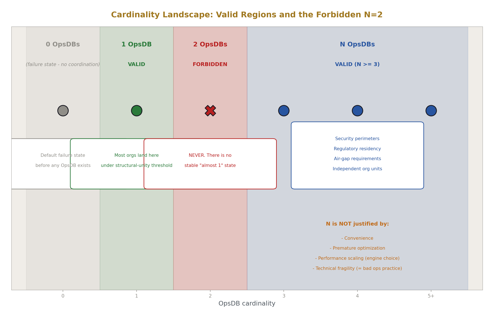
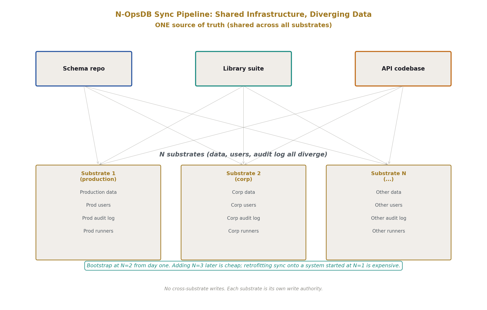
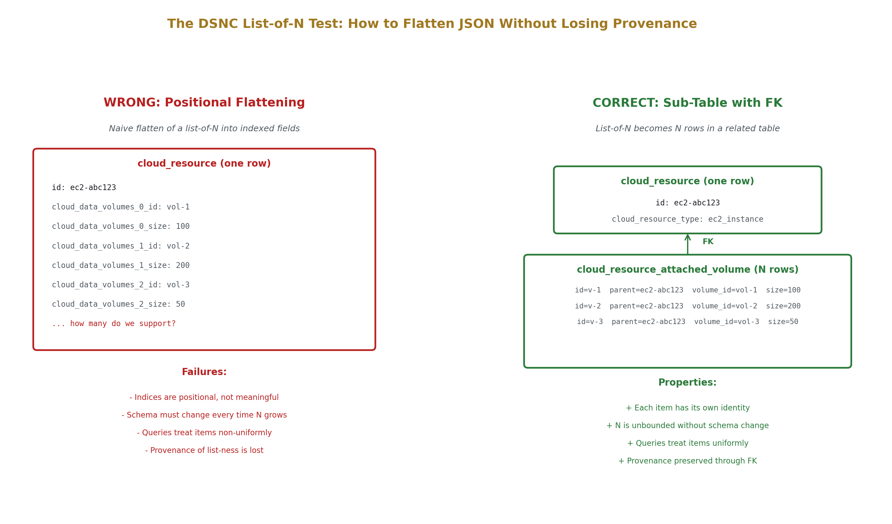
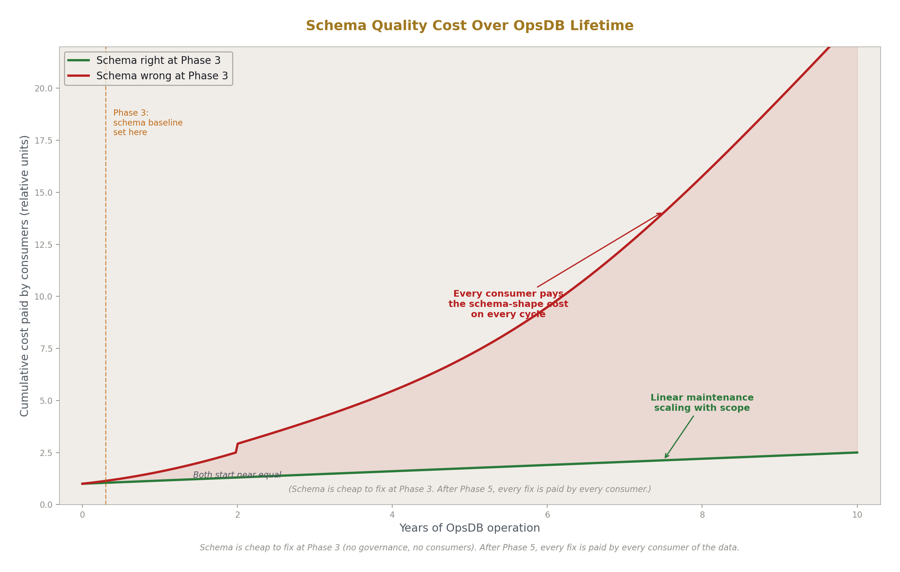
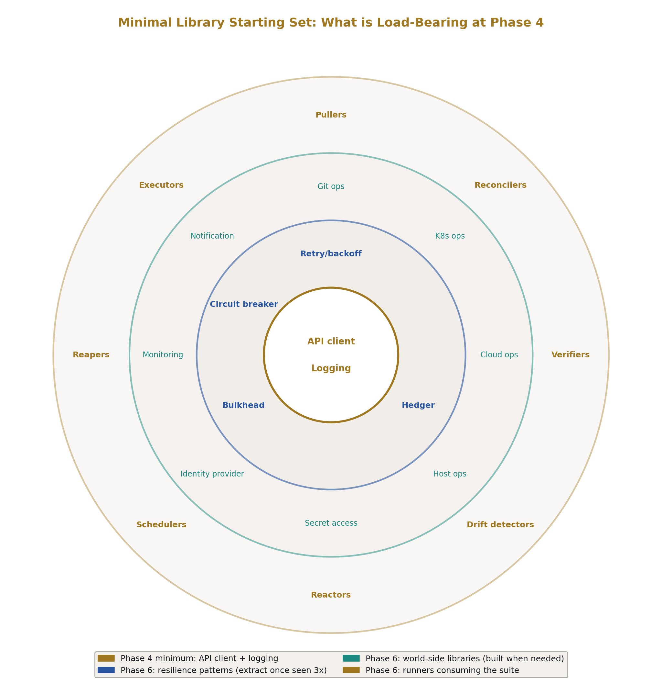
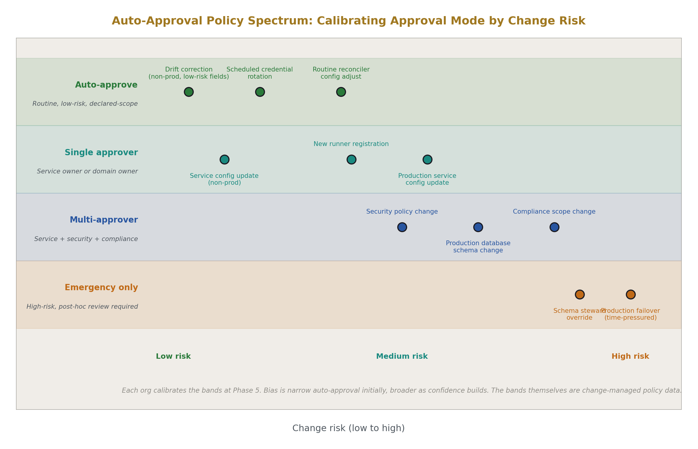
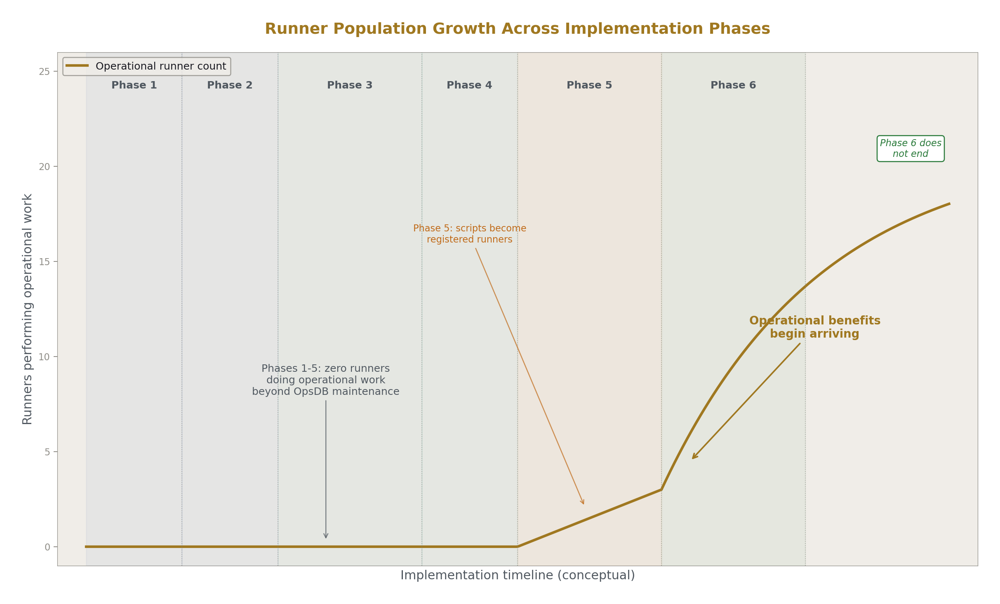
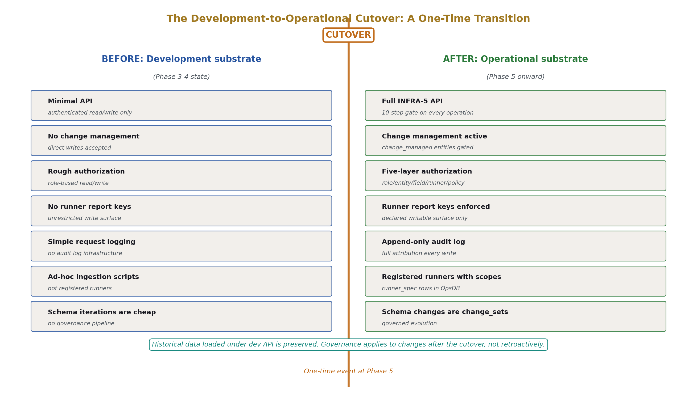

# OpsDB Implementation Path
## A Six-Phase Guide from Specification to Working Substrate

**AI Usage Disclosure:** Only the top metadata, figures, refs and final copyright sections were edited by the author. All paper content was LLM-generated using Anthropic's Opus 4.7.

---

## Abstract

The prior eight papers in the HOWL infrastructure series specify what to build. OPSDB-9 establishes the taxonomy. OPSDB-2 specifies the OpsDB design. OPSDB-4 demonstrates a schema. OPSDB-5 specifies the runner pattern. OPSDB-6 specifies the API gate. OPSDB-7 specifies schema construction. OPSDB-1 introduces the architecture to new readers. OPSDB-8 specifies the shared library suite. None of them say how to actually start.

This paper specifies the implementation path: a defined sequence of six phases that take a team from "we have read the specifications" to "we have a working OpsDB serving real operational data." Each phase makes a specific decision, produces a specific deliverable, defers what the next phase will address, and has a validation criterion that determines whether the team can move forward. The phases are: decide cardinality, determine baseline schema, build the development API and start ingesting data, determine the shared library core, design and implement change management, and add operational logic beyond OpsDB management.

The structural claim is that the architecture is large enough that attempting to build it all at once produces a multi-quarter project that delivers nothing usable until the end. The phased path delivers operational value early and grows into the full architecture; each phase validates the team's understanding before committing to the next. What this paper does not specify: storage engine choice, programming language choices, deployment topology, specific identity provider integration, or implementation timelines. Those are organizational decisions that depend on the team's existing context.

---

## 1. Introduction

### 1.1 What this paper is for

The reader has read OPSDB-9 through OPSDB-8 (or OPSDB-1 alone for the intuition, then the structural papers as needed). They understand the architecture. They want to build it. They need to know where to put the first commit.

OPSDB-2 §14.13 sketched a starting move at the design level: top-level taxonomy first, pick a domain that matters, slice the domain, build substrate and API, build a runner or two, do another domain, keep going. That sketch is correct but high-level. This paper makes it operational: six phases, each with explicit decisions, deliverables, and validation criteria. A team finishing phase N has produced something specific and verifiable; the team in phase N+1 builds on what phase N produced rather than reworking it.

### 1.2 The structural claim

The implementation path is not "implement the architecture top-down." The architecture is too large for that. Building OPSDB-2 first, then OPSDB-4, then OPSDB-5 through OPSDB-8 in sequence produces a system that doesn't deliver operational value until OPSDB-8's runner population is in place — a year or more of work, depending on team size, with nothing usable along the way. Most teams attempting this approach lose attention before reaching the operational benefits.

The phased path delivers usable value early. Phase 3 produces a development substrate that already answers real operational questions through queries against ingested data. Phase 5 produces governance. Phase 6 produces operational benefits that compound from there. Each phase builds on the prior in a way that lets the team validate their understanding before committing to the next phase. The architecture is the destination; the phases are the route.

### 1.3 What this paper specifies

Six phases with their decisions, deliverables, and validation criteria. The cross-cutting concerns the implementation requires: roles, the development-to-operational transition, planning for N when N is the cardinality. The validation discipline that determines when each phase is complete.

### 1.4 What this paper does not specify

Storage engine choice (Postgres, FoundationDB, CockroachDB, others — all are valid). Programming language choices for the API or the runners. Deployment topology. Specific identity provider integration details. Specific authority backends. Implementation timelines (different teams move through phases at different paces; the validation criteria are the right gate, not a calendar).

The paper specifies the path; the team specifies the implementation choices their organizational context requires.

### 1.5 Document structure

Section 2 covers conventions inherited from the prior series. Sections 3 through 8 specify phases 1 through 6. Section 9 covers the cross-cutting concern of roles. Section 10 covers the development-to-operational transition. Section 11 closes.

---

## 2. Conventions

This paper inherits the conventions established across the prior series. Brief recap.

**DSNC.** All schema references use the Database Schema Naming Convention from OPSDB-4. Singular table names. Lower case with underscores. Hierarchical prefixes from specific to general.

**Mechanism vocabulary.** Terms from OPSDB-9's taxonomy.

**Phase numbering.** Phases are numbered 1 through 6. Each phase has an explicit decision, a deliverable, deferred work, and a validation criterion. The numbering is the implementation order; phases are not parallel.

**Validation as gate.** A phase is complete when its validation criterion is met, not when its calendar duration has elapsed. Teams stay in a phase until the criterion is satisfied; teams that move on prematurely build subsequent phases on incomplete foundations.

**Notation.** Phase numbers appear as `Phase N` on first reference within a section. Schema entity types appear in *bold-italic* on first reference. Library names appear in `code style`. Mechanism terms appear in *bold-italic* when introduced in this paper.

---

## 3. Phase 1 — Decide cardinality

The first decision because everything downstream depends on it.

### 3.1 The decision

Per OPSDB-2 §5, organizations exist in one of three states with respect to OpsDBs: zero, one, or many. The "many" case has a structural shape — N OpsDBs deliberately, never two as a failure state. Phase 1 chooses among three working configurations:

**1 DOS, 1 OpsDB.** The simplest case. One operational domain, one substrate. Most organizations under the structural-unity threshold from OPSDB-2 §5.3 land here.

**N DOS, 1 OpsDB.** Several operational domains share one substrate. Production, corporate infrastructure, employee fleet management may each be a DOS (per OPSDB-2 §2.1) but share a single OpsDB scoped by `site` rows. The data is partitioned; the substrate, the API, the runner population, the schema repo, and the library suite are unified.

**N DOS, N OpsDB.** Substrate-level separation per OPSDB-2 §5.4 — security perimeters where API access control is structurally insufficient, legal or regulatory zones with data residency requirements, organizational boundaries between independently-operating units, air-gap requirements.

The decision is made by structural reasons, not by convenience. OPSDB-2 §5.6 enumerates the reasons that don't justify N: technical fragility, convenience, premature optimization, performance scaling. If the organization's reason for choosing N falls in those categories, the decision is wrong.

### 3.2 Why this decision comes first

Cardinality shapes the implementation pipeline before any code is written. A 1-OpsDB pipeline is a single repo, a single deployment target, a single runner population. An N-OpsDB pipeline must coordinate across N substrates from the start: the same schema applied to N OpsDBs, the same library suite consumed by N runner populations, the same API code deployed N times. The work of keeping N substrates in sync is not bolt-on; it is structural pipeline work that affects every later phase.

An organization that chooses 1 and discovers later that N is required has two bad options: consolidate the second substrate back into the first (expensive), or accept ongoing drift between substrates that grew independently (worse). An organization that chooses N from the start designs the sync pipeline before any of the N substrates exists, then operates each substrate as "the same thing with different data" rather than "two systems that share a common ancestor and have drifted."

### 3.3 If you choose N, start with two repos

The minimum case of N is two. Three is a larger case requiring more pipeline work; four and beyond scale further. Starting with two — even when the organization knows it will eventually have three or more — forces the team to act in N-mode with minimal initial setup.

Concretely: from the start of phase 2, the schema repo is structured as one source-of-truth that deploys to two OpsDBs. The library suite has its contracts and implementations versioned for consumption by two runner populations. The API code has one codebase with two deployment targets. Whatever sync, propagation, and version-pinning discipline is needed for N is exercised at N=2 from the beginning.

Bootstrapping at N=2 catches the failure modes early. If the schema sync pipeline doesn't actually propagate cleanly to the second substrate, the team finds out when the substrates are still small and the data drift is bounded. If the library deployment process doesn't handle the second target, the team finds out before the second target is operationally critical. By the time the third substrate is added, the pipeline is mature.

The argument is mechanical: bootstrapping for N=∞ at N=2 costs slightly more than bootstrapping for N=1 at N=1. Bootstrapping for N=∞ at N=3 after starting at N=1 costs much more, because the sync pipeline must be retrofitted onto two substrates that grew independently. Plan for the larger cardinality from the smaller cardinality.

### 3.4 What the N-OpsDB pipeline must do

The pipeline keeps the substrates' shared infrastructure in sync while letting their data and users diverge. The shared infrastructure includes:

- The schema repo (one repo, deployed to N OpsDBs).
- The library suite contracts and implementations (one set, consumed by N runner populations).
- The API code (one codebase, deployed N times).
- The change-management discipline (the same rules apply at each substrate, evaluated against that substrate's data).

What diverges across substrates: the data each holds, the users authorized at each, the audit log of each, the runners deployed against each. Each substrate is its own write authority per OPSDB-2 §5.8; cross-OpsDB writes are not supported; coordination across substrates is through external means (a human filing change_sets at each, a runner with credentials at multiple substrates).

This paper does not specify the pipeline mechanics in detail. OPSDB-2 §5.8 covers the architectural shape. The teams adopting the N pattern will design the specific deployment mechanisms appropriate to their context. The phase 1 deliverable is a documented plan that the pipeline exists; the pipeline itself is built during phases 2 through 5 alongside the substrates it serves.

### 3.5 Phase 1 deliverable

A documented decision: 1 OpsDB, N DOS with 1 OpsDB, or N DOS with N OpsDBs. A documented rationale citing the structural reasons that apply (per OPSDB-2 §5.4 if N, or noting the absence of those reasons if 1). For N cases, a documented plan that the sync pipeline will exist, with the team committed to bootstrapping at N=2 from the start.

No code yet. The decision and its rationale are the deliverable.

### 3.6 Phase 1 validation criterion

The schema steward and the operational lead agree on the cardinality and can name the structural reasons that drove the choice. If the rationale reduces to "two would be easier to manage" or "we might need to split eventually," the decision is wrong per OPSDB-2 §5.6 and phase 1 has not completed. The team revisits, decides correctly, and only then moves to phase 2.

---

## 4. Phase 2 — Determine baseline schema

OPSDB-4 presents one example schema. Phase 2 adapts it to the organization's actual operational reality.

### 4.1 The decision

The decision is what the schema covers at the baseline. Three sub-decisions compose it: how much of OPSDB-4's example schema to adopt directly, what to add for domains OPSDB-4 doesn't cover, and what to validate by hand-loading data before declaring the baseline complete.

### 4.2 Honest scope enumeration

OPSDB-2 §6.13 framed comprehensive scope as everything operationally meaningful that the organization performs. Phase 2's first work is enumerating that scope honestly.

What domains does the organization coordinate? Server fleet? Cloud resources, and which providers? Kubernetes clusters, and which distributions? SaaS integrations? Tape backups? Vendor contracts? Certificate inventory? On-call schedules? Compliance audit calendars? Manual operations? Office access systems for the corporate fleet? Each domain that ends up in the operational picture is a candidate for OpsDB tracking.

The enumeration is not just for completeness. It determines which sections of OPSDB-4 the organization needs and which it doesn't. An organization that doesn't run Kubernetes can omit the K8s section of the schema; an organization without a corporate-fleet DOS can omit the office access modeling; an organization that operates only in cloud can omit the hardware substrate. Conversely, an organization operating regulated medical equipment, financial transaction processing infrastructure, manufacturing systems, or other domains OPSDB-4 doesn't directly model needs to add schema for those domains, applying the comprehensive-thinking-aggregate-building pattern from OPSDB-2 §14.1.

### 4.3 Take more or less than OPSDB-4?

Both directions are valid. The argument is about err-direction.

Trim only what you are certain you don't need. If the organization currently doesn't run Kubernetes but might in two years, leaving the K8s section of the schema declared (with no rows yet) is cheaper than removing it now and re-adding it later. Schema declarations carry no operational cost when there are no rows; adding entire entity classes after the schema is operational is more expensive (it requires schema_change_set governance, validation, and coordinated rollout).

Add what's missing without inheriting OPSDB-4's gaps. OPSDB-4 is one example, not a canonical specification. If the organization's reality includes operational domains OPSDB-4 doesn't cover, those domains get added at phase 2. The DSNC discipline applies; the closed schema vocabulary from OPSDB-7 §6 applies; the patterns OPSDB-4 demonstrates (typed payloads, polymorphic bridges, versioning siblings) apply. The structural patterns transfer; the specific entity types are the organization's decision.

The bias is to include rather than exclude when uncertain. *Schema is cheap to set up early before you have any data into it.* Adding rows to a domain you didn't anticipate later is more expensive than declaring a domain you might grow into.

### 4.4 Validate by hand-loading data

The cheapest validation move and the one phase 2 must not skip. Before any API exists, before any runner exists, the team hand-loads representative data into the schema.

The validation answers four questions:

**Does the schema describe your actual infrastructure?** Take a sample EC2 instance, a sample Kubernetes pod, a sample service, a sample on-call rotation, a sample certificate. Express each as rows in the appropriate tables. Are the fields the schema declares the fields that matter? Are any fields missing? Are any fields present that nobody actually uses?

**Are the FK relationships right?** When you load an EC2 instance row, can you connect it through `megavisor_instance` to a hardware location or cloud account? When you load a service, can you connect it through `service_connection` to its dependencies? Do the substrate-walking queries from OPSDB-5 §9 produce the expected results against your hand-loaded data?

**Are the typed payloads accommodating your real cloud resource types?** OPSDB-4 §6.8 lists common `cloud_resource_type` values. Your organization's actual cloud usage may include resource types that need new discriminator values plus new JSON schemas for `cloud_data_json`. Hand-loading representative cloud resources surfaces the gaps.

**Do the relationships compose under realistic queries?** Load enough data to express a realistic operational scenario — a service with a few packages, deployed to a few hosts, with on-call rotations, dependencies, monitors, runbook references. Then run the queries an investigator would run during an incident. Do the joins resolve? Does the data model actually answer operational questions?

If hand-loading produces awkward fits — fields that don't quite match, relationships that don't compose, types that need to be discriminated differently — the schema needs revision before any code is written against it. Schema is cheap to revise at phase 2; revising it after phases 3–5 is more expensive because data has been ingested under the prior shape.

### 4.5 Phase 2 deliverable

A schema repo per OPSDB-7 with the organization's adapted schema, validated by hand-loaded representative data covering at least three operational domains. The schema steward (per OPSDB-2 §14.12) has been identified and is in the role. For N-OpsDB cases, the schema repo deploys cleanly to two test substrates as the early bootstrap of the sync pipeline.

### 4.6 Phase 2 validation criterion

A representative subset of the organization's actual infrastructure can be expressed as data in the schema with no awkward fits. The relationships connect; the typed payloads accommodate the real resource types; the substrate walks resolve; the operational scenarios the team cares about can be modeled. If anything in the real infrastructure cannot be expressed cleanly, the schema is wrong, not the infrastructure. The team revises the schema until the criterion is met, then moves to phase 3.

---

## 5. Phase 3 — Build the development API and start ingesting data

The phase that turns the schema from declared to populated.

### 5.1 The decision

The decision is to start writing real data into the substrate before the substrate is operational. The substrate at phase 3 is in development — it has a schema, it has a minimal API, it accepts writes — but it does not yet have change management, full authorization, runner report keys, or the other governance disciplines OPSDB-6 specifies. Adding governance before there is data to govern is premature; the development-mode API is what lets the team discover whether the schema works in practice.

### 5.2 Why the API is minimal at phase 3

The phase 3 API supports authenticated reads and writes against the schema with structured error reporting. That is all. No change_set submission flow. No five-layer authorization. No runner report keys. No emergency apply. No bulk operations. No optimistic concurrency. No audit log infrastructure beyond simple request logging.

The reason for the simplification: this isn't operational yet. It's a development substrate where the team validates that the schema can hold real data and that the API's basic shape is right. Adding the full OPSDB-6 governance pipeline at phase 3 means committing to a governance shape before the team has discovered what the data actually looks like. Governance designed against an incomplete understanding of the data will need rework when the data is better understood.

The development API will be replaced (or upgraded substantially) at phase 5. That is expected. Phase 3's API is throwaway in the same way phase 3's ad-hoc ingestion scripts are throwaway — both serve the goal of validating the schema and discovering data shape, then are replaced when the operational disciplines are added.

### 5.3 Bring in your existing data sources

By phase 3 the team has a schema and a minimal API. The work of phase 3 is taking the organization's current operational data sources — cloud control planes, Kubernetes clusters, monitoring systems, vault, identity provider, anything that already produces operational data — and writing their data into the development OpsDB.

This is the puller pattern from OPSDB-5 §4.1 in its earliest form, without the runner discipline. Phase 3 ingestion is scripts, not runners. No `runner_spec` rows yet. No `runner_machine` deployment infrastructure. No scheduled cycles enforced through `runner_schedule`. Just scripts on developer machines or dev infrastructure that read from authorities and write to the development OpsDB.

The scripts are scrappy by design. They demonstrate that the schema can hold the data the authorities produce. They do not yet demonstrate that the runner pattern works end-to-end; that comes in phase 5.

### 5.4 The DSNC flattening question

Cloud APIs and Kubernetes return nested JSON structures. The schema is relational. Phase 3 is where the team learns the discipline of when to flatten nested structures into discriminated payloads and when to break out a new table.

The principle: **flatten when the nested data is per-row metadata of the parent. Break out when the nested data has independent lifecycle, independent identity, or appears in lists of N items.**

Concrete examples:

**Flatten into `cloud_data_json`.** An EC2 instance's `instance_type`, `ami_id`, `vpc_id`, and `subnet_id` are per-row metadata of the EC2 instance. They go in `cloud_data_json` as flat fields under the `ec2_instance` discriminator schema (per OPSDB-4 §6.8 and OPSDB-7 §9). The instance is one row; its metadata is part of that row.

**Break out into a new table.** Security group memberships are not per-row metadata of the EC2 instance — they are a many-to-many relationship between EC2 instances and security groups. Each membership has its own identity, its own lifecycle (added when the instance was associated, removed when disassociated), and there are typically multiple per instance. They get a bridge table per OPSDB-4 §2.5.

**The list-of-N test.** When the source data has a list of N items, flattening that into `prefix_data_list_0_value`, `prefix_data_list_1_value`, `prefix_data_list_2_value` is wrong. That flattening loses the listness — N is variable, the indices are positional rather than meaningful, and queries that should treat the items uniformly become awkward. The correct shape is a sub-table where each list item is a row with `key:value` pairs, properly tracked with its own identity and FK back to the parent.

The list-of-N test is the most common phase 3 mistake. The cloud API returns an EC2 instance with a list of attached EBS volumes; the naive flattening produces `ec2_data_volumes_0_id`, `ec2_data_volumes_1_id`, with the team adding new fields each time they encounter an instance with more attached volumes than the schema supports. This is the wrong shape. The correct shape is a `cloud_resource_attached_volume` bridge table (or recognizing that EBS volumes are themselves cloud resources and the relationship is `cloud_resource_to_cloud_resource` typed appropriately).

The practical test the team applies during phase 3: when ingesting a nested structure, if any nested element is itself a thing with identity that could change independently of the parent, or if there are N of them, the nested structure is not flat-payload data. It is sub-table data and gets its own table or bridge.

### 5.5 DSNC names get long but recompose without provenance loss

The naming discipline produces long names. `cloud_resource_security_group_membership` is verbose; `service_authority_pointer_relationship_role` is verbose; `change_set_emergency_review_status` is verbose. The verbosity is the price of unambiguous structural meaning.

The argument: **the names recompose without provenance loss.** Reading `cloud_resource_security_group_membership` tells you exactly what the table is — a membership relating a cloud resource and a security group. Each component carries its meaning. The structural pattern is consistent: parent_concept_subconcept_subconcept. New tables fit the pattern; readers learn the pattern once and apply it across the schema.

The alternative — short names that require institutional knowledge to interpret — produces drift over time. `sg_mem` saves typing but requires the reader to know that "sg" is security group and "mem" is membership. As the team grows, that institutional knowledge fragments. New team members guess wrong; old team members forget. DSNC's long names refuse this drift; the cost is keystrokes, the benefit is structural transparency.

Phase 3 is where the team builds the muscle for DSNC. By phase 5, when governance pipelines are processing change_sets that touch many tables, the long names are read fluently. By phase 6, when runners across the population are using the schema, the consistency is what makes them small.

### 5.6 Iterate the schema during ingestion

Phase 3 surfaces schema gaps that hand-loading didn't catch. The team should expect to iterate the schema several times during phase 3. Each iteration is cheap because there is no governance pipeline yet — the team edits the schema files, runs the loader, and continues ingesting. After phase 5, schema changes are change_sets through the schema executor, which is heavier process; phase 3 is the right time for the rapid iteration.

The iteration is not unbounded. Each schema change should improve the fit between the schema and the data; changes that don't improve fit are not progress. The schema steward reviews iterations the same way they will review change_sets in later phases — the discipline is learned during phase 3 even though the formal process arrives in phase 5.

### 5.7 Getting the schema right is the most important thing

Schema quality determines everything downstream. If the schema is well-formed, runners scale, audit composes, automation works. **If the schema holds poorly-formatted data, every runner has to deal with that, audit and automation has to deal with that.** The cost of fixing the schema later is paid by every consumer of the data, in every cycle, for the lifetime of the OpsDB.

The phase 3 effort spent on getting the schema right pays back across every later phase. A schema that lists volumes correctly as a sub-table is a schema where the volume-tracking runner is small, the audit query is direct, the compliance scanner doesn't need special-case logic. A schema that lists volumes incorrectly as positional flattened fields is a schema where every runner that touches volumes carries logic to extract them, every audit query parses indices, and every schema change to add a new positional field cascades through every consumer.

This is why phase 3 is iterative and validation-gated rather than time-gated. The team stays in phase 3 until the schema is right; only then does ingestion at scale make sense.

### 5.8 Phase 3 deliverable

A development OpsDB with real data flowing in from at least three operational data sources, with the team having iterated the schema several times to fit the data they actually have. The DSNC discipline has been applied throughout. The list-of-N test has been applied to every nested structure. The team can answer real operational questions by querying the development OpsDB.

For N-OpsDB cases, the development substrates are at least two, and the schema iterations have propagated cleanly across both substrates through the early sync pipeline.

### 5.9 Phase 3 validation criterion

The team can answer real operational questions by querying the development OpsDB. "Show me every running EC2 instance in production" works. "Show me every K8s pod in the payment-processing namespace" works. "Show me the dependencies of the order-fulfillment service" works. The schema covers what matters; the data is well-shaped; flattening and breaking-out decisions have been made correctly.

If the team finds queries that should work but don't because the schema lost provenance during ingestion, phase 3 has not completed. The team revisits the schema, re-ingests, and verifies again.

---

## 6. Phase 4 — Determine the shared library core

The move from ad-hoc scripts to a small set of shared libraries.

### 6.1 The decision

The decision is what the minimal viable library suite looks like and what existing operational code becomes part of it. OPSDB-8 §15.1 specifies the smallest viable suite: the OpsDB API client (`opsdb.api`) and the structured logging library (`opsdb.observation.logging`). Phase 4 builds those two libraries and refactors the phase 3 ingestion scripts to use them.

### 6.2 The minimal starting set

The OpsDB API client is the foundational library. Every subsequent runner uses it; no runner accesses the OpsDB any other way. OPSDB-8 §4 specifies its contract surface; phase 4 builds an implementation of that contract that the phase 3 scripts can consume.

The structured logging library is the second foundation. OPSDB-8 §7.1 specifies its contract; phase 4 builds an implementation. With these two libraries in place, every subsequent piece of code in the OpsDB-coordinated environment has a uniform way to interact with the OpsDB and a uniform observation surface.

The two libraries are the floor. Other libraries (Kubernetes operations, cloud operations, retry patterns, notification, templating, git) are added in phase 6 as the runner population's needs require them. Phase 4's job is to establish the foundation and the discipline; subsequent libraries follow the same contract-first pattern.

### 6.3 Refactor phase 3 scripts to use the libraries

The phase 4 work that validates the library contracts is refactoring the phase 3 ingestion scripts. The scripts were written ad hoc; they call HTTP endpoints, log to wherever, handle errors however. Phase 4 converts them to call the API client, log through the logging library, and handle errors through the structured patterns the API client surfaces.

This is not just code cleanup. It's the validation move that proves the library contracts are right. If the contracts make the ingestion scripts harder to write than the ad-hoc HTTP calls they replaced, the contracts are wrong. The team iterates on the API client and the logging library until the ingestion scripts get smaller and clearer when using them. The libraries should make the runner-shape work easier; if they make it harder, they need revision.

The iteration during phase 4 is bounded. Major contract revisions during phase 4 are appropriate. After phase 6 begins, library contracts evolve through the deprecation discipline from OPSDB-8 §11.2; phase 4 is the right time for the rapid iteration before that discipline applies.

### 6.4 Bring in existing operational code

Most organizations have operational code already. Salt states, Ansible playbooks, custom scripts, internal tools — all do operational work that the OpsDB will eventually coordinate. Phase 4 is when the team decides what existing code becomes shared libraries, what becomes runners (later, in phase 6), and what gets thrown out.

The guidance:

**World-side I/O code becomes shared library implementations.** Existing code that does Kubernetes API calls, cloud API calls, SSH operations, vault reads — that code is mostly reusable as the implementation backing the contracts OPSDB-8 specifies. The library contract is new; the world-side I/O code is not. The refactoring is to wrap the existing code in the contract surface.

**Decision-making code becomes runner code.** Existing code that decides which PVCs to repair, which alerts to escalate, which configurations to apply — that code is runner-specific logic. It stays runner-specific logic. In phase 6 it gets refactored to use the libraries (the world-side I/O parts) while retaining its decision-making (the runner-specific parts). For phase 4, this code is set aside; phase 6 picks it up.

**Code that duplicates the OpsDB design gets thrown out.** Some existing code was written to coordinate operational data in the absence of an OpsDB. Custom inventories, ad-hoc state stores, scripts that maintain their own caches of operational reality. Those are competing with the OpsDB; they don't become libraries or runners; they get retired as the OpsDB takes over their function. Phase 4 identifies them; later phases retire them.

The phase 4 work includes inventorying the existing operational code and labeling each piece by category. Library candidates get refactored into the suite during phases 4 and 6 as the corresponding library is built. Runner candidates wait for phase 6. Retirement candidates are documented for later removal.

### 6.5 Phase 4 deliverable

A working OpsDB API client library implementing the contract from OPSDB-8 §4. A working structured logging library implementing the contract from OPSDB-8 §7.1. The phase 3 ingestion scripts refactored to use both, with the team iterating until the ingestion code gets smaller and clearer through the libraries. An inventory of existing operational code categorized by what becomes library, what becomes runner, what gets retired.

For N-OpsDB cases, the libraries are versioned for consumption by N runner populations. The library deployment pipeline propagates new versions to all N substrates' consumers.

### 6.6 Phase 4 validation criterion

A new ingestion script can be written using only the libraries, with no ad-hoc HTTP calls or unstructured logging. The runner-pattern shape from OPSDB-5 §2 is starting to emerge — the script reads through the API client, acts in the world through standardized I/O code, writes back through the API client, logs through the logging library. Lines of code per script are small because the libraries do the heavy lifting.

If new scripts still require ad-hoc patterns to do their work, the libraries are incomplete and phase 4 has not completed. The team adds the missing capabilities to the libraries, validates against new scripts, and repeats until the criterion is met.

---

## 7. Phase 5 — Design and implement change management

The move from development substrate to operational substrate.

### 7.1 The decision

The decision is what the organization's change management pipeline looks like in practice and which entities go through it. OPSDB-6 §7 specifies the pipeline shape. Phase 5 instantiates it for the organization's specific reality: the actual approval rules, the actual ownership, the actual emergency authority, the actual auto-approval policies, the actual runner deployment infrastructure.

This phase comes here, not earlier, because change management requires the team to know what is being changed and who has authority over it — and that requires a stable schema (phase 2), real data flowing through the substrate (phase 3), and a working library foundation (phase 4). Without those, the change management pipeline is governance designed in a vacuum.

### 7.2 What goes through change management vs what doesn't

OPSDB-6 §7.1 names the split: changes to data that *expresses intent* go through change management; changes that *record observation* do not. Phase 5 applies this split to every entity type in the organization's schema.

The team walks through each entity type and labels it as `change_managed`, `observation_only`, `append_only`, or `computed` per OPSDB-4 Appendix D. Most of the labels match OPSDB-4's defaults; some adjust based on the organization's specifics. An entity the team thought was observation-only might turn out to need governance because the organization's compliance requirements demand approval trails for changes to it; an entity the team thought needed governance might turn out to be observation-only because nothing changes it except pullers recording what authorities show.

The labeling exercise has value beyond the immediate phase 5 work. It surfaces every place the team needs to make a governance decision; doing the labeling deliberately at phase 5 prevents the labels from accreting ad hoc later.

### 7.3 Define the approval rules

OPSDB-6 §7.3 specifies how stakeholder identification works. Phase 5 writes the actual `approval_rule` policy rows that route changes to the right approvers in the organization.

The work has a specific shape. For each entity type that's `change_managed`, the team identifies who owns it operationally, who must review changes for security, who must review changes for compliance, who must review changes for production readiness, and so on. Those reviewers map to `ops_user_role` rows; the approval rules express which roles must approve which kinds of changes.

Common patterns the team will instantiate:

- **Service owners approve changes to their services.** A change_set touching a service routes to the role that owns that service.
- **Security team approves changes touching security-relevant fields.** Changes to `_security_zone`, to authentication-related fields, to firewall-relevant configurations route to the security role regardless of the entity's owner.
- **Compliance team approves changes within compliance scope.** Entities in `compliance_scope_service` for active regimes have additional approval requirements.
- **Schema steward approves schema_change_sets.** Changes to `_schema_*` tables route to the schema steward role.
- **Production operations approves production runtime changes.** Entities in the production namespace with runtime-relevant fields have additional approval from the production operations role.

The approval rules are policy data, change-managed themselves. The team writes them in phase 5; they evolve through the same change_set discipline thereafter.

### 7.4 Define the emergency path

OPSDB-6 §7.9 specifies the `emergency_apply` operation. Phase 5 defines the organization's actual emergency authority.

Three sub-decisions: who has the break-glass right (typically on-call engineers with elevated rights, or designated emergency response roles), what the post-hoc review cadence is (OPSDB-6 §7.9 suggests 72 hours as a common threshold, configurable per organization), and who reviews the emergency change after the fact (typically the schema steward, the security team, or a designated incident review role).

The emergency path is rarely used and that is correct. It exists because emergencies are real; the discipline around it ensures the path is not abused.

### 7.5 Define the auto-approval policies

OPSDB-6 §7.8 specifies auto-approved change_sets. Phase 5 decides which patterns auto-approve in the organization.

Common patterns the team will instantiate:

- **Drift corrections in non-production environments** auto-approve because the action is routine, the environment is non-critical, and waiting for a human is more risky than the correction.
- **Scheduled credential rotations** auto-approve when the rotation falls within the declared schedule.
- **Routine reconciler corrections** within declared scopes auto-approve when the change is below a defined risk threshold (modifying timeout values within a small range, adjusting replica counts within bounds).
- **Cached observation writes** don't go through change_set at all; they use `write_observation` directly.

The auto-approval policies are themselves change-managed; modifying them requires approval from the governance team. The team writes them at phase 5 with the bias toward narrow auto-approval initially and broader auto-approval as confidence builds.

### 7.6 Implement the runner enumeration

By phase 5 the team has at least a few pieces of code that look like runners — the phase 3 ingestion scripts, refactored in phase 4 to use the libraries. Phase 5 registers them in the OpsDB as `runner_spec` rows with their schedules, their target scopes, their report key declarations.

Each runner gets its declarations made explicit. The puller for cloud resources declares the `cloud_account_target` rows that scope its read access. The Kubernetes pod state puller declares the `runner_k8s_namespace_target` rows. The metrics puller for Prometheus declares the `runner_report_key` rows authorizing the specific metric keys it writes per OPSDB-6 §8.

The declaration work is the same labor-intensive work as the approval rule work. Each runner has a declared scope; the scope must be specified explicitly. The declarations are change-managed (per OPSDB-8 §13); modifying them goes through the same approval pipeline as other governance configuration.

The phase 5 work also includes the choice OPSDB-5 §11.2 names — polling vs templated vs hybrid — for each runner. Polling runners read their config from the OpsDB at runtime; templated runners have config baked into their deployment; hybrid runners use templated defaults with runtime poll for updates. Both polling and templating are fine. The choice depends on each runner's partition tolerance requirements: a runner that must operate during partitions (a host-bootstrap runner, a runner on a substrate with intermittent connectivity) uses templating or hybrid; a runner that always has OpsDB connectivity uses polling.

### 7.7 The development-to-operational transition

Phase 5 is when the development OpsDB becomes operational. The data was loaded under the development-mode API with no change management. That historical data is fine; it's there because the team loaded it during development. Going forward, every change to that data goes through the change management discipline.

The transition happens once. The cutover is a deliberate moment when the team replaces the development API with the production API (or upgrades the development API substantially), turns on the change management pipeline, and begins recording governance trails. Section 10 covers the transition mechanics in more detail.

After the transition, phase 5 work continues — refining approval rules as the team learns which rules route too many changes to humans or too few, adjusting auto-approval policies as confidence builds, registering more runners as the runner population grows. The transition is the moment governance comes online; the phase continues until the change management pipeline is operating routinely.

### 7.8 Phase 5 deliverable

A working change management pipeline with the organization's actual approval rules, emergency path, and auto-approval policies in place. Runners registered in the OpsDB with their declared scopes. The development-to-operational transition completed; the operational API replacing the development API; the audit log accumulating governance trails.

For N-OpsDB cases, the change management pipeline is identical at each substrate (same rules, evaluated against each substrate's data); each substrate's audit log is independent; cross-substrate change coordination is through external means (a human filing change_sets at multiple substrates, or designated runners with credentials at multiple substrates).

### 7.9 Phase 5 validation criterion

A configuration change submitted as a change_set is validated, routed for approval, approved, applied, and recorded — with the full trail queryable. End-to-end change management works for the cases the organization actually does. The audit log shows the trail. The change-set executor drains the to-perform queue. The runners' declared scopes are enforced.

If end-to-end change management does not work for real cases, phase 5 has not completed. The team identifies the gap, fixes it, and re-validates.

---

## 8. Phase 6 — Add operational logic beyond OpsDB management

The phase that delivers the operational benefits the prior eight papers promised.

### 8.1 The decision

The decision at phase 6 is which operational domain to address first, and which after that. The OpsDB substrate exists. The API exists. Change management exists. The runner enumeration exists. The library foundation exists. Phase 6 is when the team starts building runners that do operational work *beyond* maintaining the OpsDB itself.

### 8.2 The structural shift

Phases 1 through 5 produced infrastructure for the OpsDB. Phase 6 produces infrastructure that benefits from the OpsDB. The runners written in phase 6 are the operational logic that consumes the substrate the prior phases built.

OPSDB-5 §4 enumerates the runner kinds. Phase 6 work is building actual instances of those kinds for the organization's actual operational needs:

- **Drift detectors** that compare desired and observed state for entity classes the organization cares about, proposing corrections via change_set per OPSDB-5 §4.6.
- **Verifiers** that confirm scheduled work happened — backups, certificate renewals, credential rotations, manual operations — and produce `evidence_record` rows per OPSDB-5 §4.3.
- **Reconcilers** that converge state where automated correction is appropriate per OPSDB-5 §4.2.
- **Notification runners** that read change_set state and dispatch through configured channels per OPSDB-6 §10 and OPSDB-8 §8.
- **Compliance scanners** that evaluate policies against entity configurations and file findings.
- **GitOps integration runners** per OPSDB-5 §10 if the organization uses GitOps.
- **Reapers** that apply retention policies per OPSDB-5 §4.8.
- **Failover handlers** for the organization's failover-relevant systems per OPSDB-5 §4.10.

Each new runner follows the §12.1 pattern from OPSDB-5: identify inputs, identify outputs, choose gating, choose trigger, specify bounds, define idempotency, write the spec, build using shared libraries, deploy through normal change management.

### 8.3 Picking the first phase 6 runner

The organization's most painful or most valuable operational domain becomes the first phase 6 runner. The "most painful" framing is the right one — building the OpsDB pays back fastest when the first phase 6 runner addresses pain the team currently feels. A team that struggles with certificate management builds the certificate verifier first. A team that struggles with drift in production configurations builds the drift detector first. A team that scrambles every quarter for compliance evidence builds the compliance scanner first.

The runner is small (per OPSDB-5 §2.4 and OPSDB-8 §3.4) — typically 200–500 lines of runner-specific logic with the rest in libraries. Building it is fast because the foundation is in place. The team validates the runner against real operational scenarios; they observe the trail it produces in `runner_job` rows, `evidence_record` rows, `change_set` proposals; they confirm the operational benefit is real.

The argument for picking pain first: the team's investment in the OpsDB has been substantial. Phase 6 is when that investment starts compounding. Picking a high-pain domain first delivers compounding benefit immediately and validates the architecture for the team and for the organization. Subsequent runners are easier to justify and easier to build because the first one demonstrated the value.

### 8.4 Adding world-side libraries as needed

Phase 6 is when the additional libraries from OPSDB-8 get built — Kubernetes operations, cloud operations, secret access, monitoring authority operations, notification, retry patterns, others. Each is built when a runner needs it, or when the same world-side I/O pattern appears in two or more runners and the extraction-once-you've-seen-it-three-times pattern from OPSDB-8 §15.3 calls for it.

The library_steward (per OPSDB-8 §11.6) calibrates. New libraries follow the contract-first discipline from OPSDB-8: contract specified, test suite written, implementation gated by passing the tests. The libraries grow alongside the runner population; the population's needs determine which libraries get built when.

### 8.5 Phase 6 doesn't end

Phase 6 is the steady state. The OpsDB grows by adding new runners as new operational domains are coordinated through it. The schema grows additively to accommodate new entity types. The library suite grows by accreting patterns. The change management discipline applies uniformly.

There is no ceremony of "the OpsDB is finished." There is just "it covers what matters and absorbs new things cleanly." The work continues; the structure stays stable.

### 8.6 Phase 6 deliverable

The first operational runner is in production, addressing a real operational domain, producing the queryable trail the architecture promised. The runner's outputs flow into the OpsDB; humans, automation, and auditors can query them. The library suite has grown to include the world-side libraries the runner needed. The team has the pattern for adding subsequent runners.

### 8.7 Phase 6 validation criterion

The OpsDB delivers operational benefit beyond its own maintenance. A real operational task that previously required scattered tooling now runs through the OpsDB-coordinated pattern. The queryable trail composes — humans investigating, automation acting, auditors verifying all consume the same data through the same gate.

If the OpsDB at phase 6 is technically working but not actually used for daily operations, phase 6 has not started — the team is still in phase 5. The validation criterion is operational use, not technical completeness.

---

## 9. The roles

The implementation requires identified people in defined roles. Phase 1 should identify them; subsequent phases assume they are in place.

### 9.1 The schema steward

Per OPSDB-2 §14.12, the schema steward is responsible for the comprehensive coherence of the schema. They review schema-evolution change_sets. They notice when slicing-the-pie is needed. They resist fragmentation and feature creep. They hold the whole in mind across the many domains the OpsDB covers.

Phase 1 identifies the steward by name. Phase 2 has them actively reviewing schema decisions. Phase 5 has them as a primary approver for `_schema_change_set` rows. The role is continuous; the steward's responsibility does not end after the schema is initially built.

For most organizations the steward is a senior engineer or architect with the role as a portion of their responsibility. For the largest organizations or during periods of major schema evolution, the steward may be full-time.

### 9.2 The library steward

Per OPSDB-8 §11.6, the library steward is responsible for the coherence of the library suite. They review library proposals, contract additions, contract removals, cross-library coherence, implementation quality. They resist fragmentation at the library layer.

Phase 4 identifies the library steward by name; this can be the same person as the schema steward or a different person. Phase 6 has the library steward actively reviewing library extractions as patterns emerge in the runner population.

### 9.3 The substrate operator

The DBA-equivalent role for the storage engine the OpsDB runs on. Responsible for the substrate's operational health: backups, replication topology, capacity planning, performance tuning. Has direct database access under separation-of-duties controls per OPSDB-2 §4.2.

Phase 1 identifies the substrate operator. Phase 3 has them deploying the development OpsDB on the chosen storage engine. Phase 5 has them coordinating the development-to-operational transition.

### 9.4 The platform team

The team that owns the API code, the runner deployment infrastructure, and the day-to-day operational health of the OpsDB. Distinct from the substrate operator (who owns the storage engine layer) and from the schema and library stewards (who own the architectural artifacts). The platform team owns the gate and the framework.

Phase 1 identifies the platform team. Phase 3 has them building the development API. Phase 4 has them building the foundational libraries. Phase 5 has them implementing the production API and the change management pipeline. Phase 6 has them operating the runner deployment infrastructure as new runners are added.

### 9.5 Operational stakeholders

The owners of the entities the OpsDB tracks. Service owners. Cloud account owners. Kubernetes cluster owners. Each entity in the OpsDB has someone in the organization responsible for it operationally; those people are stakeholders in the OpsDB's design and in the change management decisions that affect their entities.

Phase 5 identifies the stakeholders for each entity class as part of writing the approval rules. The stakeholder identification is what makes the approval routing work; without it, change_sets have no defined approvers and the pipeline cannot function.

---

## 10. The development-to-operational transition

The phase 3 development OpsDB and the phase 5 operational OpsDB are different systems with the same schema and the same data substrate. The transition between them happens once and deserves explicit specification.

### 10.1 What's different between development and operational

The development OpsDB at phase 3 has:
- A minimal API (authenticated reads and writes, structured error reporting, nothing more).
- No change management pipeline.
- Rough authorization (probably just role-based read/write, without the five-layer model).
- No runner report key enforcement.
- No audit log infrastructure beyond simple request logging.
- Data ingested through ad-hoc scripts, not through registered runners.

The operational OpsDB at phase 5 has:
- The full OPSDB-6 API with the 10-step gate.
- Change management for change_managed entities.
- The five-layer authorization model.
- Runner report key enforcement.
- Append-only audit log with full attribution.
- Data flowing through registered runners with declared scopes.

### 10.2 The cutover moment

The transition is not gradual. There is a moment when the development API is replaced (or substantially upgraded) and the operational disciplines come online. Before the moment, ad-hoc scripts can write to the development substrate; after the moment, only registered runners with declared scopes can write to the operational substrate.

The transition is planned, scheduled, and executed deliberately. The team documents which data was loaded under the development API (it remains in the substrate), turns on the change management pipeline, registers the runners that will continue ingestion, and begins recording governance trails.

### 10.3 Historical data is preserved

The data loaded under the development API is fine. It's there because the team loaded it during development. It does not have a complete change_set history; it does not have full audit trails for its initial loading. That is acceptable for historical data; the OpsDB's claims about governance apply to changes after the cutover, not retroactively to data loaded before.

The schema metadata records the schema version at the cutover moment. Subsequent schema changes flow through `_schema_change_set` rows; the cutover moment is the canonical "schema version 1.0" or whatever the team decides to call it. Earlier development-iteration schema versions are not preserved as canonical history; the cutover establishes the operational schema baseline.

### 10.4 The runners replace the scripts

The phase 3 ingestion scripts are not used after the cutover. The same operational data sources continue to feed the OpsDB, but through registered runners that authenticate properly, declare their scopes, and produce `runner_job` rows recording each cycle. The runner code is largely the refactored phase 4 code; what changes is the deployment infrastructure (the runners run on registered `runner_machine` rows with proper `runner_spec` declarations) and the writes (they go through the production API with full validation, not the development API with minimal validation).

### 10.5 What the transition delivers

After the cutover, the OpsDB is operational in the sense OPSDB-2 specifies. Every change goes through the gate. Every change is audited. Every runner has declared scope. The governance trail composes. The architecture's claims hold.

The transition is the moment the prior phases' investment becomes the architecture the prior eight papers describe. Phase 6's operational benefits are delivered against this operational substrate, not against the development substrate that preceded it.

---

## 11. Closing

### 11.1 What this paper specified

A six-phase implementation path from "we have read the specifications" to "we have a working OpsDB serving real operational data." Phase 1 decides cardinality, with N cases bootstrapping at N=2. Phase 2 determines the baseline schema, validated by hand-loading data. Phase 3 builds a development API and ingests real data, with the DSNC discipline applied throughout and the list-of-N test catching naive flattening. Phase 4 determines the shared library core — the API client and logging library at minimum — and refactors phase 3 scripts to use them. Phase 5 designs and implements the change management pipeline, registering runners and completing the development-to-operational transition. Phase 6 adds operational logic beyond OpsDB management, delivering the operational benefits the architecture promised.

The cross-cutting concerns: roles identified at phase 1 and active throughout, the development-to-operational transition as a planned cutover at phase 5, the N-OpsDB sync pipeline planned at phase 1 and exercised continuously thereafter.

### 11.2 The structural claim

The architecture from OPSDB-9 through OPSDB-8 is the destination. The phases specified here are the route. The route matters because the destination is large enough that organizations attempting to build it all at once usually do not finish; phased implementation with clear validation criteria at each phase boundary is what makes the architecture adoptable rather than aspirational.

Each phase delivers something operational. Each phase validates that the prior phase's understanding was right. Each phase is small enough to complete before the team's attention moves elsewhere. The architecture grows incrementally; the operational benefits start arriving in phase 6 and compound from there.

### 11.3 What this paper asks of the team

Discipline at each phase. The decision to defer what the next phase will address rather than attempting everything at once. The discipline to validate before moving on rather than assuming the prior phase was complete. The honesty to revisit a phase when its validation criterion has not been met.

The discipline of getting the schema right at phase 3. Schema quality determines everything downstream; a well-shaped schema scales, a poorly-shaped schema imposes costs on every consumer for the OpsDB's lifetime. The investment in schema at phase 3 pays back across every later phase.

The discipline of starting the library suite small at phase 4 and growing it as needed. Premature library extraction builds capability the runner population may never use; deferred extraction leaves inconsistency in the population for too long. The library_steward calibrates; the team trusts the calibration.

The discipline of completing the development-to-operational transition at phase 5 deliberately rather than letting it happen ad hoc. The transition is the moment the OpsDB becomes the architecture the prior papers describe; doing it deliberately is what makes the transition reliable.

The discipline of starting phase 6 with the most painful operational domain. The pain demonstrates the value; subsequent runners are easier to build because the first one validated the architecture for the team and for the organization.

### 11.4 The series

OPSDB-9 established the taxonomy. OPSDB-2 specified the OpsDB design. OPSDB-4 demonstrated the schema. OPSDB-5 specified the runners. OPSDB-6 specified the API gate. OPSDB-7 specified schema construction. OPSDB-1 introduced the design to new readers. OPSDB-8 specified the shared library suite. OPSDB-3 has now specified the implementation path.

The nine papers compose into a complete architectural arc. The architecture is opinionated, the disciplines are non-negotiable, the path is phased, and the benefits compound for organizations that complete it. This paper closes the gap between specification and working substrate; the next runner the reader's organization deploys is the first concrete instance of what the prior papers described.

The work is real; the path is defined; the architecture is in place. What remains is execution.

---

*End of OPSDB-3.*
