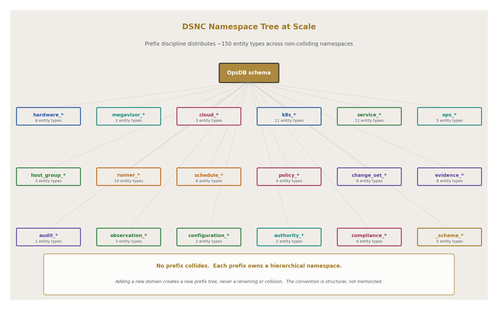
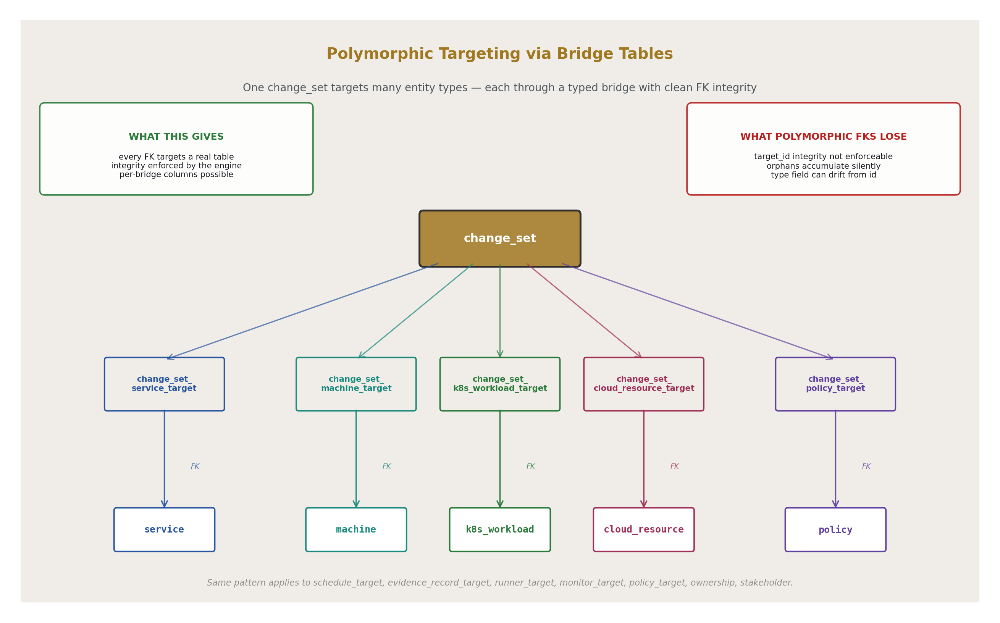
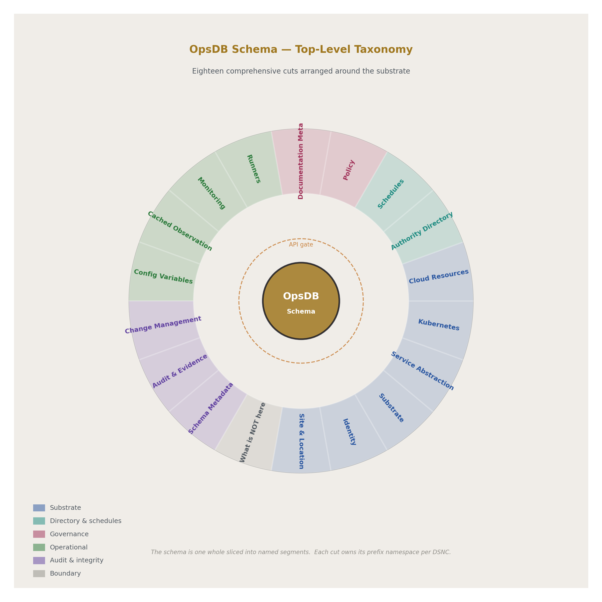
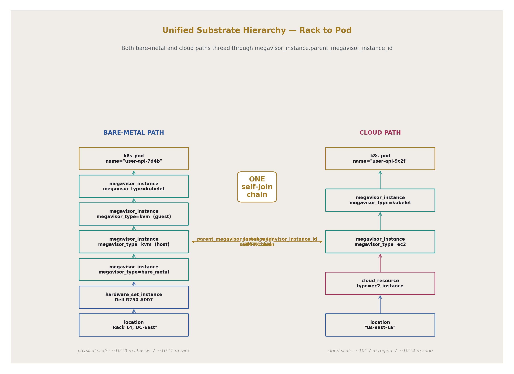
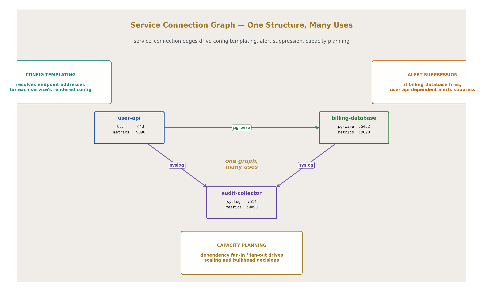
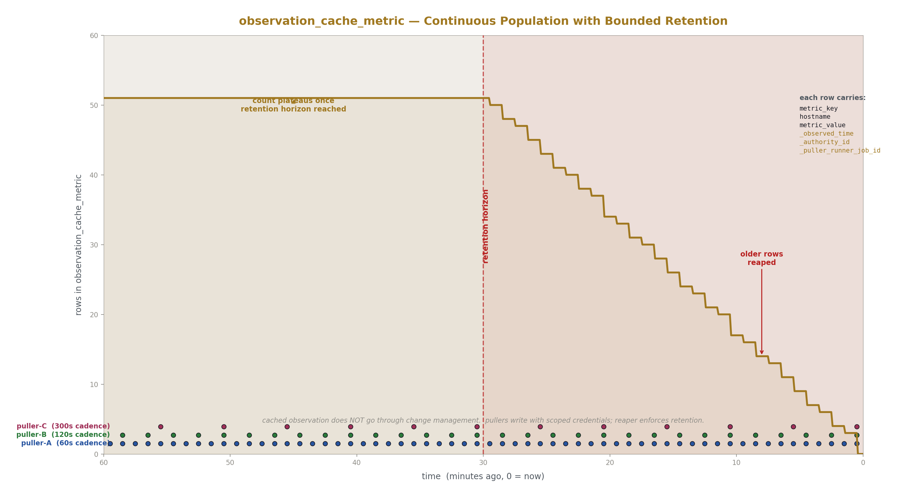
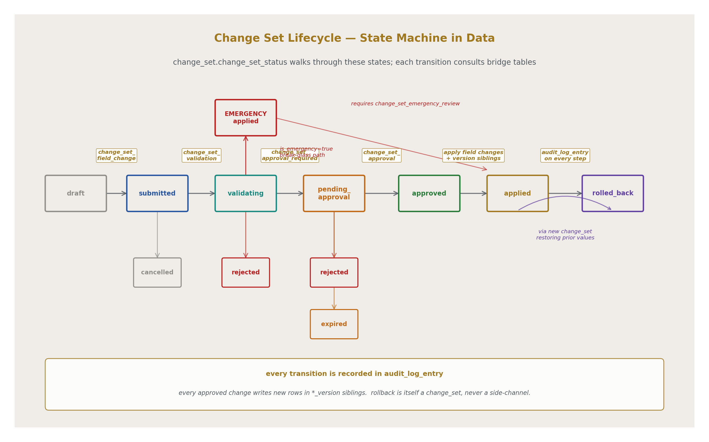
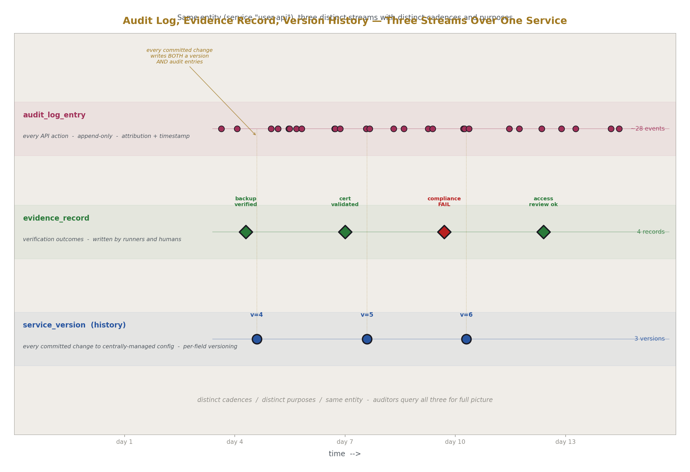

# An Example OpsDB Schema
## Comprehensive Operational Substrate Schema

**AI Usage Disclosure:** Only the top metadata, figures, refs and final copyright sections were edited by the author. All paper content was LLM-generated using Anthropic's Opus 4.7. 

---

## Abstract

This paper specifies a relational schema demonstrating the OpsDB design from HOWL-INFRA-2-2026. The schema is comprehensive across the operational substrate: site and location, identity, hardware, virtualization (with nested megavisor instances spanning bare metal, virtual machines, containers, and pods), Kubernetes, cloud resources, services and packages, runners, schedules, policies, configuration, cached observation, authority pointers, documentation metadata, monitoring and alerting, evidence, change management, audit, and the schema's record of itself.

The naming convention used throughout is the Database Schema Naming Convention, abbreviated DSNC. DSNC rules: all names are singular (`company_employee`, never `company_employees`); all names are lower_case_with_underscores; names are composed hierarchically with prefixes going from more specific to less specific (`web_site`, `web_site_widget`); foreign keys are named as `referenced_table_id` (`company_id` references `company.id`), with role prefixes when multiple FKs to the same table coexist (`vendor_company_id`, `service_company_id`); type suffixes are mandatory for time and date fields (`_time` for DATETIME, `_date` for DATE); booleans use tense prefixes (`is_active` for present, `was_activated` for past). Reserved fields appear on every table where applicable: `id`, `created_time`, `updated_time`, `parent_id` for self-hierarchy. Governance and admin metadata fields carry a leading underscore (`_requires_group`, `_audit_chain_hash`, `_retention_policy_id`) to keep them visually separated from the operational vocabulary the schema models. The benefits at scale: collisions are prevented by structural rules rather than memorized vocabulary; the schema is self-documenting; new domains slot into existing prefix trees without reorganization. DSNC has its own specification document; this paper applies the convention without re-specifying it.

The schema is presented as relational tables with explicit foreign keys, type constraints, and reserved fields. Storage engine choice, API implementation, deployment patterns, and runner implementations are out of scope; INFRA-2 covered those design boundaries. This paper demonstrates that the OpsDB design produces a workable, comprehensive schema; it does not prescribe the canonical schema.

---

## 1. Introduction

This paper specifies one example schema for an OpsDB. The OpsDB design specified in INFRA-2 commits to: a passive substrate accessed only through the API, comprehensive scope across all operational data the organization wants coordinated, a single source of truth for centrally-managed data and a directory of authority pointers for everything else, three consumer populations sharing the same data through scoped access, change management and versioning enforced at the API gate, and stable schema evolution that absorbs new domains additively over decades.

The schema presented here demonstrates that those commitments produce a workable, coherent set of tables. The tables, fields, and relationships chosen are one valid set; an organization adopting the design will adapt the schema to its specific operational reality, adding domains the organization performs and removing domains it does not. The structural patterns — naming, versioning, change management, polymorphic targeting through bridge tables, typed payloads through `*_data_json` fields with `*_type` discriminators — transfer across schemas; the specific contents of any cell do not need to.

The schema is relational. Foreign keys, type constraints, and reserved fields appear explicitly. The schema's structure is the design; how it is stored is an implementation choice. What this paper specifies is the structure.

What this paper does not specify: storage engine, API technology, deployment topology, specific runner implementations, UI design, migration tooling, or specific compliance regime mappings (INFRA-2 covered the regime mapping at the design level; the schema serves all of them through the same data).

The reader is assumed to have read INFRA-1 and INFRA-2. No other reading is assumed.

---

## 2. Conventions

### 2.1 DSNC summary

DSNC rules apply to every table and field name in this paper. Singular names. Lower case with underscores. Hierarchical prefixes from specific to general. Foreign keys named `referenced_table_id`. Type suffixes for time and date. Tense prefixes for booleans. Reserved fields where applicable.

The convention is not re-specified here. DSNC has its own document. This paper applies the convention.



### 2.2 The underscore prefix for governance metadata

Fields whose purpose is governance, security, audit, or schema metadata — fields the API consults to enforce policy, fields that record administrative state, fields that exist for the substrate's own bookkeeping — are prefixed with an underscore. Examples: `_requires_group`, `_access_classification`, `_audit_chain_hash`, `_retention_policy_id`, `_schema_version_introduced`, `_schema_version_deprecated`, `_observed_time`, `_authority_id`, `_puller_runner_job_id`.

This prefix keeps governance metadata visually distinct from the operational vocabulary the schema is modeling. A table describing services has `name`, `description`, `is_active` as operational fields; if it also carries `_requires_group`, that field is immediately visible as governance metadata, not a property of the service itself.

Most tables do not need governance fields. Standard authentication and authorization through the API's role-based mechanisms cover most access control. Underscore-prefixed governance fields appear where a specific table or specific fields need additional access constraints beyond the standard pattern.

### 2.3 Versioning sibling pattern

Tables holding centrally-managed data that goes through change management have a sibling `*_version` table. The base table holds the current state; the sibling holds historical states with `version_serial`, `parent_*_version_id`, and metadata about the change set that produced each version.

Versioning is per-field within the change set: a change set bundles N field changes across one or more entities, the change set is reviewed and approved (or processed immediately if policy permits), and on commit the affected fields are updated and a new version row is written for each affected entity. The version row records what changed.

Tables that do not go through change management — primarily cached observation tables — do not have version siblings. They have observation timestamps and overwrite or append per the puller's cadence.

### 2.4 Typed payload pattern

Some tables carry payloads that vary by type: cloud resources differ across providers, K8s workloads differ across kinds, runner specs differ across purposes. The schema uses paired fields `*_type` (an enumerated discriminator) and `*_data_json` (the typed payload). The API validates the JSON shape against the type at write time. Invalid payloads are rejected.

The discriminator and the payload are always co-located; queries that filter by type read both fields.

### 2.5 Bridge tables for polymorphic relationships

Where one entity type can target many entity types (a change set targets entities; a schedule targets entities; an evidence record targets entities; a policy targets entities), the schema does not use polymorphic FKs. Instead, a bridge table per target type expresses the relationship. A change set targeting K8s workloads has rows in `change_set_k8s_workload_target`. A change set targeting services has rows in `change_set_service_target`. Each bridge table has clean FK integrity.

The cost is more tables. The benefit is referential integrity, queryability, and the ability to add columns specific to each bridge type. For an OpsDB at scale, the table count is not a problem; the integrity is essential.



### 2.6 Reserved fields

Every table has these fields where applicable:

- `id` — primary key, auto-increment integer
- `created_time` — DATETIME, set on insert
- `updated_time` — DATETIME, set on insert and update
- `parent_id` — FK to same table, where the entity is hierarchical

Soft delete uses `is_active` BOOLEAN. Deleted entities are deactivated; their rows persist for history.

### 2.7 Notation

Entity types appear in *bold-italic* on first use within a section. Field names appear in `code style`. Where a column's type is ambiguous, the type is given in parentheses on first reference: `is_active (BOOLEAN)`, `version_serial (INT)`, `cloud_data_json (JSON)`.

---

## 3. Top-level cuts

The schema is organized into the following categories. This is the comprehensive carving; subsequent sections specify the tables within each.

- **Site and location** (§5) — the DOS scope and the physical and logical locations within it
- **Identity** (§5) — users, roles, groups
- **Substrate** (§6) — hardware, megavisor instances (nested across virtualization layers), machines, cloud resources, storage
- **Service abstraction** (§7) — services, packages, interfaces, connections, host groups
- **Kubernetes** (§8) — clusters, nodes, namespaces, workloads, pods, helm releases, configmaps, secret references
- **Cloud resources** (§9) — generic resource modeling with provider-specific payloads
- **Authority directory** (§10) — typed pointers to monitoring, logs, secrets, documentation, identity, code repositories
- **Schedules** (§11) — when things happen
- **Policy** (§12) — security zones, classifications, retention, approval rules, escalation
- **Documentation metadata** (§13) — ownership, runbooks, dashboards, last-reviewed dates
- **Runners** (§14) — what runners exist, their config, their runtime records
- **Monitoring and alerting** (§15) — monitors, alerts, on-call, suppression
- **Cached observation** (§16) — pulled state from authorities
- **Configuration variables** (§17) — typed key-value storage usable across many domains
- **Change management** (§18) — change sets, approvals, approval rules
- **Audit and evidence** (§19) — audit log, evidence records, compliance findings
- **Schema metadata** (§20) — the OpsDB's record of its own schema

Section 21 specifies what is not in this schema and why.



---

## 4. Reserved fields and universal patterns

### 4.1 Universal reserved fields

Every table has `id` as primary key. Every table has `created_time` and `updated_time`. Tables with self-hierarchy have `parent_id`. Tables supporting soft delete have `is_active`.

These are reserved across the entire schema. Their presence is consistent; their meaning is consistent.

### 4.2 Versioning sibling tables

A table participating in change management has a sibling `*_version` table with these fields:

- `id` — version row primary key
- `*_id` — FK to the base table (the entity this version belongs to)
- `version_serial` — INT, monotonic per entity
- `parent_*_version_id` — self-FK, the prior version for this entity
- `change_set_id` — FK to the change set that produced this version
- `is_active_version` — BOOLEAN, true for the current version of the entity
- `created_time`, `updated_time`

The base table always reflects the current state. The sibling reconstructs history. Rollback is achieved by submitting a change set that restores prior field values; rollback is itself a change set, recorded normally, never a side-channel.

### 4.3 Underscore-prefixed governance fields

Standard governance fields the API may consult when present on a table:

- `_requires_group` — VARCHAR, name of the group required to read or write rows in this table beyond standard role-based access
- `_access_classification` — VARCHAR, data classification level (public, internal, confidential, restricted, regulated)
- `_audit_chain_hash` — VARCHAR, cryptographic chaining of audit log entries (only on `audit_log_entry`)
- `_retention_policy_id` — FK to `retention_policy`, overrides the default retention for this row
- `_observed_time`, `_authority_id`, `_puller_runner_job_id` — present on cached observation tables, identify when and from where the observation was sourced

Most tables carry none of these. Tables that need them carry only the ones they need.

### 4.4 Typed payload pattern

Tables holding heterogeneous structured data use:

- A `*_type` field — VARCHAR or ENUM discriminator
- A `*_data_json` field — JSON payload validated against the type at the API

The API maintains a registry mapping each `*_type` value to a JSON schema. Writes validate the payload against the schema for the given type. Invalid writes are rejected.

### 4.5 Bridge tables for relationships

One-to-many and many-to-many relationships use explicit bridge tables. Polymorphic relationships (one entity referenced by many entity types) use one bridge table per target type, named `<source>_<target>_target` or similar. Each bridge has clean FK integrity to both ends.

---

## 5. Site, location, identity

### 5.1 site

```
site
  id
  name
  description
  domain
  is_active
  created_time
  updated_time
```

A *site* is a DOS scope within an OpsDB. One OpsDB can hold many sites. Each entity in the schema that is site-scoped carries `site_id`.

### 5.2 location

```
location
  id
  parent_id              -- self-FK; hierarchical
  site_id
  name
  location_type          -- VARCHAR: region, datacenter, cage, row, rack,
                         --   cloud_region, cloud_zone, office, desk
  latitude
  longitude
  is_active
  created_time
  updated_time
```

*location* is hierarchical. Latitude and longitude are set where physically meaningful; the resolution function for a location's coordinates walks up to the nearest set values. Cloud regions and cloud zones are locations with the appropriate `location_type`.

### 5.3 ops_user

```
ops_user
  id
  site_id
  username
  fullname
  email
  is_active
  created_time
  updated_time
```

The `ops_` prefix avoids collision with reserved words and with application-side user tables. This table represents an operational identity within the site. Authentication is delegated to the identity provider; the OpsDB records that the identity exists.

### 5.4 ops_group

```
ops_group
  id
  site_id
  name
  description
  is_active
  created_time
  updated_time

ops_group_member
  id
  ops_group_id
  ops_user_id
  created_time
  updated_time
```

Groups are how access policy is expressed at scale. Membership is recorded; the API consults memberships when evaluating access.

### 5.5 ops_user_role

```
ops_user_role
  id
  site_id
  name
  description
  is_active
  created_time
  updated_time

ops_user_role_member
  id
  ops_user_role_id
  ops_user_id
  rotation_order        -- INT, for on-call rotation ordering
  created_time
  updated_time
```

Roles are operational positions: "Mail On-Call," "Database SRE," "Compliance Owner." Role members are the users currently filling the role; rotation orders schedule them across time (combined with `on_call_schedule` in §15).

---

## 6. Substrate hierarchy

The unified substrate model spans physical hardware, virtualization, containers, and cloud-provided compute. The same nesting hierarchy holds throughout.

### 6.1 hardware_component

```
hardware_component
  id
  name
  manufacturer
  model
  hardware_component_type    -- VARCHAR: chassis, motherboard, cpu, ram, disk,
                             --   psu, nic, hba, fan, gpu
  parent_hardware_component_id -- self-FK; chassis → motherboard → cpu, etc.
  rack_unit_height           -- INT, only set for chassis-class components
  is_active
  created_time
  updated_time
```

The *hardware_component* tree describes a physical thing's parts. A chassis contains a motherboard, PSUs, disks, fans; a motherboard contains CPUs and RAM sticks; etc. Each part is its own row, allowing per-part tracking of failures, replacements, and history.

### 6.2 hardware_port

```
hardware_port
  id
  hardware_component_id
  name
  media_type             -- VARCHAR: rj45, fiber, sfp, db9, c13, c19, usb, hdmi
  resource_type          -- VARCHAR: network, power_110, power_220, serial,
                         --   video, kvm, storage, management
  direction              -- VARCHAR: provider, consumer, bidirectional
  is_active
  created_time
  updated_time
```

*hardware_port* describes the connection points on components. Direction allows building dependency graphs: power ports flow from provider PSUs to consumer chassis; network ports are typically bidirectional; KVM ports flow from servers to consoles.

### 6.3 hardware_set

```
hardware_set
  id
  name                  -- "Dell R750 256GB 8x NVMe"
  description
  is_active
  created_time
  updated_time

hardware_set_component
  id
  hardware_set_id
  hardware_component_id
  position_label        -- "cpu_0", "ram_slot_3"
  created_time
  updated_time
```

A *hardware_set* is a specification: which components, in which positions, constitute a configured hardware unit. Different specifications get different rows. Two hardware sets that differ only by RAID controller version are different sets.

### 6.4 hardware_set_instance

```
hardware_set_instance
  id
  hardware_set_id
  location_id
  rack_unit_mount_height    -- INT; absolute position within the rack
  serial_number
  asset_tag
  is_active
  decommissioned_time
  created_time
  updated_time
```

A *hardware_set_instance* is the actual physical thing in the actual rack. The composition is `hardware_set_id`; the location is `location_id`; the position within the location is `rack_unit_mount_height`.

### 6.5 hardware_set_instance_port_connection

```
hardware_set_instance_port_connection
  id
  source_hardware_set_instance_id
  source_hardware_port_id
  destination_hardware_set_instance_id
  destination_hardware_port_id
  cable_label
  is_active
  created_time
  updated_time
```

Cables and peering. Power chains, network chains, KVM chains, fiber runs. The dependency graph that drives alert suppression and capacity tracking is computed from these rows.

### 6.6 megavisor

```
megavisor
  id
  name
  megavisor_type        -- VARCHAR: bare_metal, kvm, vmware, xen, hyperv,
                        --   docker, containerd, kubelet, firecracker,
                        --   ec2, gce, azure_vm, lambda, cloudrun, fargate
  version
  is_active
  created_time
  updated_time
```

*megavisor* is the abstraction over anything that hosts a runnable computational unit: bare metal (the OS itself), hypervisors, container runtimes, pod runtimes, cloud-managed compute. The `megavisor_type` enumeration is extensible as new substrate types emerge.

### 6.7 megavisor_instance

```
megavisor_instance
  id
  parent_megavisor_instance_id   -- self-FK; the nesting
  megavisor_id
  hardware_set_instance_id       -- nullable; set only at the bare-metal root
  cloud_resource_id              -- nullable; set when this instance IS a cloud compute resource
  location_id                    -- cached for query speed; inherited from parent or hardware
  external_id                    -- VM UUID, container ID, pod UID, EC2 instance ID
  hostname
  ip_primary
  is_active
  is_running
  provisioned_time
  decommissioned_time
  created_time
  updated_time
```

The *megavisor_instance* is the unifying abstraction. Walk up `parent_megavisor_instance_id` to traverse the substrate stack:

```
pod (megavisor=kubelet)
  → node (megavisor=kvm guest)
    → vm host (megavisor=kvm)
      → bare metal server (megavisor=bare_metal, hardware_set_instance_id set)
        → rack location
```

Or, in a cloud:

```
pod (megavisor=kubelet)
  → node (megavisor=ec2, cloud_resource_id set)
    → cloud_resource → cloud account → cloud provider
```

One self-joining table covers both paths. A K8s pod's full ancestry chain to physical hardware (or cloud region) is one recursive query. Same shape for VMware, Hyper-V, Lambda, Cloud Run.



### 6.8 cloud_provider, cloud_account, cloud_resource

```
cloud_provider
  id
  name                   -- aws, azure, gcp, digital_ocean, hetzner, oracle
  is_active
  created_time
  updated_time

cloud_account
  id
  cloud_provider_id
  site_id
  name                   -- "production-aws-account"
  account_external_id    -- AWS account ID, Azure tenant ID, GCP project ID
  is_active
  created_time
  updated_time

cloud_resource
  id
  cloud_account_id
  location_id            -- cloud_region or cloud_zone location
  cloud_resource_type    -- VARCHAR: ec2_instance, s3_bucket, rds_database,
                         --   lambda_function, azure_vm, blob_container,
                         --   gce_instance, gcs_bucket, ...
  external_id            -- ARN, resource ID, self-link
  name
  cloud_data_json        -- typed by cloud_resource_type
  is_active
  provisioned_time
  decommissioned_time
  created_time
  updated_time
```

*cloud_resource* is the generic cloud entity. The `cloud_resource_type` enumeration is the discriminator; `cloud_data_json` carries the provider-specific shape. EC2 instances, S3 buckets, RDS databases, Lambda functions, GCE instances, GCS buckets, Azure VMs, blob containers — all are rows in this one table, with payload validated against type at the API.

The bridge to compute: when `cloud_resource_type` indicates a compute resource (ec2_instance, gce_instance, azure_vm), a corresponding `megavisor_instance` row exists with `cloud_resource_id` pointing back. The cloud resource is the cloud-side identity; the megavisor instance is the participant in the unified substrate hierarchy.

### 6.9 storage_resource

```
storage_resource
  id
  cloud_resource_id           -- nullable; set if cloud-backed
  hardware_set_instance_id    -- nullable; set if physical-backed
  storage_resource_type       -- VARCHAR: ebs, s3, gcs, azure_blob, nfs_export,
                              --   ceph_rbd, local_disk, iscsi
  size_bytes
  storage_data_json           -- backend-specific config (iops, replication, etc.)
  is_active
  created_time
  updated_time
```

*storage_resource* abstracts storage across physical and cloud backings. Either `cloud_resource_id` or `hardware_set_instance_id` (or both, for a physical disk presented through a cloud control plane) is set. The `storage_data_json` carries backend-specific configuration: IOPS profile, replication factor, encryption parameters, etc.

### 6.10 platform

```
platform
  id
  name                    -- "rocky-9-base", "ubuntu-24-04-hardened"
  os_family               -- VARCHAR: linux, windows, freebsd, darwin
  os_version
  architecture            -- VARCHAR: x86_64, arm64, riscv64
  is_active
  is_approved_for_production
  created_time
  updated_time
```

*platform* is an OS image build. New patches, new releases, new hardening profiles are new platforms.

### 6.11 machine

```
machine
  id
  megavisor_instance_id
  fqdn
  host_group_id           -- single host group, sysync-style; see §7
  platform_id
  is_active
  is_under_management     -- if false, runners skip this machine
  bootstrapped_time
  last_converged_time
  created_time
  updated_time
```

A *machine* is the configured-host concept. Not every megavisor_instance is a machine (a hypervisor host might be; a container runtime might not need to be). The machine is what runners configure and report on. `is_under_management` is the kill switch — set it false to take a host out of automation without removing its row.

`machine` has a versioning sibling `machine_version` because changes to its FK fields (host_group, platform) and configuration fields go through change management.

---

## 7. Service abstraction

The service abstraction layer comes from prior operational substrate work and survives in modern form. It models the deployment shape of operational software independently of where it runs (bare metal, VM, K8s pod, cloud function).

### 7.1 package

```
package
  id
  name                    -- "nginx", "postgres", "kubelet", "datadog-agent"
  package_type            -- VARCHAR: platform, service, sidecar, agent
  description
  is_active
  created_time
  updated_time

package_version
  id
  package_id
  version_serial
  parent_package_version_id
  package_data_json       -- install/configure spec, runner-interpreted
  is_active
  approved_for_production_time
  created_time
  updated_time
```

A *package* is a unit of installable functionality. *package_version* is the unit of change. The `package_data_json` carries the spec the runner interprets to install or configure the package; its shape varies by package type and is validated at the API.

### 7.2 package_interface, package_connection

```
package_interface
  id
  package_version_id
  name                    -- "http", "syslog_listener", "metrics_scrape"
  interface_type          -- VARCHAR: transaction, message, resource
  protocol                -- VARCHAR: tcp, udp, unix_socket, http, grpc
  default_port            -- INT, nullable
  description
  created_time
  updated_time

package_connection
  id
  package_version_id
  name                    -- "syslog_upstream", "database_primary"
  target_interface_name   -- name of an interface the package connects to
  is_required
  description
  created_time
  updated_time
```

*package_interface* describes what a package exposes; *package_connection* describes what it connects to. Both are abstract — they specify shapes, not specific endpoints. Specific endpoints are resolved at the service layer.

### 7.3 service

```
service
  id
  site_id
  name
  description
  service_type            -- VARCHAR: standard, database, k8s_cluster_member,
                          --   cloud_managed
  parent_service_id       -- nullable; allows service hierarchies
  is_active
  created_time
  updated_time

service_version
  id
  service_id
  version_serial
  parent_service_version_id
  is_active
  approved_for_production_time
  created_time
  updated_time
```

A *service* is a named operational role: "user-api", "billing-database", "ingress-controller", "audit-collector". Services compose packages and bind their interfaces to concrete endpoints.

### 7.4 service_package, service_interface_mount, service_connection

```
service_package
  id
  service_version_id
  package_version_id
  install_order           -- INT, sequence within the service
  created_time
  updated_time

service_interface_mount
  id
  service_version_id
  package_interface_id
  exposed_name            -- public name of this interface for this service
  exposed_port            -- INT, override package default
  exposed_protocol
  is_external             -- accepts traffic from outside the service mesh
  created_time
  updated_time

service_connection
  id
  source_service_version_id
  destination_service_id
  destination_service_interface_mount_id
  source_package_connection_id
  is_required
  created_time
  updated_time
```

The *service_connection* graph is the operational topology: who talks to whom, on which interface, for which purpose. This graph drives:

- Configuration template generation (concrete endpoints for templated configs)
- Firewall rules (only mounted interfaces accept traffic)
- Alert dependency suppression (if a dependency is alerting, dependent alerts are suppressed)
- Capacity planning



### 7.5 host_group

```
host_group
  id
  site_id
  name                    -- "database", "k8s_worker", "edge_proxy"
  description
  domain                  -- FQDN suffix for hosts in this group
  is_active
  created_time
  updated_time

host_group_machine
  id
  host_group_id
  machine_id
  is_active
  created_time
  updated_time

host_group_package
  id
  host_group_id
  package_version_id
  install_order
  created_time
  updated_time
```

A *host_group* is the host-level role assignment: the set of machines that share a configuration purpose. A machine belongs to exactly one host group (`machine.host_group_id`). The `host_group_machine` bridge is a denormalized convenience for queries that walk the other direction; the API maintains it as the FK on `machine` is updated. `host_group_package` lists packages applied in sequence to all machines in the group.

A K8s worker node is a machine in host group "k8s_worker" with packages installing kubelet, container runtime, monitoring agents, log shippers. The workloads running on top are modeled separately in §8.

### 7.6 site_location

```
site_location
  id
  site_id
  service_id
  location_id
  precedence_order        -- INT; 0 is most-preferred
  is_active
  created_time
  updated_time
```

Per-service location preference for failover and scaling. When a location fails, operators reorder `precedence_order`, and runners scale capacity according to the new ordering. The site_location pattern allows roles to be infinite-capable while physical locations remain interchangeable.

### 7.7 service_level

```
service_level
  id
  service_version_id
  site_location_id
  hardware_set_id         -- nullable; constrains hardware spec
  machine_count_minimum
  machine_count_maximum
  service_level_metric_id -- nullable; for SLO-driven scaling
  is_active
  created_time
  updated_time

service_level_metric
  id
  name
  metric_query            -- runner-interpreted (e.g., PromQL string)
  threshold_value
  threshold_operator      -- VARCHAR: gt, lt, gte, lte
  rate_change_minimum_time_seconds
  is_active
  created_time
  updated_time
```

Service levels express scaling policy as data. Minimum/maximum counts per site location, optional hardware constraint, optional SLO-driven metric threshold. The `rate_change_minimum_time_seconds` prevents oscillation by requiring elapsed time between scaling actions.

---

## 8. Kubernetes

K8s is modeled as a service-of-services with its own internal substrate that participates in the unified hierarchy. The cluster IS a service (in `service`); its nodes are machines (in `machine`); its pods are megavisor instances (in `megavisor_instance` with `megavisor_type='kubelet'`).

### 8.1 k8s_cluster

```
k8s_cluster
  id
  service_id              -- the cluster IS a service in the abstraction
  site_id
  name
  k8s_distribution        -- VARCHAR: vanilla, eks, gke, aks, openshift, rancher,
                          --   k3s, talos
  k8s_version
  api_endpoint_fqdn
  is_active
  created_time
  updated_time

k8s_cluster_version
  id
  k8s_cluster_id
  version_serial
  parent_k8s_cluster_version_id
  k8s_version
  is_active
  approved_for_production_time
  created_time
  updated_time
```

### 8.2 k8s_cluster_node

```
k8s_cluster_node
  id
  k8s_cluster_id
  machine_id              -- the underlying machine in the substrate
  node_role               -- VARCHAR: control_plane, worker, etcd, ingress
  is_schedulable
  joined_time
  is_active
  created_time
  updated_time
```

The bridge from K8s to the substrate. A node's `machine_id` points to the machine row, which points to its `megavisor_instance_id`, which walks up to either bare metal or a cloud resource.

### 8.3 k8s_namespace

```
k8s_namespace
  id
  k8s_cluster_id
  name
  is_active
  created_time
  updated_time
```

### 8.4 k8s_workload

```
k8s_workload
  id
  k8s_cluster_id
  k8s_namespace_id
  name
  workload_type           -- VARCHAR: deployment, statefulset, daemonset, job,
                          --   cronjob, replicaset
  is_active
  created_time
  updated_time

k8s_workload_version
  id
  k8s_workload_id
  version_serial
  parent_k8s_workload_version_id
  workload_data_json      -- the spec; runner-interpreted
  is_active
  approved_for_production_time
  created_time
  updated_time
```

The `workload_data_json` carries the K8s manifest spec. Validation at the API ensures the JSON shape matches what `workload_type` expects.

### 8.5 k8s_pod

```
k8s_pod
  id
  megavisor_instance_id   -- the bridge into the unified substrate
  k8s_workload_id
  k8s_namespace_id
  k8s_cluster_node_id
  name
  pod_uid
  is_running
  scheduled_time
  is_active
  created_time
  updated_time
```

A pod is observed state — it appears and disappears as K8s schedules and reschedules. Cached observation tables (§16) hold recent pod runtime state; this table holds the structural identity.

The bridge to `megavisor_instance` is what places pods in the unified hierarchy. Walk up from the pod's megavisor_instance to its parent (the kubelet on a node) to that node's parent (the VM, the bare metal, or the cloud resource) to the underlying location.

### 8.6 k8s_helm_release

```
k8s_helm_release
  id
  k8s_cluster_id
  k8s_namespace_id
  name
  chart_name
  chart_version
  is_active
  installed_time
  created_time
  updated_time

k8s_helm_release_version
  id
  k8s_helm_release_id
  version_serial
  parent_k8s_helm_release_version_id
  chart_name
  chart_version
  is_active
  approved_for_production_time
  created_time
  updated_time
```

A Helm release is a versioned deployment of a Helm chart. The values for the release are stored as configuration variables (§17), keyed by the helm release version. This pattern — table for the entity, configuration variables for the parameters — keeps the entity table clean and the variables queryable across many entity types.

### 8.7 k8s_config_map

```
k8s_config_map
  id
  k8s_cluster_id
  k8s_namespace_id
  name
  is_active
  created_time
  updated_time

k8s_config_map_version
  id
  k8s_config_map_id
  version_serial
  parent_k8s_config_map_version_id
  is_active
  approved_for_production_time
  created_time
  updated_time
```

The configmap key/value contents are stored as configuration variables (§17), keyed by the configmap version. Same pattern as Helm release values.

### 8.8 k8s_secret_reference

```
k8s_secret_reference
  id
  k8s_cluster_id
  k8s_namespace_id
  name
  secret_type             -- VARCHAR: opaque, tls, dockerconfigjson,
                          --   service_account_token, basic_auth
  secret_backend_id       -- FK to authority (vault, sops, kms, etc.)
  secret_backend_path     -- where the actual secret lives in the backend
  is_active
  created_time
  updated_time
```

A *k8s_secret_reference* points to where the secret lives in an external backend. The OpsDB never holds secret values. The `secret_backend_id` references an authority row (§10) typed `secret_vault`. Runners that need to apply the secret resolve it from the backend at apply time using their own credentials; the OpsDB participates only in the directory.

### 8.9 k8s_service

```
k8s_service
  id
  k8s_cluster_id
  k8s_namespace_id
  name
  k8s_service_type        -- VARCHAR: cluster_ip, node_port, load_balancer,
                          --   external_name, headless
  service_id              -- nullable; FK to OpsDB service if this k8s service
                          --   represents an OpsDB-modeled service
  is_active
  created_time
  updated_time
```

The K8s service object. Optionally linked to an OpsDB-level service when the K8s service exposes one of the operationally-modeled services. A K8s service that's purely internal to the cluster's mechanics (e.g., kube-dns) may not have an OpsDB service link.

---

## 9. Cloud resources

The generic cloud resource model from §6.8 is extended here with versioning. Provider-specific behavior is in `cloud_data_json`; the API enforces shape validation per type.

### 9.1 cloud_resource_version

```
cloud_resource_version
  id
  cloud_resource_id
  version_serial
  parent_cloud_resource_version_id
  cloud_resource_type     -- discriminator (denormalized for query)
  cloud_data_json
  is_active
  approved_for_production_time
  created_time
  updated_time
```

Cloud resources go through change management like any other configured entity. Adding tags, changing instance type, modifying security group membership — all are change sets producing new versions.

### 9.2 Common cloud_resource_type values

The discriminator enumeration is extensible. Common values:

- `ec2_instance`, `gce_instance`, `azure_vm` — compute (bridges to `megavisor_instance`)
- `s3_bucket`, `gcs_bucket`, `azure_blob_container` — object storage (bridges to `storage_resource`)
- `rds_database`, `cloud_sql_instance`, `azure_sql` — managed databases
- `lambda_function`, `cloud_run_service`, `azure_function` — serverless compute (bridges to `megavisor_instance`)
- `vpc`, `vnet`, `cloud_network` — networking
- `load_balancer`, `application_gateway`, `cloud_lb` — load balancing
- `cloudfront_distribution`, `cloud_cdn`, `azure_cdn` — content delivery
- `iam_role`, `service_account`, `azure_service_principal` — cloud-side identities
- `route53_zone`, `cloud_dns_zone`, `azure_dns_zone` — DNS
- `cloudwatch_log_group`, `cloud_logging_bucket`, `log_analytics_workspace` — logging

Each value pairs with a JSON schema for `cloud_data_json` registered with the API. Adding a new resource type is: add the enumeration value, register the schema, build runner support to act on it. The schema absorbs the new type without restructuring.

---

## 10. Authority directory

The authority directory is one of the OpsDB's primary functions. It is the place humans and automation consult to find where any operational fact lives that the OpsDB does not hold directly.

### 10.1 authority

```
authority
  id
  site_id
  name
  authority_type          -- VARCHAR: prometheus_server, log_aggregator,
                          --   secret_vault, wiki, dashboard_platform,
                          --   code_repository, identity_provider,
                          --   runbook_store, ticketing_system,
                          --   chat_platform, status_page,
                          --   artifact_registry, container_registry
  base_url                -- the authority's primary URL or endpoint
  authority_data_json     -- typed by authority_type; auth method, region, etc.
  is_active
  created_time
  updated_time
```

An *authority* is an external system that owns a slice of operational reality the OpsDB does not own. Each row identifies one authority. The `authority_data_json` carries connection metadata appropriate to the type.

### 10.2 authority_pointer

```
authority_pointer
  id
  authority_id
  pointer_type            -- VARCHAR: metric, log_query, secret, dashboard,
                          --   runbook, wiki_page, ticket, code_path,
                          --   chat_thread, artifact, container_image
  locator                 -- the path/identifier within the authority
  pointer_data_json       -- type-specific details (labels, query templates, etc.)
  last_verified_time      -- when last confirmed valid
  is_active
  created_time
  updated_time
```

An *authority_pointer* is a typed reference to a specific item within an authority. Examples:

- A pointer to a Prometheus metric: `authority_id` → the Prometheus server, `pointer_type='metric'`, `locator='node_cpu_seconds_total'`, `pointer_data_json` carries the labels needed for the query.
- A pointer to a runbook: `authority_id` → the wiki, `pointer_type='runbook'`, `locator` is the page path, `pointer_data_json` carries last-tested time and other metadata.
- A pointer to a secret: `authority_id` → the vault, `pointer_type='secret'`, `locator` is the secret path, `pointer_data_json` carries the version reference.

`last_verified_time` allows pointers to be tracked for rot. A verifier runner periodically checks pointer validity; if a runbook page returns 404 or a metric query returns no data, the runner updates the verification state and may file a finding.

### 10.3 entity_authority_pointer bridges

The relationship between OpsDB entities and their authority pointers is many-to-many through bridge tables, one per entity type to preserve referential integrity:

```
service_authority_pointer
  id
  service_id
  authority_pointer_id
  relationship_role       -- VARCHAR: primary_dashboard, runbook, log_query,
                          --   metric_namespace, status_page, on_call_handoff
  is_active
  created_time
  updated_time

machine_authority_pointer
  id
  machine_id
  authority_pointer_id
  relationship_role
  is_active
  created_time
  updated_time

k8s_cluster_authority_pointer
  id
  k8s_cluster_id
  authority_pointer_id
  relationship_role
  is_active
  created_time
  updated_time

cloud_resource_authority_pointer
  id
  cloud_resource_id
  authority_pointer_id
  relationship_role
  is_active
  created_time
  updated_time
```

(Additional bridge tables follow the same pattern for other entity types: `host_group_authority_pointer`, `k8s_workload_authority_pointer`, etc. Each bridge has clean FK integrity and can carry its own columns specific to its relationship.)

The "where do I find the runbook for this service" query is one read against `service_authority_pointer` filtered by `relationship_role='runbook'`, joined to `authority_pointer` for the locator, joined to `authority` for the connection details.

### 10.4 on_call resolution as authority lookup

Resolving "who is on call for this service right now" is treated as an authority lookup. The on-call schedule (§15) is itself in the OpsDB; the resolution is a query that combines the schedule, the current time, and the role membership. The resulting answer is a current ops_user; the API can return the user's contact information and the page mechanism in one resolved response.

---

## 11. Schedules

Schedules are first-class data: when things happen, recurring or one-time, across all operational domains.

### 11.1 schedule

```
schedule
  id
  site_id
  name
  schedule_type           -- VARCHAR: cron_expression, rate_based,
                          --   event_triggered, calendar_anchored,
                          --   deadline_driven, manual
  schedule_data_json      -- typed by schedule_type
  description
  is_active
  created_time
  updated_time

schedule_version
  id
  schedule_id
  version_serial
  parent_schedule_version_id
  schedule_data_json
  is_active
  approved_for_production_time
  created_time
  updated_time
```

The `schedule_data_json` shape varies by type:

- `cron_expression` — `{"expression": "0 2 * * *", "timezone": "UTC"}`
- `rate_based` — `{"interval_seconds": 300, "jitter_seconds": 30}`
- `event_triggered` — `{"trigger_event_type": "...", "trigger_filter": {...}}`
- `calendar_anchored` — `{"day_of_month": 15, "month_pattern": "quarterly"}`
- `deadline_driven` — `{"deadline_time": "...", "warning_offsets_seconds": [...]}`
- `manual` — `{"description": "Triggered by operator action"}`

### 11.2 Schedule target bridges

A schedule applies to specific entities through type-specific bridges:

```
runner_schedule
  id
  runner_spec_id
  schedule_id
  service_id              -- nullable; what service this scheduling targets
  is_active
  created_time
  updated_time

credential_rotation_schedule
  id
  credential_id
  schedule_id
  is_active
  created_time
  updated_time

certificate_expiration_schedule
  id
  certificate_id
  schedule_id
  warning_offsets_data_json
  is_active
  created_time
  updated_time

compliance_audit_schedule
  id
  compliance_regime_id
  schedule_id
  audit_scope_data_json
  is_active
  created_time
  updated_time

manual_operation_schedule
  id
  manual_operation_id
  schedule_id
  is_active
  created_time
  updated_time
```

Each is a bridge between the schedule and the operational thing being scheduled. The OpsDB holds the schedule data; runners read it, enforce it, and write results back. The OpsDB does not invoke runners on the schedule.

### 11.3 manual_operation

```
manual_operation
  id
  site_id
  name                    -- "Tape rotation: site A", "Annual vendor review",
                          --   "DC keycard audit", "Compliance evidence collection"
  description
  manual_operation_type   -- VARCHAR: tape_rotation, vendor_review,
                          --   keycard_audit, license_renewal,
                          --   contract_renewal, evidence_collection,
                          --   physical_inspection
  manual_operation_data_json
  responsible_ops_user_role_id
  is_active
  created_time
  updated_time
```

A *manual_operation* is something humans do on a schedule. The OpsDB tracks that it exists, when it's due, who's responsible, and what evidence proves it happened. Examples cover the full breadth of operational responsibility: tape rotations, vendor contract reviews, keycard audits when employees depart, license renewals, physical equipment inspections.

The pattern: schedule says when, manual_operation says what, ops_user_role says who, evidence_record (§19) says it happened, compliance_finding tracks gaps.

### 11.4 Examples of normal-but-often-untracked scheduling

A non-exhaustive list of operational scheduling that fits this model:

- Backup verification runs
- Credential rotations (database, API key, service account)
- Certificate renewals (TLS, SSH host keys, signing keys)
- DNS zone serial bumps (where applicable)
- Vendor contract renewals
- Software license renewals
- Compliance audit submissions (SOC 2 quarterly evidence, PCI quarterly scans)
- Patch windows (per host group, per service)
- Disaster recovery drills
- Access reviews (quarterly review of who has access to what)
- Vendor account credential rotations
- Internal CA root certificate renewals
- DR backup restoration tests
- Capacity planning reviews
- Code dependency scans

Each is a row in `schedule` plus the appropriate target bridge, with verifier runners producing evidence records on each cycle.

---

## 12. Policy

Organizational rules expressed as data, evaluated by the API and runners.

### 12.1 policy

```
policy
  id
  site_id
  name
  policy_type             -- VARCHAR: security_zone, data_classification,
                          --   retention, approval_rule, escalation,
                          --   change_management, schedule_governance,
                          --   access_control, compliance_scope
  policy_data_json        -- typed by policy_type
  description
  is_active
  _requires_group         -- governance fields visible
  created_time
  updated_time

policy_version
  id
  policy_id
  version_serial
  parent_policy_version_id
  policy_data_json
  is_active
  approved_for_production_time
  created_time
  updated_time
```

The *policy* table holds organizational rules. Modifying a policy is a change set with stricter approval rules — typically requiring approval from the security or governance team.

### 12.2 Policy target bridges

Policies apply to entities through type-specific bridges:

```
service_policy
  id
  service_id
  policy_id
  is_active
  created_time
  updated_time

machine_policy
  id
  machine_id
  policy_id
  is_active
  created_time
  updated_time

k8s_namespace_policy
  id
  k8s_namespace_id
  policy_id
  is_active
  created_time
  updated_time

cloud_account_policy
  id
  cloud_account_id
  policy_id
  is_active
  created_time
  updated_time
```

Additional bridges as needed for other entity types.

### 12.3 security_zone

```
security_zone
  id
  site_id
  name                    -- "production", "corp", "pci_cardholder",
                          --   "phi_processing", "dmz"
  description
  zone_data_json          -- required controls, threat model, etc.
  is_active
  created_time
  updated_time

security_zone_membership_service
  id
  security_zone_id
  service_id
  is_active
  created_time
  updated_time

security_zone_membership_machine
  id
  security_zone_id
  machine_id
  is_active
  created_time
  updated_time

security_zone_membership_k8s_namespace
  id
  security_zone_id
  k8s_namespace_id
  is_active
  created_time
  updated_time
```

Security zones are the operational form of policy scopes. Membership is via bridge tables per entity type.

### 12.4 data_classification

```
data_classification
  id
  site_id
  name                    -- "public", "internal", "confidential",
                          --   "restricted", "regulated_pci",
                          --   "regulated_phi", "regulated_pii"
  description
  classification_data_json
  is_active
  created_time
  updated_time
```

Data classifications are referenced through `_access_classification` fields on tables that carry data of varying sensitivity.

### 12.5 retention_policy

```
retention_policy
  id
  site_id
  name                    -- "production_30_day", "compliance_7_year",
                          --   "infinite_history", "ephemeral"
  retention_type          -- VARCHAR: time_bounded, count_bounded, hybrid,
                          --   infinite
  retention_data_json     -- horizon configuration
  is_active
  created_time
  updated_time
```

Retention policies govern how much version history and audit history is kept per entity type. Referenced through `_retention_policy_id` on entities that override default retention.

### 12.6 approval_rule

```
approval_rule
  id
  site_id
  name                    -- "production_change_two_approvers",
                          --   "schema_change_steward_required",
                          --   "compliance_change_compliance_team"
  rule_data_json          -- the matching predicate and approval requirements
  is_active
  created_time
  updated_time
```

The `rule_data_json` carries the predicate (which change sets does this rule apply to — by entity type, by namespace, by field, by classification) and the requirement (how many approvers, from which groups, with what delays). The API evaluates rules against each submitted change set to determine required approvals.

### 12.7 escalation_path

```
escalation_path
  id
  site_id
  name
  description
  is_active
  created_time
  updated_time

escalation_step
  id
  escalation_path_id
  step_order              -- INT, sequence
  step_type               -- VARCHAR: notify_role, notify_user, page_role,
                          --   page_user, wait_seconds, branch_on_acknowledge
  step_data_json
  is_active
  created_time
  updated_time

service_escalation_path
  id
  service_id
  escalation_path_id
  trigger_alert_severity_minimum
  is_active
  created_time
  updated_time
```

Escalation paths define how unacknowledged alerts propagate. Steps execute in order, with branches based on acknowledgement state. Service-to-escalation-path is a bridge with severity threshold.

### 12.8 change_management_rule

```
change_management_rule
  id
  site_id
  name
  rule_data_json          -- when does change management apply, what shape,
                          --   what emergency path, what bulk handling
  is_active
  created_time
  updated_time
```

Change management rules are themselves policy data. Modifying them is a change set with stricter approval (governance team).

### 12.9 compliance_regime

```
compliance_regime
  id
  site_id
  name                    -- "SOC2_TYPE2", "ISO27001", "PCI_DSS",
                          --   "HIPAA", "FedRAMP_MODERATE", "GDPR",
                          --   "SOX_ITGC"
  description
  regime_data_json        -- scoping, control mapping, audit cycle
  is_active
  created_time
  updated_time

compliance_scope_service
  id
  compliance_regime_id
  service_id
  is_active
  created_time
  updated_time

compliance_scope_data_classification
  id
  compliance_regime_id
  data_classification_id
  is_active
  created_time
  updated_time
```

Compliance regimes define which services and data classifications fall under which regulatory regime. Scopes are bridges per relevant entity type.

---

## 13. Documentation metadata

The structured metadata layer over unstructured documentation. The OpsDB holds pointers and ownership; the wiki holds prose.

### 13.1 ownership and stakeholders

```
service_ownership
  id
  service_id
  ops_user_role_id
  ownership_role          -- VARCHAR: owner, technical_owner, business_owner,
                          --   support_owner
  is_active
  created_time
  updated_time

machine_ownership
  id
  machine_id
  ops_user_role_id
  ownership_role
  is_active
  created_time
  updated_time

k8s_cluster_ownership
  id
  k8s_cluster_id
  ops_user_role_id
  ownership_role
  is_active
  created_time
  updated_time

cloud_resource_ownership
  id
  cloud_resource_id
  ops_user_role_id
  ownership_role
  is_active
  created_time
  updated_time
```

(Similar bridges for other entity types as needed: `host_group_ownership`, `vendor_contract_ownership`, etc.)

The ownership_role field allows multiple kinds of ownership to coexist on one entity: technical, business, support.

### 13.2 stakeholder

```
service_stakeholder
  id
  service_id
  ops_user_role_id
  stakeholder_role        -- VARCHAR: consumer, dependency_owner,
                          --   compliance_reviewer, security_reviewer
  is_active
  created_time
  updated_time
```

Stakeholders are ops_user_roles with non-ownership relationships to an entity. Same bridge pattern across entity types.

### 13.3 runbook_reference

```
runbook_reference
  id
  authority_pointer_id    -- points at the runbook in the wiki
  last_reviewed_time
  last_tested_time
  next_review_due_time
  reviewer_ops_user_id
  tester_ops_user_id
  is_active
  created_time
  updated_time

service_runbook_reference
  id
  service_id
  runbook_reference_id
  runbook_purpose         -- VARCHAR: oncall_response, deployment,
                          --   disaster_recovery, security_incident,
                          --   capacity_response
  is_active
  created_time
  updated_time
```

The `runbook_reference` carries the structured metadata about a runbook (when reviewed, when tested, who's responsible). The bridge to services (and similar bridges for other entities) attaches the runbook to its operational context with a purpose.

### 13.4 dashboard_reference

```
dashboard_reference
  id
  authority_pointer_id    -- points at the dashboard
  last_reviewed_time
  is_active
  created_time
  updated_time

service_dashboard_reference
  id
  service_id
  dashboard_reference_id
  dashboard_purpose       -- VARCHAR: primary, capacity, error_budget,
                          --   security, dependency
  is_active
  created_time
  updated_time
```

---

## 14. Runners

Runners are the operational logic layer. The OpsDB holds runner deployment metadata, configuration, and runtime records — never code. Code lives in repositories; the OpsDB references it.

### 14.1 runner_spec

```
runner_spec
  id
  site_id
  name
  runner_spec_type        -- VARCHAR: config_apply, template_generate,
                          --   k8s_apply, cloud_provision, monitor_collect,
                          --   alert_dispatch, drift_detect, verify_evidence,
                          --   reconcile, scheduler_enforce, puller,
                          --   compliance_scan, credential_rotator,
                          --   certificate_renewer, manual_operation_tracker
  description
  runner_image_reference  -- container image, binary path, repo locator
  runner_entrypoint
  is_active
  created_time
  updated_time

runner_spec_version
  id
  runner_spec_id
  version_serial
  parent_runner_spec_version_id
  runner_image_reference
  runner_data_json        -- runner-specific config schema
  is_active
  approved_for_production_time
  created_time
  updated_time
```

A *runner_spec* is the kind of runner. Its `runner_spec_type` is the discriminator; its `runner_data_json` is the type-specific configuration. The image reference points at the artifact registry (the OpsDB has a pointer; it doesn't store the artifact).

### 14.2 runner_capability

```
runner_capability
  id
  runner_spec_id
  capability_name         -- VARCHAR: yum_install, k8s_apply, ec2_provision,
                          --   template_render, secret_resolve,
                          --   prometheus_query, tape_verify,
                          --   keycard_revoke, license_check
  capability_data_json
  is_active
  created_time
  updated_time
```

Declared capabilities allow runners to find each other when chaining: a config-apply runner that needs template rendering can declare a dependency, and a scheduler can ensure a render runner has run before the apply.

### 14.3 runner_machine

```
runner_machine
  id
  machine_id
  runner_spec_id
  capacity_concurrent_jobs
  is_active
  created_time
  updated_time
```

Which machines host instances of which runner specs. The runners themselves are managed through the same machine/host_group/package mechanism — the OpsDB bootstraps itself.

### 14.4 runner_instance

```
runner_instance
  id
  runner_machine_id
  external_id             -- process ID, container ID, etc.
  is_running
  started_time
  stopped_time
  created_time
  updated_time
```

A specific live runner process. Tracked for diagnostics and capacity.

### 14.5 runner_target bridges

Which entities a runner targets, by entity type:

```
runner_service_target
  id
  runner_spec_id
  service_id
  is_active
  created_time
  updated_time

runner_host_group_target
  id
  runner_spec_id
  host_group_id
  is_active
  created_time
  updated_time

runner_k8s_namespace_target
  id
  runner_spec_id
  k8s_namespace_id
  is_active
  created_time
  updated_time

runner_cloud_account_target
  id
  runner_spec_id
  cloud_account_id
  is_active
  created_time
  updated_time
```

Each runner declares what it acts on. The selectors are by-entity-reference; queries can determine "what runners affect this service" or "what services are affected by this runner."

### 14.6 runner_job

```
runner_job
  id
  runner_spec_id
  runner_instance_id      -- which runner instance executed
  scheduled_time
  started_time
  finished_time
  job_status              -- VARCHAR: pending, running, succeeded, failed,
                          --   cancelled, timeout
  job_input_data_json     -- the input the runner was given
  job_output_data_json    -- structured output
  job_log_text            -- stdout/stderr capture, summarized
  created_time
  updated_time

runner_job_target_machine
  id
  runner_job_id
  machine_id
  per_target_status
  per_target_data_json
  created_time

runner_job_target_service
  id
  runner_job_id
  service_id
  per_target_status
  per_target_data_json
  created_time

runner_job_target_k8s_workload
  id
  runner_job_id
  k8s_workload_id
  per_target_status
  per_target_data_json
  created_time

runner_job_target_cloud_resource
  id
  runner_job_id
  cloud_resource_id
  per_target_status
  per_target_data_json
  created_time
```

The job's targets are recorded per entity type through bridge tables, with per-target status and data. A bulk job that touches 200 entities has 200 rows in the appropriate target bridge, each with its own outcome.

### 14.7 runner_job_output_var

```
runner_job_output_var
  id
  runner_job_id
  var_name
  var_value
  var_type                -- VARCHAR: string, int, float, bool, json
  created_time
```

Discrete output variables become rows. Downstream automation reads these rows to decide next actions. A drift-detection runner that finds three drifted services writes three output vars (or one with a JSON value listing them); a remediation runner reads those vars and acts.

This is the substrate-level coordination pattern: runners produce data, runners consume data, no runner directs another. The OpsDB is the rendezvous.

---

## 15. Monitoring and alerting

### 15.1 monitor

```
monitor
  id
  package_version_id      -- monitors are owned by packages
  name
  monitor_type            -- VARCHAR: script_local, script_remote,
                          --   prometheus_query, http_probe, tcp_probe,
                          --   cloud_metric, k8s_event_watch
  monitor_data_json       -- spec for the runner that executes the monitor
  collection_interval_seconds
  is_active
  created_time
  updated_time
```

Monitors are owned by packages, following the principle that monitoring is part of the package definition. When a package is deployed, its monitors are activated.

### 15.2 monitor_target bridges

Monitors apply to specific entities:

```
monitor_machine_target
  id
  monitor_id
  machine_id
  is_active
  created_time

monitor_service_target
  id
  monitor_id
  service_id
  is_active
  created_time

monitor_k8s_workload_target
  id
  monitor_id
  k8s_workload_id
  is_active
  created_time

monitor_cloud_resource_target
  id
  monitor_id
  cloud_resource_id
  is_active
  created_time
```

### 15.3 prometheus_config, prometheus_scrape_target

```
prometheus_config
  id
  authority_id            -- the prometheus server (FK to authority)
  service_id              -- nullable; service-scoped if set
  config_data_json
  is_active
  created_time
  updated_time

prometheus_scrape_target
  id
  prometheus_config_id
  target_url
  scrape_interval_seconds
  metrics_path
  scrape_data_json
  is_active
  created_time
  updated_time
```

Prometheus is modeled directly because of its de facto standard role. The actual time-series storage is in Prometheus; the OpsDB holds the configuration.

### 15.4 monitor_level

```
monitor_level
  id
  monitor_id
  name                    -- the AND-grouping name
  condition_expression    -- runner-interpreted; PromQL or simple comparator
  condition_data_json
  action_type             -- VARCHAR: set_state, set_trigger, set_alert
  action_target_id        -- FK polymorphic by action_type, via bridge if needed
  is_active
  created_time
  updated_time
```

Monitor levels evaluate conditions over collected data. Multiple levels with the same name on the same monitor AND together; a level group fires when all conditions match.

### 15.5 state_value

State storage from monitor levels is generalized in §16 (cached observation). Monitor-derived states use the same `state_value` table, scoped by monitor and entity.

### 15.6 alert

```
alert
  id
  service_id
  name
  description
  alert_severity          -- VARCHAR: info, warning, critical, page
  is_active
  created_time
  updated_time

alert_dependency
  id
  parent_alert_id         -- if firing, child is suppressed
  child_alert_id
  is_active
  created_time

alert_fire
  id
  alert_id
  fired_time
  cleared_time
  is_acknowledged
  acknowledging_ops_user_id
  acknowledged_time
  acknowledge_suppression_until_time
  alert_fire_data_json
  created_time
  updated_time
```

Alert dependencies allow suppression: when a dependency is firing, dependent alerts are not communicated. The dependency graph is computable from `service_connection` (§7) plus explicit `alert_dependency` overrides.

### 15.7 on_call_schedule, on_call_assignment

```
on_call_schedule
  id
  ops_user_role_id
  schedule_id
  rotation_data_json
  is_active
  created_time
  updated_time

on_call_assignment
  id
  on_call_schedule_id
  ops_user_id
  on_call_start_time
  on_call_stop_time
  is_active
  created_time
  updated_time
```

The on-call schedule is a schedule (§11) with role membership. The current on-call user is resolved by querying `on_call_assignment` for the active row at the current time.

---

## 16. Cached observation

Pulled state from authorities. Distinct from centrally-managed configuration: observations are written by pullers and not change-managed.

### 16.1 The unified cache table pattern

Rather than per-source tables proliferating, observation caching uses a small set of generalized tables keyed by source and key. This is mechanically simple and queryable across all observation types.

```
observation_cache_metric
  id
  authority_id            -- FK to the authority (Prometheus, CloudWatch, etc.)
  hostname                -- the machine or instance the metric describes
  metric_key              -- the metric name plus identifying labels, normalized
  metric_value
  metric_data_json        -- additional labels, metadata
  _observed_time          -- when the metric was sampled
  _puller_runner_job_id   -- which runner wrote this
  created_time
```

```
observation_cache_state
  id
  entity_type             -- VARCHAR: machine, k8s_pod, cloud_resource, etc.
  entity_id               -- the FK target (interpreted with entity_type)
  state_key               -- the named state (e.g., "process_count",
                          --   "disk_pct_used", "pod_phase")
  state_value
  state_data_json
  _observed_time
  _puller_runner_job_id
  created_time
```

```
observation_cache_config
  id
  authority_id            -- where the config was pulled from
  hostname                -- nullable; for host-scoped configs
  config_key
  config_value
  config_data_json
  _observed_time
  _puller_runner_job_id
  created_time
```

Three tables cover the bulk of observation: `metric` for numeric monitoring data, `state` for typed state about entities, `config` for pulled configuration from authorities (e.g., the live K8s configmap contents pulled from the cluster, distinct from the OpsDB-managed config).

The N-per-keyset is enforced by a retention policy (§12.5) referenced via `_retention_policy_id` on the tables or applied globally per table. A reaper runner trims each table according to the policy: keep last N samples per key, or last T time, or both.

This pattern collapses what would otherwise be table sprawl into a few well-shaped, queryable tables. Adding a new observation source does not require a new table — it requires a new puller runner that writes to one of the existing tables with the appropriate keys.



### 16.2 Cached observation does not go through change management

Pullers write with their service account credentials. The writes are recorded in `audit_log` (§19) but not gated by change management. The world changed; the OpsDB reflects it. Operators querying cached observation see the timestamp and decide whether the freshness is sufficient.

---

## 17. Configuration variables

A unified pattern for typed key-value data attached to entities. Helm values, configmap contents, package configuration parameters, runner parameters — all use this pattern rather than proliferating one-off tables.

### 17.1 The configuration variables table

```
configuration_variable
  id
  scope_type              -- VARCHAR: helm_release_version, k8s_config_map_version,
                          --   service_version, runner_spec_version,
                          --   package_version, host_group, machine,
                          --   service, k8s_namespace
  scope_id                -- the FK target (interpreted with scope_type)
  variable_key            -- the parameter name
  variable_value          -- TEXT; small/medium values stored inline
  variable_type           -- VARCHAR: string, int, float, bool, json,
                          --   secret_reference
  variable_data_json      -- nullable; for json-typed values too large for
                          --   variable_value or for secret references
  is_sensitive            -- BOOLEAN; affects logging and display
  _access_classification  -- VARCHAR; if set, restricts access
  is_active
  created_time
  updated_time

configuration_variable_version
  id
  configuration_variable_id
  version_serial
  parent_configuration_variable_version_id
  variable_value
  variable_type
  variable_data_json
  change_set_id
  is_active_version
  created_time
  updated_time
```

The table holds typed key-value pairs keyed by scope. A Helm release version's values are rows in `configuration_variable` with `scope_type='helm_release_version'` and `scope_id` pointing at the helm release version. A configmap version's contents are rows with `scope_type='k8s_config_map_version'`. A service's per-environment parameters are rows with `scope_type='service_version'`.

When a Helm chart is rendered, the API resolves the scope, joins with the configuration variables for that scope, and provides the values to the runner. The runner does not template freely — it receives concrete values, applies them, and reports back.

`variable_type='secret_reference'` means the variable_value is a pointer (FK to `k8s_secret_reference` or other secret reference table) rather than the actual value. The OpsDB does not hold secrets; it holds where they live.

### 17.2 Why one table for many uses

The configuration variables table covers many domains because the underlying shape — typed key-value scoped to an entity — is common across them. Helm values, configmap data, service parameters, runner parameters all have the same structural needs. One well-designed table serves them all; queries that span domains ("show me every variable referencing this secret") work directly.

This is the principle of using tables for N things when the things are of one class. We model what's mechanically the same as one table; we proliferate tables only when the entities are genuinely structurally different.

### 17.3 Validation at the API

The API maintains a registry of valid keys per scope_type, with their expected types and any value constraints. Writes are validated at the gate; out-of-bound values are rejected. The schema declares the structure; the API enforces the bounds.

---

## 18. Change management

Every change to centrally-managed data flows through change sets. The OpsDB-internal record of the full lifecycle.

### 18.1 change_set

```
change_set
  id
  site_id
  name
  description
  proposed_by_ops_user_id     -- nullable; set if human-proposed
  proposed_by_runner_job_id   -- nullable; set if runner-proposed
  change_set_status           -- VARCHAR: draft, submitted, validating,
                              --   pending_approval, approved, rejected,
                              --   expired, applied, rolled_back, cancelled
  reason_text
  ticket_pointer_authority_pointer_id
  is_emergency
  is_bulk
  expected_apply_time
  applied_time
  rolled_back_time
  created_time
  updated_time
```

A *change_set* bundles N field-level changes to be reviewed and committed together. Either a human or a runner proposes it. The `change_set_status` walks through the lifecycle: draft (being edited), submitted (validation in progress), pending_approval (awaiting approvers), approved (ready to commit), applied (committed, current), rolled_back (reverted by a later change set), cancelled (withdrawn).



### 18.2 change_set_field_change

```
change_set_field_change
  id
  change_set_id
  target_entity_type      -- VARCHAR: service, machine, k8s_workload, etc.
  target_entity_id
  target_field_name
  before_value_text       -- nullable; null on create
  after_value_text        -- nullable; null on delete
  before_value_data_json  -- for fields whose values are JSON
  after_value_data_json
  field_change_type       -- VARCHAR: create, update, delete
  apply_order             -- INT; for ordering within the change set
  applied_status          -- VARCHAR: pending, applied, failed
  applied_error_text
  created_time
  updated_time
```

Per-field change records. A change set bundles N of these. On commit, the API applies them in order, atomically per the storage engine's transaction support; failure of any one rolls back the whole bundle.

The field-level granularity matches the per-field versioning approach (§4.2): each field change updates the field on the base table and writes a corresponding entry in the entity's version sibling.

### 18.3 change_set_approval_required

```
change_set_approval_required
  id
  change_set_id
  approval_rule_id        -- FK to the policy that produced this requirement
  ops_group_required_id   -- FK to the group whose member must approve
  approver_count_required -- INT; how many distinct group members must approve
  fulfilled_count
  is_fulfilled
  created_time
  updated_time
```

Computed by the API on submission: which approval rules apply, what each requires. A bulk change set may have multiple rows here if it touches entities that fall under different rules.

### 18.4 change_set_approval

```
change_set_approval
  id
  change_set_id
  approving_ops_user_id
  approval_data_json      -- comments, conditions
  approved_time
  created_time
```

Each approval is recorded with identity and timestamp.

### 18.5 change_set_rejection

```
change_set_rejection
  id
  change_set_id
  rejecting_ops_user_id
  rejection_reason_text
  rejection_data_json
  rejected_time
  created_time
```

Rejections halt the change set. Depending on the rule, one rejection may block the change set (single-rejection-blocks) or all required approvers may need to reject (rare).

### 18.6 change_set_validation

```
change_set_validation
  id
  change_set_id
  validation_type         -- VARCHAR: schema, semantic, policy, lint
  validation_status       -- VARCHAR: passed, failed, warning
  validation_data_json
  validated_time
  created_time
```

Linting and validation results before approval routing. Schema validation, semantic checks (cross-field invariants), policy checks (does this change violate a rule), and any lint configured for the entity type. Fail-blocks at this stage; warnings allow proceeding with explicit acknowledgement.

### 18.7 change_set_emergency_review

```
change_set_emergency_review
  id
  change_set_id
  reviewing_ops_user_id
  review_status           -- VARCHAR: pending, approved_post_hoc,
                          --   findings_filed, requires_corrective_change
  review_text
  reviewed_time
  created_time
  updated_time
```

When a change set is marked `is_emergency=true`, it commits with reduced approvals and is flagged in the audit log. After the incident, an emergency review is required: someone reviews the change retroactively and either confirms it was appropriate or files findings that lead to corrective change sets.

### 18.8 change_set_bulk_membership

For bulk change sets where the bundle structure benefits from explicit grouping (e.g., a fleet-wide credential rotation touching 200 services):

```
change_set_bulk_membership
  id
  change_set_id
  member_change_set_id    -- nullable; if structuring as parent-child
  bulk_role               -- VARCHAR: rotation_step_1, rotation_step_2, etc.
  bulk_data_json
  is_active
  created_time
  updated_time
```

This allows complex bulk operations to be structured while still committing atomically.

### 18.9 The runner-proposed change flow

A drift-detection runner that finds drift on a service writes a change set with `proposed_by_runner_job_id` set, containing the field changes to revert the drift. The change set goes through the same validation, approval, and commit pipeline as human changes. Approval rules may auto-approve runner-proposed changes for specific entity classes (a policy decision); in other cases, runner proposals route to humans.

This pattern keeps automation governed by the same discipline as human action. The runner is not privileged; it uses the same gate.

---

## 19. Audit and evidence

Two distinct categories. Audit log records every API action. Evidence records report control outcomes.

### 19.1 audit_log_entry

```
audit_log_entry
  id
  site_id
  acting_ops_user_id      -- nullable; set for human actions
  acting_service_account_id -- nullable; set for runner actions
  api_endpoint            -- which API call
  http_method
  action_type             -- VARCHAR: read, create, update, delete,
                          --   approve, reject, change_set_submit,
                          --   schema_change
  target_entity_type
  target_entity_id
  request_data_summary    -- structured summary of the request
  response_status
  response_data_summary
  client_ip_address
  client_user_agent
  _audit_chain_hash       -- cryptographic chain over prior entry; optional
  acted_time
  created_time
```

Append-only. Every API call produces an entry. The `_audit_chain_hash` enables tamper-evidence where stricter regimes require it: each entry's hash includes a hash of the previous entry, so any modification of history breaks the chain detectably.

The schema enforces append-only at the DDL level (no UPDATE or DELETE permission on this table for any role, including substrate operators); the API is the only writer.



### 19.2 evidence_record

```
evidence_record
  id
  site_id
  evidence_record_type    -- VARCHAR: backup_verification,
                          --   certificate_validity,
                          --   compliance_scan,
                          --   credential_rotation_verification,
                          --   access_review,
                          --   physical_inspection,
                          --   tape_rotation_completed,
                          --   keycard_revocation_completed,
                          --   license_renewal_completed,
                          --   vendor_contract_review_completed
  evidence_record_data_json   -- typed by evidence_record_type
  produced_by_runner_job_id   -- nullable; set when produced by a runner
  produced_by_ops_user_id     -- nullable; set when produced by a human
  evidence_status         -- VARCHAR: passed, failed, warning, partial
  observed_time           -- when the underlying check happened
  retention_horizon_time  -- per the retention policy
  created_time
  updated_time
```

Evidence records are structured outputs of verification. A backup verifier writes one when each scheduled backup is checked. A certificate scanner writes one per scan cycle. A compliance scanner writes one per evaluated control. A human performing a tape rotation writes one when the rotation is complete (through a UI that calls the API).

### 19.3 evidence_record target bridges

Per-entity-type bridges relate evidence records to what they're about:

```
evidence_record_service_target
  id
  evidence_record_id
  service_id
  per_target_status
  per_target_data_json
  created_time

evidence_record_machine_target
  id
  evidence_record_id
  machine_id
  per_target_status
  per_target_data_json
  created_time

evidence_record_credential_target
  id
  evidence_record_id
  credential_id
  per_target_status
  per_target_data_json
  created_time

evidence_record_certificate_target
  id
  evidence_record_id
  certificate_id
  per_target_status
  per_target_data_json
  created_time

evidence_record_compliance_regime_target
  id
  evidence_record_id
  compliance_regime_id
  per_target_status
  per_target_data_json
  created_time

evidence_record_manual_operation_target
  id
  evidence_record_id
  manual_operation_id
  per_target_status
  per_target_data_json
  created_time
```

A scan that evaluates 100 services produces one `evidence_record` and 100 rows in `evidence_record_service_target`, each with its per-target status.

### 19.4 compliance_finding

```
compliance_finding
  id
  site_id
  compliance_regime_id
  finding_severity        -- VARCHAR: informational, low, medium, high, critical
  finding_title
  finding_description
  filed_by_ops_user_id    -- nullable; set when human-filed
  filed_by_evidence_record_id -- nullable; set when produced by automated scan
  finding_status          -- VARCHAR: open, accepted, mitigating,
                          --   resolved, accepted_risk
  resolution_change_set_id -- nullable; FK to the change set that resolved it
  resolution_text
  filed_time
  resolved_time
  created_time
  updated_time

compliance_finding_target_service
  id
  compliance_finding_id
  service_id
  is_active
  created_time
```

(Additional bridges per entity type.)

Findings are themselves data. They can be filed by humans (auditors recording observations) or by automated scans (a compliance scanner flagging a non-compliant configuration). They link to the change set that resolved them, providing the full trail from observation through correction.

---

## 20. Schema metadata

The OpsDB's record of its own schema. All fields in this section carry the underscore prefix because schema metadata is governance infrastructure, distinct from the operational vocabulary.

### 20.1 _schema_version

```
_schema_version
  id
  version_serial          -- INT, monotonic
  version_label           -- VARCHAR, e.g., "2026.05.03.01"
  parent__schema_version_id
  description
  released_time
  is_current
  created_time
  updated_time
```

The canonical version of the schema as a whole. One row is `is_current=true` at any time; older rows are retained for history.

### 20.2 _schema_change_set

```
_schema_change_set
  id
  _schema_version_id      -- the version this change set produced
  parent__schema_change_set_id
  proposed_by_ops_user_id
  approved_by_ops_user_role_id    -- typically the schema steward role
  reason_text
  applied_time
  created_time
  updated_time
```

Each evolution of the schema is a change set. Strict approval rules apply (§12.6); the schema steward role is typically required.

### 20.3 _schema_entity_type

```
_schema_entity_type
  id
  table_name
  description
  _schema_version_introduced_id
  _schema_version_deprecated_id   -- nullable
  is_active
  created_time
  updated_time
```

Registry of every entity type (table) in the schema, with introduction and deprecation versions. Allows queries like "what entity types exist in version V?"

### 20.4 _schema_field

```
_schema_field
  id
  _schema_entity_type_id
  field_name
  field_type              -- VARCHAR: int, varchar, text, json, boolean, datetime
  is_nullable
  is_primary_key
  is_foreign_key
  foreign_key_target__schema_entity_type_id  -- nullable
  default_value_text
  constraint_data_json    -- range, regex, enumeration, etc.
  description
  _schema_version_introduced_id
  _schema_version_deprecated_id
  is_active
  created_time
  updated_time
```

Registry of every field with type, constraints, FK target, and lifecycle. The API consults this when validating writes against the current schema.

### 20.5 _schema_relationship

```
_schema_relationship
  id
  source__schema_entity_type_id
  source__schema_field_id
  target__schema_entity_type_id
  cardinality             -- VARCHAR: one_to_one, one_to_many, many_to_many
  on_delete_action        -- VARCHAR: cascade, restrict, set_null
  description
  _schema_version_introduced_id
  _schema_version_deprecated_id
  is_active
  created_time
  updated_time
```

Registry of relationships, computable from `_schema_field` but maintained explicitly for query convenience and explicit documentation of cardinality and delete behavior.

### 20.6 Schema metadata population

Schema metadata is populated by API tooling on schema change-set commit. When a `_schema_change_set` is approved and applied, the tooling derives the new entity types, fields, and relationships and inserts the corresponding metadata rows. Schema metadata can be edited directly only through the same change-set discipline (an explicit `_schema_change_set` that updates the metadata rows), under stricter approval — but this is rare; normal schema evolution flows through DDL changes that the tooling reflects.

This is the schema-knows-itself pattern: querying the OpsDB for its own structure is a normal API read against `_schema_entity_type`, `_schema_field`, and `_schema_relationship`. Runners can verify schema compatibility before proceeding (a runner written against version V can refuse to run against version V+2 if the changes affect its assumptions).

---

## 21. What this schema does not include

Boundary discipline. For each domain the OpsDB does not own, what IS in the OpsDB (structured metadata, pointer) versus what ISN'T (the content):

**Prose content.** Wikis, runbook bodies, design documents, decision narratives are in the wiki. The OpsDB has `runbook_reference` rows pointing at them with last-reviewed metadata.

**Time-series storage at full resolution.** Prometheus, Datadog, CloudWatch hold full-resolution time series. The OpsDB has `observation_cache_metric` for recent summaries and `prometheus_config` plus `authority_pointer` for live queries.

**Code and binaries.** Repositories and registries hold code and artifacts. The OpsDB has `runner_image_reference` and `package_data_json` references pointing at them.

**Chat and discussion.** Slack, Teams, IRC hold conversations. The OpsDB has authority pointers to threads where conversation context is needed (e.g., the discussion of a specific change set).

**Tickets and incidents-as-tickets.** Jira, Linear, ServiceNow hold ticket workflows. The OpsDB has `ticket_pointer_authority_pointer_id` on entities like `change_set` to reference related tickets, but does not replace the ticketing system.

**Secret values.** Vault, AWS Secrets Manager, GCP Secret Manager hold values. The OpsDB has `k8s_secret_reference` and pointers in configuration variables of type `secret_reference`, never values.

**Email content, document files, video assets.** External systems hold these. Pointers if needed.

The discipline matters. Each boundary kept makes the OpsDB better at what it does and lets each external system do what it does well. Crossing boundaries weakens both systems.

---

## 22. Closing

This paper has specified one example schema demonstrating the OpsDB design from INFRA-2. The schema covers the operational substrate comprehensively in DSNC form: hardware, virtualization with nested megavisor instances, K8s, cloud resources, services, runners, schedules, policies, configuration, cached observation, authority pointers, documentation metadata, monitoring, evidence, change management, audit, and schema metadata.

The structural commitments hold. Data is the long-lived center; runners and the API are the logic that churns around it. Comprehensive scope spans all operational data the organization wants to coordinate, including domains like vendor contracts, manual operations, certificate inventory, and tape rotations that are normal operational requirements suited to OpsDB tracking. The schema absorbs new domains additively because DSNC prevents collision and the typed-payload pattern allows extensibility without table sprawl. The single-API gate and underscore-prefixed governance metadata keep the substrate's governance visible and uniform.

The reader has now seen the design (INFRA-2) realized in one schema (INFRA-3). The schema is one example. Other schemas implementing the same design will differ in their specific tables and fields while preserving the structural patterns: DSNC naming, versioning siblings for change-managed entities, polymorphic relationships through bridge tables, typed payloads through `*_data_json` plus `*_type`, underscore-prefixed governance metadata, comprehensive top-level cuts, and the boundary discipline that keeps the OpsDB focused on operational data while pointing at authorities for everything else.

---

## Appendix A: Master entity type index

| Entity | Section | Description |
|---|---|---|
| alert | 15.6 | Named alert condition with severity, scoped to a service |
| alert_dependency | 15.6 | Suppression relationship between alerts |
| alert_fire | 15.6 | A specific firing instance of an alert |
| approval_rule | 12.6 | Policy declaring approval requirements per change |
| audit_log_entry | 19.1 | Append-only API action record |
| authority | 10.1 | External system owning a slice of operational reality |
| authority_pointer | 10.2 | Typed reference to a specific item within an authority |
| certificate | 11.4* | Tracked certificate with renewal schedule (implied) |
| change_management_rule | 12.8 | Policy data governing change management behavior |
| change_set | 18.1 | Bundled proposed changes |
| change_set_approval | 18.4 | Recorded approval on a change set |
| change_set_approval_required | 18.3 | Computed approval requirement |
| change_set_bulk_membership | 18.8 | Structure within bulk change sets |
| change_set_emergency_review | 18.7 | Post-hoc review of emergency changes |
| change_set_field_change | 18.2 | Per-field change record |
| change_set_rejection | 18.5 | Rejection record |
| change_set_validation | 18.6 | Validation outcome record |
| cloud_account | 6.8 | Cloud provider account (AWS, GCP, Azure tenant) |
| cloud_provider | 6.8 | Cloud vendor identity |
| cloud_resource | 6.8 | Generic cloud resource with typed payload |
| cloud_resource_authority_pointer | 10.3 | Bridge to authority pointers |
| cloud_resource_ownership | 13.1 | Bridge to role ownership |
| cloud_resource_version | 9.1 | Versioning sibling |
| compliance_finding | 19.4 | Filed compliance gap or observation |
| compliance_finding_target_service | 19.4 | Bridge to affected service |
| compliance_regime | 12.9 | Regulatory regime declaration |
| compliance_scope_data_classification | 12.9 | Bridge classifying regime scope |
| compliance_scope_service | 12.9 | Bridge scoping regime to services |
| configuration_variable | 17.1 | Typed key-value scoped to entity |
| configuration_variable_version | 17.1 | Versioning sibling |
| credential_rotation_schedule | 11.2 | Bridge: credential to schedule |
| dashboard_reference | 13.4 | Structured dashboard pointer with metadata |
| data_classification | 12.4 | Data sensitivity level |
| escalation_path | 12.7 | Named alert escalation policy |
| escalation_step | 12.7 | Step within an escalation path |
| evidence_record | 19.2 | Verification outcome from runner or human |
| evidence_record_certificate_target | 19.3 | Bridge to certificate evidence |
| evidence_record_compliance_regime_target | 19.3 | Bridge to regime evidence |
| evidence_record_credential_target | 19.3 | Bridge to credential evidence |
| evidence_record_machine_target | 19.3 | Bridge to machine evidence |
| evidence_record_manual_operation_target | 19.3 | Bridge to manual operation evidence |
| evidence_record_service_target | 19.3 | Bridge to service evidence |
| hardware_component | 6.1 | Physical hardware part |
| hardware_port | 6.2 | Connection point on a hardware component |
| hardware_set | 6.3 | Hardware specification |
| hardware_set_component | 6.3 | Component-in-set bridge |
| hardware_set_instance | 6.4 | Physical instance of a hardware set in a location |
| hardware_set_instance_port_connection | 6.5 | Cable/peering record |
| host_group | 7.5 | Host role assignment |
| host_group_machine | 7.5 | Bridge: machine to host group |
| host_group_package | 7.5 | Bridge: host group to package version |
| k8s_cluster | 8.1 | Kubernetes cluster |
| k8s_cluster_authority_pointer | 10.3 | Bridge to authority pointers |
| k8s_cluster_node | 8.2 | Cluster node bridging to machine |
| k8s_cluster_ownership | 13.1 | Bridge to role ownership |
| k8s_cluster_version | 8.1 | Versioning sibling |
| k8s_config_map | 8.7 | Configmap entity |
| k8s_config_map_version | 8.7 | Versioning sibling |
| k8s_helm_release | 8.6 | Helm release entity |
| k8s_helm_release_version | 8.6 | Versioning sibling |
| k8s_namespace | 8.3 | Cluster namespace |
| k8s_namespace_policy | 12.2 | Bridge to policy |
| k8s_pod | 8.5 | Pod with link to megavisor_instance |
| k8s_secret_reference | 8.8 | Pointer to secret backend |
| k8s_service | 8.9 | K8s service object |
| k8s_workload | 8.4 | Deployment, statefulset, etc. |
| k8s_workload_version | 8.4 | Versioning sibling |
| location | 5.2 | Hierarchical location |
| machine | 6.11 | Configured host |
| machine_authority_pointer | 10.3 | Bridge to authority pointers |
| machine_ownership | 13.1 | Bridge to role ownership |
| machine_policy | 12.2 | Bridge to policy |
| manual_operation | 11.3 | Operational task humans perform |
| manual_operation_schedule | 11.2 | Bridge: manual operation to schedule |
| megavisor | 6.6 | Substrate-hosting abstraction |
| megavisor_instance | 6.7 | Instance in the unified substrate hierarchy |
| monitor | 15.1 | Owned by a package, defines a check |
| monitor_cloud_resource_target | 15.2 | Bridge to cloud resource |
| monitor_k8s_workload_target | 15.2 | Bridge to K8s workload |
| monitor_level | 15.4 | Condition-action grouping |
| monitor_machine_target | 15.2 | Bridge to machine |
| monitor_service_target | 15.2 | Bridge to service |
| observation_cache_config | 16.1 | Cached configuration data |
| observation_cache_metric | 16.1 | Cached metric data |
| observation_cache_state | 16.1 | Cached state data |
| on_call_assignment | 15.7 | Specific on-call assignment over a window |
| on_call_schedule | 15.7 | Schedule + role linkage |
| ops_group | 5.4 | Operational group |
| ops_group_member | 5.4 | Group membership bridge |
| ops_user | 5.3 | Operational identity |
| ops_user_role | 5.5 | Operational role |
| ops_user_role_member | 5.5 | Role membership bridge |
| package | 7.1 | Installable functionality |
| package_connection | 7.2 | Outbound interface dependency |
| package_interface | 7.2 | Exposed interface |
| package_version | 7.1 | Versioning sibling |
| platform | 6.10 | OS image build |
| policy | 12.1 | Organizational rule |
| policy_version | 12.1 | Versioning sibling |
| prometheus_config | 15.3 | Prometheus configuration |
| prometheus_scrape_target | 15.3 | Scrape target within a config |
| retention_policy | 12.5 | Per-entity-type retention |
| runbook_reference | 13.3 | Structured runbook pointer with metadata |
| runner_capability | 14.2 | Declared runner capability |
| runner_cloud_account_target | 14.5 | Bridge: runner to cloud account |
| runner_host_group_target | 14.5 | Bridge: runner to host group |
| runner_instance | 14.4 | Live runner process |
| runner_job | 14.6 | Runtime record of a runner execution |
| runner_job_output_var | 14.7 | Discrete output variable from a job |
| runner_job_target_cloud_resource | 14.6 | Bridge to cloud resource |
| runner_job_target_k8s_workload | 14.6 | Bridge to K8s workload |
| runner_job_target_machine | 14.6 | Bridge to machine |
| runner_job_target_service | 14.6 | Bridge to service |
| runner_k8s_namespace_target | 14.5 | Bridge: runner to K8s namespace |
| runner_machine | 14.3 | Bridge: machine to runner spec |
| runner_schedule | 11.2 | Bridge: runner to schedule |
| runner_service_target | 14.5 | Bridge: runner to service |
| runner_spec | 14.1 | Runner kind specification |
| runner_spec_version | 14.1 | Versioning sibling |
| schedule | 11.1 | Time-based or event-based trigger spec |
| schedule_version | 11.1 | Versioning sibling |
| security_zone | 12.3 | Operational security scope |
| security_zone_membership_k8s_namespace | 12.3 | Bridge to namespace |
| security_zone_membership_machine | 12.3 | Bridge to machine |
| security_zone_membership_service | 12.3 | Bridge to service |
| service | 7.3 | Operational role |
| service_authority_pointer | 10.3 | Bridge to authority pointers |
| service_connection | 7.4 | Service-to-service connection |
| service_dashboard_reference | 13.4 | Bridge service to dashboard ref |
| service_escalation_path | 12.7 | Bridge service to escalation |
| service_interface_mount | 7.4 | Exposed interface for a service |
| service_level | 7.7 | Scaling and capacity rule |
| service_level_metric | 7.7 | SLO-driven scaling metric |
| service_ownership | 13.1 | Bridge to role ownership |
| service_package | 7.4 | Bridge: service to package version |
| service_policy | 12.2 | Bridge to policy |
| service_runbook_reference | 13.3 | Bridge service to runbook ref |
| service_stakeholder | 13.2 | Bridge to non-ownership role |
| service_version | 7.3 | Versioning sibling |
| site | 5.1 | DOS scope |
| site_location | 7.6 | Per-service location preference |
| storage_resource | 6.9 | Storage abstraction |
| _schema_change_set | 20.2 | Schema evolution change set |
| _schema_entity_type | 20.3 | Registry of entity types |
| _schema_field | 20.4 | Registry of fields |
| _schema_relationship | 20.5 | Registry of relationships |
| _schema_version | 20.1 | Schema version |

---

## Appendix B: Underscore-prefix metadata fields

| Field | Meaning | Where consulted |
|---|---|---|
| `_requires_group` | Group required for access beyond standard role | API, on every read/write of the row |
| `_access_classification` | Data sensitivity level | API, for access decisions and logging |
| `_audit_chain_hash` | Cryptographic chain hash | Audit verification tooling |
| `_retention_policy_id` | Override of default retention | Reaper runners, query interfaces |
| `_schema_version_introduced_id` | When this entity/field appeared | Schema introspection |
| `_schema_version_deprecated_id` | When this entity/field was deprecated | Schema introspection, runner compatibility checks |
| `_observed_time` | When observation was sampled | Cached observation queries |
| `_authority_id` | Source authority of observation | Cached observation queries |
| `_puller_runner_job_id` | Runner job that wrote this observation | Audit, debugging |

---

## Appendix C: Typed payload validation map

For each `*_data_json` field, the `*_type` discriminator determines the JSON schema the API validates against. The schemas themselves are registered with the API, not specified in this document. Adding a new type involves: declaring the new enumeration value, registering the JSON schema, building runner support to act on the payload.

| Field | Type field | Notes |
|---|---|---|
| `cloud_resource.cloud_data_json` | `cloud_resource_type` | Per-provider, per-resource shape |
| `storage_resource.storage_data_json` | `storage_resource_type` | Per-backend storage configuration |
| `package_version.package_data_json` | (no separate type field; per-package) | Install/configure spec |
| `k8s_workload_version.workload_data_json` | `k8s_workload.workload_type` | K8s manifest spec |
| `k8s_helm_release_version.release_data_json` | (Helm chart determines shape) | Helm release values |
| `authority.authority_data_json` | `authority.authority_type` | Connection metadata |
| `authority_pointer.pointer_data_json` | `authority_pointer.pointer_type` | Pointer-specific details |
| `schedule.schedule_data_json` | `schedule.schedule_type` | Timing spec |
| `policy.policy_data_json` | `policy.policy_type` | Rule expression |
| `runner_spec_version.runner_data_json` | `runner_spec.runner_spec_type` | Runner-specific config schema |
| `monitor.monitor_data_json` | `monitor.monitor_type` | Monitor-specific spec |
| `evidence_record.evidence_record_data_json` | `evidence_record.evidence_record_type` | Evidence shape |
| `manual_operation.manual_operation_data_json` | `manual_operation.manual_operation_type` | Operation details |
| `configuration_variable.variable_data_json` | `configuration_variable.variable_type` | Value or pointer details |

---

## Appendix D: Change-managed vs observation-only entities

**Change-managed** (writes go through change sets, have versioning siblings):

site, location, ops_user, ops_group, ops_user_role (and member tables), hardware_component, hardware_port, hardware_set, hardware_set_instance, megavisor, megavisor_instance, cloud_provider, cloud_account, cloud_resource, storage_resource, platform, machine, package, package_version, package_interface, package_connection, service, service_version, service_package, service_interface_mount, service_connection, host_group, host_group_machine, host_group_package, site_location, service_level, k8s_cluster, k8s_cluster_node, k8s_namespace, k8s_workload, k8s_helm_release, k8s_config_map, k8s_secret_reference, k8s_service, authority, authority_pointer, schedule, manual_operation, policy, security_zone, data_classification, retention_policy, approval_rule, escalation_path, escalation_step, change_management_rule, compliance_regime, runbook_reference, dashboard_reference, runner_spec, runner_capability, runner_machine, runner_target bridges, monitor, prometheus_config, monitor_level, alert, alert_dependency, on_call_schedule, configuration_variable, all ownership and stakeholder bridges, all policy bridges, _schema_* tables.

**Observation-only** (writes by pullers/runners with audit but not change management):

observation_cache_metric, observation_cache_state, observation_cache_config, runner_instance, runner_job, runner_job_output_var, runner_job_target bridges, alert_fire, on_call_assignment (resolved from schedule), evidence_record, evidence_record target bridges.

**Append-only** (writes by API only, neither updated nor deleted):

audit_log_entry.

**Computed by API tooling on schema commit** (not directly written):

_schema_version, _schema_entity_type, _schema_field, _schema_relationship.

---

*End of HOWL-INFRA-3-2026.*
