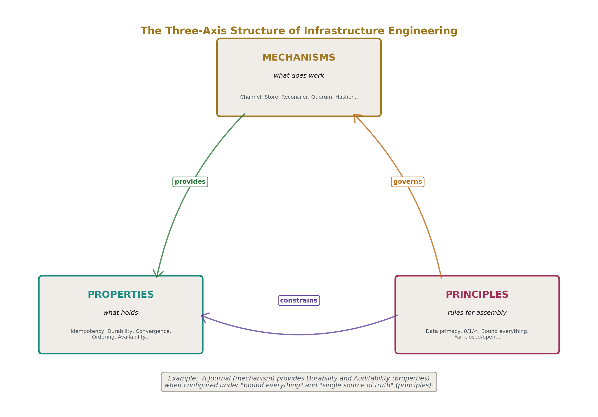
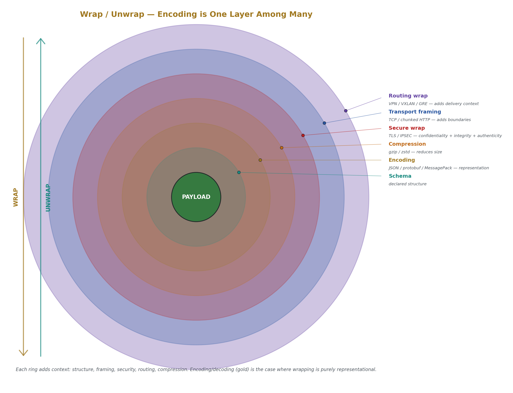
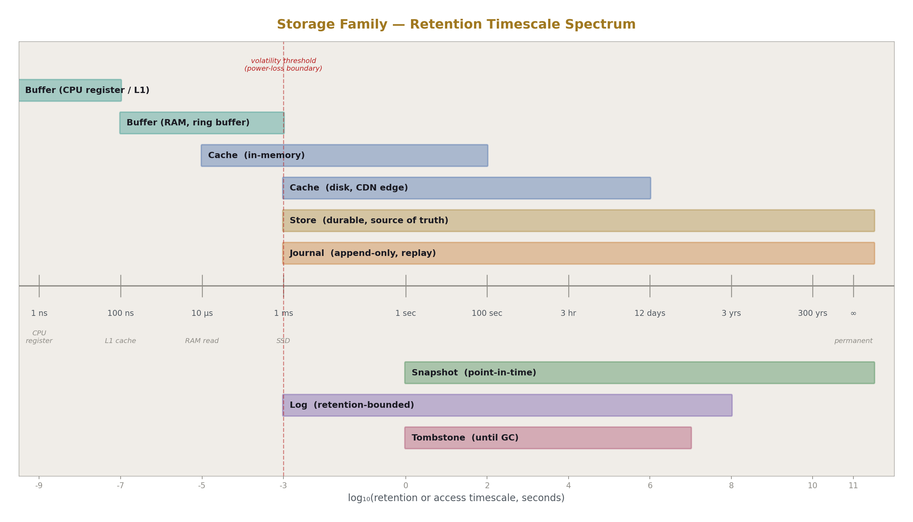
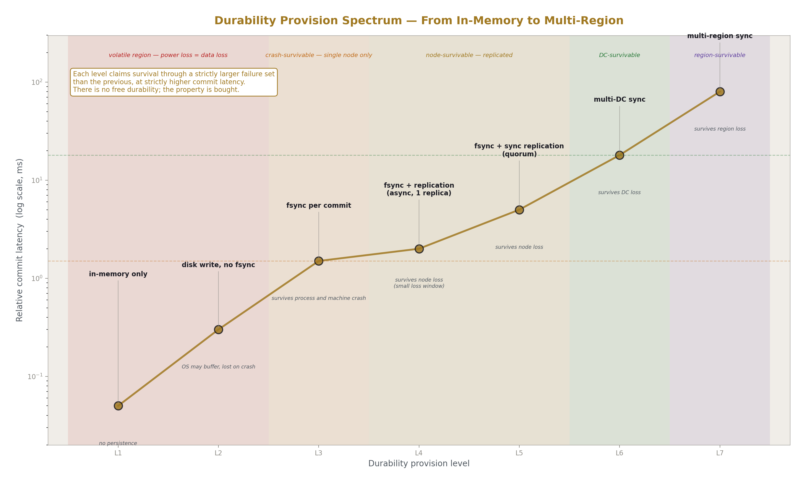
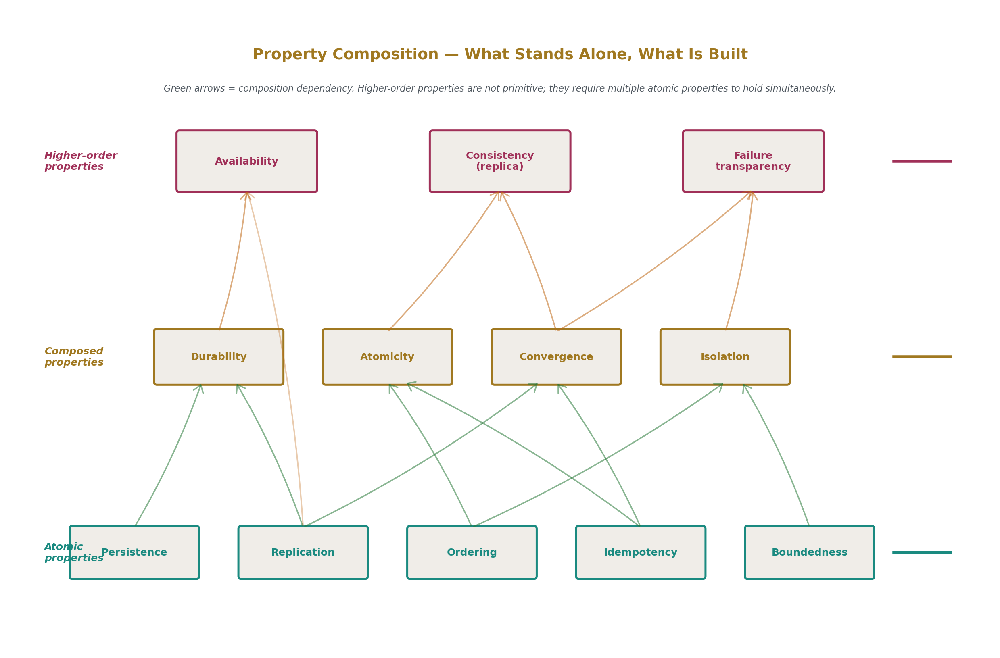
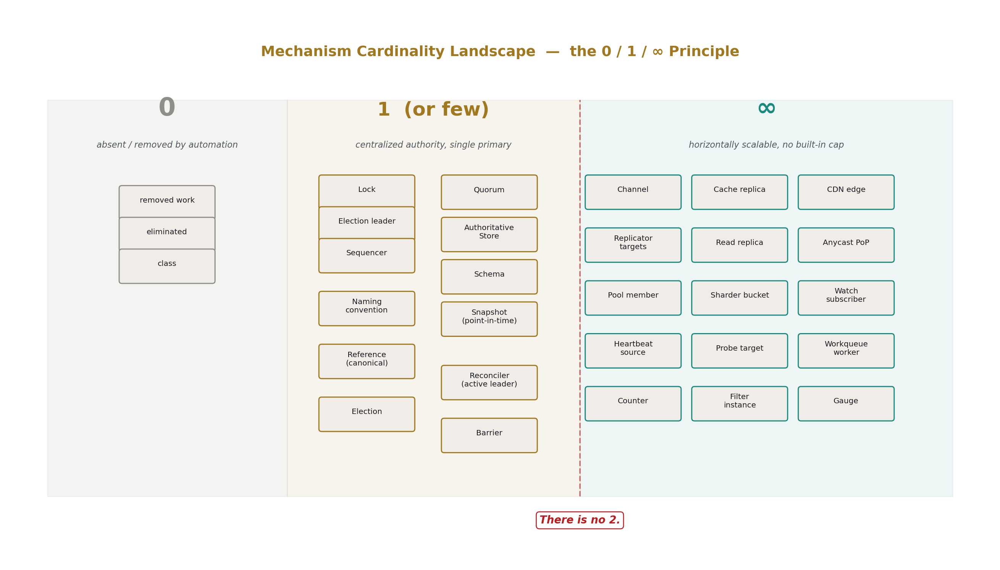
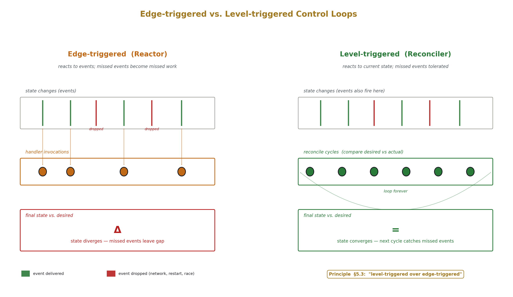
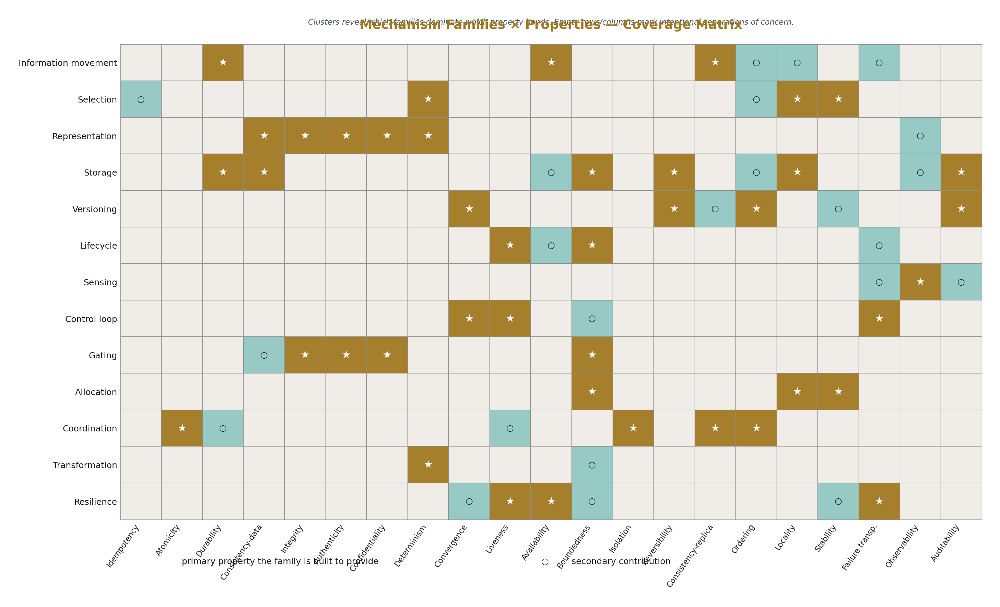

# Infrastructure Taxonomy
## A Taxonomy of Infrastructure Mechanisms, Properties, and Principles

**AI Usage Disclosure:** Only the top metadata, figures, refs and final copyright sections were edited by the author. All paper content was LLM-generated using Anthropic's Opus 4.7. 

---

### Abstract

Infrastructure engineering discusses systems and tools, not the underlying parts those systems are built from. The same word commonly names a mechanism, a property, and a principle (durability is a mechanism implemented via journaling and replication; durability is a property claimed about committed data; "durability principles" govern how the mechanisms are configured). This conflation prevents precise comparison and prevents engineering decisions from being inspectable.

This paper presents a three-axis taxonomy. Axis 1 enumerates the mechanisms — the building blocks that perform work. Axis 2 enumerates the properties — the contracts that hold over those mechanisms. Axis 3 enumerates the principles — the rules that govern assembly. Each axis is populated; the relationships between axes are specified.

---

## 1. Introduction

Infrastructure engineering frequently operates with imprecise vocabulary. Three distinct things are named with overlapping words: what a component does (the mechanism), what it guarantees (the property), and the rules that govern its proper use (the principle). The word "durability" can refer to a mechanism (write-ahead logging plus fsync plus replication), a property (the contract that committed data survives a defined set of failures), or a principle (the rule that critical data must survive single-node failure). The same applies to "consistency," "ordering," and several others.

This paper separates these three. It presents a three-axis taxonomy: mechanisms, properties, principles. The taxonomy is purely descriptive. It does not prescribe construction, recommend implementations, or evaluate systems. It names the parts.

The scope is infrastructure: networked systems, server operations, configuration, orchestration, storage, and the data and control planes that connect them. Application internals, language design, and hardware design are out of scope except where they expose mechanisms that infrastructure consumes.



---

## 2. Terminology and ground rules

A **mechanism** is a unit of work-doing. It takes inputs, produces outputs, and performs side effects. Mechanisms are identified by their interface, not their implementation.

A **property** is a contract. It states a claim that holds over operations performed by one or more mechanisms — across operations, across failures, across time. Properties are independent of mechanisms; multiple mechanisms can provide the same property, and a single mechanism may provide a property only under specific configurations.

A **principle** is a rule that governs choice and assembly. Principles do not perform work and do not make claims about specific guarantees. They constrain which mechanisms to pick when multiple options exist, how to configure mechanisms, and how to combine them.

The same word will sometimes name a mechanism and a property. The paper resolves this by always qualifying: "durability mechanism" versus "durability property." This is the central separation in the paper.

The paper uses **Real** to mean physical and **Virtual** to mean non-physical. Mechanisms in this paper are virtual unless explicitly noted; they manipulate virtual things even when those virtual things describe physical reality.

**Wrap/unwrap** is used as the general operation of which encoding/decoding is one case. Wrapping a payload in a layer that adds context, structure, framing, encryption, signing, or routing metadata covers TLS over TCP, IPSEC over IP, VPNs over public networks, base64 over bytes, JSON or protobuf over fields, tar over files, and HTTP over a body. Encoding/decoding is the case where wrapping adds purely representational context.

Mechanisms are **bold-italic** on first use. Properties are **bold** on first use. Principles are *italic* on first use.



---

## 3. The mechanism axis

This section enumerates the mechanisms. Each mechanism has a name, a definition stated in terms of inputs/outputs/side effects, sub-types where the mechanism has meaningful variants, notes on what mechanisms it commonly composes with, and an explicit boundary statement.

Mechanisms are grouped into families for navigation. The grouping is not constraining; some mechanisms genuinely span families (see §7.2).

### 3.1 Information movement family

Mechanisms that cause bytes or messages to travel from one location to another.

***Channel.*** A path along which bytes travel between two endpoints.

Sub-types: by **persistence** (long-lived connection vs. ephemeral per-message); by **reliability** (lossless with retransmission vs. best-effort); by **ordering** (preserves send order vs. reorders); by **direction** (unidirectional, bidirectional, half-duplex); by **framing** (stream of bytes vs. discrete messages).

Composes with: Encoders/decoders for wire format. Authenticators for endpoint identity. Limiters for rate control. Filters for content selection.

Boundary: a Channel transports; it does not itself decide who sends or receives. Routing decisions belong to Router.

***Fanout.*** One source emits to many destinations.

Sub-types: **broadcast** (all destinations receive every message); **multicast** (subscribers to a topic receive matching messages); **anycast** (one destination from a set receives, chosen by a metric); **selective** (rules pick which destinations match each message).

Composes with: Channels (one per destination, or a shared substrate). Selectors (deciding which destinations match). Sequencers (when ordering across destinations matters).

Boundary: Fanout duplicates a single emission to multiple receivers. It does not aggregate; that is Funnel.

***Funnel.*** Many sources emit to one collector.

Sub-types: by **mixing** (interleave per-source streams vs. merge by some key); by **buffering** (immediate forward vs. accumulate-then-forward); by **deduplication** (collapse duplicates vs. preserve all).

Composes with: Channels (one per source). Comparators (for deduplication). Buffers (for accumulation).

Boundary: Funnel collects; it does not select among competing sources, that is Selector.

***Replicator.*** Copies state from one holder to another, continuously or on demand.

Sub-types: by **direction** (pull from source, push to target, peer-to-peer); by **timing** (synchronous, asynchronous, periodic); by **scope** (full state, incremental delta, on-demand subset); by **fidelity** (byte-identical, semantically equivalent, eventually equivalent).

Composes with: Stores (the source and target). Journals (often the input to incremental Replicators). Version stamps (to track replication progress). Sequencers (for ordering replicated changes).

Boundary: Replicator maintains copies. It does not arbitrate among copies; that is Election or Quorum. It does not provide durability beyond what the underlying Stores provide.

***Relay.*** Receives on one channel, emits on another, possibly with transformation.

Sub-types: **proxy** (relays application protocol with possible inspection); **tunnel** (encapsulates one protocol inside another); **gateway** (translates between protocols); **bridge** (relays at a layer below the application).

Composes with: Channels (input and output). Wrap/unwrap mechanisms (when changing protocol). Filters (when inspecting). Mutators (when modifying in flight).

Boundary: Relay forwards. Decisions about which target to forward to belong to Router.

### 3.2 Selection family

Mechanisms that choose among candidates.

***Index.*** A data structure that maps a key to a location, accelerating lookup.

Sub-types by **lookup shape**: equality (hash index), range (B-tree), prefix (trie), set membership (bloom filter as approximate, exact set as precise), geometric (R-tree, GiST), full-text (inverted index), probabilistic (HyperLogLog for cardinality, count-min sketch for frequency).

Composes with: Stores (an index typically points into a Store). Hashers (for hash indexes). Comparators (for ordered indexes).

Boundary: an Index accelerates lookup; it does not store the primary data, and it does not decide which keys to look up.

***Selector.*** Given a population, returns a subset matching a predicate.

Sub-types: **label match** (equality on tags or attributes); **expression match** (boolean expressions over fields); **regex match** (pattern over names); **set membership** (in a known list); **compound** (combinations of the above).

Composes with: Indexes (for efficient evaluation). Comparators. Stores (the population being selected from).

Boundary: Selector returns the whole subset. Picking one from the subset is Ranker or Router.

***Comparator.*** Given two things, decides whether they are equal, ordered, or different in a specific way.

Sub-types: **equality** (same or not); **ordering** (less, equal, greater); **structural** (deep equality across nested values); **fuzzy** (similar within a threshold); **versioned** (which is the newer state).

Composes with: Indexes (for ordering). Selectors (for filtering). Mergers (for conflict resolution).

Boundary: Comparator answers a question about two things. It does not select among many; that is Selector.

***Hasher.*** Deterministic function from input to bounded output.

Sub-types: **cryptographic** (SHA-256, SHA-3 — collision-resistant, expensive); **non-cryptographic** (CRC32, xxHash, MurmurHash — fast, no security claim); **consistent** (minimizes remappings when the bucket count changes); **locality-sensitive** (similar inputs hash to nearby outputs); **content-addressed** (the hash is the identifier).

Composes with: Indexes (hash indexes). Sharders (hash-based placement). Comparators (content-addressed equality). Bloom filters (membership probes).

Boundary: A Hasher produces a fixed-size summary. It does not decide what to do with the result.

***Ranker.*** Given candidates, orders them by score.

Sub-types: **single-criterion** (one metric); **multi-criterion** (weighted combination); **lexicographic** (ordered tiers of criteria); **learned** (model-based scoring).

Composes with: Selectors (Ranker often runs over a Selector's output). Sensing mechanisms (Counter, Gauge, Histogram, providing the input metrics).

Boundary: A Ranker produces an order. Picking the top-N or routing to the top-1 is Router.

***Router.*** Given an input, picks an output path.

Sub-types: **table-driven** (lookup against rules); **hash-based** (input hashed to bucket); **load-aware** (uses current capacity signals); **policy-based** (rules over input attributes); **content-based** (rules over input payload).

Composes with: Selectors (to find candidate paths). Rankers (to order them). Routers commonly take a Selector's output and a Ranker's order, then pick.

Boundary: A Router picks one path per input. Sending to multiple is Fanout.

### 3.3 Representation family

Mechanisms that determine how things are expressed.

***Wrap/unwrap.*** A pair of mechanisms that encapsulate a payload in a layer adding context, structure, framing, encryption, signing, or routing metadata, and the inverse operation.

Sub-types: **representational** (encoding/decoding — JSON, protobuf, base64, MessagePack — adds structure but no security or routing); **secure** (TLS, IPSEC, signed envelopes — adds confidentiality, integrity, authenticity); **routing** (VPN, GRE, VXLAN, MPLS — adds delivery context); **archival** (tar, zip — bundles multiple things into one); **framing** (HTTP chunked encoding, length-prefixed messages — adds boundaries to streams); **compressing** (gzip, zstd — reduces size, adds dictionary or codec metadata).

Composes with: Channels (wrapped payloads typically travel over channels). Schemas (representational wrap/unwrap usually validates against a schema). Authenticators (secure wrap/unwrap embeds identity).

Boundary: Wrap/unwrap converts between forms of the same logical content. It does not change what the content means. The unwrap of a wrap returns the original (within whatever fidelity the codec promises).

***Schema.*** A description of permissible structure, constraining what valid wrapped values look like.

Sub-types: **strict** (every field defined, extras rejected); **permissive** (defined fields enforced, extras allowed); **versioned** (multiple compatible versions coexist); **structural** (shape only); **semantic** (shape plus value constraints).

Composes with: Validators (which enforce schema). Encoders/decoders (which use schema). Versioning mechanisms (for schema evolution).

Boundary: A Schema describes; it does not enforce. Enforcement is Validator's job.

***Namespace.*** A scope within which names are unique and resolvable.

Sub-types: by **structure** (flat, hierarchical, federated); by **resolution** (lookup table, function, distributed protocol); by **scope** (local, organizational, global).

Composes with: Naming conventions (which produce names within namespaces). Indexes (which often back resolution).

Boundary: A Namespace defines uniqueness; it does not produce names.

***Naming convention.*** A function that constructs identifiers from component data deterministically.

Sub-types: **positional** (component meaning fixed by position in the name); **tagged** (component meaning given by labels); **hierarchical** (each component selects within its parent); **encoded** (components packed into a fixed-width identifier — composite keys, IP bit-fields, snowflake IDs).

Composes with: Namespaces (the scope a convention operates within). Hashers (for encoded conventions). Schemas (defining the components and their valid values).

Boundary: A Naming convention produces names. The mapping from name to resource is the Namespace's resolution function.

### 3.4 Storage family

Mechanisms that hold data over time.

***Buffer.*** In-memory holder of bounded size.

Sub-types: **FIFO queue** (first-in first-out); **LIFO stack** (last-in first-out); **ring buffer** (overwrites oldest when full); **priority queue** (ordered by score).

Composes with: Channels (for in-flight messages). Workqueues (which are typed buffers). Limiters (using buffer depth as a signal).

Boundary: A Buffer is volatile. Survival across restart belongs to Store, Journal, or Snapshot.

***Cache.*** A fast, capacity-bounded copy of data whose source of truth is elsewhere.

Sub-types: by **placement** (in-process, sidecar, remote, tiered); by **admission** (every access populates, only on threshold); by **eviction** (LRU, LFU, FIFO, TTL, random, weighted); by **invalidation** (TTL, explicit, versioned-key, write-through, event-driven); by **consistency** (eventually consistent with source, write-through synchronous).

Composes with: Stores (the source of truth). TTL (for time-based eviction). Comparators (for version-based invalidation). Hashers (for cache key construction).

Boundary: A Cache is rebuildable from its source. If losing the cache loses data, it is a Store, not a Cache.

***Store.*** A durable holder, source of truth.

Sub-types: by **structure** (key-value, relational, document, columnar, graph, blob); by **durability mechanism** (synchronous fsync, async, replicated); by **access pattern** (random, sequential, append-only).

Composes with: Indexes (for lookup). Journals (for durability). Snapshots (for backup). Replicators (for distribution).

Boundary: a Store is the authoritative location for some data. It is not a Cache, even if implemented similarly.

***Journal.*** Append-only sequential record of events or changes, suitable for replay.

Sub-types: **operation log** (records what happened); **state delta log** (records the change); **redo log** (replay produces the new state); **undo log** (replay reverses a change); **mixed** (both directions).

Composes with: Stores (a Journal often makes a Store durable). Replicators (Journal as input). Snapshots (Journal-since-snapshot is the recovery input). Sequencers (giving Journal entries an order).

Boundary: A Journal is intended for replay. A Log without replay intent is a Log, not a Journal.

***Log.*** Append-only record of events without replay-for-recovery as the purpose.

Sub-types: **structured log** (fields, types, queryable); **unstructured log** (free text); **audit log** (for accountability); **access log** (for traffic analysis); **diagnostic log** (for troubleshooting).

Composes with: Funnels (for centralization). Filters (for reducing volume). Buffers (for batching).

Boundary: a Log records for inspection. A Journal records for replay. Same shape, different intent.

***Snapshot.*** Point-in-time copy of state.

Sub-types: **full** (entire state); **incremental** (changes since previous snapshot); **logical** (semantic copy, replayable elsewhere); **physical** (block-level copy, restorable to identical platform); **consistent** (captured atomically); **fuzzy** (captured over time, may not be a single moment).

Composes with: Stores (the source of the snapshot). Journals (snapshot plus journal-since-snapshot is a common recovery model). Replicators (snapshot as bootstrap input).

Boundary: a Snapshot is a frozen copy. It is not the live state.

***Tombstone.*** Marker that something was deleted, distinct from absence-of-data.

Sub-types: by **scope** (per-row, per-column, per-range); by **lifetime** (forever, until garbage-collected, until acknowledged by all replicas).

Composes with: Stores (where tombstones live alongside data). Replicators (tombstones must propagate). Reapers (which eventually remove tombstones).

Boundary: A Tombstone exists because absence is ambiguous in distributed systems. In a single-node store with no replication, tombstones are unnecessary.



### 3.5 Versioning family

Mechanisms that preserve and manage state lineage.

***Version stamp.*** Monotonic identifier attached to a state.

Sub-types: **scalar** (single increasing number — sequence, LSN); **logical clock** (Lamport timestamp); **vector clock** (per-actor counters); **wall-clock** (timestamp, with skew risk); **content hash** (the stamp is the hash of the content); **opaque** (etag, resourceVersion — identity without semantics); **hybrid** (scalar plus another component).

Composes with: Histories (sequences of stamps). Comparators (which is newer). Sequencers (which produce stamps).

Boundary: A Version stamp identifies a state. It does not by itself preserve states; that is History.

***History.*** Ordered sequence of versions, with the relationship between versions preserved.

Sub-types: **linear** (each version has one parent); **branching** (versions can have multiple children); **DAG** (versions can have multiple parents — merges); **forgetful** (older versions garbage-collected); **complete** (all versions retained).

Composes with: Version stamps (identifying nodes). Stores (where History entries live). References (named pointers into History).

Boundary: A History preserves lineage. Identifying which version is "current" is a Reference's job.

***Merge algorithm.*** Given two divergent histories from a common ancestor, produces a unified history.

Sub-types: **last-write-wins** (highest stamp wins); **three-way merge** (compare both against common ancestor); **CRDT** (mathematically guaranteed convergent merge for specific data shapes); **operational transformation** (concurrent edits transformed to apply in any order); **manual** (operator resolves conflicts).

Composes with: Histories (the inputs and output). Comparators (for detecting differences). Diffs (for representing changes).

Boundary: A Merge algorithm reconciles divergence. The detection of divergence is Comparator's job.

***Diff.*** Structural description of the change between two versions.

Sub-types: **textual** (line-based, character-based); **structural** (per-field for typed data); **operation-based** (the sequence of edits); **semantic** (meaning-preserving rather than literal).

Composes with: Histories (Diff between adjacent versions). Replicators (sending Diffs rather than full copies — see rsync's delta). Merge algorithms (which apply diffs).

Boundary: A Diff describes a change. Applying it is a separate operation.

***Reference.*** A named pointer to a version.

Sub-types: **named** (branch name, tag, alias); **symbolic** (HEAD, current, latest); **anchored** (pinned to specific stamp); **mutable** (reassignable); **immutable** (set once).

Composes with: Histories (References point into Histories). Naming conventions (References are named entities).

Boundary: A Reference points; it is not the version itself.

### 3.6 Lifecycle family

Mechanisms that bound a thing's extent in time.

***TTL.*** Time after which a thing is considered expired.

Sub-types: **absolute** (expires at a specific time); **relative** (expires after a duration since creation); **idle** (expires after a duration since last access); **conditional** (expires when a predicate becomes true).

Composes with: Reapers (which act on expiration). Caches and Stores (where TTLs are applied).

Boundary: TTL marks expiration; it does not perform the removal. Reaper does.

***Lease.*** Time-bounded grant of authority over a resource.

Sub-types: **renewable** (can be extended before expiration); **non-renewable** (must reacquire); **exclusive** (only one holder); **shared** (multiple holders); **revocable** (granter can withdraw); **non-revocable** (holder owns until expiration).

Composes with: Locks (an exclusive Lease is a time-bounded Lock). Elections (leader leases). Reapers (cleanup of expired leases).

Boundary: A Lease grants conditional, expiring authority. Permanent grants are not Leases.

***Reaper.*** Process that removes expired or abandoned things.

Sub-types: **lazy** (acts on access); **active** (scheduled scans); **event-driven** (acts on expiration notifications); **batch** (accumulates work and acts in bursts).

Composes with: TTLs (which produce expiration). Stores and Caches (the populations being reaped). Tombstones (which Reapers eventually remove).

Boundary: A Reaper removes; it does not decide what counts as expired.

***Drainer.*** Process that gracefully removes things from active service before destroying them.

Sub-types: **connection-level** (let in-flight connections finish); **request-level** (let in-flight requests finish); **timeout-bounded** (wait up to a deadline, then force); **state-aware** (wait for specific safe states).

Composes with: Health probes (which detect drained state). Reapers (which destroy after draining). Failover mechanisms (drain-then-fail-over).

Boundary: A Drainer transitions out of service. Final removal is a separate step.

### 3.7 Sensing family

Mechanisms that produce data about state.

***Probe.*** Synthetic test of liveness, health, or correctness.

Sub-types: **liveness** (is it alive); **readiness** (is it ready to serve); **startup** (is it done initializing); **deep** (does it function correctly end-to-end); **dependency** (are its dependencies reachable). By **mechanism**: HTTP, TCP connect, exec command, gRPC health protocol.

Composes with: Channels (for network probes). Workqueues (for scheduled probes). Counters and Gauges (recording probe results).

Boundary: A Probe asks. Acting on the answer is the consumer's job.

***Counter.*** Monotonic numeric tally of events.

Sub-types: **simple** (single value); **labeled** (per-dimension counters); **resettable** (occasionally zeroed); **non-resettable** (only ever increases).

Composes with: Histograms (which Counters often feed). Gauges (rate-of-change of a Counter is a Gauge). Limiters (Counter as input).

Boundary: A Counter counts. Rates and percentages are derived elsewhere.

***Gauge.*** Current numeric value of a quantity.

Sub-types: **instantaneous** (sampled now); **windowed** (recent values aggregated); **bounded** (with min/max); **derived** (computed from other signals).

Composes with: Histograms (Gauge values feeding distribution). Rankers (using Gauges as scoring inputs). Limiters (Gauge-based throttling).

Boundary: A Gauge reports a current value. History is a separate concern.

***Histogram.*** Bucketed distribution of values over time.

Sub-types: by **bucket scheme** (linear, exponential, custom); by **decay** (cumulative, sliding window, exponentially-weighted); by **percentile estimation** (exact, t-digest, HDRHistogram).

Composes with: Counters (per-bucket counts). Gauges (current percentiles).

Boundary: A Histogram describes a distribution. It does not retain individual samples (in general).

***Watch.*** Subscription to changes in a resource, push-stream of events.

Sub-types: **edge-triggered** (every change emitted); **level-triggered** (current state on subscribe, plus changes); **filtered** (only changes matching criteria); **resumable** (can reconnect from a known position).

Composes with: Channels (the delivery mechanism). Reactors (consumers of Watch streams). Reconcilers (which often use Watches to discover work).

Boundary: A Watch reports changes. Reaction is the subscriber's job.

***Heartbeat.*** Periodic "still alive" emission, distinct from Probe.

Sub-types: by **direction** (push from the watched, pull-and-respond); by **payload** (presence-only, presence-plus-state); by **detection** (timeout-based absence detection, Phi accrual, gossip-amplified).

Composes with: Failure detectors (consuming Heartbeats). Channels (for emission). Counters and Gauges (counting received heartbeats and timing them).

Boundary: a Heartbeat is emitted by the watched. A Probe is initiated by the watcher. Same goal, opposite direction.

### 3.8 Control loop family

Mechanisms that observe and act.

***Reconciler.*** Observes desired state versus actual state, takes action to close the gap. Level-triggered, repeats forever, retries on failure.

Sub-types: by **trigger** (event-driven, periodic, both); by **scope** (per-object, per-namespace, cluster-wide); by **action model** (CRUD operations, declarative apply, custom).

Composes with: Watches (input). Workqueues (work scheduling). Stores (where desired and actual state live). Sensing mechanisms (for actual state).

Boundary: A Reconciler converges. It does not guarantee a specific time bound on convergence; that is a property claim, not a mechanism feature.

***Reactor.*** Receives events, runs handlers. Edge-triggered, fires once per event.

Sub-types: by **delivery** (at-most-once, at-least-once, exactly-once-with-deduplication); by **handler model** (function callback, child process, message dispatch).

Composes with: Watches (event source). Channels (event transport). Filters (event matching).

Boundary: A Reactor reacts. Missed events produce missed reactions; convergence requires Reconciler.

***Scheduler (control loop sense).*** Assigns work to time slots or to resources by policy. (See also Scheduler in Allocation, §3.10.)

Sub-types: **cron-like** (calendar-based triggers); **rate-based** (every N seconds); **priority queue** (highest-priority pending work first); **deadline-driven** (work must complete by a time).

Composes with: Workqueues. Reactors. Limiters.

Boundary: a Scheduler decides when. Deciding what to do is the work itself.

***Workqueue.*** Buffered, deduplicated, retry-aware task list feeding a worker pool.

Sub-types: by **deduplication** (key-based, none); by **retry** (immediate, backoff, dead-letter); by **ordering** (FIFO, priority, none); by **persistence** (in-memory, durable).

Composes with: Buffers (the underlying structure). Reconcilers (workqueues are typical Reconciler internals). Retrier (for backoff logic).

Boundary: A Workqueue holds pending work. Doing the work is a worker's job.

### 3.9 Gating family

Mechanisms that decide what is permitted.

***Authenticator.*** Verifies an identity claim against credentials.

Sub-types: by **factor** (something known, something held, something inherent); by **mechanism** (password, certificate, token, signed assertion, biometric); by **scope** (single-system, federated).

Composes with: Authorizers (which need verified identity). Channels (Authenticators often run at channel establishment). Wrap/unwrap (for credential transport).

Boundary: An Authenticator establishes who. Whether they may do something is Authorizer's job.

***Authorizer.*** Checks permission for (subject, action, object).

Sub-types: **role-based** (RBAC); **attribute-based** (ABAC); **policy-based** (rules engine); **capability-based** (token-as-capability); **mandatory** (system-imposed) versus **discretionary** (owner-controlled).

Composes with: Authenticators (input subject). Filters (which often consult Authorizers). Validators.

Boundary: An Authorizer answers yes/no. Enforcement is the consumer's job.

***Validator.*** Checks that a request meets schema or policy rules before it is accepted.

Sub-types: **schema** (structural); **semantic** (value constraints); **policy** (organizational rules); **invariant** (cross-field consistency).

Composes with: Schemas (input rules). Mutators (often run before Validators). Filters.

Boundary: A Validator accepts or rejects. It does not modify; that is Mutator.

***Mutator.*** Modifies a request in flight before it is accepted.

Sub-types: **defaulting** (fills in unspecified fields); **injection** (adds required components — sidecars, labels); **rewriting** (modifies submitted values); **enrichment** (adds derived data).

Composes with: Validators (Mutator output is Validator input). Schemas. Wrap/unwrap.

Boundary: A Mutator modifies. Acceptance is Validator's decision.

***Filter.*** Accepts, drops, or modifies based on rules.

Sub-types: by **layer** (L2/L3/L4/L7); by **state** (stateless per-message, stateful per-flow); by **rule structure** (linear scan, set-based, tuple-space, compiled); by **action** (accept, drop, reject, log, redirect, mark, rate-limit).

Composes with: Channels (Filters typically run on traffic flowing through Channels). Counters (per-rule). Authorizers (Filters often consult Authorizers).

Boundary: A Filter operates per-message. It does not maintain conversation state across messages unless it is specifically a stateful Filter.

***Limiter.*** Bounds rate or concurrency.

Sub-types: by **algorithm** (token bucket, leaky bucket, fixed window, sliding window, semaphore); by **scope** (per-source, per-target, global, per-tuple); by **action on excess** (drop, queue, reject, throttle).

Composes with: Counters (input). Authorizers (Limiter as a kind of Authorizer for "may proceed now"). Buffers (when queueing).

Boundary: A Limiter constrains volume. It does not select which requests are allowed by content; that is Filter or Authorizer.

### 3.10 Allocation family

Mechanisms that decide how much of what.

***Pool.*** Collection of equivalent resources from which one can be checked out and returned.

Sub-types: **fixed-size** (pre-allocated); **elastic** (grows and shrinks); **per-tenant** (isolated pools); **shared** (multi-tenant); **prioritized** (some borrowers preferred).

Composes with: Quotas (per-borrower limits). Limiters (waiting for resources). Drainers (for graceful pool reduction).

Boundary: A Pool provides resources on request. It does not perform work; the resources do.

***Quota.*** Maximum amount of a resource a party may consume.

Sub-types: **hard** (enforced strictly); **soft** (warning, no enforcement); **burstable** (short overruns allowed); **fair-share** (proportional allocation under contention).

Composes with: Counters (current consumption). Limiters (enforcement). Authorizers (Quota check as authorization).

Boundary: A Quota states a limit. Enforcement is Limiter's job.

***Scheduler (allocation sense).*** Assigns work to resources by placement policy. (See also Scheduler in Control loop, §3.8.)

Sub-types: by **selection** (filter+score+bind); by **constraints** (affinity, anti-affinity, spread, gravity); by **preemption** (low-priority work evicted for high-priority).

Composes with: Pools (the resources). Selectors (filtering candidates). Rankers (scoring). Sensing mechanisms (for resource state).

Boundary: an allocation Scheduler picks where. Picking when is the control-loop Scheduler's job; the same name spans both because they share core algorithms.

***Sharder.*** Partitions a workload across resources.

Sub-types: **hash-based** (key hashed to shard); **range-based** (key ranges per shard); **directory-based** (lookup table); **consistent-hash** (minimizes remappings on shard count change).

Composes with: Hashers. Pools (shards as a Pool). Routers (directing work to the chosen shard). Replicators (when shards have replicas).

Boundary: A Sharder decides which shard. Replication within a shard is separate.

### 3.11 Coordination family

Mechanisms that synchronize multiple parties.

***Lock.*** Exclusive access primitive.

Sub-types: by **scope** (in-process mutex, cross-process file lock, distributed lock); by **fairness** (FIFO, no guarantee); by **mode** (exclusive, shared, upgradable); by **reentrancy** (recursive vs. not).

Composes with: Leases (a distributed Lock is often a Lease). Quorums (correctness of distributed Locks often depends on Quorum). Election (Lock as election outcome).

Boundary: A Lock serializes access. It does not by itself ensure correctness of what happens under the lock.

***Election.*** Protocol that selects one among many.

Sub-types: by **algorithm** (Raft, Paxos, ZAB, simple highest-ID, lease-based); by **scope** (single-leader, per-shard, per-key); by **failover** (manual, automatic, semi-automatic).

Composes with: Heartbeats (failure detection input). Leases (the elected role often holds a Lease). Quorums (most elections require Quorum).

Boundary: An Election picks a leader. What the leader then does is separate.

***Barrier.*** Synchronization point where participants wait until all have arrived.

Sub-types: **count-based** (wait for N); **named** (wait for specific participants); **phased** (multi-stage barrier).

Composes with: Workqueues (work past a Barrier). Sensing mechanisms (for arrival detection).

Boundary: A Barrier is a meeting point. It does not specify what happens before or after.

***Quorum.*** Rule requiring N-of-M parties to agree.

Sub-types: **majority** (more than half); **plurality**; **weighted** (votes per party vary); **read-quorum vs write-quorum** (different sizes for different ops).

Composes with: Replicators (Quorum-based replication). Elections. Stores (Quorum-based writes).

Boundary: A Quorum is a counting rule. The thing being agreed about is separate.

***Sequencer.*** Assigns monotonic positions or timestamps.

Sub-types: **single-source** (one sequencer, contention); **distributed** (snowflake-style, partitioned); **logical** (Lamport); **vector** (per-actor); **wall-clock** (with skew risk); **hybrid** (logical-plus-physical).

Composes with: Version stamps (the output). Journals (Journal entries get sequence numbers). Replicators (sequence determines replay order).

Boundary: a Sequencer assigns order. Enforcing that order in execution is consumers' job.

### 3.12 Transformation family

Mechanisms that produce new data from input data.

***Renderer.*** Produces output by combining template with data.

Sub-types: by **template language** (Jinja, Mustache, Go templates, custom); by **scope** (per-field, whole-document); by **chaining** (single-stage vs. pipeline of renderers).

Composes with: Stores (data source). Schemas (validating output). Wrap/unwrap (output often emitted in a serialization format).

Boundary: A Renderer produces a representation. It does not interpret or execute the result.

***Transformer.*** Pure function from input to output.

Sub-types: **map** (per-element); **filter** (subset); **reduce** (aggregate); **fold** (accumulate); **flat-map** (one-to-many); **codec** (specific Transformer for wrap/unwrap).

Composes with: Channels (Transformer in-line with data flow). Workqueues (Transformer as worker function).

Boundary: A Transformer is pure. Side effects belong elsewhere.

***Compactor.*** Merges multiple inputs into a smaller equivalent output.

Sub-types: **log compaction** (collapse to latest-per-key); **SSTable compaction** (merge sorted runs); **defragmentation** (rewrite to remove gaps); **incremental** (work over time); **stop-the-world** (all-at-once).

Composes with: Stores. Journals. Reapers (Compactor often removes Tombstones).

Boundary: A Compactor reduces redundancy without semantic change.

### 3.13 Resilience family

Mechanisms that handle failure.

***Retrier.*** Re-runs a failed operation, possibly with backoff and jitter.

Sub-types: **immediate** (no delay); **exponential backoff**; **jittered backoff** (randomized); **bounded** (max attempts); **deadline-bounded** (max total time); **idempotency-aware** (only retries if safe).

Composes with: Workqueues. Circuit breakers (which gate retries). Limiters (retry budgets).

Boundary: A Retrier re-attempts. Whether the operation is safe to retry depends on its idempotency property, which is upstream.

***Circuit breaker.*** Opens to stop calling a failing dependency, half-opens to test recovery.

Sub-types: by **detection** (error rate, latency, both); by **recovery probe** (single test request, gradual); by **scope** (per-target, per-call-site, global).

Composes with: Counters (failure detection input). Retriers (Circuit breaker gates Retrier). Hedgers.

Boundary: A Circuit breaker stops calls. Restoring service when the dependency recovers is its half-open phase, but actual recovery is the dependency's responsibility.

***Bulkhead.*** Isolates failure domains so one failing component cannot drag others down.

Sub-types: **thread-pool isolation** (per-dependency thread pools); **process isolation**; **machine isolation**; **cell isolation** (whole sets of resources separated).

Composes with: Pools (Bulkhead implementation). Quotas (per-domain limits). Limiters.

Boundary: A Bulkhead separates. It does not by itself improve any single component.

***Hedger.*** Issues redundant requests to reduce tail latency.

Sub-types: **immediate** (parallel from start); **delayed** (issue secondary if primary slow); **bounded** (max concurrent attempts); **canceling** (cancel losers when winner returns).

Composes with: Channels. Comparators (deduplicating responses). Limiters (bounding hedge volume).

Boundary: A Hedger trades load for latency. It assumes idempotency in the operation.

***Failover mechanism.*** Switches from primary to standby on failure detection.

Sub-types: **active-passive** (standby idle until promoted); **active-active** (multiple primaries, one assumes role on failure); **automatic** (on detection); **manual** (operator-triggered); **planned** (graceful) versus **unplanned** (after detected failure).

Composes with: Election (failover often involves Election). Drainer (graceful failover drains first). Heartbeats (detection). Leases.

Boundary: A Failover mechanism transfers a role. The actual work the role does is separate.

### 3.14 Family summary table

| Family | Mechanisms |
|---|---|
| Information movement | Channel, Fanout, Funnel, Replicator, Relay |
| Selection | Index, Selector, Comparator, Hasher, Ranker, Router |
| Representation | Wrap/unwrap, Schema, Namespace, Naming convention |
| Storage | Buffer, Cache, Store, Journal, Log, Snapshot, Tombstone |
| Versioning | Version stamp, History, Merge algorithm, Diff, Reference |
| Lifecycle | TTL, Lease, Reaper, Drainer |
| Sensing | Probe, Counter, Gauge, Histogram, Watch, Heartbeat |
| Control loop | Reconciler, Reactor, Scheduler, Workqueue |
| Gating | Authenticator, Authorizer, Validator, Mutator, Filter, Limiter |
| Allocation | Pool, Quota, Scheduler, Sharder |
| Coordination | Lock, Election, Barrier, Quorum, Sequencer |
| Transformation | Renderer, Transformer, Compactor |
| Resilience | Retrier, Circuit breaker, Bulkhead, Hedger, Failover mechanism |

Scheduler appears in two families (Control loop and Allocation) because the same mechanism shape serves two purposes; see §7.2.

---

## 4. The property axis

This section enumerates the contracts that mechanisms can be claimed to provide. Each property has a name, a definition stated as a claim, the conditions under which the claim holds, common ways the property is partially or conditionally provided, and explicit notes on what the property does not claim.

### 4.1 Data integrity properties

**Idempotency.** Claim: applying the same operation with the same inputs more than once yields the same end state as applying it once.

Conditions: same operation, same inputs, no other concurrent state changes interleaved. Some idempotent operations require uniqueness keys or version checks to be idempotent against retries.

Partial provision: an operation may be idempotent on success but not on failure (a partial failure left state mid-update). An operation may be idempotent against itself but not against other operations that touch the same state.

Does not claim: that the operation has no side effects, only that repeated application converges to the same end state.

**Atomicity.** Claim: a defined unit of work either fully completes or has no externally visible effect.

Conditions: the unit must be specified — a single operation, a transaction, a batch. The visibility boundary must be specified — within a single process, across replicas, across systems.

Partial provision: atomic on the local store but not across replicas; atomic per-row but not per-batch; atomic on success path but partially visible on failure.

Does not claim: that other parties are blocked during the operation; that is Isolation.

**Durability (as contract).** Claim: data acknowledged as committed survives the failure modes specified.

Conditions: must specify which failures (process crash, machine power loss, disk failure, datacenter loss, region loss). Stronger durability claims require more replication or more synchronous commits, costing latency.

Partial provision: durable to disk but not replicated; durable to one replica but not a quorum; durable in primary region but not after region failure.

Does not claim: that data is correct, only that it survives.

**Consistency (data integrity sense).** Claim: declared constraints and invariants among data items hold at the boundaries specified.

Conditions: constraints must be declared (foreign keys, uniqueness, check constraints, application invariants). Boundaries must be specified (transaction boundary, eventual after replication).

Partial provision: foreign keys enforced but application invariants not; constraints deferred until commit but checked there; constraints relaxed under specific operations (mass loads).

Does not claim: anything about replica freshness or about ordering.

**Integrity.** Claim: data has not been altered without detection between defined points.

Conditions: requires checksums, signatures, or attested storage. The points between which integrity is claimed must be specified.

Partial provision: integrity in transit but not at rest; integrity at rest but not against malicious storage operators; integrity within a system but not across system boundaries.

Does not claim: confidentiality or authenticity, though those properties often share mechanisms.

**Authenticity.** Claim: the source of data or a request is verifiable.

Conditions: requires a trust root and signing or proof mechanism. The verification party must trust the root.

Partial provision: authenticity of the immediate sender (TLS) but not the original author (end-to-end signing); authenticity of the data but not of when it was authored.

Does not claim: that the authenticated source is acting honestly, only that the source is who they claim.

**Confidentiality.** Claim: data is unreadable to unauthorized parties.

Conditions: must specify which parties are authorized and which are not; must specify the threat model (passive observation, active attacker, compromised endpoint).

Partial provision: confidentiality in transit but not at rest; confidentiality from network observers but not from storage operators; confidentiality against external attackers but not against insiders.

Does not claim: integrity or authenticity.



### 4.2 Behavioral properties

**Determinism.** Claim: same inputs produce the same outputs and the same side effects.

Conditions: must specify what counts as input. Time, randomness, concurrency, and external state are all potential sources of nondeterminism that may or may not be in scope.

Partial provision: deterministic in pure logic but not in I/O ordering; deterministic per-thread but not across threads; deterministic given identical clocks but not with skew.

Does not claim: correctness, only repeatability.

**Convergence.** Claim: repeated application of a process drives state toward a fixed point.

Conditions: must specify the fixed point and the conditions under which convergence is guaranteed (no further input changes, no failures).

Partial provision: converges in steady state but not while inputs change; converges to a set of valid states but not a unique one; converges given enough retries but with no time bound.

Does not claim: a time bound on convergence, only that progress is made.

**Liveness.** Claim: the system continues to make progress under specified conditions.

Conditions: must specify "progress" (some operation completes, every queued operation eventually completes, throughput remains above a threshold) and "conditions" (no failures, fewer than F failures, partition heal within time T).

Partial provision: liveness for reads but not writes; liveness for some clients but not others under load.

Does not claim: latency bounds on individual operations.

**Availability.** Claim: the system responds within a specified timeframe under specified conditions.

Conditions: response timeframe, percentage of requests, conditions of normal operation. An availability claim without these is incomplete.

Partial provision: available for reads but not writes; available within a region but not globally; available for cached responses but not fresh ones.

Does not claim: that responses are correct or recent, only that responses come.

**Boundedness.** Claim: a resource's consumption stays within a specified limit.

Conditions: the resource must be named (memory, connections, queue depth, rate). The limit must be specified.

Partial provision: bounded in steady state but unbounded during failures; bounded per-tenant but unbounded in aggregate.

Does not claim: that the limit is sufficient for any particular workload.

**Isolation.** Claim: concurrent operations do not visibly interfere with each other.

Conditions: must specify the level (read uncommitted, read committed, repeatable read, snapshot, serializable). Stronger levels permit fewer interference patterns.

Partial provision: isolation within a transaction but not across them; isolation for reads but not writes; isolation that allows specific anomalies (write skew, lost updates) at lower levels.

Does not claim: ordering, only non-interference.

**Reversibility.** Claim: a completed operation can be undone, fully or partially.

Conditions: the time window during which reversal is possible; the side effects that can or cannot be reversed (external API calls cannot be unmade); whether reversal is automatic or operator-driven.

Partial provision: reversible in the database but not in side effects; reversible within a window but not after; reversible by an operator but not by a user.

Does not claim: that the system before and after reversal is byte-identical, only that the visible effect is undone.

### 4.3 Distribution properties

**Consistency (replica sense).** Claim: a read after a write returns the written value, or a value satisfying the specified relationship.

Conditions: must specify the level (linearizable, sequential, causal, eventual, monotonic-read, read-your-writes, bounded-staleness with a bound). Levels are not all comparable; some are weaker, some are sideways.

Partial provision: linearizable in one DC but eventual across DCs; read-your-writes for a session but not across sessions; bounded staleness with most reads under bound but worst-case longer.

Does not claim: data integrity (declared constraints holding); that is data-integrity Consistency.

**Ordering (as guarantee).** Claim: operations apply or appear in a specified order.

Conditions: must specify the order (program order per client, total order across all clients, causal order based on happens-before, partial order). The order may hold for some observers and not others.

Partial provision: total order within a partition but not across; FIFO per producer but interleaved across producers; causal but not total.

Does not claim: any specific operation completes by any specific time.

**Locality.** Claim: related data sits close together in storage or compute terms.

Conditions: closeness must be defined (same disk page, same node, same rack, same DC). Relatedness must be defined (same key prefix, same partition, same tenant).

Partial provision: locality in primary storage but not in cache; locality at write but degraded after rebalancing; locality within shard but not across.

Does not claim: that locality survives all operational events.

**Stability under change.** Claim: adding or removing nodes, keys, or clients does not cause disproportionate disruption.

Conditions: "disproportionate" must be defined (more than 1/N keys remap, more than X% of cache lost, more than Y latency spike).

Partial provision: stable to additions but not removals; stable to fewer than K simultaneous changes; stable in absence of specific failure patterns.

Does not claim: that change is free, only that the cost is bounded.

**Failure transparency.** Claim: failures of specified components are hidden from clients up to specified bounds.

Conditions: which components, which failure types, what bounds (latency increase, error rate increase, timeout).

Partial provision: transparent to single-node failures but not multi-node; transparent for reads but not writes; transparent within a brief window after which the failure surfaces.

Does not claim: that failures are prevented, only that they are not exposed up to the bound.

### 4.4 Operational properties

**Observability.** Claim: relevant state is queryable or subscribable through specified interfaces.

Conditions: which state, through which interfaces, with what latency, at what cost. "Observable in principle" through grep on logs is different from "queryable through a metrics endpoint."

Partial provision: observable in real time but not historically; observable per-component but not in aggregate; observable to operators but not to clients.

Does not claim: that observed state is fresh, only that it is reachable.

**Auditability.** Claim: past operations are reconstructible from preserved records.

Conditions: which operations are recorded, the retention period, the integrity protection on the records, who can read them.

Partial provision: auditable for changes but not reads; auditable within retention but not before; auditable in summary but not detail.

Does not claim: that the audit log itself is tamper-proof unless integrity is separately claimed.

### 4.5 Property orthogonality

The properties enumerated above are mutually independent. No property is derivable from a combination of others. Each captures a distinct claim.

Some properties appear similar and the distinctions matter. **Durability** (data survives failures) is distinct from **persistence** (data exists across process restarts) and from **availability** (data can be read now). A system can be durable but unavailable (data is safe but can't be reached). A system can be available but not durable (data can be read now but won't survive a crash).

**Consistency-data-integrity** (constraints hold) is distinct from **consistency-replica** (replicas agree on a value). A system can have full data integrity on each replica while replicas disagree about which value is current.

**Ordering** is distinct from **isolation**. Ordering is about sequence; isolation is about interference. Operations can be ordered without being isolated (each sees the others' partial state in order) and isolated without being ordered (concurrent transactions don't interfere but no global sequence exists).

**Idempotency** is distinct from **determinism**. An idempotent operation can be nondeterministic (each first-application produces a random ID, but reapplications produce no further change). A deterministic operation can be non-idempotent (an increment is deterministic but not idempotent).



### 4.6 Property summary table

| Property | Claim |
|---|---|
| Idempotency | Repeating an operation yields the same end state as one application |
| Atomicity | A unit either fully completes or has no visible effect |
| Durability | Acknowledged data survives the specified failures |
| Consistency (data) | Declared constraints hold at specified boundaries |
| Integrity | Data unaltered without detection between specified points |
| Authenticity | Source of data or request is verifiable |
| Confidentiality | Data unreadable to unauthorized parties |
| Determinism | Same inputs produce same outputs and side effects |
| Convergence | Repeated application drives state to a fixed point |
| Liveness | The system makes progress under specified conditions |
| Availability | The system responds within a timeframe under specified conditions |
| Boundedness | Resource consumption stays within a specified limit |
| Isolation | Concurrent operations do not visibly interfere |
| Reversibility | Completed operations can be undone, fully or partially |
| Consistency (replica) | Read-after-write returns written value, per specified level |
| Ordering | Operations apply or appear in a specified order |
| Locality | Related data sits close together in specified terms |
| Stability under change | Membership changes cause bounded disruption |
| Failure transparency | Specified failures are hidden from clients up to specified bounds |
| Observability | State is queryable or subscribable through specified interfaces |
| Auditability | Past operations are reconstructible from preserved records |

---

## 5. The principle axis

This section enumerates the rules that govern mechanism choice and configuration. Each principle has a name, a statement of the rule, the reasoning behind the rule, the domains where it applies, and known counter-principles or domain-specific exceptions.

### 5.1 Principles governing data and logic

***Data primacy.*** Data outlives logic. Make data the source of truth; treat logic as the transformation over data. Configuration goes in data, not in code paths.

Reasoning: data is fully knowable and stable across environment changes; logic is unknowable in the general case (halting problem) and tied to its execution environment. Data survives platform migrations, organizational changes, and decade-scale time spans; logic typically does not.

Domains: configuration management, schema design, automation systems, infrastructure-as-code.

Counter-principles: none direct. The principle does not forbid logic; it constrains where state lives.

***Single source of truth.*** Every fact has exactly one authoritative location. All other locations are derived caches.

Reasoning: when a fact lives in multiple authoritative locations, divergence becomes possible, and reconciliation between authoritative sources is harder than between an authority and a cache.

Domains: state management, distributed systems, configuration, identity.

Counter-principles: peer-to-peer systems where no single source is desired, with a Merge algorithm replacing the source-of-truth model.

***Convention over lookup.*** When a function over data can produce the answer, prefer it to a registry that must be queried.

Reasoning: functions are deterministic and require no coordination. Registries require maintenance, can become inconsistent, and add a network call. A naming convention that produces the answer is faster and more reliable than a directory service.

Domains: naming, addressing, identifier construction.

Counter-principles: when the function would be too complex to maintain (high-cardinality, frequently-changing component data), a registry is correct.

### 5.2 Principles governing scale and cardinality

***0/1/∞.*** There are three real cardinalities. Design for whichever is correct; never design for two.

Reasoning: any cardinality greater than one tends toward many under organizational pressure. Building for "two" or "a few" creates a system that breaks at the next growth step. Building for "infinity" from the start handles any growth; building for "one" forces explicit decision when "two" is needed.

Domains: replication topology, instance counts, multi-region design.

Counter-principles: cost considerations may force a small fixed N, with explicit acknowledgment that the design will require change at growth.

***Comprehensive over aggregate.*** Slice the whole; do not accrete from parts. The model exists in totality even before implementation fills it in.

Reasoning: aggregate systems grow by adding components as needed, with no plan for the whole. They become internally inconsistent because no whole was ever planned. Comprehensive systems start with the whole conceptually and fill in implementations against that whole.

Domains: system design, taxonomy construction (this paper), automation architecture.

Counter-principles: minimum viable products often start aggregate. Conversion from aggregate to comprehensive is expensive but is the path most systems must eventually take.

***One way to do each thing.*** Within an environment, converge on one method per task. Many almost-identical implementations are the enemy.

Reasoning: every variant must be maintained, monitored, and understood. Two systems that do the same thing slightly differently produce twice the operational load and confused incident response.

Domains: production environments, operational tooling, deployment pipelines.

Counter-principles: deliberate redundancy for failure independence (different vendors, different codebases for critical systems) is acceptable when the cost is justified by the risk reduction.



### 5.3 Principles governing failure and resilience

***Idempotent retry.*** Every operation that crosses a failure boundary should be safely retryable.

Reasoning: failures are inevitable; retries are the standard recovery mechanism. Non-idempotent operations cannot be safely retried, forcing operators to choose between data loss (don't retry) and duplication (retry blindly).

Domains: distributed systems, message processing, configuration application.

Counter-principles: counter-style operations and side-effect-causing external calls cannot always be made idempotent without uniqueness keys or saga patterns.

***Level-triggered over edge-triggered.*** React to current state, not to events. Missed events are inevitable; missed state is not.

Reasoning: edge-triggered systems lose work when events are missed (network drops, restarts, races). Level-triggered systems compare desired and actual on every iteration, so a missed event just means the next iteration catches it.

Domains: control loops, configuration management, replication.

Counter-principles: pure event reaction is required when state is unbounded or expensive to compare. Hybrid (event-triggered with periodic level-triggered backup) is common.

***Fail closed.*** When uncertain, deny rather than allow.

Reasoning: in security and integrity contexts, allowing the unknown is the larger risk. The cost of false rejection is a failed operation; the cost of false acceptance is a breach or corruption.

Domains: security, authorization, data validation.

Counter-principles: ***Fail open*** — when uncertain, continue degraded rather than halt — applies in availability-critical contexts where the cost of false rejection (an outage) exceeds the cost of allowing the unknown.

The choice between fail-closed and fail-open is per-domain. Both principles are valid; which applies depends on what failure mode is more costly.

***Bound everything.*** Every queue has a max depth, every cache a max size, every connection a timeout, every retry a budget.

Reasoning: unbounded resources fail unboundedly. An unbounded queue grows until OOM. An unbounded retry never gives up.

Domains: every long-running system.

Counter-principles: none direct. The bounds may be very large, but they must exist.

***Reversible changes.*** Prefer mechanisms that allow rollback.

Reasoning: changes have unintended consequences. The ability to revert is the fastest recovery mechanism.

Domains: deployments, schema migrations, configuration changes.

Counter-principles: some changes are irreversible by nature (data deletion, public API removal). For these, the principle requires extra care up front since reversal is unavailable.



### 5.4 Principles governing dependency and structure

***Minimize dependencies.*** Each new dependency multiplies failure modes and migration costs.

Reasoning: every dependency is a thing that can break. Operational logic especially cannot depend on what it controls — a configuration system that depends on its own configuration cannot bootstrap.

Domains: operational tooling, libraries, frameworks, build pipelines.

Counter-principles: rebuilding everything from scratch to avoid dependencies is wasteful. The principle is "minimize," not "eliminate."

***Separate planes.*** Data plane, control plane, and management plane have different SLAs, different blast radii, and different failure modes. Do not mix them.

Reasoning: data plane handles user traffic, must be fast and highly available. Control plane configures the data plane, can tolerate slower changes. Management plane observes both, should survive failures of either. Mixing them couples their failure modes.

Domains: networking, distributed systems, K8s, database systems.

Counter-principles: small systems may not need full plane separation. The principle scales with system complexity.

***Layer for separation of concerns.*** Each layer does one job, with a clean interface to the next.

Reasoning: layered systems are easier to reason about, modify, and replace. Each layer can be optimized for its job without compromising others.

Domains: networking (OSI layers), system architecture, application design.

Counter-principles: too many layers create overhead and obscure data flow. The principle is "appropriate layering," not "maximum layering."

***Bucket for locality and accounting.*** Group data by access pattern, by tenant, by lifecycle, and by failure domain. Buckets are the unit of operation.

Reasoning: bucketing enables locality (related things together for performance), accounting (per-bucket metrics, quotas), and isolation (failure in one bucket does not propagate to others).

Domains: storage, caching, multi-tenant systems, network design.

Counter-principles: over-bucketing fragments resources and increases overhead. The principle is "appropriate bucketing."

### 5.5 Principles governing distribution

***Local cache + global truth.*** Keep an updatable local copy of what is needed; fall through to global when the local is stale or missing.

Reasoning: local access is fast and survives network partitions. Global access is authoritative but slow and partition-vulnerable. Combining them gets both performance and correctness.

Domains: caching, configuration distribution, replicated stores.

Counter-principles: when local divergence cannot be tolerated (financial transactions), strong consistency must be paid for.

***Centralize policy, decentralize enforcement.*** One place defines rules; many places enforce them locally.

Reasoning: central policy avoids drift across enforcers. Local enforcement avoids the single point of failure of central enforcement and avoids round-trips on every check.

Domains: security policy, network policy, configuration, RBAC.

Counter-principles: when policy must be re-evaluated on every operation (audit logging, real-time fraud detection), enforcement may need to be central.

***Push the decision down.*** Make decisions at the lowest layer that has enough information.

Reasoning: decisions made high in the stack require round-trips and serialize through choke points. Decisions made low have more local information and run faster.

Domains: routing, scheduling, query planning, network design.

Counter-principles: decisions requiring global knowledge cannot be pushed down. The principle requires the decision to be locally answerable.

***Push the work down or out.*** Edge cache absorbs origin traffic. CDN absorbs edge. Anycast absorbs CDN. Each layer reduces what the next must handle.

Reasoning: work done close to the source is faster and avoids loading deeper layers. Work done at the deepest layer should only be the work that requires it.

Domains: traffic handling, caching, computation placement.

Counter-principles: state-changing operations cannot be pushed out indefinitely; they must reach the source of truth.

### 5.6 Principles governing the operator's relationship to the system

***Make state observable.*** If you cannot see it, you cannot operate it.

Reasoning: every operational decision requires evidence. Mechanisms whose state is hidden cannot be diagnosed, tuned, or trusted.

Domains: every operational system.

Counter-principles: confidentiality requirements may limit what can be exposed and to whom. Observability and confidentiality must be reconciled, not traded against each other.

***Removing classes of work.*** The goal of automation is not doing work faster — it is making the work no longer need to be done.

Reasoning: automation that only speeds up manual work still requires the manual work to be done at scale. Automation that removes the work entirely scales independently of the work volume.

Domains: operational automation, configuration management.

Counter-principles: knowledge work that creates the automation itself cannot be removed; it can only be improved.

### 5.7 Principle conflicts

Some principles directly oppose each other.

Fail-closed and fail-open oppose. The resolution is per-domain: fail-closed for security and integrity, fail-open for availability.

Centralize and decentralize oppose. The "centralize policy, decentralize enforcement" principle is itself a resolution: different aspects of the same concern have different centralization needs.

Comprehensive and aggregate oppose. The principle prefers comprehensive, but acknowledges aggregate as the practical reality of MVP development.

These conflicts are real and intentional. The taxonomy does not resolve them; resolution belongs to the construction methodology, where specific property requirements determine which principle applies.

### 5.8 Principle summary table

| Principle | Rule |
|---|---|
| Data primacy | Data is the source of truth; logic is transformation |
| Single source of truth | Every fact has one authoritative location |
| Convention over lookup | Prefer functions over registries when possible |
| 0/1/∞ | Three cardinalities; design for the right one |
| Comprehensive over aggregate | Slice the whole; do not accrete from parts |
| One way to do each thing | Converge on one method per task |
| Idempotent retry | Operations across failure boundaries must be retryable |
| Level-triggered over edge-triggered | React to state, not events |
| Fail closed | When uncertain, deny |
| Fail open | When uncertain, continue degraded |
| Bound everything | Every resource has an explicit limit |
| Reversible changes | Prefer mechanisms allowing rollback |
| Minimize dependencies | Each dependency multiplies risk |
| Separate planes | Data/control/management planes stay separate |
| Layer for separation of concerns | Each layer one job, clean interfaces |
| Bucket for locality and accounting | Group by access, tenant, lifecycle, failure domain |
| Local cache + global truth | Local for speed, global for authority |
| Centralize policy, decentralize enforcement | One definition, many enforcers |
| Push the decision down | Decide at the lowest informed layer |
| Push the work down/out | Each layer absorbs what the next would handle |
| Make state observable | What cannot be seen cannot be operated |
| Removing classes of work | Eliminate the work, not just speed it up |

---

## 6. Relationships between axes

The three axes are not independent. Mechanisms provide properties; properties require mechanisms; principles select among mechanisms and constrain configurations.

### 6.1 Mechanisms provide properties

Each mechanism may provide certain properties natively, may provide them only when configured a specific way, or may be unable to provide them.

A Journal natively provides Auditability and partial Durability. It does not provide Atomicity by itself; combining a Journal with appropriate commit protocols provides Atomicity.

A Replicator can provide replica Consistency in any of several levels depending on synchronicity. A synchronous Replicator can provide linearizable replica Consistency at the cost of Availability under partition. An asynchronous Replicator provides eventual Consistency with better Availability.

A Cache does not provide Durability because by definition its source of truth is elsewhere. A Cache provides Boundedness (capacity limit) and may provide Locality (close to consumer).

A Reconciler provides Convergence as its core contract. Whether it provides bounded Convergence (a time bound) depends on its iteration interval, the bounds on its work units, and the success rate of its actions.

This pattern is general: most mechanisms have a small set of native properties and a larger set of configurable or compositional properties.

### 6.2 Properties require mechanisms

Working backward, each property has a set of mechanisms that can provide it. Some properties are providable by many mechanisms; some require composition; some require specific mechanisms.

Idempotency can be provided by Comparators (check before write), by Sequencers (uniqueness keys preventing duplicate effect), or by Stores with appropriate write semantics (last-write-wins, conditional updates). The property is one; the mechanisms providing it are many.

Durability requires Journals, Stores, and possibly Replicators in combination. A Journal alone is sufficient for crash durability on a single node. Multi-node durability requires a Replicator with appropriate Quorum.

Authenticity requires an Authenticator, a trust root (often a Schema describing valid identities), and Wrap/unwrap mechanisms that carry authentication tokens.

Observability requires Sensing mechanisms (Counters, Gauges, Histograms, Watches) and a means of access (Index, Channel, Wrap/unwrap for query protocols).

### 6.3 Principles select among mechanisms and configurations

When multiple mechanisms can provide a required property, principles guide the choice.

If both a synchronous Replicator and an asynchronous Replicator can provide replica Consistency at the levels required, *minimize dependencies* may favor whichever has fewer external requirements; *bound everything* may favor whichever has explicit configurable bounds; *push the decision down* may favor the one that requires less coordination.

If a property could be provided by either a centralized Authenticator or a distributed token validation scheme, *centralize policy, decentralize enforcement* favors a hybrid: central issuance, local validation.

If both edge-triggered and level-triggered mechanisms could detect changes and act on them, *level-triggered over edge-triggered* favors the level-triggered Reconciler.

### 6.4 The triangle

The three axes form a triangle of dependencies:

```
            MECHANISMS
              /     \
   provides /         \  governed by
            /           \
           v             v
       PROPERTIES <---  PRINCIPLES
                  constrain
```

A mechanism provides properties. Principles govern which mechanisms are chosen. Principles also constrain how properties are realized — for example, "bound everything" requires that the Boundedness property be claimed for every long-running mechanism, even when not strictly necessary for correctness.

### 6.5 Mechanism-property reference

The following table is informational, not prescriptive. It indicates which property bands are commonly addressed by which mechanism families. A blank cell does not mean a family cannot address a property; it means addressing the property is not the family's primary purpose.

| Family | Primary property bands addressed |
|---|---|
| Information movement | Locality, Failure transparency, Ordering |
| Selection | (none directly; supports property realization in others) |
| Representation | Integrity, Authenticity, Confidentiality, Observability |
| Storage | Durability, Persistence, Consistency-data, Locality |
| Versioning | Reversibility, Auditability, Ordering, Stability under change |
| Lifecycle | Boundedness, Liveness |
| Sensing | Observability |
| Control loop | Convergence, Liveness, Failure transparency |
| Gating | Integrity, Confidentiality, Authenticity, Boundedness |
| Allocation | Boundedness, Stability under change, Locality |
| Coordination | Atomicity, Isolation, Ordering, Consistency-replica |
| Transformation | (none directly; supports property realization) |
| Resilience | Availability, Liveness, Failure transparency, Convergence |

The entries describe what the family is *typically used to address*, not what every member of the family provides.



---

## 7. Overlaps, ambiguities, and known issues

The taxonomy does not cleave reality perfectly. This section names where it bends.

### 7.1 The double-citizen problem

Some words name both a mechanism and a property: durability, ordering, consistency. A Journal is a durability mechanism; the contract that committed data survives is the durability property. A Sequencer is an ordering mechanism; the guarantee that operations apply in sequence is the ordering property.

The conflation arises because the property motivates the mechanism: we build journals because we want durability, we build sequencers because we want ordering. In casual speech the words refer to whichever is contextually salient.

The paper resolves this by always qualifying. "Durability mechanism" and "durability property" are distinct terms. When this paper uses an unqualified word, the context determines which is meant; in the cross-axis tables and definitions, the qualified form is used.

### 7.2 Mechanisms that span families

Some mechanisms genuinely live in two families.

**Scheduler** appears in both Control loop (when its job is to decide *when*) and Allocation (when its job is to decide *where*). The same algorithmic shape — filter, score, choose — serves both purposes. The taxonomy lists Scheduler in both families with a cross-reference rather than splitting it into two mechanisms with different names.

**Limiter** has Gating purpose (deciding whether this particular request may proceed) and Allocation purpose (deciding how much capacity each consumer gets). Same mechanism; the family depends on the operator's intent.

**Replicator** has Information movement purpose and Storage durability purpose. The mechanism moves data; the consequence is that the data exists in multiple locations.

The convention in this paper: name the mechanism once, in its primary family, with cross-references where relevant.

### 7.3 Mechanisms not yet in the taxonomy

The taxonomy is not complete. Mechanisms considered and excluded include:

- **Application-layer protocols** (HTTP, gRPC, message-queue-specific protocols). These are compositions of lower-level mechanisms; the taxonomy describes the components rather than the composed protocols.
- **Specific data structures** (B-trees, LSM-trees, skip lists). These are implementations of Index and Store mechanisms; the taxonomy stops at the interface.
- **Programming-language constructs** (futures, channels-as-language-feature, generators). These are application-layer concerns out of scope.

Mechanisms expected to emerge but not yet stable enough to name:

- **AI-specific operational mechanisms** (model rollout, training-pipeline orchestration, inference traffic shaping). These are forming as a recognizable family but the mechanism boundaries are still shifting.
- **Edge-compute coordination patterns** that go beyond the Replicator and Reconciler families.

### 7.4 Properties not yet in the taxonomy

Properties considered and excluded:

- **Performance properties** (throughput, latency percentiles) are quantitative measurements rather than contracts. They appear in conditions on other properties (Availability with response timeframe; Boundedness on resources).
- **Compliance properties** (HIPAA-compliant, PCI-DSS-compliant) are bundles of other properties applied to specific data classes; they are not atomic property claims.
- **Cost properties** are economic, not operational.

Properties expected to mature:

- **Verifiability** as a distinct property from Authenticity and Integrity, in the sense of zero-knowledge or cryptographic proofs of correct execution.
- **Tunability** as a property of mechanisms whose contracts can be adjusted at runtime.

### 7.5 Principles in tension

As noted in §5.7, principles can directly oppose each other: fail-closed versus fail-open, centralize versus decentralize. These conflicts are real and intentional. The taxonomy documents the principles; resolution belongs to the construction methodology that will use the taxonomy.

A principle conflict is not a flaw — it is a signal that two valid approaches exist, and that choosing between them requires information beyond the taxonomy itself (the property being prioritized, the failure mode being defended against, the cost of each error type).

### 7.6 Bucketing and layering as meta-patterns

Bucketing and layering recur across the entire mechanism axis. Bucketing appears in Storage (cache lines, partitions), Selection (hash buckets), Allocation (resource pools), Sensing (histograms), Lifecycle (TTL cohorts). Layering appears in Information movement (network layers), Representation (wrap/unwrap stacking), Storage (cache hierarchies), Gating (defense in depth).

Neither is a single mechanism. They are organizing techniques applied across mechanisms. The taxonomy flags them here rather than creating a "Bucketing family" or "Layering family" because doing so would mis-describe their nature: they are how mechanisms are deployed, not what mechanisms are.

A mechanism may be applied with bucketing (a per-tenant Pool) or without (a global Pool). A mechanism may participate in a layered design (a Cache as L1 in front of a Store as L2) or stand alone. The presence or absence of bucketing and layering does not change what the mechanism is.

### 7.7 Known limits of the taxonomy

The taxonomy covers infrastructure mechanisms. It does not cover:

- **Hardware mechanisms.** Memory hierarchies, bus protocols, instruction-level mechanisms appear as boundary conditions but are not enumerated.
- **Application-layer concerns.** Business logic, user interface, application architecture are out of scope.
- **Sociotechnical concerns.** Team structure, on-call practice, communication, change management, organizational dynamics are not addressed. Operational success depends heavily on these; the taxonomy is silent on them.
- **Domain-specific mechanisms.** ML pipelines, blockchain consensus, real-time control systems, scientific computing pipelines may have mechanisms not enumerated here. The taxonomy is aimed at general infrastructure; specialized domains may need extensions.

The taxonomy is intended as a foundation that domains can extend, not a complete description of every system.

---

## 8. Closing

### 8.1 Restatement of contribution

This paper has presented a three-axis taxonomy. Mechanisms (§3) are named, defined, and grouped into families. Properties (§4) are named with claim-form definitions. Principles (§5) are named with rule-form statements. The relationships between the three axes (§6) are specified: mechanisms provide properties, principles govern mechanism choice and configuration, and the choice of which property to prioritize at any given decision point is the operator's.

The same word commonly names a mechanism, a property, and a principle. The paper resolves this throughout by qualifying — durability mechanism, durability property, durability-related principle. The qualified form is the intended use throughout.

### 8.2 An invitation

The taxonomy is published with the expectation that other practitioners will find errors, omissions, and improvements. Names, groupings, and definitions are open to revision.

The three-axis structure (mechanism, property, principle) is the load-bearing claim of this paper. The contents of each axis are revisable. A mechanism that is missing should be added. A property that is poorly defined should be sharpened. A principle that is incorrectly stated should be corrected.

The structural claim is that infrastructure engineering benefits from separating these three things — that mechanisms, properties, and principles are distinct kinds of thing that should be reasoned about separately even when they are named with the same word.

---

## Appendix A: Master mechanism index

| Mechanism | Family | Section |
|---|---|---|
| Authenticator | Gating | 3.9 |
| Authorizer | Gating | 3.9 |
| Barrier | Coordination | 3.11 |
| Buffer | Storage | 3.4 |
| Bulkhead | Resilience | 3.13 |
| Cache | Storage | 3.4 |
| Channel | Information movement | 3.1 |
| Circuit breaker | Resilience | 3.13 |
| Compactor | Transformation | 3.12 |
| Comparator | Selection | 3.2 |
| Counter | Sensing | 3.7 |
| Diff | Versioning | 3.5 |
| Drainer | Lifecycle | 3.6 |
| Election | Coordination | 3.11 |
| Failover mechanism | Resilience | 3.13 |
| Fanout | Information movement | 3.1 |
| Filter | Gating | 3.9 |
| Funnel | Information movement | 3.1 |
| Gauge | Sensing | 3.7 |
| Hasher | Selection | 3.2 |
| Heartbeat | Sensing | 3.7 |
| Hedger | Resilience | 3.13 |
| Histogram | Sensing | 3.7 |
| History | Versioning | 3.5 |
| Index | Selection | 3.2 |
| Journal | Storage | 3.4 |
| Lease | Lifecycle | 3.6 |
| Limiter | Gating | 3.9 |
| Lock | Coordination | 3.11 |
| Log | Storage | 3.4 |
| Merge algorithm | Versioning | 3.5 |
| Mutator | Gating | 3.9 |
| Namespace | Representation | 3.3 |
| Naming convention | Representation | 3.3 |
| Pool | Allocation | 3.10 |
| Probe | Sensing | 3.7 |
| Quorum | Coordination | 3.11 |
| Quota | Allocation | 3.10 |
| Ranker | Selection | 3.2 |
| Reaper | Lifecycle | 3.6 |
| Reactor | Control loop | 3.8 |
| Reconciler | Control loop | 3.8 |
| Reference | Versioning | 3.5 |
| Relay | Information movement | 3.1 |
| Renderer | Transformation | 3.12 |
| Replicator | Information movement | 3.1 |
| Retrier | Resilience | 3.13 |
| Router | Selection | 3.2 |
| Scheduler | Control loop / Allocation | 3.8, 3.10 |
| Schema | Representation | 3.3 |
| Selector | Selection | 3.2 |
| Sequencer | Coordination | 3.11 |
| Sharder | Allocation | 3.10 |
| Snapshot | Storage | 3.4 |
| Store | Storage | 3.4 |
| TTL | Lifecycle | 3.6 |
| Tombstone | Storage | 3.4 |
| Transformer | Transformation | 3.12 |
| Validator | Gating | 3.9 |
| Version stamp | Versioning | 3.5 |
| Watch | Sensing | 3.7 |
| Workqueue | Control loop | 3.8 |
| Wrap/unwrap | Representation | 3.3 |

## Appendix B: Master property index

| Property | Band | Section |
|---|---|---|
| Atomicity | Data integrity | 4.1 |
| Auditability | Operational | 4.4 |
| Authenticity | Data integrity | 4.1 |
| Availability | Behavioral | 4.2 |
| Boundedness | Behavioral | 4.2 |
| Confidentiality | Data integrity | 4.1 |
| Consistency (data integrity) | Data integrity | 4.1 |
| Consistency (replica) | Distribution | 4.3 |
| Convergence | Behavioral | 4.2 |
| Determinism | Behavioral | 4.2 |
| Durability | Data integrity | 4.1 |
| Failure transparency | Distribution | 4.3 |
| Idempotency | Data integrity | 4.1 |
| Integrity | Data integrity | 4.1 |
| Isolation | Behavioral | 4.2 |
| Liveness | Behavioral | 4.2 |
| Locality | Distribution | 4.3 |
| Observability | Operational | 4.4 |
| Ordering | Distribution | 4.3 |
| Reversibility | Behavioral | 4.2 |
| Stability under change | Distribution | 4.3 |

## Appendix C: Master principle index

| Principle | Group | Section |
|---|---|---|
| 0/1/∞ | Scale and cardinality | 5.2 |
| Bound everything | Failure and resilience | 5.3 |
| Bucket for locality and accounting | Dependency and structure | 5.4 |
| Centralize policy, decentralize enforcement | Distribution | 5.5 |
| Comprehensive over aggregate | Scale and cardinality | 5.2 |
| Convention over lookup | Data and logic | 5.1 |
| Data primacy | Data and logic | 5.1 |
| Fail closed | Failure and resilience | 5.3 |
| Fail open | Failure and resilience | 5.3 |
| Idempotent retry | Failure and resilience | 5.3 |
| Layer for separation of concerns | Dependency and structure | 5.4 |
| Level-triggered over edge-triggered | Failure and resilience | 5.3 |
| Local cache + global truth | Distribution | 5.5 |
| Make state observable | Operator relationship | 5.6 |
| Minimize dependencies | Dependency and structure | 5.4 |
| One way to do each thing | Scale and cardinality | 5.2 |
| Push the decision down | Distribution | 5.5 |
| Push the work down/out | Distribution | 5.5 |
| Removing classes of work | Operator relationship | 5.6 |
| Reversible changes | Failure and resilience | 5.3 |
| Separate planes | Dependency and structure | 5.4 |
| Single source of truth | Data and logic | 5.1 |

---

*End of HOWL-INFRA-1-2026.*

---

## Appendix E: Mechanism implementations — which programs supply which mechanisms

For each mechanism, examples of widely-deployed implementations. This is not exhaustive; it is enough to ground the abstract mechanism in something the reader can point at.

### E.1 Information movement family

| Mechanism | Common implementations |
|---|---|
| Channel | TCP, QUIC, Unix domain socket, SSH transport, ZeroMQ, gRPC streams, Kafka connections, MQTT |
| Fanout | Multicast (IGMP), Anycast (BGP), Redis pub/sub, Kafka topics with multiple consumer groups, NATS, AWS SNS, Salt master publish |
| Funnel | Fluentd, Logstash, Vector, syslog aggregators, OpenTelemetry collectors, Prometheus scraping, Salt returners |
| Replicator | Postgres streaming replication, MySQL binlog, MongoDB oplog, Cassandra hinted handoff, Redis replication, Kafka MirrorMaker, rsync, etcd Raft, K8s informer caches |
| Relay | HAProxy, Envoy, nginx (proxy mode), Squid, stunnel, ngrok, AWS API Gateway |

### E.2 Selection family

| Mechanism | Common implementations |
|---|---|
| Index | B-tree (most RDBMSes), LSM-tree (Cassandra, RocksDB, LevelDB), bloom filter (Cassandra SSTables, Bitcoin), GIN/GiST (Postgres), inverted index (Elasticsearch, Lucene), R-tree (PostGIS), HyperLogLog (Redis HLL, Presto) |
| Selector | SQL WHERE, K8s label selectors, Salt grain match, Ansible host patterns, Prometheus PromQL `{label=value}`, AWS resource tag filters |
| Comparator | etag/If-Match (HTTP), Postgres MVCC visibility, K8s resourceVersion check, vector clocks (Riak), git diff |
| Hasher | SHA-2 family, BLAKE3, xxHash, MurmurHash3, CRC32, consistent hashing (Cassandra, Memcached), Rendezvous/HRW hashing |
| Ranker | K8s scheduler scoring, Postgres query planner cost model, search engines (BM25, learned-to-rank), HAProxy least-conn |
| Router | iptables, nftables, IP routing tables (FIB), kube-proxy, Envoy route_config, AWS Application Load Balancer rules, message brokers |

### E.3 Representation family

| Mechanism | Common implementations |
|---|---|
| Wrap/unwrap (representational) | JSON, protobuf, MessagePack, BSON, Avro, CBOR, base64, gzip, zstd, tar |
| Wrap/unwrap (secure) | TLS 1.2/1.3, IPSEC, SSH transport layer, JOSE/JWT/JWS/JWE, signed URLs |
| Wrap/unwrap (routing) | VXLAN, GRE, MPLS, Geneve, WireGuard, OpenVPN |
| Schema | Postgres CREATE TABLE, JSON Schema, OpenAPI, protobuf .proto, Avro schema, SQL DDL, GraphQL SDL |
| Namespace | DNS zones, K8s namespaces, filesystem directories, Java packages, Cassandra keyspaces, Postgres schemas |
| Naming convention | RFC FQDN structure, K8s `app.kubernetes.io/*` labels, AWS resource ARN format, Cassandra composite keys, snowflake IDs, ULIDs |

### E.4 Storage family

| Mechanism | Common implementations |
|---|---|
| Buffer | Linux pipe buffers, kernel ring buffer (dmesg), Kafka in-memory queues, application-level circular buffers, Go channels |
| Cache | Memcached, Redis, Varnish, CDN edges (Cloudflare, Fastly, Akamai), Linux page cache, CPU L1/L2/L3, browser cache |
| Store | Postgres, MySQL, Cassandra, MongoDB, etcd, ZooKeeper, S3, HDFS, ext4, ZFS |
| Journal | Postgres WAL, MySQL binlog, ext4 journal, Cassandra commitlog, Redis AOF, Kafka log segments, etcd WAL |
| Log | syslog, journald, application logs, AWS CloudTrail, audit logs, web server access logs |
| Snapshot | ZFS snapshots, LVM snapshots, AWS EBS snapshots, Postgres pg_dump, Redis RDB, K8s etcd backups, VM snapshots, Btrfs snapshots |
| Tombstone | Cassandra tombstones, Riak tombstones, soft-delete columns in RDBMSes, Kafka tombstone messages, S3 delete markers in versioned buckets |

### E.5 Versioning family

| Mechanism | Common implementations |
|---|---|
| Version stamp | Git SHA, Postgres LSN, MySQL GTID, K8s resourceVersion, S3 ETag, MongoDB ObjectId, Cassandra timestamps, vector clocks (Riak, Voldemort) |
| History | Git commits, Mercurial revsets, Perforce changelists, Postgres WAL, S3 object versions, time-travel queries (Snowflake, BigQuery) |
| Merge algorithm | Git three-way merge, Riak siblings + CRDTs, Last-write-wins (Cassandra, DynamoDB), operational transformation (Google Docs), automerge |
| Diff | unified diff, JSON Patch (RFC 6902), JSON Merge Patch (RFC 7396), K8s strategic merge patch, database migration tools (Flyway, Alembic) |
| Reference | Git refs (branches, tags, HEAD), Docker image tags, K8s deployment.spec.template ref, symlinks, S3 latest version pointer, CNAME records |

### E.6 Lifecycle family

| Mechanism | Common implementations |
|---|---|
| TTL | DNS TTL, Redis EXPIRE, Cassandra TTL columns, Kafka log retention, S3 lifecycle policies, browser cookie max-age, ARP cache timeouts |
| Lease | DHCP leases, K8s leader election leases, ZooKeeper ephemeral nodes, Consul sessions, Raft leader leases, file locks with timeouts |
| Reaper | Postgres autovacuum, Cassandra compaction (tombstone GC), Linux OOM killer, K8s GC controller, Java GC, conntrack timeout sweep |
| Drainer | K8s pod termination grace period, HAProxy connection draining, AWS ELB deregistration delay, Cassandra `nodetool decommission` |

### E.7 Sensing family

| Mechanism | Common implementations |
|---|---|
| Probe | K8s liveness/readiness probes, HAProxy health checks, AWS ELB target health, gRPC health protocol, Nagios checks, Pingdom |
| Counter | Prometheus Counter, statsd counter, eBPF counters, /proc/net/stat, syscall counters |
| Gauge | Prometheus Gauge, /proc/loadavg, JMX gauges, top, free, df |
| Histogram | Prometheus Histogram, t-digest, HDRHistogram, OpenTelemetry histograms, ELK percentile aggregations |
| Watch | K8s watch API, etcd watch, ZooKeeper watches, inotify, Consul blocking queries, Kafka consumer subscribe |
| Heartbeat | Cassandra gossip, Consul gossip, Kafka heartbeats, BGP keepalive, OSPF hello, mobile app pings |

### E.8 Control loop family

| Mechanism | Common implementations |
|---|---|
| Reconciler | K8s controllers (Deployment, ReplicaSet, etc.), K8s operators, Terraform apply, Salt state.apply, Puppet agent, ArgoCD, Flux |
| Reactor | Webhooks, K8s Reactor (in client-go), AWS Lambda triggered by events, GitHub Actions, EventBridge rules |
| Scheduler (control loop) | cron, systemd timers, Kubernetes CronJob, Quartz, Airflow scheduler, Hangfire |
| Workqueue | K8s client-go workqueue, Sidekiq, Celery, AWS SQS, RabbitMQ work queues, Resque |

### E.9 Gating family

| Mechanism | Common implementations |
|---|---|
| Authenticator | Kerberos, OAuth 2.0/OIDC, SAML, PKI client certs, SSH key auth, AWS IAM, LDAP, Active Directory |
| Authorizer | K8s RBAC, AWS IAM policies, OPA, Casbin, Postgres GRANT, Cedar |
| Validator | JSON Schema validators, K8s admission validating webhooks, Postgres CHECK constraints, OpenAPI validators, OPA Gatekeeper |
| Mutator | K8s admission mutating webhooks (Istio sidecar injection), Postgres BEFORE INSERT triggers, GraphQL middleware, AWS Lambda authorizers |
| Filter | iptables, nftables, AWS Security Groups, AWS NACLs, K8s NetworkPolicy, Calico policies, Snort, ModSecurity, Cloudflare WAF |
| Limiter | nginx limit_req, Envoy rate limit filter, Redis-cell, AWS API Gateway throttling, Cloudflare rate limiting, semaphores in code |

### E.10 Allocation family

| Mechanism | Common implementations |
|---|---|
| Pool | Database connection pool (HikariCP, pgbouncer), thread pool, AWS EC2 Auto Scaling Group, K8s node pool, IP address pool (DHCP) |
| Quota | K8s ResourceQuota, AWS service quotas, Linux cgroups, disk quotas (quotactl), Cassandra throughput throttle |
| Scheduler (allocation) | K8s scheduler, Mesos, YARN, Slurm, AWS ECS placement, Borg, Nomad, Linux CFS scheduler |
| Sharder | Cassandra token ring, Redis Cluster slots, MongoDB sharded clusters, Vitess, Citus, Elasticsearch shards |

### E.11 Coordination family

| Mechanism | Common implementations |
|---|---|
| Lock | pthread mutex, Postgres advisory locks, Redis Redlock, ZooKeeper locks, etcd lease-based locks, file locks (flock) |
| Election | Raft (etcd, Consul), Paxos (Spanner), ZAB (ZooKeeper), Patroni (Postgres), Sentinel (Redis), Bully algorithm |
| Barrier | pthread barrier, ZooKeeper double-barrier recipe, Java CyclicBarrier, MPI_Barrier, K8s Init Containers (sequential start) |
| Quorum | Raft majority, Paxos quorum, Cassandra CL=QUORUM, etcd quorum reads/writes, MongoDB write concern w=majority, Galera quorum |
| Sequencer | Postgres SEQUENCE, Twitter Snowflake, MongoDB ObjectId, Kafka offsets, Lamport clocks, vector clocks, AWS DynamoDB versionId |

### E.12 Transformation family

| Mechanism | Common implementations |
|---|---|
| Renderer | Jinja2, Mustache, Handlebars, Go html/template, ERB, Helm templates, Terraform templates, Liquid |
| Transformer | UNIX pipes, awk, jq, MapReduce, Spark transformations, Pandas operations, stream processors (Kafka Streams, Flink) |
| Compactor | Cassandra compaction, Kafka log compaction, Postgres VACUUM FULL, RocksDB compaction, Btrfs balance, ZFS scrub |

### E.13 Resilience family

| Mechanism | Common implementations |
|---|---|
| Retrier | Polly (.NET), Resilience4j, AWS SDK retries, gRPC retry policies, Postgres replication retry |
| Circuit breaker | Hystrix, Resilience4j, Envoy outlier detection, Polly, Sentinel (Alibaba) |
| Bulkhead | Hystrix thread pools, K8s namespaces with quotas, AWS account isolation, Cell-based architectures (AWS) |
| Hedger | Google's tail-tolerant request hedging, Envoy hedge_policy, Cassandra speculative retry, BigTable hedged reads |
| Failover mechanism | Patroni, repmgr, MHA, Sentinel, Cluster IP failover (keepalived), AWS RDS Multi-AZ, K8s pod replacement |

---

## Appendix F: Property gap analysis

Properties that are commonly *claimed* but rarely *fully delivered* in practice. This is one of the more useful tables in the paper because it names where industry vocabulary diverges from contract reality.

| Property | Common claim | What is actually delivered | Reason for the gap |
|---|---|---|---|
| Durability | "Your data is safe" | Survives single-machine crash; loses last 1–10s on async replication | Sync replication is too slow for default config |
| Availability | "99.99% uptime" | Read availability of cached responses; write availability lower | Reads are easy to scale, writes serialize through primary |
| Consistency (replica) | "Consistent" | Eventual, with 50ms–60s lag; "strong" only on primary | True linearizability requires expensive coordination |
| Atomicity | "Transactional" | Per-row in NoSQL; per-transaction in RDBMS; rarely cross-system | Distributed transactions (XA, 2PC) avoided due to cost |
| Idempotency | "Safe to retry" | Safe for GET/PUT/DELETE; not for POST without uniqueness keys | HTTP semantics widely misimplemented |
| Ordering | "FIFO" | Per-partition only; no global order | Global order requires global serialization |
| Determinism | "Reproducible" | Reproducible given identical inputs; rarely hit in practice | Time, randomness, concurrency, external state |
| Isolation | "Serializable" | Read Committed by default; serializable rare | Performance cost of true serializable |
| Failure transparency | "Self-healing" | Transparent for replica loss; opaque for primary loss | Primary failover often requires manual or complex automation |
| Observability | "Fully observable" | Real-time per-component; hard to correlate cross-component | No global causality; logs/metrics/traces are siloed |
| Auditability | "Audited" | Audit log exists; tamper-evident only with separate effort | Audit log itself rarely has integrity protection |
| Reversibility | "Rollback supported" | Rollback for the database; not for downstream side effects | API calls, emails, payments cannot be unsent |
| Boundedness | "Capped at N" | Capped under normal load; unbounded during failures or queue buildup | Bounds rarely enforced under stress conditions |
| Confidentiality | "Encrypted" | Encrypted in transit; sometimes at rest; rarely against the operator | Operator-level confidentiality requires confidential computing |
| Authenticity | "Authenticated" | Identity of immediate sender (TLS); rarely end-to-end author identity | Sender ≠ author in most architectures |

---

## Appendix G: Mechanism family populations across common system categories

Which families dominate which kinds of system. Helps situate a system in the taxonomy quickly.

| System category | Dominant families | Light/absent families |
|---|---|---|
| Configuration management (Salt, Ansible, Puppet) | Control loop, Selection, Transformation, Sensing | Versioning (light), Coordination (light) |
| Container orchestration (Kubernetes, Nomad) | Control loop, Allocation, Gating, Sensing, Coordination | Transformation (light) |
| Relational database (Postgres, MySQL) | Storage, Coordination, Versioning, Gating | Information movement (limited to replication) |
| Distributed database (Cassandra, DynamoDB) | Storage, Replication, Coordination (Quorum), Versioning | Strong gating absent (no FK/CHECK) |
| In-memory store (Redis, Memcached) | Storage (volatile), Information movement, Lifecycle | Versioning (light), Strong durability (optional) |
| Object store (S3, GCS) | Storage, Versioning, Gating | Strong consistency (eventual until 2020), Coordination |
| Message broker (Kafka, RabbitMQ, NATS) | Information movement, Storage (Journal), Coordination | Gating (basic), Selection (limited) |
| Stream processor (Flink, Spark Streaming, Kafka Streams) | Transformation, Storage, Sensing | Gating, Versioning |
| CDN (Cloudflare, Fastly, Akamai) | Information movement (Anycast, Fanout), Storage (Cache), Gating | Coordination, Versioning |
| Load balancer (HAProxy, nginx, Envoy) | Selection (Router, Ranker), Sensing, Resilience | Storage, Versioning |
| DNS (BIND, Unbound, Route53) | Selection, Storage, Information movement, Lifecycle | Coordination, Versioning (basic) |
| Firewall (iptables, nftables, AWS SG) | Gating (Filter, Limiter), Selection | Storage, Coordination |
| Source control (Git, Perforce) | Versioning (entire family), Storage, Comparison | Information movement (push/pull only), Coordination (limited) |
| Service mesh (Istio, Linkerd) | Information movement, Gating, Sensing, Resilience | Storage (none of own) |
| Observability stack (Prometheus, Grafana, ELK) | Sensing, Storage, Selection (PromQL, Lucene) | Gating, Coordination |
| File transfer (rsync, sftp, aspera) | Information movement, Comparison (delta), Versioning (limited) | Most others absent — single-purpose tool |
| Identity provider (Keycloak, Okta, AD) | Gating (Authenticator, Authorizer), Storage, Versioning | Information movement (light) |
| Backup system (Bacula, Borg, Restic) | Storage (Snapshot), Versioning, Compactor | Coordination (light) |

---

## Appendix H: Properties at risk under each failure mode

When a specific failure occurs, which property guarantees become difficult or impossible to maintain. This shows the engineering tradeoff space.

| Failure mode | Properties typically lost | Properties usually preserved |
|---|---|---|
| Single process crash | Liveness (briefly), in-flight Atomicity | Durability (with WAL), Consistency-data (with rollback) |
| Single node power loss | Liveness, fsync-pending writes if not synced | Durability (committed data), Consistency-replica (with replicas) |
| Network partition | Consistency-replica (CP) **or** Availability (AP) — choose one | Durability, Liveness within partition |
| Single disk failure | Boundedness (capacity), data on that disk if no RAID | Durability (with replication or RAID), Availability |
| Single rack failure | Locality, requests pinned to rack | Most properties (with multi-rack replication) |
| Single DC failure | Locality, regional Availability | Durability (multi-DC), global Availability |
| Region failure | Durability (without multi-region), region's Availability | Multi-region durability, other regions' Availability |
| Clock skew | Determinism (time-dependent), Ordering (timestamp-based) | Wall-clock-independent properties |
| Quorum loss (>N/2 nodes down) | Consistency-replica writes, Liveness for writes | Read availability if AP |
| Cache failure | Locality, Availability for cache-bound traffic | Source-of-truth properties (Durability, Consistency) |
| Authenticator failure | Authenticity, all dependent gating | Properties of already-authenticated sessions |
| Bulk corruption (silent) | Integrity, Auditability if logs corrupted | Almost nothing without integrity checking |
| Insider threat | Confidentiality, Integrity, Auditability | None reliably without external controls |
| Resource exhaustion (queue full, conn full) | Liveness, Boundedness violated, Availability | Durability, Consistency for completed ops |
| Cascading failure | Failure transparency, Liveness across many systems | Often nothing without Bulkhead |
| Time skew across replicas | Ordering, LWW correctness | Properties not relying on wall clocks |
| Split-brain (election failure) | Consistency-replica, Atomicity | Per-partition consistency on each side |

---

## Appendix I: Mechanisms commonly mistaken for each other

Confusions that produce architectural mistakes. Each row names a confusion and what distinguishes the mechanisms.

| Pair often confused | Distinguishing question |
|---|---|
| Cache vs Store | If you lose it, do you lose data? Cache = no, Store = yes. |
| Journal vs Log | Is replay the purpose? Journal = yes (WAL), Log = no (audit/access). |
| Probe vs Heartbeat | Who initiates? Probe = watcher, Heartbeat = watched. |
| Reconciler vs Reactor | Triggered by current state or events? Reconciler = state, Reactor = events. |
| Lock vs Lease | Time-bounded by default? Lock = no, Lease = yes. |
| Authenticator vs Authorizer | Who vs what they may do. Authenticator = identity, Authorizer = permission. |
| Validator vs Mutator | Modifies the request? Validator = no, Mutator = yes. |
| Filter vs Limiter | Selects by content or by rate? Filter = content, Limiter = rate. |
| Snapshot vs Backup | A snapshot is a mechanism; "backup" is a goal achieved with snapshots + transport + retention. |
| Tombstone vs Delete | Tombstone is a record-of-deletion; delete-without-tombstone causes resurrection in distributed systems. |
| Quorum vs Election | Quorum is a counting rule; Election uses Quorum to pick a leader. |
| Sharder vs Replicator | Sharder splits data across nodes; Replicator copies the same data to multiple nodes. |
| Hasher vs Sequencer | Hasher is content-derived (deterministic from input); Sequencer is allocation-derived (monotonic over time). |
| Index vs Schema | Index accelerates lookup over existing data; Schema describes what data is allowed. |
| Pool vs Quota | Pool is resources to draw from; Quota is the limit on how much one party may draw. |
| Watch vs Funnel | Watch = subscribe to changes (per-resource); Funnel = aggregate from many sources (per-stream). |

---

## Appendix J: Principle violations and their typical consequences

When each principle is violated, what failure mode results. This is the most operationally useful table in the appendix.

| Principle violated | Typical consequence |
|---|---|
| Data primacy | Configuration buried in code; can't change behavior without redeploying |
| Single source of truth | Drift between sources; reconciliation is harder than between authority and cache |
| Convention over lookup | Brittle naming; every change requires updating a registry |
| 0/1/∞ | System breaks at the next growth step ("we built it for two replicas") |
| Comprehensive over aggregate | Internally inconsistent system; no plan for the whole; ops engineers can't predict behavior |
| One way to do each thing | Twice the operational load; each variant must be separately monitored and understood |
| Idempotent retry | Retries cause duplication, double-charges, double-emails |
| Level-triggered over edge-triggered | Missed events become missed work; system silently diverges from desired state |
| Fail closed (in security context) | False acceptances become breaches |
| Fail open (in availability context) | Outage on minor failures; unnecessary downtime |
| Bound everything | Unbounded queue → OOM; unbounded retries → never give up; cache → fills disk |
| Reversible changes | Rollback unavailable on incident; long MTTR |
| Minimize dependencies | Cascading failures; one outage causes many; bootstrap is impossible |
| Separate planes | Control plane outage takes down data plane; no way to manage during incident |
| Layer for separation of concerns | Tight coupling; replacing one layer requires changing others |
| Bucket for locality and accounting | Hot tenants starve others; no per-tenant accountability |
| Local cache + global truth | Every request hits the global authority → bottleneck; or no fallback when global is partitioned |
| Centralize policy, decentralize enforcement | Policy drift across enforcers, or single point of failure on every check |
| Push the decision down | Every decision serialized through a coordinator; latency ceiling |
| Push the work down/out | Origin servers absorb all traffic; no scaling without rebuilding |
| Make state observable | Can't diagnose; every incident becomes a guessing game |
| Removing classes of work | Automation only speeds the work, doesn't eliminate it; team scales with workload |

---

## Appendix K: Property triplet — what cannot coexist (CAP-style observations)

Well-known impossibility results, generalized to property triplets across the taxonomy. These are not always strict theorems but engineering realities.

| Triplet | Observation |
|---|---|
| Consistency-replica + Availability + Partition tolerance | Pick two (CAP). Under partition, CP rejects writes; AP accepts and reconciles later. |
| Consistency-replica + Availability + Latency | At higher consistency levels, latency increases; PACELC. |
| Durability + Latency + Throughput | Synchronous durability bounds throughput; asynchronous durability risks loss. |
| Idempotency + Atomicity + Ordering | Achieving all three across distributed parties requires consensus; no shortcuts. |
| Confidentiality + Observability + Auditability | Encrypted-at-rest data is harder to audit; audit data is itself sensitive. |
| Locality + Stability under change + Availability | Rebalancing for locality after change reduces availability briefly. |
| Reversibility + Atomicity (of side effects) + Latency | Reversible distributed operations require sagas or two-phase commit, both slow. |
| Determinism + Liveness + Real-time clocks | A deterministic system that uses real time cannot be both reproducible and responsive to wall-clock events. |
| Failure transparency + Boundedness + Liveness | Hiding failures requires retries, which can violate bounds and stall liveness. |

---

## Appendix L: Mechanism evolution over time

Mechanisms that have changed in standard implementation over the last 25 years. Useful for spotting where industry conventions are mid-shift.

| Mechanism | Older standard | Modern standard |
|---|---|---|
| Election | Manual failover, custom heartbeat scripts | Raft (etcd, Consul) widely available |
| Replicator | Master-slave (term itself now changed) | Master-replica or peer-to-peer; CRDTs for AP systems |
| Lock (distributed) | Custom NFS file locks, ad-hoc | Raft-backed (etcd locks), lease-based |
| Probe | TCP connect or ping | HTTP /healthz, /readyz, /livez (K8s convention now industry-wide) |
| Schema | Free-form text or per-RDBMS DDL | OpenAPI, protobuf, JSON Schema as portable schemas |
| Naming convention | Per-organization arbitrary | Cloud resource ARNs, K8s standard labels, RFC-driven IDs (ULID) |
| Reconciler | Cron + scripts | Operator pattern (K8s), GitOps (Flux, Argo) |
| Authenticator | Per-app passwords, LDAP | OIDC, federated SSO, mTLS, workload identity |
| Filter (network) | iptables linear scan | nftables sets, eBPF programs, cloud-native security groups |
| Compactor | Manual VACUUM, cron-driven defrag | Background autovacuum, LSM auto-compaction |
| Quorum | Hand-rolled per system | Library/framework primitives (etcd, ZooKeeper recipes) |
| Versioning (data) | Last-write-wins or none | MVCC standard in OLTP; CRDTs growing in distributed systems |
| Heartbeat detection | Fixed timeout | Phi accrual, gossip-amplified |
| Sequencer | Auto-increment (single point) | Snowflake-style distributed; ULIDs for sortable IDs |
| Snapshot | Stop-the-world dumps | Online consistent snapshots (ZFS, EBS, Postgres) |

---

## Appendix M: Fast-locator — given a problem, look here first

A reverse index. The operator has a symptom; the table points at the family of mechanisms that needs attention.

| Symptom | First family to inspect | Second family |
|---|---|---|
| "Data is missing after restart" | Storage (Journal, Store) | Coordination (commit protocol) |
| "Reads return stale data" | Storage (Cache invalidation) | Information movement (Replicator lag) |
| "Service is slow under load" | Allocation (Pool, Quota) | Resilience (Circuit breaker, Hedger) |
| "Service is unreachable" | Information movement (Channel, Router) | Resilience (Failover) |
| "Wrong user can see data" | Gating (Authorizer) | Representation (Wrap/unwrap encryption) |
| "Operations not idempotent on retry" | Selection (Comparator), Versioning (Version stamp) | Coordination (Sequencer) |
| "Configuration drifts on hosts" | Control loop (Reconciler) | Sensing (Probe) |
| "Cluster has no leader" | Coordination (Election, Quorum) | Sensing (Heartbeat) |
| "Backup is missing recent data" | Storage (Snapshot, Journal) | Lifecycle (TTL) |
| "Replicas disagree" | Versioning (Merge algorithm), Coordination (Quorum) | Information movement (Replicator) |
| "System won't scale past N nodes" | Coordination (centralization point), Allocation (Sharder) | Storage (single-primary bottleneck) |
| "Memory keeps growing" | Lifecycle (Reaper, TTL) | Allocation (Quota) |
| "Cascading outage took down everything" | Resilience (Bulkhead, Circuit breaker) | — |
| "Audit log is incomplete" | Storage (Log retention), Sensing (Counter coverage) | Gating (logged at right point) |
| "Deployments break things in production" | Versioning (Reference, History), Resilience (Failover) | Control loop (Reconciler logic) |
| "Two systems see different facts" | (Single source of truth principle violated) | Versioning (Reconciliation) |
| "Tail latency is bad" | Resilience (Hedger), Allocation (Scheduler) | Storage (Cache hit rate) |
| "Deletes resurrect" | Storage (Tombstone discipline), Lifecycle (gc_grace) | Information movement (Replicator) |
| "Names collide" | Representation (Namespace, Naming convention) | Coordination (Sequencer for unique IDs) |
| "Schema migration breaks clients" | Representation (Schema versioning), Versioning (References) | — |

---

*End of Appendices E–M. These tables provide non-redundant, operationally useful supplements to the core taxonomy: implementations, gaps, populations, failure surfaces, common confusions, principle consequences, impossibility triplets, evolution, and a reverse-index for diagnosis.*
